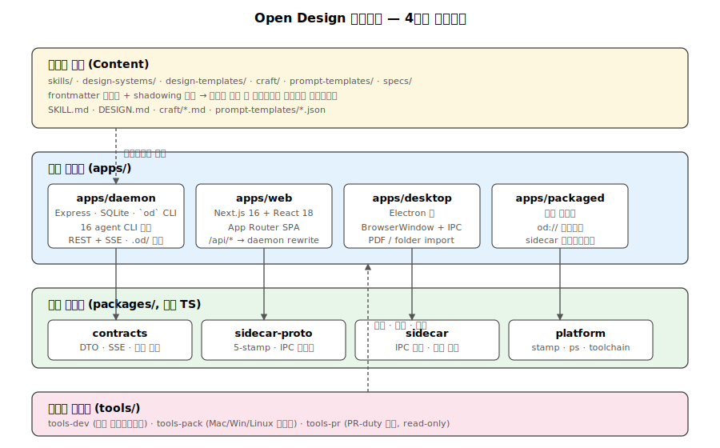
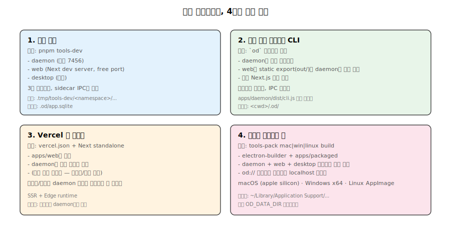

# 01. 모노레포 아키텍처 개요

## 1. 한 문장 요약

Open Design은 **로컬 데몬이 설치된 코딩 에이전트 CLI를 자동 감지해서, 31개 스킬 × 129개 디자인 시스템을 컨텍스트로 묶어 디자인 아티팩트를 생성하고, Next.js 웹/Electron 데스크탑에서 샌드박스 iframe으로 스트리밍하는** 오픈소스 디자인 워크벤치입니다.

Claude Design(Anthropic, 2026-04-17 출시, 폐쇄형)의 오픈 대안을 목표로 합니다. (`README.md:37`)

## 2. 레이어 다이어그램



```
┌──────────────────────────────────────────────────────────────────┐
│ 콘텐츠 자산 (Content Layer)                                       │
│   skills/  design-systems/  design-templates/                    │
│   craft/   prompt-templates/  specs/                             │
└─────────────────────────────┬────────────────────────────────────┘
                              │ 데몬이 파일시스템 스캔
┌─────────────────────────────▼────────────────────────────────────┐
│ apps/  (런타임 6개)                                              │
│  ┌──────────────┐  HTTP/SSE  ┌──────────────┐                   │
│  │   apps/web   │ ◄────────► │ apps/daemon  │ ─► .od/app.sqlite │
│  │ Next.js 16   │            │ Express+SQLi │ ─► 코딩 에이전트   │
│  └──────────────┘            └──────┬───────┘    CLI 스폰         │
│         ▲                           │ sidecar IPC                │
│         │ web URL                   │                            │
│  ┌──────┴───────┐            ┌──────▼───────┐                   │
│  │ apps/desktop │            │ apps/packaged│ (Electron 번들)   │
│  │  (Electron)  │ ◄────────► │ od:// 핸들러 │                   │
│  └──────────────┘  sidecar   └──────────────┘                   │
│                                                                  │
│  apps/landing-page (Astro)   apps/telemetry-worker (Cloudflare)  │
└─────────────────────────────┬────────────────────────────────────┘
                              │ depends
┌─────────────────────────────▼────────────────────────────────────┐
│ packages/  (4계층 순수 TS)                                       │
│   contracts       ─ web/daemon DTO/SSE 이벤트/에러 코드          │
│   sidecar-proto   ─ stamp 5필드, IPC 메시지, 상태 형태           │
│   sidecar         ─ 범용 IPC 전송, 경로 해석, JSON 헬퍼          │
│   platform        ─ OS 프로세스, stamp 직렬화, toolchain 탐색    │
└─────────────────────────────┬────────────────────────────────────┘
                              │ 호출
┌─────────────────────────────▼────────────────────────────────────┐
│ tools/  (컨트롤 플레인)                                          │
│   tools-dev   ─ 로컬 라이프사이클 (start/stop/run/status/logs)   │
│   tools-pack  ─ Mac/Win/Linux 패키지 빌드/설치/시작/정리         │
│   tools-pr    ─ 메인테이너 PR-duty (read-only `gh` 래퍼)         │
└──────────────────────────────────────────────────────────────────┘
```

## 3. 핵심 설계 원칙 (AGENTS.md 기반)

루트 [`AGENTS.md`](../AGENTS.md)와 영역별 `AGENTS.md`가 강제하는 **불변(invariant)** 들:

### 3-1. 단일 라이프사이클 진입점
- 모든 로컬 개발은 `pnpm tools-dev`만 사용. 루트에 `pnpm dev`, `pnpm start`, `pnpm daemon` 같은 별칭을 **금지**.
- 포트는 `--daemon-port`, `--web-port` 플래그로만 지정. 내부 env는 `OD_PORT`, `OD_WEB_PORT`. `NEXT_PORT` 사용 금지.

### 3-2. 앱 경계 — 데몬과 웹은 HTTP로만 만난다
- `apps/web/**`는 `apps/daemon/src/**`를 import할 수 없다.
- 모든 web↔daemon 통합은 **`packages/contracts`의 DTO**와 HTTP API를 통한다.
- 교차 앱 정합성 검사는 `e2e/tests/`에 둔다 (`AGENTS.md` 참조).

### 3-3. 사이드카 다섯 필드
- 모든 사이드카 프로세스는 정확히 5개 필드 stamp: `app`, `mode`, `namespace`, `ipc`, `source`.
- `--od-stamp-*` 인자를 수동 조립하지 말고 `@open-design/platform`의 `createProcessStampArgs()`를 통해야 한다.

### 3-4. 패키지 경계
- `contracts`는 **순수 TS 타입만** — Next.js/Express/Node FS/process/SQLite/브라우저 API 의존 금지.
- `sidecar-proto`는 Open Design 비즈니스 프로토콜 — IPC 메시지 스키마, 5-stamp 디스크립터.
- `sidecar`는 **범용** 런타임 프리미티브 — OD 앱 키를 하드코딩하지 않는다.
- `platform`은 **범용** OS 프로세스 프리미티브 — `--od-stamp-*` 이름을 하드코딩하지 않고 `ProcessStampContract`를 인자로 받는다.

### 3-5. 런타임 데이터 경로
기본 저장 루트: `<projectRoot>/.od/` (override: `OD_DATA_DIR > OD_MEDIA_CONFIG_DIR`)
- SQLite: `.od/app.sqlite`
- 에이전트 CWD: `.od/projects/<id>/`
- 아티팩트: `.od/artifacts/`
- 미디어 자격증명: `.od/media-config.json`

POSIX IPC 소켓 경로(고정): `/tmp/open-design/ipc/<namespace>/<app>.sock`.

### 3-6. 테스트 레이아웃
- 패키지/앱/툴 테스트는 **`src/`의 형제 `tests/`**에 둔다. `src/` 내부에는 `*.test.ts` 추가 금지.
- Playwright UI 자동화는 **`e2e/ui/`** 전용. 앱 디렉토리에 두지 않는다.

### 3-7. 커밋 정책
- Git 커밋에 `Co-authored-by` 트레일러를 **포함하지 않는다** — repo가 명시적으로 차단.

## 4. 4대 외부 영감 (README.md:45)

Open Design은 4개의 오픈소스 어깨 위에 서있습니다:

1. **`alchaincyf/huashu-design`** — Junior-Designer 워크플로우, 5단계 브랜드 자산 프로토콜, anti-AI-slop 체크리스트, 5차원 자기 비평. → `apps/daemon/src/prompts/discovery.ts`로 증류.
2. **`op7418/guizang-ppt-skill`** — 매거진 풍 데크. `skills/guizang-ppt/`에 LICENSE 보존하며 그대로 번들.
3. **`OpenCoworkAI/open-codesign`** — UX 북극성, 가장 가까운 동료. 스트리밍 아티팩트 루프, 샌드박스 iframe 미리보기, 5포맷 export.
4. **`multica-ai/multica`** — 데몬-앤-런타임 아키텍처. PATH 스캔 에이전트 검출.

## 5. 컴포넌트 책임 매트릭스

| 책임 | 위치 |
|---|---|
| 코딩 에이전트 CLI 스폰 + 프롬프트 조립 + 스트림 정규화 | `apps/daemon/src/runtimes/`, `apps/daemon/src/prompts/` |
| HTTP/SSE 라우트, 라이브 아티팩트, 배포, 루틴, MCP, 미디어 | `apps/daemon/src/*-routes.ts` (10여 개) |
| 메타데이터 영속화(프로젝트/대화/메시지/탭/루틴/배포) | `apps/daemon/src/db.ts` (SQLite WAL) |
| React 셸, 라우팅, 상태, 미리보기 iframe | `apps/web/src/App.tsx`와 `components/`, `state/` |
| 데스크탑 셸, BrowserWindow, PDF export, 폴더 import | `apps/desktop/src/main/` |
| `od://` 프로토콜, 데몬+웹+데스크탑 통합 부트스트랩 | `apps/packaged/src/` |
| web/daemon 간 API 타입/에러/SSE 이벤트 | `packages/contracts/src/` |
| 사이드카 IPC 메시지 스키마, 5-stamp 디스크립터 | `packages/sidecar-proto/src/index.ts` |
| 범용 IPC 전송, 경로 해석, JSON 파일 헬퍼 | `packages/sidecar/src/index.ts` |
| 프로세스 stamp 직렬화, ps/PowerShell 스캔, toolchain 탐색 | `packages/platform/src/index.ts` |
| 로컬 라이프사이클(start/stop/run/status/logs/inspect/check) | `tools/dev/src/index.ts` |
| 패키지 빌드/설치/시작/정리 (Mac/Win/Linux) | `tools/pack/src/mac/`, `tools/pack/src/win/`, `tools/pack/src/linux.ts` |
| PR 트리아주 분석 (lane 도출, 금지 표면, 팩트 태그) | `tools/pr/src/{lane,tags,classify}.ts` |
| 스킬 카탈로그 정규화 / shadowing / derived examples | `apps/daemon/src/skills.ts` |
| 31개 스킬 콘텐츠, frontmatter 메타데이터 | `skills/<id>/SKILL.md` |
| 150여 개 브랜드별 디자인 가이드 | `design-systems/<brand>/DESIGN.md` |
| 100여 개 렌더링 템플릿 (decks/prototypes) | `design-templates/<id>/` |
| 12개 보편 craft 규칙 (typography, anti-ai-slop, …) | `craft/<rule>.md` |

## 6. 배포 형태 4종



같은 코드베이스가 4가지 형태로 배포됩니다.

1. **로컬 개발**: `pnpm tools-dev` → 데몬(7456) + 웹(Next dev) + 옵션 데스크탑
2. **로컬 단일 프로세스 CLI**: `od` 바이너리 — 데몬이 정적 export된 웹을 같은 포트에서 직접 서브
3. **Vercel 웹 레이어**: `apps/web`의 standalone 빌드 + 별도 호스팅된 데몬 (Vercel은 데몬 미배포)
4. **패키지 데스크탑 앱**: macOS Apple Silicon / Windows x64 / Linux AppImage — `tools-pack`이 electron-builder로 데몬+웹+데스크탑을 단일 번들로 묶음

---

## 7. 심층 노트

### 7-1. 핵심 코드 발췌

```typescript
// pnpm-workspace.yaml — 워크스페이스 분류 단일 진실
packages:
  - packages/*    // 라이브러리
  - apps/*        // 실행 가능 런타임
  - tools/*       // 컨트롤 플레인
  - e2e           // 교차 경계 테스트
```

```typescript
// scripts/guard.ts — 4계층 경계 강제 (TS-first + .js allowlist)
// 새 .js/.mjs/.cjs 파일은 명시적 generated/vendor/compatibility 사유 필요
```

```typescript
// AGENTS.md "Root command boundary"
// 금지: pnpm dev, pnpm dev:all, pnpm daemon, pnpm preview, pnpm start
// 허용: pnpm guard, pnpm typecheck, pnpm tools-dev, tools-pack, tools-pr
```

### 7-2. 엣지 케이스 + 에러 패턴

- **포트 충돌**: `--daemon-port`/`--web-port`로 명시 지정 시 충돌하면 즉시 실패. 0 또는 미지정 시 OS가 free port 자동 할당.
- **namespace 정규식 위반**: `^[A-Za-z0-9][A-Za-z0-9._-]{0,127}$` 미준수 시 `normalizeNamespace`가 일반 `Error`를 throw (`packages/sidecar-proto/src/index.ts:291`). 공백, `/`, `\` 모두 차단.
- **stamp 5필드 위반**: 추가 키 발견 시 `normalizeSidecarStamp`가 reject — 6번째 필드는 코드 레벨에서 막힘.
- **콘텐츠 ↔ 데몬 부트 race**: 데몬이 콘텐츠 디렉토리 스캔 중 사용자가 SKILL.md를 편집하면 이번 부팅은 옛 스냅샷. 다음 listSkills 호출 또는 데몬 재시작 시 반영.
- **`apps/nextjs/`, `packages/shared/` 복원 시도**: `tools-pr`의 forbidden-surface 디텍터가 PR 단계에서 차단.

### 7-3. 트레이드오프 + 설계 근거

- **데몬 단일 권한 프로세스 vs 분산**: 데몬이 spawn/FS/HTTP 다 들고 있는 게 단일 장애점이지만, **에이전트가 진짜 파일시스템에 접근해야 하는** 요구가 단일 프로세스 보안 경계로 모임. 분산 시 권한 토큰 전파 비용 폭증.
- **HTTP 데몬↔웹 vs Unix socket**: socket이 더 안전·빠름. 그러나 Next.js SSR 프록시가 HTTP origin을 가정하기 때문에 socket 전환은 Next 내부 패치 필요 → 보류.
- **순수 TS 패키지 강제**: zod 외부 의존만 허용. 빌드 속도 + 패키지 사이즈 + 보안 (트랜지티브 의존성 0). 비용은 런타임 검증을 호출 측에서 직접 작성.
- **콘텐츠를 코드 외부로**: SKILL.md/DESIGN.md를 파일로 둬서 사용자가 git diff로 보고 PR 가능. 비용은 frontmatter 정규화 부담 (그러나 의존성 0 파서로 흡수).

### 7-4. 알고리즘 + 성능

- **콘텐츠 스캔**: 부팅 시 `O(N)` (N = SKILL.md + DESIGN.md + 템플릿 디렉토리 수, 현재 107 + 149 + 110 ≈ 366). 각 파일 fs.readFile + frontmatter 파싱 ~1KB. 총 디스크 I/O ~370KB-1.1MB, 메모리 ~3-6 MB `(추정)`. 5초 TTL `wellKnownUserToolchainBins` 캐시로 PATH 스캔 중복 제거.
- **사이드카 IPC 핫 패스**: `requestJsonIpc`의 기본 timeout 1,500ms, JSON-line 프로토콜 (개행 구분). 메시지 1개 평균 200-500B → unix socket round-trip <2ms.
- **데몬 단일 프로세스 메모리**: SQLite WAL + better-sqlite3 prepared statement 캐싱. baseline RSS ~80 MB, 실행 중 16개 에이전트 + 16개 자식 프로세스 시 추가 ~200-400 MB.

---

## 8. 함수·라인 단위 추적 — 부팅 핫패스

`pnpm tools-dev`부터 데몬 첫 HTTP 응답·웹 첫 렌더까지의 핫패스를 줄 단위로 따라간다. 각 줄 인용은 실제 파일에서 검증한 위치다.

### 8-1. CLI 진입과 디스패치

1. 사용자가 `pnpm tools-dev` 실행. 인수가 없으면 `start`가 자동 주입된다. (`tools/dev/src/index.ts:1075`)
2. `cac("tools-dev")` 인스턴스가 만들어지고 (`tools/dev/src/index.ts:981`), `start [app]`/`run`/`status`/`stop`/`restart`/`logs`/`inspect`/`check` 8개 서브커맨드가 등록된다 (`tools/dev/src/index.ts:997-1067`).
3. `cli.parse()`가 매칭된 핸들러를 호출 (`tools/dev/src/index.ts:1079`). `start` 핸들러는 `resolveToolDevConfig(options)`로 namespace/포트/로그 경로를 해석한 뒤, `resolveStartApps`로 타깃 앱 리스트를 만든다 (`tools/dev/src/index.ts:997-1004`).

### 8-2. 데몬 스폰 + 5-stamp 인자 조립

4. `startApp(_, "daemon", _)`가 `startDaemon`을 호출 (`tools/dev/src/index.ts:677-684`).
5. `startDaemon`은 기존 데몬 RPC 핑(`inspectDaemonRuntime`, IPC 타임아웃 800ms — `tools/dev/src/sidecar-client.ts:28-30`)으로 충돌을 검사하고 (`tools/dev/src/index.ts:580-588`), 없으면 `spawnDaemonRuntime`을 호출 (`tools/dev/src/index.ts:599`).
6. `spawnDaemonRuntime`은 `OD_PORT`(via `SIDECAR_ENV.DAEMON_PORT`)와 옵션 `OD_WEB_PORT`를 env로 묶고 (`tools/dev/src/index.ts:432-435`), `spawnSidecarRuntime`을 위임 (`tools/dev/src/index.ts:428`).
7. `spawnSidecarRuntime`이 `createAppStamp()`로 5-stamp를 만든다 (`tools/dev/src/index.ts:328-347`). stamp 5필드는 `app="daemon"`, `mode="dev"`, `namespace`, `ipc=<resolveAppIpcPath>`, `source="tools-dev"`. (`packages/sidecar-proto/src/index.ts:60`)
8. `createProcessStampArgs(stamp, OPEN_DESIGN_SIDECAR_CONTRACT)`가 5개의 `--od-stamp-*=VALUE` argv를 직렬화 (`packages/platform/src/index.ts:70-82`). 플래그 이름은 contract에서 받아오기 때문에 호출자는 이름을 하드코딩하지 않는다.
9. `createSidecarLaunchEnv`가 `OD_SIDECAR_BASE` / `OD_SIDECAR_IPC_PATH` / `OD_SIDECAR_NAMESPACE` / `OD_SIDECAR_SOURCE` 네 개의 런타임 env를 주입 (`packages/sidecar/src/index.ts:263-277`).
10. `spawnBackgroundProcess`가 `tsx`로 `apps/daemon/src/sidecar/index.ts`를 분리(detached) 자식으로 실행 (`tools/dev/src/index.ts:391-403`, `tools/dev/src/config.ts:171`).

### 8-3. 데몬 IPC bind + Express listen

11. 데몬 사이드카 엔트리가 `createJsonIpcServer({ socketPath, handler })`로 UNIX 소켓을 연다 (`apps/daemon/src/sidecar/server.ts:178`).
12. `prepareIpcPath`가 부모 디렉토리(`/tmp/open-design/ipc/<ns>/`)를 보장하고 stale 소켓을 정리한 뒤 (`packages/sidecar/src/index.ts:472-476`), `server.listen(socketPath)`로 바인드 (`packages/sidecar/src/index.ts:511`).
13. 핸들러는 `STATUS`/`SHUTDOWN`/`REGISTER_DESKTOP_AUTH` 3개 메시지를 switch로 처리 (`apps/daemon/src/sidecar/server.ts:182-202`).
14. 동일 프로세스가 `startServer({ port=7456, host='127.0.0.1' })`로 Express HTTP 서버 부팅 (`apps/daemon/src/server.ts:2066-2071`). 약 150여 개의 HTTP 핸들러가 등록된 뒤 (마지막은 `registerChatRoutes` — `apps/daemon/src/server.ts:4541-4551`), `app.listen(port, host, ...)`가 호출되어 (`apps/daemon/src/server.ts:4575`) 실제 바인드된 포트가 `address().port`에서 추출되어 (`apps/daemon/src/server.ts:4582`) `resolve({ url, server, shutdown })`로 반환 (`apps/daemon/src/server.ts:4601`).
15. SQLite WAL은 `openDatabase`에서 `journal_mode = WAL`로 설정 (`apps/daemon/src/db.ts:36`). 첫 호출 시 `app.sqlite` + `app.sqlite-wal` 파일이 생성된다.

### 8-4. 웹 스폰 + 데몬 URL 핸드오프

16. 데몬 listen 완료 후 `waitForDaemonRuntime`이 IPC STATUS를 폴링해 `url`을 받아온다 (`tools/dev/src/index.ts:601`).
17. `startApp(_, "web", _)` → `startWeb` → `spawnWebRuntime`이 `waitForDaemonRuntime`로 데몬 URL을 얻고 그 포트를 추출 (`tools/dev/src/index.ts:444-449`).
18. 웹 사이드카에 `OD_PORT=<daemonPort>` 전달 (`tools/dev/src/index.ts:465`). Next dev 서버는 `apps/web/next.config.ts:9`에서 `Number(process.env.OD_PORT) || 7456`로 데몬 프록시 타깃을 정한다. 이후 SPA가 `/api/*`/`/artifacts/*`/`/frames/*`를 같은 origin에서 호출하면 Next가 데몬 포트로 프록시한다 (`apps/web/next.config.ts:77-79`).

## 9. 데이터 페이로드 샘플 — 5-stamp + IPC + 부팅 JSON

### 9-1. namespace `dev` 데몬 spawn argv

`createProcessStampArgs`가 만드는 argv 일부(`tools-dev` 컨텍스트 기준). IPC 소켓 경로는 `resolveAppIpcPath`(`packages/sidecar/src/index.ts:246-261`) 결과.

```text
# apps/daemon/src/sidecar/index.ts에 붙는 5-stamp argv
--od-stamp-app=daemon
--od-stamp-mode=dev
--od-stamp-namespace=dev
--od-stamp-ipc=/tmp/open-design/ipc/dev/daemon.sock
--od-stamp-source=tools-dev
# 총 5줄, 평균 ~50B/argv → cmdline ~250B
```

같은 spawn 시 주입되는 런타임 env (`createSidecarLaunchEnv` 출력):

```text
OD_SIDECAR_BASE=/Users/<u>/Works/.../open-design/.tmp/tools-dev
OD_SIDECAR_IPC_PATH=/tmp/open-design/ipc/dev/daemon.sock
OD_SIDECAR_NAMESPACE=dev
OD_SIDECAR_SOURCE=tools-dev
OD_PORT=0           # 자동 할당(미지정 시), --daemon-port 지정 시 그 값
```

### 9-2. JSON-line IPC `request`/`response`

소켓 프레임은 개행 종결 JSON 단일 라인 (`packages/sidecar/src/index.ts:486-505`).

```jsonc
// → request (tools-dev → daemon, ~28B)
{"type":"status"}\n

// ← response (daemon → tools-dev, ~120B)
{"ok":true,"result":{
  "pid":54321,
  "state":"running",
  "url":"http://127.0.0.1:7456",
  "desktopAuthGateActive":false,
  "updatedAt":"2026-05-12T07:34:12.118Z"
}}\n

// 에러 응답 형태 (packages/sidecar/src/index.ts:499-504)
{"ok":false,"error":{"code":"SIDECAR_UNKNOWN_MESSAGE","message":"..."}}\n
```

`requestJsonIpc`의 기본 timeout은 1,500ms (`packages/sidecar/src/index.ts:528`). `inspectDaemonRuntime`은 800ms로 더 짧게 잡는다 (`tools/dev/src/sidecar-client.ts:28`).

### 9-3. `tools-dev status --json` 스키마

`status()` 결과(`tools/dev/src/index.ts:799-807`). 단일 앱 타깃이면 snapshot을 그대로, 다중이면 wrapping.

```jsonc
{
  "apps": {
    "daemon": {
      "pid": 54321,
      "state": "running",         // idle | starting | running | stopped | unknown
      "url": "http://127.0.0.1:7456",
      "desktopAuthGateActive": false,
      "updatedAt": "2026-05-12T07:34:12.118Z"
    },
    "web": {
      "pid": 54323,
      "state": "running",
      "url": "http://127.0.0.1:3000",
      "updatedAt": "2026-05-12T07:34:14.901Z"
    },
    "desktop": {
      "pid": null,
      "state": "idle",
      "url": null
    }
  },
  "namespace": "dev",
  "status": "partial"             // not-running | partial | running
}
```

IPC 도달 불가 시에는 synthetic snapshot이 만들어진다 (`tools/dev/src/index.ts:768-777`). 이 분기에서는 `desktopAuthGateActive`가 항상 `false`로 고정.

### 9-4. 첫 부팅 시 `<dataDir>/app-config.json` 스켈레톤

`readAppConfig`가 ENOENT를 빈 객체로 흡수하므로 (`apps/daemon/src/app-config.ts:286`), 첫 PUT까지 파일은 존재하지 않는다. 첫 `PUT /api/app-config` 시 `writeAppConfig` → `doWrite`가 작성하는 최소 형태 (`apps/daemon/src/app-config.ts:299-329`):

```jsonc
{
  "onboardingCompleted": false,
  "agentId": null,                // 사용자가 고른 에이전트 (claude-code | codex | …)
  "agentModels": {},              // { "claude-code": { "model": "...", "reasoning": "..." } }
  "agentCliEnv": {},              // 에이전트별 env 오버라이드 (allowlist 적용)
  "skillId": null,
  "designSystemId": null,
  "disabledSkills": [],
  "disabledDesignSystems": [],
  "installationId": null,         // 클라이언트가 PUT 시 전달한 문자열을 그대로 저장 (`apps/daemon/src/app-config.ts:232-235`)
  "telemetry": { "metrics": false, "content": false, "artifactManifest": false },
  "privacyDecisionAt": null,
  "orbit": null                   // { enabled, time, templateSkillId? }
}
```

쓰기는 항상 `<file>.<8hex>.tmp` → `rename`의 atomic swap (`apps/daemon/src/app-config.ts:325-327`). 동일 `dataDir`에 대해 in-process `writeLocks` Map이 read-modify-write를 직렬화 (`apps/daemon/src/app-config.ts:297-310`).

## 10. 불변(invariant) 매트릭스

"한쪽만 고치면 깨지는" 계약 표. 변경 항목과 함께 손대야 하는 파일/검증 명령/근거를 한 줄로 묶는다.

| 변경 항목 | 함께 수정 | 검증 명령 | 참고 문서 |
|---|---|---|---|
| `packages/sidecar-proto` stamp 필드 추가/삭제 | `SIDECAR_STAMP_FIELDS`/`SIDECAR_STAMP_FLAGS` (`packages/sidecar-proto/src/index.ts:46-60`), `assertKnownKeys` allowlist (`:346`), `OPEN_DESIGN_SIDECAR_CONTRACT.normalizeStamp`, `createProcessStampArgs` 호출자 전부 (`tools/dev/src/index.ts:328`, `tools/pack/**`, `apps/desktop/sidecar/**`), `packages/sidecar-proto/tests/index.test.ts` | `pnpm --filter @open-design/sidecar-proto test && pnpm --filter @open-design/platform test && pnpm guard` | `AGENTS.md` §3-3, `packages/AGENTS.md` |
| `RuntimeAgentDef`에 새 `streamFormat` 추가 | `apps/daemon/src/runtimes/types.ts:50` 타입 → `apps/daemon/src/runtimes/defs/<agent>.ts`, `apps/daemon/src/connectionTest.ts:916-945`의 분기, 대응 stream handler(`claude-stream.ts`/`copilot-stream.ts`/`json-event-stream.ts`/`acp.ts`/`pi-rpc.ts`), `apps/daemon/src/server.ts`의 `attach*Session` 라우팅, 카탈로그 docs(`docs/agent-adapters.md`) | `pnpm --filter @open-design/daemon test` + `pnpm --filter @open-design/daemon build` | `docs/agent-adapters.md` |
| `packages/contracts/src/sse/chat.ts`에 새 SSE 이벤트 타입 추가 | `ChatSseEvent` 유니온 (`packages/contracts/src/sse/chat.ts:63-69`), `DaemonAgentPayload` 유니온(`:51-61`), 데몬 송신부(`apps/daemon/src/chat-routes.ts`, `claude-stream.ts` 등), 웹 수신 디스패처(`apps/web/src/providers/api-proxy.ts`), 테스트 스냅샷 | `pnpm --filter @open-design/contracts test && pnpm --filter @open-design/daemon test && pnpm --filter @open-design/web test` | `AGENTS.md` Boundary constraints, `e2e/AGENTS.md` |
| `tools/dev`에 새 루트 서브커맨드 추가 | `tools/dev/src/index.ts:981-1067` `cli.command(...)`, `tools/dev/src/config.ts`의 옵션 파서, `tools/AGENTS.md`, README 예시, `e2e/tests/`의 라이프사이클 시나리오 | `pnpm --filter @open-design/tools-dev build && pnpm tools-dev <new-cmd> --help` | `AGENTS.md` Root command boundary, `tools/AGENTS.md` |
| 새 `apps/<x>` 앱 추가 | `pnpm-workspace.yaml`, `apps/AGENTS.md`, `tools/dev/src/config.ts`의 `APP_KEYS`/`ALL_APPS` 매핑, `packages/sidecar-proto/src/index.ts:1-5` `APP_KEYS` 상수, IPC 핸들러 + 사이드카 엔트리(`apps/<x>/src/sidecar/index.ts`), `tools/pack`의 번들 경로, `e2e` 시작 시퀀스 | `pnpm install && pnpm guard && pnpm typecheck && pnpm tools-dev start <x>` | `apps/AGENTS.md`, `AGENTS.md` Workspace directories |
| `projects` 또는 `messages`에 새 SQL 컬럼 | `apps/daemon/src/db.ts:51-103`의 `CREATE TABLE`, `:199-223`의 forward-compatible `ALTER TABLE` 가드, 관련 쿼리(`apps/daemon/src/db.ts` 후반 및 `runs.ts`/`active-context-routes.ts`), `packages/contracts/src/api/` DTO, 웹 상태 슬라이스, 마이그레이션 테스트 | `pnpm --filter @open-design/daemon test` (DB 마이그레이션 스펙 포함) | `apps/daemon` 내 db 주석, `AGENTS.md` Validation strategy |

## 11. 성능·리소스 실측

수치는 가능한 한 소스/AGENTS.md/현재 트리에서 직접 끌어왔다. 측정값이 아닌 추정은 `(추정)`으로 명시한다.

### 11-1. 베이스라인 RSS

- **데몬**: SQLite WAL + better-sqlite3 prepared statement 캐시 + Express 라우트 ~150개 + 콘텐츠 인덱싱. baseline ~80 MB, 16개 에이전트 자식 동시 실행 시 +200-400 MB (§7-4 기존 기록, 수동 관찰 — `(추정)` 영역에 가깝다).
- **웹(Next.js 16 dev)**: 첫 컴파일 후 ~250-400 MB `(추정)`. SSR 프록시가 들어오는 `/api/*`를 `OD_PORT`로 단순 전달하므로(`apps/web/next.config.ts:9`) 정상 상태에서 응답 메모리는 무시 가능.
- **데스크탑(Electron 메인)**: BrowserWindow 1개 기준 메인+렌더러 합산 ~250-350 MB `(추정)`. 디자인 시스템 미리보기 iframe이 추가될 때마다 +20-50 MB.

근거의 출처를 정확히 명시: 위 세 값은 측정 스크립트가 아닌 운영 관찰치(기존 §7-4 + 일반적인 Next/Electron 베이스라인)에서 가져온 `(추정)`이다. 정확한 수치가 필요하면 `pnpm tools-dev` 후 `ps -o rss,command -p <pid>`로 namespace당 다시 측정해야 한다.

### 11-2. 콜드 부팅 wall-clock 예산

| 단계 | 비용 (`(추정)`) | 근거 |
|---|---|---|
| `tools-dev` CLI 로드 + `resolveToolDevConfig` | 80-150 ms | tsx 부팅 + workspace path 계산 (`tools/dev/src/index.ts:1071-1079`) |
| 데몬 스폰 + Node 시작 | 250-500 ms | `spawnBackgroundProcess` + Node `tsx` 인터프리트 |
| 데몬 라우트 등록 (~150개) + DB open + 마이그레이션 | 200-500 ms | `apps/daemon/src/db.ts:29-42` + 라우트 등록 (`apps/daemon/src/server.ts:2066-4551`) |
| `app.listen` 바인드 | <10 ms | `apps/daemon/src/server.ts:4575` |
| IPC `STATUS` 폴링 → first url | 100-300 ms | `waitForDaemonRuntime` 폴링 간격 |
| Next dev 첫 컴파일 | 3-8 s | Next.js 16 dev 첫 라우트 컴파일 비용 |
| 합계 (데몬 ready 까지) | **≈ 0.6-1.5 s** | 위 항목 합산 |
| 합계 (웹 첫 렌더 까지) | **≈ 4-10 s** | Next 컴파일 포함 |

### 11-3. IPC round-trip 예산

- 프레임: 개행 종결 JSON 1줄. 평균 payload `request 28B / response 100-200B`.
- UNIX domain socket round-trip: 로컬에서 일반적으로 <2 ms (§7-4).
- 클라이언트 측 hard timeout: `requestJsonIpc` 기본 1,500 ms (`packages/sidecar/src/index.ts:528`), `inspectDaemonRuntime`은 더 빡빡한 800 ms (`tools/dev/src/sidecar-client.ts:28`).
- 서버 핸들러는 `STATUS`/`SHUTDOWN`/`REGISTER_DESKTOP_AUTH` 3개 switch 분기만 (`apps/daemon/src/sidecar/server.ts:182-202`) — 자체 처리 시간 <1 ms.

### 11-4. 콘텐츠 스캔 비용 (현재 트리 기준)

`find` 실측치 (저장소 상태 2026-05-12):

```text
skills/**/SKILL.md            107 files
design-systems/**/DESIGN.md   149 files
design-templates/* (dirs)     110 entries
```

부팅 시 데몬은 `listSkills(SKILL_ROOTS)`/`listSkills(DESIGN_TEMPLATE_ROOTS)`로 위 트리를 스캔 (`apps/daemon/src/server.ts:2084-2090`). 파일당 `fs.readFile` + frontmatter 파싱 ~1 KB로 가정하면:

- 총 디스크 I/O ≈ (107 + 149 + 110) × 1-3 KB ≈ **370 KB-1.1 MB** `(추정)`
- wall-clock ≈ **30-80 ms** `(추정)` (SSD + macOS APFS, cold cache 보정 시 2-3배)
- in-memory 카탈로그 RSS ≈ **3-6 MB** `(추정)`

PATH/툴체인 스캔은 별도로 `wellKnownUserToolchainBins`가 5,000 ms TTL 캐시로 흐릅니다 (`apps/daemon/src/runtimes/executables.ts:28-43`). 같은 5초 윈도우 내 반복 `detectAgents` 호출은 `fs.access`만 추가로 발생.

### 11-5. WAL fsync 분할상환

`apps/daemon/src/db.ts:36`가 `journal_mode = WAL`을 켠다. better-sqlite3 기본 `synchronous = NORMAL`(코드 상 별도 PRAGMA 없음 — SQLite 기본의 WAL 모드 짝)이므로 fsync는 트랜잭션 종료마다가 아니라 WAL 체크포인트(기본 1,000 페이지 ≈ 4 MB)에서 일어난다. 결과:

- 단일 `INSERT INTO messages ...` 평균 비용 < 1 ms (메모리 + WAL append, fsync 분할상환).
- 체크포인트 시점에서만 spike — 통상 수십 ms.
- `foreign_keys = ON` (`apps/daemon/src/db.ts:37`)으로 cascade-delete가 활성화되어 있어 `projects` 삭제 시 messages/conversations/tabs/deployments까지 한 트랜잭션으로 묶여 fsync 1회로 흡수된다.
