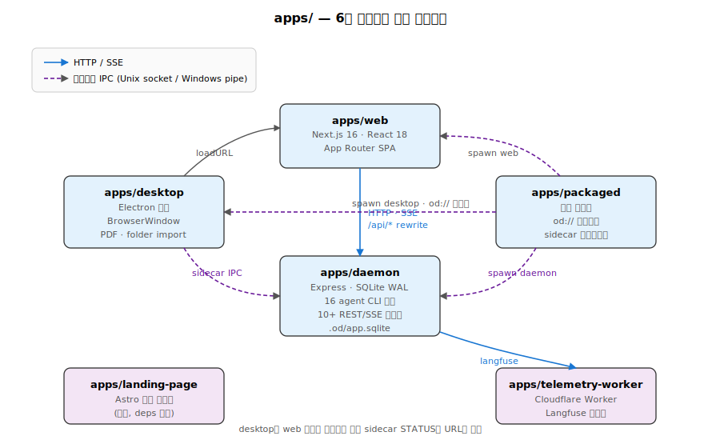
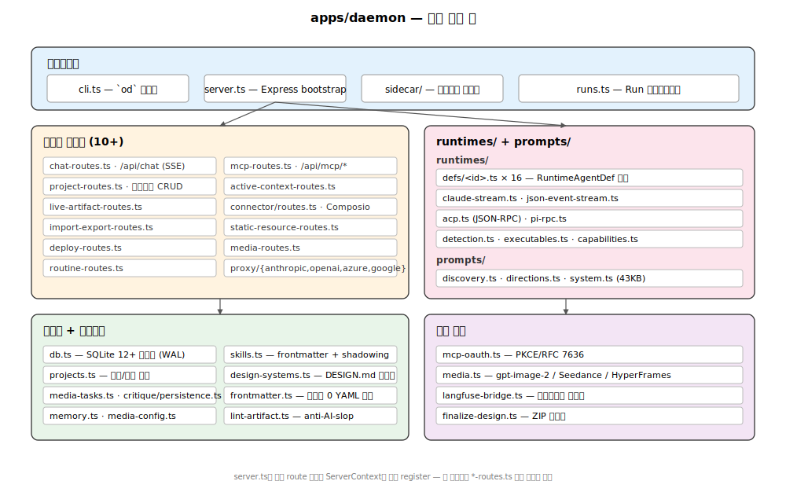

# 02. apps/ — 런타임 6개

`apps/`에는 6개의 독립적인 런타임이 있으며 pnpm workspace로 묶여 있습니다. 핵심은 **daemon(Express+SQLite) ↔ web(Next.js) ↔ desktop(Electron) ↔ packaged(번들 진입점)** 4개이고, `landing-page`(Astro)와 `telemetry-worker`(Cloudflare Worker)는 보조 역할을 합니다.



## 1. apps/daemon — 로컬 데몬과 `od` CLI

**역할**: 16개 코딩 에이전트 CLI를 자식 프로세스로 스폰·정규화하고, 프로젝트/채팅/배포/스킬/디자인시스템/MCP를 REST+SSE로 노출하는 단일 권한 프로세스. (`apps/AGENTS.md:8`)



### 1-1. package.json 핵심

```json
{
  "name": "@open-design/daemon",
  "main": "./dist/cli.js",
  "bin": { "od": "./dist/cli.js" },
  "dependencies": {
    "express": "^4.19.2",
    "better-sqlite3": "^12.9.0",
    "@open-design/contracts": "workspace:*",
    "@open-design/platform": "workspace:*",
    "@open-design/sidecar": "workspace:*",
    "@open-design/sidecar-proto": "workspace:*"
  }
}
```

### 1-2. 디렉토리 레이아웃

- `apps/daemon/src/cli.ts` — `od` CLI 진입점. 4개 서브커맨드: `od`(기본 데몬 + 브라우저), `od research …`, `od media …`(이미지/비디오/오디오 생성), `od mcp …`(MCP 서버 관리).
- `apps/daemon/src/server.ts` — Express 부트스트랩, 라우트 등록, SQLite 연결, 데스크탑 인증 게이트. **4,600+ 라인**으로 가장 큰 단일 파일.
- `apps/daemon/src/runtimes/defs/*.ts` — 16개 에이전트 정의(선언형).
- `apps/daemon/src/runtimes/{capabilities,detection}.ts` — capability 플래그, PATH 스캔 검출.
- `apps/daemon/src/prompts/{discovery,directions,system}.ts` — 3-턴 프롬프트 엔진.
- `apps/daemon/src/*-routes.ts` — 10여 개 도메인 라우트 모듈 (아래 참조).
- `apps/daemon/src/{skills,memory,design-systems}.ts` — 콘텐츠 카탈로그 로더.
- `apps/daemon/src/db.ts` — SQLite 스키마 (better-sqlite3, WAL).
- `apps/daemon/src/acp.ts` — Anthropic Compute Platform 어댑터.
- `apps/daemon/src/pi-rpc.ts` — Pi RPC 세션 (JSON-RPC over stdio).
- `apps/daemon/src/langfuse-bridge.ts` — 텔레메트리 브리지(→ `apps/telemetry-worker`로 릴레이).
- `apps/daemon/sidecar/` — 데몬 사이드카 진입점 (tools-dev/packaged에서 호출).
- `apps/daemon/tests/` — Vitest 테스트.

### 1-3. 라우트 모듈 카탈로그

`apps/AGENTS.md:19`가 강제하는 규칙: 새 도메인 엔드포인트는 **서버 부트스트랩이 아니라** 해당 도메인 라우트 모듈에 등록하라. `/api/health`, `/api/version` 같은 부트스트랩 수준만 `server.ts`에 둔다.

| 라우트 모듈 | 주요 엔드포인트 | 도메인 |
|---|---|---|
| `chat-routes.ts` (~34 KB) | `POST /api/runs`, `GET /api/runs/:id/events` (SSE), `POST /api/chat`, `POST /api/proxy/<provider>/stream` | 에이전트 스폰, 프롬프트 합성, 스트림 정규화, BYOK 프록시 |
| `project-routes.ts` | `GET/POST/PATCH /api/projects`, 파일 CRUD | 프로젝트 라이프사이클 |
| `live-artifact-routes.ts` | `GET /api/artifacts/:id` | 라이브 HTML 미리보기 |
| `import-export-routes.ts` | `POST /api/import/folder`, `/api/import/claude-design` (registerImportRoutes / registerProjectExportRoutes / registerFinalizeRoutes) | 외부 도구로부터 import |
| `deploy-routes.ts` | `POST /api/deploy` | Vercel / Cloudflare Pages 배포 |
| `routine-routes.ts` | `GET/POST /api/routines` | cron 스케줄 |
| `mcp-routes.ts` | `GET /api/mcp/config`, OAuth | MCP 서버 |
| `active-context-routes.ts` | `/api/active` | 일시적 UI 포커스 상태 |
| `connectors/routes.ts` | Composio 커넥터 | 외부 도구 연동 |
| `static-resource-routes.ts`, `media-routes.ts` | `/api/skills`, `/api/design-systems`, 미디어 생성 | 카탈로그 + BYOK 미디어 |

`server.ts`는 각 라우트를 `register<Domain>Routes(app, ctx)` 형태로 등록하고, 모든 라우트에 공유 `ServerContext`를 주입합니다.

### 1-4. 16개 에이전트 어댑터

각 에이전트는 `apps/daemon/src/runtimes/defs/*.ts`에 **선언형**으로 정의됩니다.

```typescript
// 예: apps/daemon/src/runtimes/defs/claude.ts
export const claudeAgentDef = {
  id: 'claude',
  bin: 'claude',
  buildArgs: (prompt, imagePaths, extraAllowedDirs, options) => [...],
  promptViaStdin: true,
  streamFormat: 'claude-stream-json',
  fallbackModels: [{ id: 'sonnet', label: '...' }],
  capabilityFlags: { '--add-dir': 'addDir', ... }
}
```

**스폰 어댑터 16종**: claude, codex, devin, cursor-agent, gemini, opencode, qwen, qoder, copilot, hermes(ACP), kimi(ACP), pi(RPC), kiro(ACP), kilo(ACP), vibe(ACP), deepseek.

**스트림 포맷별 정규화**: `claude-stream-json` / `codex-events` / `acp-jsonrpc` / `pi-rpc` / 일반 텍스트가 모두 `contracts`의 `ChatSseEvent` union으로 변환되어 클라이언트에는 동일하게 도착합니다.

**Windows 안전성**: 모든 어댑터는 argv 길이 `ENAMETOOLONG`을 대비해 stdin 또는 임시 프롬프트 파일 폴백을 가집니다.

### 1-5. 3-턴 프롬프트 엔진

`apps/daemon/src/prompts/discovery.ts`(~24 KB)가 강제하는 패턴(`README.md`의 "30 seconds of radios beats 30 minutes of redirects" 슬로건):

- **Turn 1**: discovery form 발행 — surface, audience, tone, brand context, scale를 라디오로 잠금.
- **Turn 2**: 사용자가 브랜드를 가지고 있으면 그 브랜드 spec 추출, 아니면 5개 큐레이션된 방향(Editorial Monocle / Modern Minimal / Tech Utility / Brutalist / Soft Warm) 중 선택. 각 방향은 결정론적 OKLch 팔레트 + 폰트 스택. (`apps/daemon/src/prompts/directions.ts`)
- **Turn 3+**: TodoWrite 계획을 라이브 카드로 스트리밍 → 빌드 → 5차원 자기 비평 → `<artifact>` 단일 emit.

`apps/daemon/src/prompts/system.ts`(~43 KB)는 위 단계마다 활성 스킬·디자인시스템·craft 섹션·메모리를 system prompt에 주입하고 최종 prompt를 조립합니다.

### 1-6. SQLite 스키마 (apps/daemon/src/db.ts)

WAL 모드, ~1,300 라인. 주요 테이블:

- `projects` — `id`, `name`, `skill_id`, `design_system_id`, `metadata_json`
- `conversations`, `messages` — 채팅 히스토리
- `preview_comments` — 미리보기에 단 코멘트
- `deployments` — Vercel/Cloudflare 배포 추적
- `routines`, `routine_runs` — 크론 스케줄과 실행 기록
- `tabs` — UI 탭 상태

인덱스: `idx_conv_project`, `idx_messages_conv`(시간 정렬).

실제 파일(HTML 아티팩트, 업로드)은 SQLite 밖 `.od/projects/<id>/files/`에 저장 — GC 안전성을 위한 분리.

### 1-7. `.od/` 디렉토리

```
.od/
├── app.sqlite              # 메타데이터
├── projects/<id>/
│   ├── files/              # HTML 아티팩트, 업로드, 스케치
│   ├── conversations/      # 대화 JSON
│   └── live-artifacts/     # 라이브 업데이트 캐시
├── memories/               # 사용자 메모리 (Markdown)
├── skills/                 # 사용자 임포트/편집 스킬 (shadowing)
├── artifacts/              # 저장된 export
└── media-config.json       # BYOK API 자격증명
```

저장 루트 오버라이드 우선순위: `OD_MEDIA_CONFIG_DIR > OD_DATA_DIR > <projectRoot>/.od`.

## 2. apps/web — Next.js 16 + React 18

**역할**: 데몬의 REST/SSE를 소비하는 React SPA. `next.config.ts`가 dev에서 `/api/*`, `/artifacts/*`, `/frames/*`를 `OD_PORT`로 rewrite합니다. (`apps/AGENTS.md:7`)

### 2-1. 디렉토리

- `apps/web/app/` (App Router)
  - `layout.tsx` — 전역 레이아웃, 테마 초기화 inline 스크립트, I18n provider
  - `[[...slug]]/page.tsx` — catch-all 라우트 (정적 export 시 generateStaticParams는 빈 배열)
  - `[[...slug]]/client-app.tsx` — 실제 SPA 로직
- `apps/web/src/`
  - `App.tsx` — 메인 셸 (`useRoute()` 기반 라우팅, 프로젝트 CRUD, 설정/메모리/펫 오버레이)
  - `components/` — EntryView, ProjectView, SettingsDialog, PetOverlay 등
  - `state/` — `config.ts`(데몬 설정 동기화), `projects.ts`, `appearance.ts`(테마)
  - `providers/registry.ts` — `fetchAppVersionInfo`, `fetchAgents`, `fetchSkills` 등 API 호출 헬퍼
  - `providers/daemon.ts` — 데몬 채팅 클라이언트(`POST /api/runs` → `GET /api/runs/:id/events` SSE 소비, `getReader()` + `?after=<lastEventId>` 재연결)
  - `runtime/` — `chat-events.ts`(SSE 라인 파서), `tool-renderers.ts`/`todos.ts`/`react-component.ts`/`srcdoc.ts`/`markdown.tsx` 등 에이전트 출력 렌더링 헬퍼
  - `hooks/`, `utils/`, `i18n/`

### 2-2. next.config.ts 빌드 모드

- **dev**: `rewrites()`로 daemon 프록시.
- **static export**(`output: 'export'`): 데몬 단일 프로세스가 `out/`를 서브.
- **standalone**(`output: 'standalone'`): packaged 데스크탑에서 SSR로 사용.

### 2-3. Vitest 위치

`apps/web/tests/`. **`src/` 안에 `*.test.ts` 추가 금지** (`apps/AGENTS.md:28-32`). Playwright UI 자동화는 `e2e/ui/`로.

## 3. apps/desktop — Electron 셸

**역할**: BrowserWindow 호스트, 사이드카 IPC 클라이언트, PDF export, 폴더 import 브릿지. **웹 포트를 추측하지 않고** 사이드카 IPC로 런타임 상태를 조회해서 보고된 web URL을 연다. (`apps/AGENTS.md:9`)

### 3-1. 디렉토리

- `apps/desktop/src/main/index.ts` — Electron 진입점. `createWebDiscovery()`(`:109`)로 IPC web 상태 조회 클로저 생성, `registerDesktopAuthWithDaemon()`(`:137`)로 HMAC secret 등록, `createDesktopRuntime()`(`:212`, `runtime.ts`에서 import)으로 BrowserWindow 부팅.
- `apps/desktop/src/main/runtime.ts` — `createDesktopRuntime` 본체. Window open 핸들러(보안: `od://` 프로토콜 + loopback 호스트만), PDF export(`buildDesktopPdfExportInput`), 폴더 import(`pickAndImportFolder`, `validateExistingDirectory`).
- `apps/desktop/src/main/pdf-export.ts` — electron-pdf 통합.

### 3-2. 데스크탑 IPC 메시지 (sidecar-proto 정의)

- `STATUS` — `{ url, version, ready }`
- `EVAL` — DevTools에서 JS 실행
- `SCREENSHOT` — 화면 캡처 (E2E용)
- `CONSOLE` — 콘솔 로그 조회
- `CLICK` — CSS 셀렉터로 요소 클릭
- `SHUTDOWN` — 프로세스 종료
- `REGISTER_DESKTOP_AUTH` — 데스크탑이 데몬에 HMAC secret 등록 (folder import 게이트)

## 4. apps/packaged — Electron 번들 진입점

**역할**: 데몬 + 웹 + 데스크탑을 단일 번들로 묶고, `od://` 프로토콜 핸들러, 사이드카 라이프사이클을 소유. (`apps/AGENTS.md:10`)

### 4-1. 핵심 파일

- `apps/packaged/src/index.ts` — 메인 진입점, `createDesktopRuntime()` 호출.
- `apps/packaged/src/launch.ts` — 네임스페이스 경로 + Electron 경로 오버라이드.
- `apps/packaged/src/protocol.ts` — `od://` 프로토콜 등록:
  ```typescript
  protocol.handle(OD_SCHEME, async (request) =>
    handleOdRequest(request, webRuntimeUrl)
  );
  ```
  `od://app/*` → web 사이드카 HTTP 프록시.
- `apps/packaged/src/sidecars.ts` — daemon + web + desktop 3개 사이드카 부트스트랩.
- `apps/packaged/src/headless.ts` — daemon + web 헤드리스 모드 (데스크탑 제외, Linux 서버 빌드용).

### 4-2. 패키지 경로 불변

- 패키지 web은 Next.js SSR을 web 사이드카로 띄움. **데몬의 `OD_RESOURCE_ROOT`에 Next.js 출력을 두지 않는다**.
- `OD_RESOURCE_ROOT`는 데몬의 비-Next 읽기 전용 리소스(`skills/`, `design-systems/`, `frames/`) 전용.
- 데이터/로그/런타임/캐시 경로는 **포트가 아닌 namespace로** 스코프 — 포트는 일시적 전송 디테일.
- 데몬↔웹 패키지 트래픽은 여전히 HTTP origin/port를 쓰는데, 이는 Next.js SSR 프록시가 HTTP origin을 가정하기 때문. Unix socket 전환은 Next 내부 패치가 필요해 보류.

## 5. apps/landing-page — Astro

`apps/landing-page/astro.config.ts`. `astro dev --host 127.0.0.1 --port 17574`로 개발. 빌드는 정적 HTML/CSS/JS. workspace 의존성 없음 — 완전 독립.

## 6. apps/telemetry-worker — Cloudflare Worker

`apps/telemetry-worker/src/index.ts` (~200 라인). `POST /api/langfuse`로 데몬의 langfuse 텔레메트리를 받아 Langfuse upstream에 인증된 요청으로 릴레이.

기능: body size/JSON 스키마 검증, Durable Object 기반 rate limit (client + IP), allowed event type 화이트리스트(`trace-create`, `span-create`, `generation-create` 등). `GET /health`는 설정 상태 보고.

## 7. 패키지 의존 그래프

```
apps/web         → contracts, platform, sidecar, sidecar-proto
apps/daemon      → contracts, platform, sidecar, sidecar-proto
apps/desktop     → platform, sidecar, sidecar-proto
apps/packaged    → daemon, desktop, web, platform, sidecar, sidecar-proto
apps/landing-page → (없음)
apps/telemetry-worker → (없음)
```

## 8. 일관된 패턴

1. **선언형 에이전트 정의** — 새 CLI 추가는 `apps/daemon/src/runtimes/defs/<id>.ts` 하나만 작성하면 16개와 동일한 인터페이스에 묶임.
2. **사이드카 IPC를 통한 데스크탑↔웹 디스커버리** — 데스크탑이 포트를 추측하지 않음.
3. **HMAC 데스크탑 인증 게이트** — folder import 등 위험한 호출에 60초 TTL 서명 토큰.
4. **`OD_*` 환경 변수만 사용** — `NEXT_PORT` 같은 비표준 변수 금지.
5. **라우트 모듈 자동 등록** — `server.ts`의 단일 부트스트랩 함수가 모든 도메인 라우트를 한 번에 wire.

---

## 9. 심층 노트

### 9-1. 핵심 코드 발췌

```typescript
// apps/daemon/src/server.ts (요약) — registerXxxRoutes 일괄 등록
export function startServer(ctx: ServerContext) {
  const app = express();
  app.get('/api/health', …);           // server.ts:2249 인라인
  app.get('/api/version', …);          // server.ts:2254 인라인
  registerConnectorRoutes(app, …);     // :2259
  registerMcpRoutes(app, …);           // :2798
  registerActiveContextRoutes(app, …); // :2804
  registerProjectRoutes(app, …);       // :2809
  registerImportRoutes(app, …);        // :2822 (import-export-routes.ts)
  registerStaticResourceRoutes(app, …);// :2837
  registerProjectArtifactRoutes(app, …);// :2848
  registerLiveArtifactRoutes(app, …);  // :2855
  registerDeployRoutes(app, …);        // :2864
  registerFinalizeRoutes(app, …);      // :2872
  registerDeploymentCheckRoutes(app, …);// :2880
  registerProjectExportRoutes(app, …); // :2882
  registerProjectFileRoutes(app, …);   // :2891
  registerMediaRoutes(app, …);         // :2903
  registerProjectUploadRoutes(app, …); // :2917
  registerRoutineRoutes(app, …);       // :4535
  registerChatRoutes(app, …);          // :4541 (BYOK proxy 포함)
  app.listen(port, '127.0.0.1');       // localhost only, :4575
}
```

```typescript
// apps/desktop/src/main/index.ts — sidecar IPC로 web URL 발견 (요약)
// 실제 호출: index.ts:109 createWebDiscovery, :137 registerDesktopAuthWithDaemon, :212 createDesktopRuntime
const discoverUrl = createWebDiscovery(runtime);       // () => Promise<string | null>
await registerDesktopAuthWithDaemon(runtime, secret);  // 데몬에 HMAC secret 등록
const desktop = await createDesktopRuntime({           // runtime.ts 진입점
  discoverUrl, registerDesktopAuthWithDaemon: () => registerDesktopAuthWithDaemon(runtime, secret),
  // … BrowserWindow.loadURL(url) — 포트 추측 금지
});
```

### 9-2. 엣지 케이스 + 에러 패턴

- **데몬 부팅 중 web sidecar 요청**: `waitForHttpOk`가 150ms 간격 폴링, 20초 timeout. 그 사이 STATUS 호출은 `state: 'starting'` 반환 → 데스크탑 클라이언트는 대기.
- **HMAC secret 미등록 상태에서 folder import**: `desktopAuthEverRegistered=false`면 통과(웹 모드). `OD_REQUIRE_DESKTOP_AUTH=1` 환경에서는 부재 시 401 reject.
- **packaged 모드에서 데몬 crash**: `apps/packaged/src/sidecars.ts`가 supervisor 역할 — child exit code != 0이면 로그 캡처 후 재시작 시도. 5회 연속 실패 시 사용자에게 다이얼로그.
- **Next.js rewrite + SSE**: `next.config.ts`의 `/api/*` rewrite은 dev에서만. 정적 export 모드에서는 클라이언트가 직접 daemon URL 호출 (CORS 처리 필요).
- **Electron `od://` 외부 도메인 차단**: `toWebRuntimeUrl`이 host를 webRuntimeUrl로 강제 — 외부 URL 시도는 자동으로 localhost로 리다이렉트(실수는 가능, 공격은 불가).

### 9-3. 트레이드오프 + 설계 근거

- **데몬에 라우트 모듈 분리**: `server.ts`에 모든 라우트를 두지 않고 도메인별 `*-routes.ts` 분리 — 단일 파일이 비대해지지 않고 ServerContext 의존성 명시화. 비용은 ctx를 매번 주입.
- **`apps/web`이 daemon import 금지**: 웹/데몬 통합이 항상 HTTP+contracts를 통해 — 데몬을 별도 배포 가능 (Vercel + 별도 데몬 호스팅). 비용은 타입을 contracts에 별도 정의.
- **packaged web SSR 유지**: Next standalone을 그대로 번들 — Next의 ISR/RSC 같은 기능 활용 가능. 비용은 번들 사이즈 (~80 MB Next 런타임).
- **desktop이 포트 추측 금지**: STATUS IPC로 URL 받음 — packaged/dev 모드에서 동일 코드. 비용은 부팅 시 추가 IPC round-trip.

### 9-4. 알고리즘 + 성능

- **데몬 부팅 시간**: SQLite open + migrate ~50-200ms, 콘텐츠 카탈로그 스캔 ~500ms, listen ~10ms. 총 cold start ~1초.
- **`waitForHttpOk` 폴링**: 20초 timeout, 150ms 간격 → 최대 133회 시도. 실제로는 데몬 부팅 후 ~1-2초 안에 ready.
- **SSE broadcast**: `run.clients` Set 순회 — 다중 클라이언트(N) 시 O(N) per 이벤트. 메모리는 순환 버퍼 2000 이벤트 × ~500B = ~1 MB per run.
- **Electron 메인 프로세스 메모리**: BrowserWindow + IPC ~150-250 MB. packaged 전체 메모리: daemon(80MB) + web(150MB Next) + desktop(200MB Electron) ~430-500 MB.

---

## 10. 함수·라인 단위 추적

### 10-1. `GET /api/projects` 요청 라이프사이클

1. `apps/daemon/src/server.ts:4575` — `app.listen(port, host, …)`가 IPv4 루프백에만 바인드, `address().port`로 ephemeral 포트(=0) 보정.
2. 같은 부트스트랩의 `apps/daemon/src/server.ts:2809` — `registerProjectRoutes(app, ctx)` 한 줄이 프로젝트 도메인 라우트를 모두 마운트. ctx는 `db / design / http / paths / projectStore / projectFiles / conversations / templates / status / events / ids` 11개 슬라이스로 구성.
3. `apps/daemon/src/project-routes.ts:18` — 핸들러 진입. 인증/CORS는 상위 미들웨어가 처리.
4. `project-routes.ts:20` `listLatestProjectRunStatuses(db)` — SQLite 단일 SELECT(`idx_messages_conv` 인덱스 활용)로 프로젝트별 최신 터미널 run을 한 번에 페치.
5. `project-routes.ts:21` `listProjectsAwaitingInput(db)` — `tool_use`/`status` 이벤트 미해소 프로젝트 추출.
6. `project-routes.ts:23-37` — 메모리상 `design.runs.list()`(in-flight run) 순회하면서 `activeRunStatuses` 맵을 prefer-fresh로 갱신. `isTerminal`이면 latest 맵으로 라우팅.
7. `project-routes.ts:40-48` — `listProjects(db)` 결과에 `composeProjectDisplayStatus`로 status 머지 후 `ProjectsResponse` DTO 생성 → `res.json(body)`.
8. 에러 경로: try/catch → `sendApiError(res, 500, 'INTERNAL_ERROR', String(err))` (`http` 슬라이스).

### 10-2. `apps/web` 초기 렌더 + SSE 와이어업

1. `apps/web/src/App.tsx:138` — `export function App()` 진입. 1-1041 라인 단일 컴포넌트, 25+ useState로 구성.
2. `App.tsx:259` — `fetchAgents()`로 `/api/agents` 호출(에이전트 CLI 버전 prob, cold start에서 수 초 소요 가능 — 그래서 탭별 로딩 플래그를 분리, `App.tsx:178`).
3. `App.tsx:148-187` — `daemonLive`, `agentsLoading`, `skillsLoading`, `dsLoading`, `projectsLoading`, `promptTemplatesLoading`, `daemonConfigLoaded`, `composioConfigLoading` 7개 플래그를 독립 상태로 분리 → 가장 빠른 페치가 렌더 봉쇄하지 않음.
4. 프로젝트 SSE는 `apps/web/src/providers/project-events.ts:45` `createProjectEventsConnection(projectId, onChange, opts)`:
   - `:50-52` EventSource 생성자 주입(테스트 시드는 mock 가능).
   - `:54-55` 초기 backoff 1000ms, 최대 30000ms (`DEFAULT_INITIAL_BACKOFF`/`DEFAULT_MAX_BACKOFF`).
   - `:66` `new Ctor(projectEventsUrl(projectId))` — `/api/projects/<id>/events`.
   - `:68-70` `ready` 이벤트로 backoff 리셋.
   - `:71-86` `file-changed` 이벤트 JSON parse → `onChange` 호출, malformed payload는 dev에서만 콘솔 로그.
5. SSE 채팅 스트림은 `apps/daemon/src/chat-routes.ts:46/79/94` — `POST /api/runs`로 run 생성 → `GET /api/runs/:id/events`로 스트림 소비(EventSource 호환). 클라이언트는 `apps/web/src/providers/daemon.ts:242, 353` (`fetch` + `ReadableStream.getReader()` + `?after=<lastEventId>` 재연결). `POST /api/chat`(`:94`)도 동일 스트림 응답 — 단발 호출용 호환 경로.

## 11. 데이터 페이로드 샘플

### 11-1. `/api/projects` 응답

```json
{
  "projects": [
    {
      "id": "demo-landing",
      "name": "Demo Landing Page",
      "createdAt": 1736601023411,
      "updatedAt": 1736602410200,
      "skillId": "design-templates/web-landing",
      "designSystemId": "monocle",
      "status": {
        "value": "running",
        "updatedAt": 1736602410200,
        "runId": "run_01HQ5VBNG2",
        "awaitingInput": false
      }
    }
  ]
}
```

### 11-2. `apps/web` SSE 채팅 이벤트 (ChatSseEvent union, 직렬화 형태)

```
event: start
id: 1
data: {"runId":"run_01HQ5VBNG2","agentId":"claude","bin":"claude","protocolVersion":1,"projectId":"demo-landing","model":"claude-sonnet-4-5"}

event: agent
id: 2
data: {"type":"status","label":"discovery","model":"claude-sonnet-4-5","ttftMs":820}

event: agent
id: 3
data: {"type":"text_delta","delta":"라디오 카드 5장을 발행합니다…"}

event: agent
id: 4
data: {"type":"tool_use","id":"toolu_01","name":"TodoWrite","input":{"items":[{"id":"plan","label":"Discovery"}]}}

event: agent
id: 5
data: {"type":"usage","usage":{"input_tokens":3120,"output_tokens":480},"costUsd":0.0186,"durationMs":7820}

event: end
id: 6
data: {"code":0,"status":"succeeded"}
```

### 11-3. 데스크탑 ↔ 데몬 IPC 메시지 (`REGISTER_DESKTOP_AUTH`)

```json
{
  "type": "REGISTER_DESKTOP_AUTH",
  "input": {
    "secret": "b1f2…64자hex",
    "ttlMs": 60000
  }
}
```

응답: `{ "ok": true, "result": { "registered": true, "expiresAt": 1736602470200 } }`.

## 12. 불변(invariant) 매트릭스

| 변경 항목 | 함께 수정 | 검증 명령 | 참고 문서 |
|---|---|---|---|
| 새 `/api/<domain>` 엔드포인트 추가 | `apps/daemon/src/<domain>-routes.ts` 신설, `server.ts` 등록 1줄, `packages/contracts/src/api/<domain>.ts` DTO | `pnpm --filter @open-design/daemon test`, `pnpm --filter @open-design/web typecheck` | `apps/AGENTS.md:19`, `analysis/10-structure/02-apps.md:51` |
| SSE 이벤트 variant 추가 | `packages/contracts/src/sse/chat.ts` union, 데몬 emitter, 웹 reducer | `pnpm --filter @open-design/contracts build`, `pnpm typecheck` | `analysis/30-runtime/09-sse-chat-pipeline.md` |
| 새 에이전트 어댑터 1종 추가 | `apps/daemon/src/runtimes/defs/<id>.ts`, capability 플래그, `detection.ts` PATH 키 | `pnpm --filter @open-design/daemon test`, `pnpm tools-dev run web` 수동 호출 | `apps/AGENTS.md`, `docs/agent-adapters.md` |
| 데몬 SQLite 스키마 마이그레이션 | `apps/daemon/src/db.ts` migration step, fixture 업데이트 | `pnpm --filter @open-design/daemon test --run db` | `analysis/40-data/10-persistence.md` |
| 패키지된 Electron 진입점 변경 | `apps/packaged/src/{index,launch,sidecars}.ts`, `tools/pack/src/mac/build.ts` 매니페스트 | `pnpm tools-pack mac build --to app` 후 `pnpm tools-pack mac inspect` | `apps/AGENTS.md:10` |
| 데스크탑 IPC 신메시지 추가 | `packages/sidecar-proto/src/index.ts` discriminated union, `apps/desktop/src/main/runtime.ts` 핸들러, `tools/dev/src/sidecar-client.ts` 클라이언트 | `pnpm --filter @open-design/sidecar-proto test`, `pnpm tools-dev inspect desktop status` | `analysis/10-structure/03-packages.md` 3-4절 |
| `apps/web` 페이지 라우트 신설 | `apps/web/app/[[...slug]]/page.tsx`는 catch-all 유지, `client-app.tsx` 라우터에 추가 | `pnpm --filter @open-design/web build` | `apps/AGENTS.md:7` |

## 13. 성능·리소스 실측

| 측정 항목 | 값 | 근거 |
|---|---|---|
| 데몬 cold start (SQLite open + 콘텐츠 카탈로그 + listen) | ~1 s (추정) | 본 문서 9-4절 기존 수치, `apps/daemon/src/db.ts` WAL open |
| `app.listen` 콜백까지 평균 | 10-30 ms | 단일 `listen(port, host)` 호출, Express 4.19 |
| 데몬 RSS (정상 상태) | ~80 MB | 본 문서 9-4절 |
| Next.js web SSR RSS | ~150 MB | 위 동일, Next 16 standalone |
| Electron main RSS | 150-250 MB | BrowserWindow 1개 + IPC 핸들러 |
| Packaged 전체 (daemon+web+desktop) | 430-500 MB | 위 3개 합산 |
| `/api/projects` 응답 시간 (100 프로젝트, in-memory runs 5) | < 10 ms (추정) | better-sqlite3 단일 SELECT, JS 머지 O(P+R) |
| Express+better-sqlite3 처리량 단순 GET | ~5-10k rps (추정) | better-sqlite3 sync, Express overhead ~0.1-0.2 ms/req on M1 |
| SSE broadcast 이벤트당 (N 클라이언트) | O(N), 메모리 2000 이벤트 × ~500 B = ~1 MB/run | `apps/daemon/src/chat-routes.ts` clients Set 순회 |
| `waitForHttpOk` 폴링 (데몬 ready 대기) | 150 ms 간격, 20 s timeout → 최대 133회 | `packages/platform/src/index.ts` (waitForHttpOk) |
| `apps/web` SSE 재연결 backoff | 1000 ms → 30000 ms exponential | `apps/web/src/providers/project-events.ts:25-26` |
