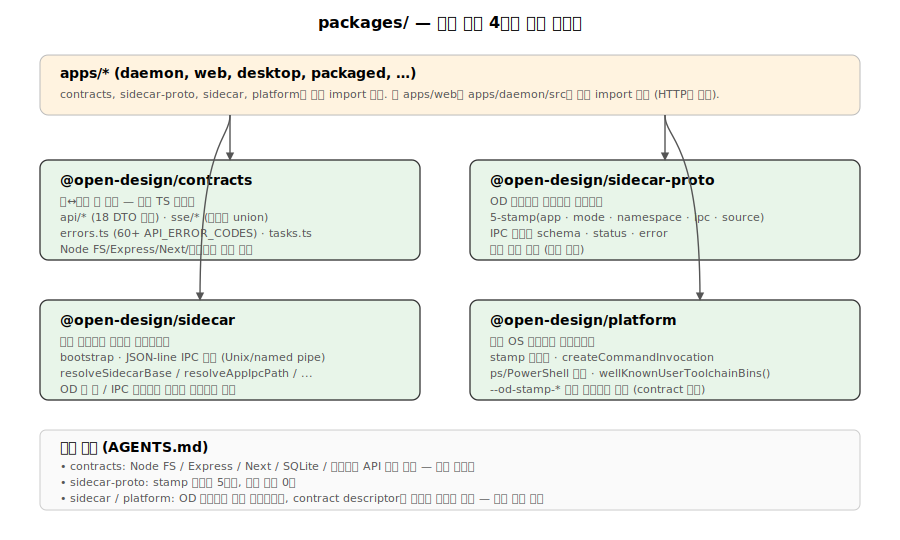

# 03. packages/ — 4계층 순수 TS 패키지

`packages/`는 4개의 순환 없는 계층화 패키지로 구성됩니다. 모두 **순수 TypeScript**이며, 각 레이어는 `AGENTS.md`에 명문화된 경계 규칙을 따릅니다.



## 1. 의존 그래프

```
            ┌──── @open-design/contracts ────┐  (web/daemon 앱 DTO 계약)
            │   순수 TS, 외부 의존: zod만     │
            └─────────────────────────────────┘
                          ▲
                          │ apps/* import
                          │
            ┌──── @open-design/sidecar-proto ──────┐  (OD 사이드카 비즈니스 프로토콜)
            │   외부 의존 없음. 5-stamp, IPC 메시지 │
            └───────────────────────────────────────┘
                          ▲
                          │ contract descriptor로 전달
                          │
            ┌──── @open-design/sidecar ───────────┐  (범용 사이드카 런타임 프리미티브)
            │   bootstrap, IPC 전송, 경로/env      │
            │   OD 앱 키 하드코딩 없음              │
            └───────────────────────────────────────┘
                          ▲
                          │ 호출됨
                          │
            ┌──── @open-design/platform ──────────┐  (범용 OS 프로세스 프리미티브)
            │   stamp 직렬화, ps/PowerShell 스캔   │
            │   사용자 toolchain bin 디스커버리    │
            └───────────────────────────────────────┘
```

**순환 의존성 없음.** 각 패키지는 다른 OD 패키지를 직접 import하지 않고 **제네릭 인자**로 contract descriptor를 받습니다.

## 2. @open-design/contracts

**역할**: web↔daemon HTTP/SSE 계약 — DTO 타입, SSE 이벤트 union, 에러 코드, 작업 상태, 직렬화 제약. **순수 TS 타입만**, Node FS/process/Express/Next.js/SQLite/브라우저 API 의존 **금지**.

### 2-1. 의존성

`zod@^3.23.8` 단 하나 (직렬화 스키마 검증용).

### 2-2. 디렉토리

```
packages/contracts/src/
├── api/              (18개 엔드포인트별 DTO 모듈)
│   ├── chat.ts, artifacts.ts, files.ts, projects.ts
│   ├── connectors.ts, mcp.ts, registry.ts, research.ts
│   ├── memory.ts, live-artifacts.ts, comments.ts
│   ├── app-config.ts, connectionTest.ts, finalize.ts
│   ├── orbit.ts, providerModels.ts, proxy.ts, routines.ts, version.ts
├── sse/
│   ├── common.ts     (SseTransportEvent<Name, Payload> 제네릭)
│   ├── chat.ts       (ChatSseEvent union: start|agent|stdout|stderr|error|end)
│   └── proxy.ts
├── prompts/          (5개 prompt 템플릿)
├── common.ts         (JsonValue, BoundedJsonConstraints, Response types)
├── errors.ts         (60+ API_ERROR_CODES)
├── tasks.ts          (TaskState, TaskStatus)
├── critique.ts
├── examples.ts
└── index.ts          (배럴 export)
```

### 2-3. 대표 export

| 타입 | 위치 | 역할 |
|---|---|---|
| `ChatRequest` | `api/chat.ts` | 에이전트 호출 요청 (agentId, message, projectId, skillIds[]) |
| `ChatRunStatus` | `api/chat.ts` | 실행 상태 union: `queued \| running \| succeeded \| failed \| canceled` |
| `ChatSseEvent` | `sse/chat.ts` | SSE 이벤트 union (6종) |
| `DaemonAgentPayload` | `sse/chat.ts` | agent 측 emit: status / text_delta / thinking_delta / tool_use / tool_result / usage |
| `ApiErrorResponse` | `errors.ts` | 에러 응답 (code, message, details, retryable) |
| `TaskStatus` | `tasks.ts` | 작업 상태 (id, state, label, detail, 타임스탬프) |
| `SseTransportEvent<Name, P>` | `sse/common.ts` | 범용 SSE 프레임 제네릭 |
| `LiveArtifact` | `api/live-artifacts.ts` | 라이브 아티팩트 도큐먼트 |
| `ProjectFile` | `api/files.ts` | 파일 메타 |
| `BoundedJsonConstraints` | `common.ts` | maxDepth / maxObjectKeys / maxArrayLength / maxStringLength / maxSerializedBytes |

### 2-4. 경계 규칙 준수 검증

- `node:` import 없음 (`common.ts`, `errors.ts`, `tasks.ts`, `sse/common.ts` 모두 타입만)
- zod 외 외부 의존 없음
- **계약 레이어로만 동작** — 런타임 검증은 호출 측(daemon)에 위임

## 3. @open-design/sidecar-proto

**역할**: Open Design 사이드카 비즈니스 프로토콜. **앱/모드/소스 상수**, **5필드 stamp 디스크립터**, **namespace 정규식 검증**, **IPC 메시지 스키마**, **status 형태**, **에러 의미론**, **기본 product path 상수**.

### 3-1. 의존성

**없음** — 완전 순수.

### 3-2. 단일 파일 구조

```
packages/sidecar-proto/src/index.ts   (~500 라인, 모든 정의)
packages/sidecar-proto/tests/index.test.ts
```

### 3-3. 5-Stamp 필드

```typescript
export const SIDECAR_STAMP_FIELDS = [
  "app", "mode", "namespace", "ipc", "source"
] as const;

// 필드 의미:
// 1. app:       AppKey (daemon | desktop | web)
// 2. mode:      SidecarMode (dev | runtime)
// 3. namespace: ^[A-Za-z0-9][A-Za-z0-9._-]{0,127}$
// 4. ipc:       절대 경로 또는 Windows named pipe
// 5. source:    SidecarSource (packaged | tools-dev | tools-pack)
```

이 5필드는 루트 `AGENTS.md`에서 **엄격히 5개로 제한**됩니다 — 추가/제거 금지.

### 3-4. IPC 메시지 스키마

직접 TypeScript discriminated union, Zod 미사용:

```typescript
export type DaemonSidecarMessage =
  | SidecarStatusMessage
  | SidecarShutdownMessage
  | RegisterDesktopAuthMessage;

export type DesktopSidecarMessage =
  | SidecarStatusMessage
  | SidecarShutdownMessage
  | DesktopEvalMessage
  | DesktopScreenshotMessage
  | DesktopConsoleMessage
  | DesktopClickMessage
  | DesktopExportPdfMessage;

export type WebSidecarMessage =
  | SidecarStatusMessage
  | SidecarShutdownMessage;
```

8개 메시지 타입: `CLICK`, `CONSOLE`, `EVAL`, `EXPORT_PDF`, `REGISTER_DESKTOP_AUTH`, `SCREENSHOT`, `SHUTDOWN`, `STATUS`.

### 3-5. 정규화 함수

- `normalizeNamespace()` — 공백/`/`/`\` 차단, null byte 금지, 정규식 검증
- `normalizeIpcPath()` — 절대 경로 필수, Windows named pipe 특별 처리
- `normalizeDaemonSidecarMessage()` — type별 input 검증
- `normalizeSidecarStamp()` — 5필드 모두 필수, 알려진 키만 허용

### 3-6. 기본 경로 상수

```typescript
export const SIDECAR_DEFAULTS = Object.freeze({
  host: "127.0.0.1",
  ipcBase: "/tmp/open-design/ipc",
  namespace: "default",
  projectTmpDirName: ".tmp",
  windowsPipePrefix: "open-design",
});
```

### 3-7. 상태 형태

```typescript
export type ServiceRuntimeState =
  | "idle" | "running" | "starting" | "stopped" | "unknown";

export type DaemonStatusSnapshot = {
  pid?: number | null;
  state: ServiceRuntimeState;
  url: string | null;
  desktopAuthGateActive: boolean;
};

export type DesktopStatusSnapshot = {
  pid?: number | null;
  state: DesktopRuntimeState;
  title?: string | null;
  windowVisible?: boolean;
};
```

### 3-8. 에러 의미론

```typescript
export const SIDECAR_ERROR_CODES = Object.freeze({
  INVALID_MESSAGE: "SIDECAR_INVALID_MESSAGE",
  UNKNOWN_MESSAGE: "SIDECAR_UNKNOWN_MESSAGE",
});

export class SidecarContractError extends Error {
  readonly code: SidecarErrorCode;
  constructor(code: SidecarErrorCode, message: string);
}
```

## 4. @open-design/sidecar

**역할**: **범용** 사이드카 런타임 프리미티브 — bootstrap, JSON-line IPC 전송, 경로/런타임 해석, launch env 구성, JSON 파일 헬퍼. **OD 앱 키나 IPC 비즈니스 메시지를 하드코딩하지 않음** — 모두 ProcessStampContract/SidecarStampShape 제네릭으로 추상화.

### 4-1. Bootstrap

```typescript
export function bootstrapSidecarRuntime<TStamp extends SidecarStampShape>(
  stampInput: unknown,
  env: NodeJS.ProcessEnv,
  options: BootstrapSidecarRuntimeOptions<TStamp>,
): SidecarRuntimeContext<TStamp>
```

순서:
1. 입력 stamp 정규화 (`contract.normalizeStamp`)
2. 앱 검증 (기대 앱과 일치 확인)
3. base 경로 해석 (env > config > source 기본값)
4. IPC 경로 계산 (`resolveAppIpcPath`)
5. 환경 변수 설정 (`OD_SIDECAR_IPC_PATH`, `OD_SIDECAR_NAMESPACE`, `OD_SIDECAR_SOURCE`)
6. `SidecarRuntimeContext` 반환

### 4-2. IPC 전송

POSIX Unix domain socket 또는 Windows named pipe(`\\.\pipe\open-design-<namespace>-<app>`).

| 함수 | 역할 |
|---|---|
| `createJsonIpcServer(handler, socketPath)` | JSON-line 프로토콜 서버 생성 |
| `requestJsonIpc<T>(socketPath, payload, {timeoutMs})` | JSON 요청 송신, 기본 1500ms 타임아웃 |
| `prepareIpcPath(socketPath)` | 디렉토리 생성, 좌초된 socket 정리 |

**프로토콜**: 메시지 = `{...json...}\n`(개행 구분). 응답 = `{ok: true, result}` 또는 `{ok: false, error: {code?, message}}`.

### 4-3. 경로 해석

| 함수 | 결과 |
|---|---|
| `resolveSidecarBase()` | 기본 경로 |
| `resolveNamespaceRoot()` | `{base}/{namespace}` |
| `resolveRuntimeRoot()` | `{namespace-root}/runs/{runId}` |
| `resolvePointerPath()` | `{namespace-root}/current.json` |
| `resolveAppIpcPath()` | `{ipcBase}/{namespace}/{app}.sock` (또는 Windows pipe) |
| `resolveAppRuntimeDir()` | `{namespace-root}/{app}` |
| `resolveLogsDir()` | `{runtime-root}/logs/{app}` |

### 4-4. 런타임 파일 헬퍼

```typescript
export async function readJsonFile<T>(filePath: string): Promise<T | null>;
export async function writeJsonFile(filePath: string, payload: unknown): Promise<void>;
export async function removeFile(filePath: string): Promise<void>;
export async function removePointerIfCurrent(pointerPath: string, runId: string): Promise<void>;
```

**작성 위치 예**: `{namespace-root}/current.json`(pointer), `{runtime-root}/manifest.json`.

### 4-5. Launch Env

```typescript
export function createSidecarLaunchEnv<TStamp>({
  base, contract, extraEnv = process.env, stamp
}): NodeJS.ProcessEnv
```

설정 변수:
- `OD_SIDECAR_BASE`
- `OD_SIDECAR_IPC_PATH`
- `OD_SIDECAR_NAMESPACE`
- `OD_SIDECAR_SOURCE`

## 5. @open-design/platform

**역할**: **범용** OS 프로세스 프리미티브 — stamp 직렬화, command 파싱, 프로세스 매칭/검색, 사용자 toolchain bin 디스커버리. **`--od-stamp-*` 이름을 하드코딩하지 않고** `ProcessStampContract`를 인자로 받는다.

### 5-1. Stamp 직렬화

```typescript
export function createProcessStampArgs<TStamp>(
  stamp: TStamp,
  contract: ProcessStampContract<TStamp>,
): string[]
```

stamp 객체 → flag 배열 (`--od-stamp-app=daemon --od-stamp-mode=runtime ...`).

```typescript
export function readProcessStamp<TStamp>(
  args: readonly string[],
  contract: ProcessStampContract<TStamp>,
): TStamp | null
```

argv → stamp 객체 (역변환).

```typescript
export function readFlagValue(args: readonly string[], flagName: string): string | null
```

`--flag=value` 또는 `--flag value` 인라인/분리 둘 다 지원.

### 5-2. Command Parsing

```typescript
export type CommandInvocation = {
  args: string[];
  command: string;
  windowsVerbatimArguments?: boolean;
};
```

**Windows 배치 보안**: `.bat`/`.cmd` 호출 시 `cmd.exe /s /c "..."` 래퍼, 환경 변수 확장(`%FOO%`) 주입 차단.

```typescript
function quoteWindowsCommandArg(value: string): string {
  // %DEEPSEEK_API_KEY% 같은 env var 주입 방지
  const escaped = value.replace(/"/g, '""').replace(/%/g, '"^%"');
  return `"${escaped}"`;
}
```

### 5-3. Process 매칭/검색

```typescript
export function matchesStampedProcess<TStamp>(
  processInfo: Pick<ProcessSnapshot, "command">,
  criteria: TCriteria | undefined,
  contract: ProcessStampContract<TStamp, TCriteria>,
): boolean

export async function listProcessSnapshots(): Promise<ProcessSnapshot[]>
```

- **POSIX**: `ps -axo pid=,ppid=,command=` 파싱.
- **Windows**: PowerShell `Get-CimInstance Win32_Process | ConvertTo-Json` 파싱.

```typescript
export function collectProcessTreePids(
  processes: ProcessSnapshot[],
  rootPids: Array<number | null | undefined>,
): number[]
```

BFS로 자손 PID 수집 — 사이드카 종료 시 child process까지 깨끗하게 정리.

### 5-4. 사용자 Toolchain Bin 디스커버리

**단일 진실 공급원** — `wellKnownUserToolchainBins()`. 데몬의 에이전트 resolver(`apps/daemon/src/agents.ts`)와 패키지 사이드카의 PATH 빌더(`apps/packaged/src/sidecars.ts`)가 모두 이 함수만 호출하므로 두 레이어가 토큰 검색 목록을 드리프트할 수 없습니다.

검색 순서:
1. `$VP_HOME/bin` (Vite+)
2. `$NPM_CONFIG_PREFIX/bin` 또는 `$npm_config_prefix/bin`
3. `~/.local/bin`, `~/.vite-plus/bin`, `~/.opencode/bin`, `~/.bun/bin`, `~/.volta/bin`, `~/.asdf/shims`
4. `~/Library/pnpm` (macOS)
5. `~/.cargo/bin`
6. `~/.npm-global/bin`, `~/.npm-packages/bin`
7. `/opt/homebrew/bin`, `/usr/local/bin` (POSIX)
8. Node 버전 매니저 스캔(semver 정렬, 최신 우선):
   - `~/.local/share/mise/installs/node/*/bin`
   - `~/.nvm/versions/node/*/bin`
   - `~/.local/share/fnm/node-versions/*/installation/bin`
   - `~/.fnm/node-versions/*/installation/bin`

### 5-5. 유틸리티

```typescript
export async function stopProcesses(pids): Promise<StopProcessesResult>
// SIGTERM → 5초 대기 → SIGKILL. 결과:
// { matchedPids, stoppedPids, forcedPids, remainingPids, alreadyStopped }

export async function waitForHttpOk(url, {timeoutMs = 20000}): Promise<true>
// HTTP GET 폴링, 150ms 간격
```

## 6. 경계 규칙 준수 매트릭스

| 규칙 (AGENTS.md) | 검증 |
|---|---|
| contracts: 순수 TS, Node FS/process/Express/SQLite/브라우저 의존 금지 | ✓ zod만 의존, `node:` import 없음 |
| sidecar-proto: 외부 의존 없음, 5-stamp 고정 | ✓ deps 비어있음, `SIDECAR_STAMP_FIELDS` 5개 |
| sidecar: OD 앱 키/IPC 비즈니스 메시지 하드코딩 금지 | ✓ ProcessStampContract 제네릭으로만 |
| platform: `--od-stamp-*` 하드코딩 금지 | ✓ `contract.stampFlags` 읽음 |
| 패키지 테스트는 `tests/` 형제 | ✓ 모두 `packages/<x>/tests/` |
| stamp 5필드 제한 | ✓ `SIDECAR_STAMP_FIELDS as const` |
