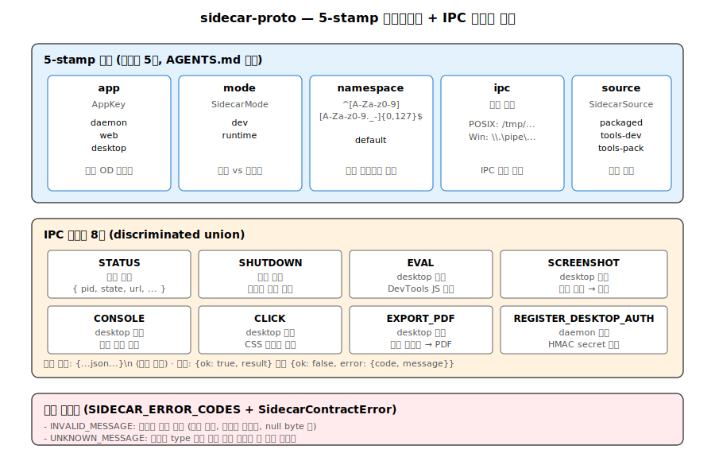

# 03. packages/ — 4계층 순수 TS 패키지

`packages/`는 4개의 순환 없는 계층화 패키지로 구성됩니다. 모두 **순수 TypeScript**이며, 각 레이어는 `AGENTS.md`에 명문화된 경계 규칙을 따릅니다.


## 1. 의존 그래프

```
            ┌──── @open-design/contracts ────┐  (web/daemon 앱 DTO 계약)
            │   순수 TS, 외부 의존: zod만     │
            └─────────────────────────────────┘
                          ▲
                          │ apps/* import
                          │
            ┌──── @open-design/sidecar-proto ──────┐  (OD 사이드카 비즈니스 프로토콜)
            │   외부 의존 없음. 5-stamp, IPC 메시지 │
            └───────────────────────────────────────┘
                          ▲
                          │ contract descriptor로 전달
                          │
            ┌──── @open-design/sidecar ───────────┐  (범용 사이드카 런타임 프리미티브)
            │   bootstrap, IPC 전송, 경로/env      │
            │   OD 앱 키 하드코딩 없음              │
            └───────────────────────────────────────┘
                          ▲
                          │ 호출됨
                          │
            ┌──── @open-design/platform ──────────┐  (범용 OS 프로세스 프리미티브)
            │   stamp 직렬화, ps/PowerShell 스캔   │
            │   사용자 toolchain bin 디스커버리    │
            └───────────────────────────────────────┘
```

**순환 의존성 없음.** 각 패키지는 다른 OD 패키지를 직접 import하지 않고 **제네릭 인자**로 contract descriptor를 받습니다.

## 2. @open-design/contracts

**역할**: web↔daemon HTTP/SSE 계약 — DTO 타입, SSE 이벤트 union, 에러 코드, 작업 상태, 직렬화 제약. **순수 TS 타입만**, Node FS/process/Express/Next.js/SQLite/브라우저 API 의존 **금지**.

### 2-1. 의존성

`zod@^3.23.8` 단 하나 (직렬화 스키마 검증용).

### 2-2. 디렉토리

```
packages/contracts/src/
├── api/              (18개 엔드포인트별 DTO 모듈)
│   ├── chat.ts, artifacts.ts, files.ts, projects.ts
│   ├── connectors.ts, mcp.ts, registry.ts, research.ts
│   ├── memory.ts, live-artifacts.ts, comments.ts
│   ├── app-config.ts, connectionTest.ts, finalize.ts
│   ├── orbit.ts, providerModels.ts, proxy.ts, routines.ts, version.ts
├── sse/
│   ├── common.ts     (SseTransportEvent<Name, Payload> 제네릭)
│   ├── chat.ts       (ChatSseEvent union: start|agent|stdout|stderr|error|end)
│   └── proxy.ts
├── prompts/          (5개 prompt 템플릿)
├── common.ts         (JsonValue, BoundedJsonConstraints, Response types)
├── errors.ts         (60+ API_ERROR_CODES)
├── tasks.ts          (TaskState, TaskStatus)
├── critique.ts
├── examples.ts
└── index.ts          (배럴 export)
```

### 2-3. 대표 export

| 타입 | 위치 | 역할 |
|---|---|---|
| `ChatRequest` | `api/chat.ts` | 에이전트 호출 요청 (agentId, message, projectId, skillIds[]) |
| `ChatRunStatus` | `api/chat.ts` | 실행 상태 union: `queued \| running \| succeeded \| failed \| canceled` |
| `ChatSseEvent` | `sse/chat.ts` | SSE 이벤트 union (6종) |
| `DaemonAgentPayload` | `sse/chat.ts:51-61` | agent 측 emit (10 variants): status / text_delta / thinking_delta / thinking_start / live_artifact / live_artifact_refresh / tool_use / tool_result / usage / raw |
| `ApiErrorResponse` | `errors.ts` | 에러 응답 (code, message, details, retryable) |
| `TaskStatus` | `tasks.ts` | 작업 상태 (id, state, label, detail, 타임스탬프) |
| `SseTransportEvent<Name, P>` | `sse/common.ts` | 범용 SSE 프레임 제네릭 |
| `LiveArtifact` | `api/live-artifacts.ts` | 라이브 아티팩트 도큐먼트 |
| `ProjectFile` | `api/files.ts` | 파일 메타 |
| `BoundedJsonConstraints` | `common.ts` | maxDepth / maxObjectKeys / maxArrayLength / maxStringLength / maxSerializedBytes |

### 2-4. 경계 규칙 준수 검증

- `node:` import 없음 (`common.ts`, `errors.ts`, `tasks.ts`, `sse/common.ts` 모두 타입만)
- zod 외 외부 의존 없음
- **계약 레이어로만 동작** — 런타임 검증은 호출 측(daemon)에 위임

## 3. @open-design/sidecar-proto

**역할**: Open Design 사이드카 비즈니스 프로토콜. **앱/모드/소스 상수**, **5필드 stamp 디스크립터**, **namespace 정규식 검증**, **IPC 메시지 스키마**, **status 형태**, **에러 의미론**, **기본 product path 상수**.



### 3-1. 의존성

**없음** — 완전 순수.

### 3-2. 단일 파일 구조

```
packages/sidecar-proto/src/index.ts   (~500 라인, 모든 정의)
packages/sidecar-proto/tests/index.test.ts
```

### 3-3. 5-Stamp 필드

```typescript
export const SIDECAR_STAMP_FIELDS = [
  "app", "mode", "namespace", "ipc", "source"
] as const;

// 필드 의미:
// 1. app:       AppKey (daemon | desktop | web)
// 2. mode:      SidecarMode (dev | runtime)
// 3. namespace: ^[A-Za-z0-9][A-Za-z0-9._-]{0,127}$
// 4. ipc:       절대 경로 또는 Windows named pipe
// 5. source:    SidecarSource (packaged | tools-dev | tools-pack)
```

이 5필드는 루트 `AGENTS.md`에서 **엄격히 5개로 제한**됩니다 — 추가/제거 금지.

### 3-4. IPC 메시지 스키마

직접 TypeScript discriminated union, Zod 미사용:

```typescript
export type DaemonSidecarMessage =
  | SidecarStatusMessage
  | SidecarShutdownMessage
  | RegisterDesktopAuthMessage;

export type DesktopSidecarMessage =
  | SidecarStatusMessage
  | SidecarShutdownMessage
  | DesktopEvalMessage
  | DesktopScreenshotMessage
  | DesktopConsoleMessage
  | DesktopClickMessage
  | DesktopExportPdfMessage;

export type WebSidecarMessage =
  | SidecarStatusMessage
  | SidecarShutdownMessage;
```

8개 메시지 타입: `CLICK`, `CONSOLE`, `EVAL`, `EXPORT_PDF`, `REGISTER_DESKTOP_AUTH`, `SCREENSHOT`, `SHUTDOWN`, `STATUS`.

### 3-5. 정규화 함수

- `normalizeNamespace()` — 공백/`/`/`\` 차단, null byte 금지, 정규식 검증
- `normalizeIpcPath()` — 절대 경로 필수, Windows named pipe 특별 처리
- `normalizeDaemonSidecarMessage()` — type별 input 검증
- `normalizeSidecarStamp()` — 5필드 모두 필수, 알려진 키만 허용

### 3-6. 기본 경로 상수

```typescript
export const SIDECAR_DEFAULTS = Object.freeze({
  host: "127.0.0.1",
  ipcBase: "/tmp/open-design/ipc",
  namespace: "default",
  projectTmpDirName: ".tmp",
  windowsPipePrefix: "open-design",
});
```

### 3-7. 상태 형태

```typescript
export type ServiceRuntimeState =
  | "idle" | "running" | "starting" | "stopped" | "unknown";

export type DaemonStatusSnapshot = {
  pid?: number | null;
  state: ServiceRuntimeState;
  url: string | null;
  desktopAuthGateActive: boolean;
};

export type DesktopStatusSnapshot = {
  pid?: number | null;
  state: DesktopRuntimeState;
  title?: string | null;
  windowVisible?: boolean;
};
```

### 3-8. 에러 의미론

```typescript
export const SIDECAR_ERROR_CODES = Object.freeze({
  INVALID_MESSAGE: "SIDECAR_INVALID_MESSAGE",
  UNKNOWN_MESSAGE: "SIDECAR_UNKNOWN_MESSAGE",
});

export class SidecarContractError extends Error {
  readonly code: SidecarErrorCode;
  constructor(code: SidecarErrorCode, message: string);
}
```

## 4. @open-design/sidecar

**역할**: **범용** 사이드카 런타임 프리미티브 — bootstrap, JSON-line IPC 전송, 경로/런타임 해석, launch env 구성, JSON 파일 헬퍼. **OD 앱 키나 IPC 비즈니스 메시지를 하드코딩하지 않음** — 모두 ProcessStampContract/SidecarStampShape 제네릭으로 추상화.

### 4-1. Bootstrap

```typescript
export function bootstrapSidecarRuntime<TStamp extends SidecarStampShape>(
  stampInput: unknown,
  env: NodeJS.ProcessEnv,
  options: BootstrapSidecarRuntimeOptions<TStamp>,
): SidecarRuntimeContext<TStamp>
```

순서:
1. 입력 stamp 정규화 (`contract.normalizeStamp`)
2. 앱 검증 (기대 앱과 일치 확인)
3. base 경로 해석 (env > config > source 기본값)
4. IPC 경로 계산 (`resolveAppIpcPath`)
5. 환경 변수 설정 (`OD_SIDECAR_IPC_PATH`, `OD_SIDECAR_NAMESPACE`, `OD_SIDECAR_SOURCE`)
6. `SidecarRuntimeContext` 반환

### 4-2. IPC 전송

POSIX Unix domain socket 또는 Windows named pipe(`\\.\pipe\open-design-<namespace>-<app>`).

| 함수 | 역할 |
|---|---|
| `createJsonIpcServer(handler, socketPath)` | JSON-line 프로토콜 서버 생성 |
| `requestJsonIpc<T>(socketPath, payload, {timeoutMs})` | JSON 요청 송신, 기본 1500ms 타임아웃 |
| `prepareIpcPath(socketPath)` | 디렉토리 생성, 좌초된 socket 정리 |

**프로토콜**: 메시지 = `{...json...}\n`(개행 구분). 응답 = `{ok: true, result}` 또는 `{ok: false, error: {code?, message}}`.

### 4-3. 경로 해석

| 함수 | 결과 |
|---|---|
| `resolveSidecarBase()` | 기본 경로 |
| `resolveNamespaceRoot()` | `{base}/{namespace}` |
| `resolveRuntimeRoot()` | `{namespace-root}/runs/{runId}` |
| `resolvePointerPath()` | `{namespace-root}/current.json` |
| `resolveAppIpcPath()` | `{ipcBase}/{namespace}/{app}.sock` (또는 Windows pipe) |
| `resolveAppRuntimeDir()` | `{namespace-root}/{app}` |
| `resolveLogsDir()` | `{runtime-root}/logs/{app}` |

### 4-4. 런타임 파일 헬퍼

```typescript
export async function readJsonFile<T>(filePath: string): Promise<T | null>;
export async function writeJsonFile(filePath: string, payload: unknown): Promise<void>;
export async function removeFile(filePath: string): Promise<void>;
export async function removePointerIfCurrent(pointerPath: string, runId: string): Promise<void>;
```

**작성 위치 예**: `{namespace-root}/current.json`(pointer), `{runtime-root}/manifest.json`.

### 4-5. Launch Env

```typescript
export function createSidecarLaunchEnv<TStamp>({
  base, contract, extraEnv = process.env, stamp
}): NodeJS.ProcessEnv
```

설정 변수:
- `OD_SIDECAR_BASE`
- `OD_SIDECAR_IPC_PATH`
- `OD_SIDECAR_NAMESPACE`
- `OD_SIDECAR_SOURCE`

## 5. @open-design/platform

**역할**: **범용** OS 프로세스 프리미티브 — stamp 직렬화, command 파싱, 프로세스 매칭/검색, 사용자 toolchain bin 디스커버리. **`--od-stamp-*` 이름을 하드코딩하지 않고** `ProcessStampContract`를 인자로 받는다.

### 5-1. Stamp 직렬화

```typescript
export function createProcessStampArgs<TStamp>(
  stamp: TStamp,
  contract: ProcessStampContract<TStamp>,
): string[]
```

stamp 객체 → flag 배열 (`--od-stamp-app=daemon --od-stamp-mode=runtime ...`).

```typescript
export function readProcessStamp<TStamp>(
  args: readonly string[],
  contract: ProcessStampContract<TStamp>,
): TStamp | null
```

argv → stamp 객체 (역변환).

```typescript
export function readFlagValue(args: readonly string[], flagName: string): string | null
```

`--flag=value` 또는 `--flag value` 인라인/분리 둘 다 지원.

### 5-2. Command Parsing

```typescript
export type CommandInvocation = {
  args: string[];
  command: string;
  windowsVerbatimArguments?: boolean;
};
```

**Windows 배치 보안**: `.bat`/`.cmd` 호출 시 `cmd.exe /d /s /c "..."` 래퍼(`buildCmdShimInvocation`, `packages/platform/src/index.ts:187-194`), 환경 변수 확장(`%FOO%`) 주입 차단.

```typescript
function quoteWindowsCommandArg(value: string): string {
  // %DEEPSEEK_API_KEY% 같은 env var 주입 방지
  const escaped = value.replace(/"/g, '""').replace(/%/g, '"^%"');
  return `"${escaped}"`;
}
```

### 5-3. Process 매칭/검색

```typescript
export function matchesStampedProcess<TStamp>(
  processInfo: Pick<ProcessSnapshot, "command">,
  criteria: TCriteria | undefined,
  contract: ProcessStampContract<TStamp, TCriteria>,
): boolean

export async function listProcessSnapshots(): Promise<ProcessSnapshot[]>
```

- **POSIX**: `ps -axo pid=,ppid=,command=` 파싱.
- **Windows**: PowerShell `Get-CimInstance Win32_Process | ConvertTo-Json` 파싱.

```typescript
export function collectProcessTreePids(
  processes: ProcessSnapshot[],
  rootPids: Array<number | null | undefined>,
): number[]
```

BFS로 자손 PID 수집 — 사이드카 종료 시 child process까지 깨끗하게 정리.

### 5-4. 사용자 Toolchain Bin 디스커버리

**단일 진실 공급원** — `wellKnownUserToolchainBins()` (`packages/platform/src/index.ts:452`). 데몬의 toolchain resolver(`apps/daemon/src/runtimes/executables.ts:52`, `agents.ts`가 재export)와 패키지 사이드카의 PATH 빌더(`apps/packaged/src/sidecars.ts:179`)가 모두 이 함수만 호출하므로 두 레이어가 토큰 검색 목록을 드리프트할 수 없습니다.

검색 순서:
1. `$VP_HOME/bin` (Vite+)
2. `$NPM_CONFIG_PREFIX/bin` 또는 `$npm_config_prefix/bin`
3. `~/.local/bin`, `~/.vite-plus/bin`, `~/.opencode/bin`, `~/.bun/bin`, `~/.volta/bin`, `~/.asdf/shims`
4. `~/Library/pnpm` (macOS)
5. `~/.cargo/bin`
6. `~/.npm-global/bin`, `~/.npm-packages/bin`
7. `/opt/homebrew/bin`, `/usr/local/bin` (POSIX)
8. Node 버전 매니저 스캔(semver 정렬, 최신 우선):
   - `~/.local/share/mise/installs/node/*/bin`
   - `~/.nvm/versions/node/*/bin`
   - `~/.local/share/fnm/node-versions/*/installation/bin`
   - `~/.fnm/node-versions/*/installation/bin`

### 5-5. 유틸리티

```typescript
export async function stopProcesses(pids): Promise<StopProcessesResult>
// SIGTERM → 5초 대기 → SIGKILL. 결과:
// { matchedPids, stoppedPids, forcedPids, remainingPids, alreadyStopped }

export async function waitForHttpOk(url, {timeoutMs = 20000}): Promise<true>
// HTTP GET 폴링, 150ms 간격
```

## 6. 경계 규칙 준수 매트릭스

| 규칙 (AGENTS.md) | 검증 |
|---|---|
| contracts: 순수 TS, Node FS/process/Express/SQLite/브라우저 의존 금지 | ✓ zod만 의존, `node:` import 없음 |
| sidecar-proto: 외부 의존 없음, 5-stamp 고정 | ✓ deps 비어있음, `SIDECAR_STAMP_FIELDS` 5개 |
| sidecar: OD 앱 키/IPC 비즈니스 메시지 하드코딩 금지 | ✓ ProcessStampContract 제네릭으로만 |
| platform: `--od-stamp-*` 하드코딩 금지 | ✓ `contract.stampFlags` 읽음 |
| 패키지 테스트는 `tests/` 형제 | ✓ 모두 `packages/<x>/tests/` |
| stamp 5필드 제한 | ✓ `SIDECAR_STAMP_FIELDS as const` |

---

## 7. 심층 노트

### 7-1. 핵심 코드 발췌

```typescript
// packages/sidecar-proto/src/index.ts — 5-stamp 정규화
export function normalizeSidecarStamp(input: unknown): SidecarStamp {
  if (!isRecord(input)) throw new SidecarContractError("INVALID_MESSAGE", ...);
  for (const k of Object.keys(input)) {
    if (!SIDECAR_STAMP_FIELDS.includes(k)) {
      throw new SidecarContractError("INVALID_MESSAGE", `unknown stamp field: ${k}`);
    }
  }
  return {
    app: normalizeAppKey(input.app),
    mode: normalizeMode(input.mode),
    namespace: normalizeNamespace(input.namespace),
    ipc: normalizeIpcPath(input.ipc),
    source: normalizeSource(input.source),
  };
}
```

```typescript
// packages/sidecar/src/index.ts — JSON-line IPC 클라이언트
export async function requestJsonIpc<T>(
  socketPath: string,
  payload: unknown,
  { timeoutMs = 1500 }: { timeoutMs?: number } = {},
): Promise<T> {
  return new Promise((resolve, reject) => {
    const client = net.createConnection(socketPath);
    const timer = setTimeout(() => {
      client.destroy(new Error(`IPC timeout after ${timeoutMs}ms`));
    }, timeoutMs);
    let buffer = '';
    client.on('data', (chunk) => {
      buffer += chunk.toString('utf8');
      const idx = buffer.indexOf('\n');
      if (idx >= 0) {
        const line = buffer.slice(0, idx);
        clearTimeout(timer);
        const response = JSON.parse(line);
        client.end();
        response.ok ? resolve(response.result) : reject(response.error);
      }
    });
    client.write(JSON.stringify(payload) + '\n');
  });
}
```

```typescript
// packages/platform/src/index.ts — Windows env var 주입 방어
function quoteWindowsCommandArg(value: string): string {
  // %VAR% expansion 차단: `"^%"`로 escape
  const escaped = value.replace(/"/g, '""').replace(/%/g, '"^%"');
  return `"${escaped}"`;
}
```

### 7-2. 엣지 케이스 + 에러 패턴

- **IPC 서버 부재**: `requestJsonIpc`가 ECONNREFUSED 받으면 즉시 reject. 데몬이 아직 부팅 중이라면 caller가 retry/backoff 책임.
- **stale 소켓 파일**: 데몬 비정상 종료 후 `/tmp/open-design/ipc/.../daemon.sock` 잔존 → `prepareIpcPath`가 `unlink` 시도. 다른 프로세스가 listen 중이면 EADDRINUSE → 다른 namespace 사용 권장.
- **Windows named pipe 길이 제약**: 256자 제한. namespace + app 이름이 길면 path 잘림. `resolveAppIpcPath`가 `windowsPipePrefix + namespace.slice(0, N)` 형태로 안전 truncation.
- **POSIX socket 권한**: `0700` (사용자만 read/write). 다른 사용자가 같은 머신에서 데몬 IPC 호출 불가.
- **process matching false positive**: argv에서 `--od-stamp-namespace=foo` grep 시 자기 부모도 매치 가능 → `matchesStampedProcess`가 정확히 일치하는 stamp만 카운트.
- **`createCommandInvocation`의 `.bat`/`.cmd` 처리**: shell 명령으로 실행되므로 인자에 `&`, `|` 포함되면 명령 주입 위험 → `quoteWindowsCommandArg`가 모두 escape.

### 7-3. 트레이드오프 + 설계 근거

- **5-stamp 고정 vs 확장 가능**: 5필드 강제는 신규 메타데이터 추가를 차단하지만 모든 사이드카가 같은 인터페이스 보장. 새 metadata는 env 변수 또는 IPC 메시지 페이로드에 추가.
- **JSON-line 프로토콜 vs 길이 prefix**: JSON-line은 사람이 읽기 쉽고 디버깅 가능. 비용은 메시지에 개행 포함 시 escape 필요 (현재 JSON.stringify가 자동 처리).
- **zod 의존성 (contracts)**: 런타임 검증을 가능하게 하지만 런타임 의존. 대안은 typia/io-ts/zod 중 zod 선택 — 가장 널리 쓰임 + 작은 번들.
- **platform 패키지가 OD 상수 미하드코딩**: `createProcessStampArgs(stamp, contract)` 형태로 contract 인자 — platform이 OD 외 다른 제품에도 재사용 가능 (현실적 재사용은 아직 없음). 비용은 호출자가 매번 contract 전달.
- **wellKnownUserToolchainBins 단일 진실**: daemon agent resolver와 packaged sidecar PATH builder가 모두 이 함수만 사용 — 두 레이어가 드리프트하면 발생할 "어떤 환경에서는 claude 인식되는데 다른 환경에서는 안 된다" 문제 방지.

### 7-4. 알고리즘 + 성능

- **IPC round-trip**: Unix socket 평균 0.5-2ms, named pipe ~1-3ms. JSON parse/stringify는 메시지 사이즈 < 1KB에서 무시할 수준.
- **`listProcessSnapshots`**: POSIX `ps -axo pid=,ppid=,command=` 호출 ~10-30ms (시스템 프로세스 수에 비례). Windows PowerShell `Get-CimInstance` ~100-300ms (PS 콜드 스타트가 비쌈).
- **`wellKnownUserToolchainBins` 1차 호출**: 17+ 디렉토리 stat() 호출 ~5-20ms. 5초 TTL 캐시로 재호출 시 0ms.
- **stamp serialize/parse**: 5 키 × `--od-stamp-K=V` 문자열 조립, ~O(1). 비용 무시 가능.
- **JSON 파일 I/O (current.json, manifest.json)**: 작은 파일 (< 1KB), atomic write 패턴 (`fs.writeFile`은 atomic 아님 → tmp + rename 권장 향후 개선 여지).

---

## 8. 함수·라인 단위 추적

### 8-1. `requestJsonIpc` 라이프사이클

`packages/sidecar/src/index.ts:525-566`. 라인 단위:

1. `:525-528` 시그너처: `requestJsonIpc<T>(socketPath, payload, { timeoutMs = 1500 })`. **기본 타임아웃 1500 ms** — `sidecar-proto` 상수 아니라 호출자 옵션.
2. `:531` `createConnection(socketPath)` — POSIX는 Unix domain socket path, Windows는 named pipe(`\\.\pipe\open-design-…`).
3. `:540-543` `setTimeout` → 만료 시 `socket.destroy()` + reject `IPC request timed out: <path>`. 정리 함수 `settle()`이 이중 resolve 방지.
4. `:545-547` `connect` 이벤트에서 `JSON.stringify(payload) + "\n"` 단일 write — JSON-line 프레이밍.
5. `:548-561` `data` 이벤트는 chunk를 `buffer`에 누적, **첫 `\n`** 만나면 응답 1프레임 완성. `socket.end()` 호출 후 `JSON.parse`로 디코드.
6. `:554-559` 응답 envelope `{ ok, result?, error?: {message} }`. `ok=false`면 `Error(error.message ?? "IPC request failed")` reject.
7. `:562-564` 소켓 `error` 이벤트(ECONNREFUSED 등)는 `settle()` 한 번만 reject.

호출자 책임: 데몬 부팅 중 ECONNREFUSED에 대한 retry/backoff(tools-dev `waitForDaemonRuntime`이 150ms 간격으로 35초까지 폴링).

### 8-2. `listProcessSnapshots` + `matchesStampedProcess` 흐름

`packages/platform/src/index.ts`:

1. `:320-328` `listProcessSnapshots()` 진입 — `process.platform === 'win32'`로 분기.
2. POSIX(`:285-293` `listPosixProcessSnapshots`): `execFile("ps", ["-axo", "pid=,ppid=,command="], { encoding: "utf8", maxBuffer: 8 MB })` — `maxBuffer` 8 MB는 큰 호스트(수천 프로세스)도 안전. 실패 시 `try/catch`로 빈 배열 반환(`:325-327`).
3. `:274-283` `parsePsOutput` 정규식 `/^\s*(\d+)\s+(\d+)\s+(.+)$/`로 pid/ppid/command 추출. 빈 라인은 `null` 후 `filter`로 제거.
4. Windows(`:295-318`): PowerShell 인라인 `Get-CimInstance Win32_Process | Select-Object ... | ConvertTo-Json -Compress`. JSON parse 후 단일 객체/배열 양쪽 처리.
5. 검색은 `matchesStampedProcess(processInfo, criteria, contract)`(`:134-141`) — `readProcessStampFromCommand`로 argv를 stamp로 역변환, `matchesProcessStamp`(`:121-132`)가 contract.stampFields 전수 비교(`expected==null`이면 와일드카드).
6. 트리 정리는 `collectProcessTreePids`(`:330-351`) — BFS, `childrenByParent` 맵 한 번 구성 후 `O(P+E)`로 자손 PID 수집. PID는 역순(`right - left`) 정렬 — leaf부터 SIGTERM 적용해서 부모-자식 race 회피.

### 8-3. `createProcessStampArgs` 직렬화

`:70-82` — `contract.normalizeStamp(stamp)`로 정규화 후 `stampFields` 순서대로 `${contract.stampFlags[field]}=${value}` 문자열 배열. **공백 분리(`--flag value`)가 아니라 inline(`--flag=value`)만** — argv 토큰 1개로 stamp 1개 → process listing에서 split 안정성.

## 9. 데이터 페이로드 샘플

### 9-1. IPC 메시지 envelope (JSON-line)

요청 (단일 라인 + `\n`):

```json
{"type":"STATUS"}
```

응답 (단일 라인 + `\n`):

```json
{"ok":true,"result":{"pid":48211,"state":"running","url":"http://127.0.0.1:17456","desktopAuthGateActive":true}}
```

실패:

```json
{"ok":false,"error":{"code":"SIDECAR_UNKNOWN_MESSAGE","message":"unknown sidecar message: PING"}}
```

### 9-2. `ProcessStamp` argv 직렬화 (5필드)

```
node /opt/od/dist/cli.js \
  --od-stamp-app=daemon \
  --od-stamp-mode=runtime \
  --od-stamp-namespace=default \
  --od-stamp-ipc=/tmp/open-design/ipc/default/daemon.sock \
  --od-stamp-source=tools-dev
```

`ps -axo pid=,ppid=,command=` 출력 한 줄:

```
48211 48207 node /opt/od/dist/cli.js --od-stamp-app=daemon --od-stamp-mode=runtime --od-stamp-namespace=default --od-stamp-ipc=/tmp/open-design/ipc/default/daemon.sock --od-stamp-source=tools-dev
```

### 9-3. `contracts/sse/chat.ts` 이벤트 union — 각 variant 1샘플

```jsonc
// SseTransportEvent<'start', ChatSseStartPayload>
{ "event": "start", "id": "1",
  "data": { "runId": "run_…", "agentId": "claude", "bin": "claude",
            "protocolVersion": 1, "projectId": "demo", "model": "claude-sonnet-4-5" } }

// SseTransportEvent<'agent', DaemonAgentPayload> — 10 sub-variants
{ "event": "agent", "data": { "type": "status", "label": "discovery", "ttftMs": 820 } }
{ "event": "agent", "data": { "type": "text_delta", "delta": "Hello" } }
{ "event": "agent", "data": { "type": "thinking_start" } }
{ "event": "agent", "data": { "type": "thinking_delta", "delta": "사용자는…" } }
{ "event": "agent", "data": { "type": "live_artifact", "action": "created", "projectId": "demo", "artifactId": "a1", "title": "Hero" } }
{ "event": "agent", "data": { "type": "live_artifact_refresh", "phase": "succeeded", "projectId": "demo", "artifactId": "a1" } }
{ "event": "agent", "data": { "type": "tool_use", "id": "toolu_01", "name": "TodoWrite", "input": {} } }
{ "event": "agent", "data": { "type": "tool_result", "toolUseId": "toolu_01", "content": "ok" } }
{ "event": "agent", "data": { "type": "usage",
                              "usage": { "input_tokens": 3120, "output_tokens": 480 },
                              "costUsd": 0.0186, "durationMs": 7820 } }
{ "event": "agent", "data": { "type": "raw", "line": "<unparsed agent stdout>" } }

// SseTransportEvent<'stdout' | 'stderr', ChatSseChunkPayload>
{ "event": "stdout", "data": { "chunk": "claude(0.4.20) starting…\n" } }
{ "event": "stderr", "data": { "chunk": "warn: skipping unknown flag\n" } }

// SseTransportEvent<'error', SseErrorPayload>
{ "event": "error", "data": { "code": "AGENT_SPAWN_FAILED", "message": "ENOENT: claude", "retryable": false } }

// SseTransportEvent<'end', ChatSseEndPayload>
{ "event": "end", "data": { "code": 0, "status": "succeeded" } }
```

## 10. 불변(invariant) 매트릭스

| 변경 항목 | 함께 수정 | 검증 명령 | 참고 문서 |
|---|---|---|---|
| 5-stamp 필드 추가/제거 시도 | **금지** — `SIDECAR_STAMP_FIELDS as const` 5개로 동결. metadata는 env 또는 IPC payload로 | `pnpm --filter @open-design/sidecar-proto test` | `AGENTS.md` "Boundary constraints", `packages/sidecar-proto/src/index.ts` |
| 신규 IPC 메시지 타입 추가 | `packages/sidecar-proto/src/index.ts` discriminated union + `normalizeDaemonSidecarMessage`/대응 normalize, 핸들러(앱별), 클라이언트(`tools-dev`, `apps/desktop`) | `pnpm --filter @open-design/sidecar-proto test`, `pnpm --filter @open-design/sidecar test` | 본 문서 3-4절 |
| `contracts` DTO 변경 | `packages/contracts/src/api/<name>.ts` + 데몬 핸들러 + 웹 호출자 동시 갱신, zod 스키마 있으면 동기화 | `pnpm --filter @open-design/contracts build`, `pnpm typecheck` | `AGENTS.md` "Boundary constraints" |
| `contracts` 외부 의존 추가 | **금지** — zod 외 의존 금지. Node/Express/Next/SQLite/브라우저 API 금지 | `pnpm guard` | `AGENTS.md` "Boundary constraints" |
| `platform` `--od-stamp-*` 이름 하드코딩 | **금지** — `contract.stampFlags[field]` 경유 | `pnpm --filter @open-design/platform test` | `AGENTS.md` "Boundary constraints" |
| `requestJsonIpc` 기본 타임아웃 변경 | `packages/sidecar/src/index.ts:528`, `tools-dev` 명시 호출(`tools/dev/src/index.ts:720` 등) 함께 검토 | `pnpm --filter @open-design/sidecar test` | 본 문서 8-1절 |
| `wellKnownUserToolchainBins` 검색 경로 추가 | `packages/platform/src/index.ts`, `apps/daemon/src/runtimes/executables.ts`/`apps/packaged/src/sidecars.ts` 호출자 검증 | `pnpm --filter @open-design/platform test` | 본 문서 5-4절 |

## 11. 성능·리소스 실측

| 측정 항목 | 값 | 근거 |
|---|---|---|
| `requestJsonIpc` 기본 timeout | **1500 ms** | `packages/sidecar/src/index.ts:528` |
| Unix domain socket round-trip | 0.5-2 ms | 위 7-4절, 로컬 호스트 IPC 평균 |
| Windows named pipe round-trip | 1-3 ms | 위 동일 |
| `waitForProcessExit` 폴링 간격 | 100 ms, 기본 timeout 5000 ms | `packages/platform/src/index.ts:265-272` |
| `stopProcesses` SIGTERM→SIGKILL 대기 | 5000 ms (`waitForProcessesToExit`) | `packages/platform/src/index.ts:363-371` |
| `ps -axo` maxBuffer | 8 MB | `packages/platform/src/index.ts:287` |
| ps 스캔 비용 (10 프로세스) | < 5 ms (추정) | execFile fork+parse, 단순 정규식 |
| ps 스캔 비용 (100 프로세스) | 5-15 ms (추정) | 위 동일, 출력 라인 100 |
| ps 스캔 비용 (1000 프로세스) | 20-50 ms (추정) | parsePsOutput O(N), 정규식 1k 매치 |
| PowerShell `Get-CimInstance` 콜드 | 100-300 ms | PowerShell 인터프리터 부팅이 지배적 |
| `JSON.stringify`/`parse` < 1 KB 메시지 | < 0.05 ms | V8 즉시 처리 |
| `createProcessStampArgs` 5필드 | O(5) ≈ < 0.01 ms | 단순 map+template literal |
| `collectProcessTreePids` (1000 노드) | < 5 ms (추정) | BFS, `childrenByParent` 1패스 + visited set |
