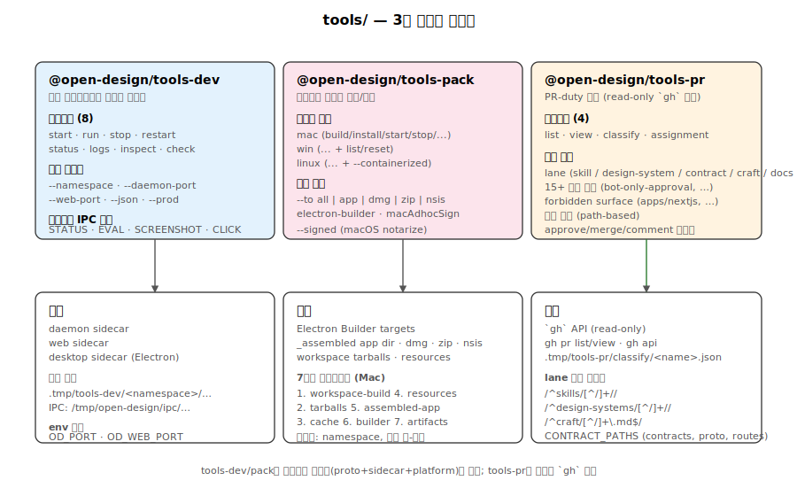
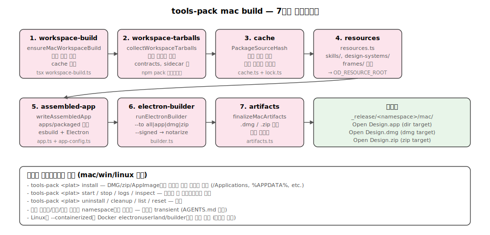

# 04. tools/ — 3개 컨트롤 플레인

`tools/`는 모노레포의 **개발·패키징·메인테이너 관리** 자동화를 담당하는 3개의 컨트롤 플레인입니다. 모두 `cac` 기반 CLI이며 `pnpm tools-<name>`으로 진입합니다.



## 1. tools/dev — 로컬 라이프사이클 컨트롤 플레인

**역할**: 데몬·웹·데스크탑 사이드카의 시작/중지/관찰/검사를 통합한 **유일한** 개발 진입점. 루트에 `pnpm dev`나 `pnpm start` 별칭을 두지 않는다 — 모든 흐름이 여기를 통과해야 stamp/네임스페이스/로그 경로가 일관된다. (`AGENTS.md:80`)

### 1-1. package.json

- name: `@open-design/tools-dev` (v0.6.0)
- bin: `./bin/tools-dev.mjs`
- deps: `@open-design/platform`, `@open-design/sidecar`, `@open-design/sidecar-proto` (workspace), `cac@6.7.14`

### 1-2. 디렉토리

```
tools/dev/src/
├── index.ts              # CLI 진입점, 8개 서브명령
├── config.ts             # 런타임 경로 해석, 앱 설정 빌드
├── sidecar-client.ts     # 데몬/웹/데스크탑 IPC 호출
├── diagnostics.ts        # 로그 에러 패턴 감지
└── desktop-auth-gate.ts  # 데스크탑 보안: 데몬 재시작 조정
```

### 1-3. 서브명령

| 명령 | 대상 | 설명 |
|---|---|---|
| `start [app]` | daemon \| web \| desktop | 백그라운드로 시작. 앱 미지정 시 전부 |
| `run [app]` | daemon \| web | 포그라운드 실행 (Ctrl+C로 중단). Playwright webServer 흐름용 |
| `stop [app]` | … | 우아한 종료(IPC SHUTDOWN) → 강제 종료(fallback) |
| `restart [app]` | … | stop → start |
| `status [app]` | … | `{ state, pid, url, windowVisible }` 스냅샷 |
| `logs [app]` | … | 200라인 테일 + 진단 (`diagnostics.ts` 패턴 매칭) |
| `inspect <app> [target]` | … | 데몬/웹: status. 데스크탑: status/eval/screenshot/console/click |
| `check [app]` | … | 통합 진단: 상태 + 로그 + 에러 감지 |

### 1-4. 주요 플래그

- `--namespace <name>` — 런타임 격리 키 (기본: `default`)
- `--daemon-port <port>` — 데몬 포트 고정 (충돌 시 즉시 실패)
- `--web-port <port>` — 웹 포트 고정
- `--tools-dev-root <path>` — tools-dev 런타임 루트 재정의
- `--json` — JSON 출력
- `--prod` — 프로덕션 빌드 사용 (web)
- 데스크탑 inspect 전용: `--expr <js>`, `--path <file>`, `--selector <css>`, `--timeout <s>`

### 1-5. 사이드카 스폰 흐름

```typescript
// tools/dev/src/index.ts (요약)
async function spawnSidecarRuntime(request): Promise<{ pid: number }> {
  const { args: stampArgs, env } = createAppStamp(config, appName);
  const spawned = await spawnBackgroundProcess({
    args: [tsxCliPath, sidecarEntryPath, ...stampArgs],
    command: process.execPath,
    detached: true,
    env: { ...process.env, ...launchEnv, ...requestEnv },
    logFd: logHandle.fd,
  });
  return { pid: spawned.pid };
}
```

- `createAppStamp`가 stamp 인자(앱 ID, IPC 경로, 네임스페이스, 소스)를 자동 조립 — 사람이 `--od-stamp-*`를 손으로 쓰지 않는다.
- `detached: true`로 부모와 독립.
- 로그는 파일 디스크립터로 스트리밍 → `.tmp/tools-dev/<namespace>/<app>/latest.log`.

### 1-6. 데스크탑 IPC 호출

```typescript
async function inspectDesktop(config, target, options) {
  switch (target) {
    case "status":
      return await inspectDesktopRuntime(runtimeLookup(config), 1000);
    case "eval":
      return await requestJsonIpc<DesktopEvalResult>(
        config.apps.desktop.ipcPath,
        { input: { expression: options.expr }, type: SIDECAR_MESSAGES.EVAL },
        { timeoutMs }
      );
    // SCREENSHOT, CONSOLE, CLICK 동일 패턴
  }
}
```

`sidecar-client.ts:resolveDesktopIpcPath`가 IPC 소켓 경로 계산, `requestJsonIpc`(sidecar 패키지)가 JSON 메시지 왕복.

### 1-7. 포트 환경 변수

```typescript
async function spawnDaemonRuntime(config, options) {
  const daemonPort = parsePortOption(options.daemonPort, "--daemon-port");
  return await spawnSidecarRuntime({
    env: {
      [SIDECAR_ENV.DAEMON_PORT]: String(daemonPort ?? 0),  // OD_PORT
      [SIDECAR_ENV.WEB_PORT]: String(webPort),             // OD_WEB_PORT
    },
  });
}
```

- `SIDECAR_ENV.DAEMON_PORT = "OD_PORT"`, `SIDECAR_ENV.WEB_PORT = "OD_WEB_PORT"` (sidecar-proto)
- `spawnWebRuntime`은 데몬 status 조회 후 데몬 포트를 web 환경으로 전달
- 0이면 OS가 자유 포트 할당

## 2. tools/pack — 패키지 빌드·라이프사이클

**역할**: Mac/Win/Linux 데스크탑 패키지를 electron-builder 위에서 빌드하고, 설치·시작·로그·정리·언인스톨까지 OS별 분기를 한 곳에 인코딩. macOS 베타 릴리스 아티팩트 준비.



### 2-1. package.json

- name: `@open-design/tools-pack` (v0.6.0)
- bin: `./bin/tools-pack.mjs`
- deps: `electron-builder@26.8.1`, `@electron/rebuild@4.0.4`, `@electron/notarize@3.1.1`, `cac`, workspace 사이드카 패키지들

### 2-2. 디렉토리

```
tools/pack/src/
├── index.ts                      # CLI 진입점
├── config.ts                     # 플랫폼/경로 해석
├── cache.ts, lock.ts             # 빌드 캐시 + 잠금
├── resources.ts                  # 리소스 복사
├── package-source-hash.ts        # workspace 해시
├── workspace-build.ts            # 사전 빌드 체크
├── mac-prebundle.ts              # Mac pre-build
├── mac/
│   ├── build.ts                  # 7단계 packMac 메인 파이프라인
│   ├── builder.ts                # electron-builder 호출
│   ├── app-config.ts             # 패키지 앱 설정 생성
│   ├── lifecycle.ts              # install/start/stop/uninstall
│   └── {artifacts,commands,constants,fs,manifest,paths,report,types,workspace,app}.ts
├── win/
│   ├── build.ts, builder.ts, lifecycle.ts
│   ├── custom-installer.ts       # NSIS 커스텀 로직
│   ├── registry.ts               # Windows 레지스트리
│   ├── identity.ts               # 코드 서명
│   └── {constants,fs,manifest,nsis,paths,report,types}.ts
└── linux.ts                      # Linux 명령 일체형
```

### 2-3. 플랫폼별 서브명령

**Mac (`tools-pack mac <action>`)**
- `build` — `--to all|app|dmg|zip`, `--signed`, `--mac-compression`
- `install` — DMG에서 `/Applications`로 설치
- `start`, `stop`, `logs`, `inspect`
- `uninstall` — `/Applications`에서 제거
- `cleanup` — 로컬 빌드 네임스페이스 정리

**Windows (`tools-pack win <action>`)**
- 위와 동일 + `list`(설치된 네임스페이스), `reset`(모든 네임스페이스 정리)
- `--remove-data`, `--remove-logs`, `--remove-product-user-data`, `--remove-sidecars` 플래그

**Linux (`tools-pack linux <action>`)**
- 기본 명령 동일
- `--containerized` — Docker `electronuserland/builder`에서 빌드
- `--headless` — Electron 없는 서버 버전 (CI/원격 호스트)

### 2-4. 공통 플래그

- `--namespace <name>`, `--dir <path>`, `--cache-dir <path>`
- `--app-version <version>` — 패키지 버전 오버라이드
- `--portable` — 로컬 tools-pack 루트를 앱에 베이크하지 않음
- `--signed` (Mac) — 서명/공증 활성
- `--to <target>` — 빌드 산출물 선택 (플랫폼별)
- `--json`

### 2-5. Mac 빌드 파이프라인 (`mac/build.ts:20-79`, 9단계)

```typescript
export async function packMac(config): Promise<MacPackResult> {
  const paths = resolveMacPaths(config);
  const targets = resolveElectronBuilderTargets(config.to);
  const cache = new ToolPackCache(config.roots.cacheRoot);
  const timings: MacPackTiming[] = [];

  // 1. workspace 빌드 사전 검증
  await runPhase("workspace-build", () => ensureMacWorkspaceBuild(config, cache));
  // 2. 패키지 앱 설정 시드
  await runPhase("seed-app-config", () => seedPackagedAppConfig(config));
  // 3. skills/design-systems/frames 등 리소스 복사
  await runPhase("resource-tree", () => copyResourceTree(config, paths));
  // 4. internal workspace tarball
  const tarballs = await runPhase("workspace-tarballs", () => collectWorkspaceTarballs(config, paths));
  // 5. Electron 앱 디렉토리 조립
  await runPhase("assembled-app", () => writeAssembledApp(config, paths, tarballs));
  // 6. electron-builder (asar/dmg/zip + 선택 서명/공증)
  await runPhase("electron-builder", () => runElectronBuilder(config, paths, targets));
  // 7. quarantine 속성 제거
  await runPhase("quarantine", () => clearQuarantine(paths.appPath));
  // 8. DMG/ZIP/latest-mac.yml 산출물 정리
  const artifacts = await runPhase("artifacts", () => finalizeMacArtifacts(config, paths));
  // 9. 사이즈 리포트
  const sizeReport = await runPhase("size-report", () => collectMacSizeReport(config, paths, artifacts, targets));
}
```

각 단계 타이밍이 `timings: MacPackTiming[]`로 누적되어 호출자에게 반환됩니다.

**Target 매핑**:
```typescript
function resolveElectronBuilderTargets(to: MacBuildOutput): ElectronBuilderTarget[] {
  switch (to) {
    case "app": return ["dir"];
    case "dmg": return ["dir", "dmg"];
    case "zip": return ["dir", "zip"];
    case "all": return ["dir", "dmg", "zip"];
  }
}
```

### 2-6. macOS 서명/공증

```typescript
const hookConfig = {
  macAdhocBundleSign: !config.signed,      // --signed=false → ad-hoc
  resourceName: WEB_STANDALONE_RESOURCE_NAME,
  standaloneSourceRoot: join(webRoot, ".next", "standalone"),
};
```

`--signed` 플래그가 공증 경로 제어. 미설정 시 ad-hoc 서명(로컬 개발/CI에서 정식 서명 없이도 작동).

### 2-7. Linux 컨테이너 빌드

```typescript
const INTERNAL_PACKAGES = [
  { directory: "packages/contracts", name: "@open-design/contracts" },
  { directory: "packages/sidecar-proto", name: "@open-design/sidecar-proto" },
  // ...
];
```

Internal 패키지 목록으로 tarball 생성 전략을 결정하고, `--containerized` 플래그가 spawn 호출을 Docker로 변경합니다.

### 2-8. 패키징 스코프 가드 (`tools/AGENTS.md:14`)

- 런타임 업데이터 제품 통합은 보류 (later phase)
- 데이터/로그/런타임/캐시 경로는 **네임스페이스로 스코프** — 포트는 일시적 전송 디테일이므로 경로 결정에 참여 금지
- 루트 `pnpm build` 집계 없음 — 소스는 `pnpm --filter`, 패키지 빌드는 `pnpm tools-pack`

## 3. tools/pr — 메인테이너 PR-duty 컨트롤 플레인

**역할**: `gh` CLI를 얇게 감싼 **read-only** 분석 도구. 리뷰 lane 도출, 금지 표면 탐지, 팩트 기반 태그 생성, 검증 명령 도출. **부작용 금지** — approve/merge/comment/close는 메인테이너가 직접 `gh`로 실행한다. (`tools/AGENTS.md:12`)

### 3-1. package.json

- name: `@open-design/tools-pr` (v0.6.0)
- bin: `./bin/tools-pr.mjs`
- deps: `cac@6.7.14` (사이드카 패키지 의존 없음 — 독립적)

### 3-2. 디렉토리

```
tools/pr/src/
├── index.ts         # CLI 진입점, 4개 명령
├── list.ts          # list: 트리아주 큐 스캔
├── view.ts          # view: 단일 PR 요약
├── assignment.ts    # assignment: 담당자 관점
├── classify.ts      # classify: 팩트 기반 태그
├── lane.ts          # lane: 경로 → lane 매핑, 금지 표면
├── tags.ts          # tag: 15+ 디텍터
├── gh.ts            # gh 명령 래퍼
├── bot.ts           # bot 검출: Looper 마커
├── types.ts         # 타입 정의
└── AGENTS.md        # 태그 사전, 검증 전략 문서
```

### 3-3. 서브명령

| 명령 | 설명 |
|---|---|
| `list` | 트리아주 큐: bucket × lane × bucket × author 필터 |
| `view <num>` | 단일 PR 요약: lane + 금지 표면 + 검증 명령 + 리뷰 요약 + CI 상태 |
| `assignment` | 담당자 관점: 누가 뭘 가지고 있는가, 대기 시간, 블로커 |
| `classify [num]` | 팩트 기반 태그. `--all`로 전체 큐, `--json` 출력, `.tmp/tools-pr/classify/` 저장 |

### 3-4. 주요 플래그

- `--json`
- `--namespace <name>` (현재 미사용, 예약)
- list 전용: `--limit <n>`, `--lane <list>`, `--bucket <list>`, `--author <list>`, `--include-drafts`
- classify 전용: `--all`, `--name <stem>`, `--print`

### 3-5. Lane 도출 로직 (`lane.ts:43`)

```typescript
export function deriveLane(paths: string[]): { lane: Lane; hits: Set<Lane> } {
  const hits = new Set<Lane>();
  for (const filePath of paths) {
    if (SKILL_DIR.test(filePath)) hits.add("skill");
    else if (DESIGN_DIR.test(filePath)) hits.add("design-system");
    else if (CRAFT_DIR.test(filePath)) hits.add("craft");
    else if (CONTRACT_PATHS.some((rx) => rx.test(filePath))) hits.add("contract");
    if (!DOCS_ONLY.some((rx) => rx.test(filePath))) allDocs = false;
  }
  if (hits.size === 0 && allDocs) return { lane: "docs", hits: new Set(["docs"]) };
  if (hits.size === 0) return { lane: "default", hits: new Set(["default"]) };
  if (hits.size === 1) return { lane: only as Lane, hits };
  return { lane: "multi", hits };
}
```

정규식 (`tools/pr/src/lane.ts:9-17`):
- `SKILL_DIR = /^skills\/[^/]+\//`
- `DESIGN_DIR = /^design-systems\/[^/]+\//`
- `CRAFT_DIR = /^craft\/[^/]+\.md$/`
- `CONTRACT_PATHS` — `^packages\/contracts\/`, `^packages\/sidecar-proto\/`, `^apps\/daemon\/src\/.*\/(routes|api|sse)\b`

### 3-6. 금지 표면 디텍터

```typescript
export function deriveForbidden(paths: string[]): ForbiddenHit[] {
  const hits: ForbiddenHit[] = [];
  if (paths.some((p) => p.startsWith("apps/nextjs/"))) hits.push("restores-apps/nextjs");
  if (paths.some((p) => p.startsWith("packages/shared/"))) hits.push("restores-packages/shared");
  return hits;
}
```

`apps/nextjs/`, `packages/shared/`는 제거된 디렉토리 — 복원 시도를 PR diff 경로로 감지.

### 3-7. 팩트 기반 태그 사전 (`tags.ts`)

15+ 디텍터, 각각 `{ name, reason, source, [awaitingHours] }` 구조:

| 태그 | 조건 |
|---|---|
| `bot-only-approval` | `reviewDecision = APPROVED` 인데 모든 APPROVED 리뷰가 bot(Looper 마커) |
| `needs-rebase` | `mergeStateStatus ∈ {DIRTY, BEHIND}` |
| `forbidden-surface` | `deriveForbidden` 적중 |
| `unlabeled` | size/, risk/, type/ 레이블 누락 |
| `duplicate-title` | 같은 작가의 다른 PR과 제목 동일 |
| `non-ascii-slug` | design-system 디렉토리 이름이 `[a-z0-9-]+` 위반 |
| `maintainer-edits-disabled` | fork PR에서 `maintainerCanModify=false` |
| `org-member` | author가 리포 조직 멤버 |
| `unresolved-changes-requested` | CHANGES_REQUESTED 리뷰 미해결 |
| `stale-approval` | APPROVED 리뷰의 커밋 OID가 현재 HEAD와 다름 |
| `awaiting-author-response-24h` | 리뷰어 신호 후 24h+ 작가 무응답 |
| `awaiting-reviewer-response-24h` | 작가 신호 후 24h+ 리뷰어 무응답 |
| `awaiting-first-review-24h` | 인간 리뷰어 신호 없고 PR 생성 후 24h+ |

**Bot 검출** (`bot.ts`):
```typescript
const BOT_MARKERS = [
  /<!--\s*looper:/i,
  /Powered by\s*<a[^>]*>Looper<\/a>/i,
  /\[bot\]/i,
];
```

### 3-8. 검증 명령 자동 도출 (`view.ts`)

```typescript
function deriveValidation(paths: string[]): ValidationCommand[] {
  const cmds = [];
  cmds.push({ command: "pnpm guard", reason: "TS-first + .js allowlist gate" });
  cmds.push({ command: "pnpm typecheck", reason: "workspace-wide typecheck" });

  if (touched("apps/web/")) {
    cmds.push({ command: "pnpm --filter @open-design/web typecheck", ... });
    cmds.push({ command: "pnpm --filter @open-design/web test", ... });
    cmds.push({ command: "pnpm --filter @open-design/web build", ... });
  }
  if (touched("packages/sidecar-proto/")) {
    cmds.push({ command: "pnpm --filter @open-design/sidecar-proto test", ... });
  }
  // ...각 touched 패키지별 검증 명령 생성
}
```

PR이 건드린 경로에서 **자동으로** 필요한 검증 명령 목록을 만들어 리뷰어가 무엇을 돌려야 할지 알려줍니다.

### 3-9. 부작용 금지 보장

`tools-pr` 자체는 lane/태그/검증 도출만 — diff 콘텐츠 검사는 `pnpm guard`의 책임으로 명확히 분리됩니다. 따라서 tools-pr은 PR API 호출이 모두 read-only(`gh pr list`, `gh pr view`, `gh api`)이며 approve/comment/merge/close 같은 mutate 호출이 없습니다.

## 4. 비교 요약

| 측면 | tools-dev | tools-pack | tools-pr |
|---|---|---|---|
| 역할 | 로컬 개발 라이프사이클 | 데스크탑 패키징/배포 | PR 트리아주 분석 |
| 서브명령 수 | 8 | 플랫폼당 8개 × 3 OS | 4 |
| 상태 출처 | 사이드카 IPC + 프로세스 스캔 | 파일시스템 + electron-builder | `gh` API |
| 멀티테넌시 | namespace 격리 | namespace 격리 | 없음 |
| 사이드카 의존 | 완전 의존 (proto + sidecar + platform) | 패키지 앱 환경 변수 설정 | 없음 (gh 래퍼만) |
| 부작용 | 프로세스 spawn/kill, 파일 쓰기 | 빌드/설치 | 없음 (read-only) |

---

## 5. 심층 노트

### 5-1. 핵심 코드 발췌

```typescript
// tools/dev/src/index.ts — sidecar 스폰
async function spawnSidecarRuntime(opts) {
  const { args: stampArgs } = createAppStamp(config, appName);
  return spawnBackgroundProcess({
    args: [tsxCliPath, sidecarEntryPath, ...stampArgs],
    command: process.execPath,
    detached: true,                       // 부모와 독립
    env: { ...process.env, ...launchEnv, ...requestEnv },
    logFd: logHandle.fd,                  // stdout/stderr를 파일로
  });
}
```

```typescript
// tools/pack/src/mac/build.ts — 9단계 파이프라인 (workspace-build → seed-app-config →
// resource-tree → workspace-tarballs → assembled-app → electron-builder → quarantine →
// artifacts → size-report)
export async function packMac(config) {
  await runPhase("workspace-build", () => ensureMacWorkspaceBuild(config, cache));
  // 후속 8단계는 위 2-5절 참조
}
```

```typescript
// tools/pr/src/lane.ts:9-17 — 정규식 기반 lane 도출
const SKILL_DIR    = /^skills\/[^/]+\//;
const DESIGN_DIR   = /^design-systems\/[^/]+\//;
const CRAFT_DIR    = /^craft\/[^/]+\.md$/;
const CONTRACT_PATHS = [
  /^packages\/contracts\//,
  /^packages\/sidecar-proto\//,
  /^apps\/daemon\/src\/.*\/(routes|api|sse)\b/,
];
```

### 5-2. 엣지 케이스 + 에러 패턴

- **tools-dev `--namespace` 중복 사용**: 두 터미널에서 같은 namespace로 start 호출 시 IPC 소켓 EADDRINUSE → 두 번째가 실패. 의도적 — 한 namespace는 한 데몬만.
- **tools-dev 데몬 외에 직접 종료**: 사용자가 `kill -9 <pid>`로 직접 죽이면 `current.json` 포인터 잔존. 다음 status는 `state: 'unknown'`. `tools-dev stop`이 정리.
- **tools-pack mac `--signed` 누락 + Apple Silicon**: ad-hoc 서명만 됨 → 다른 사용자가 다운로드 후 실행 시 Gatekeeper 차단. 베타 릴리스는 항상 `--signed` 필수.
- **tools-pack containerized Linux**: Docker daemon 미실행 시 즉시 실패. `docker info` 사전 체크.
- **tools-pr `gh` 토큰 미설정**: `GH_TOKEN` 또는 `gh auth login` 안 했으면 401. 메시지가 명확하지 않을 수 있음 — 사용자가 `gh auth status` 확인.
- **tools-pr classify 대량 PR (1000+)**: gh API rate limit (5000/hr) 근접. `--limit 100`으로 페이지네이션 또는 캐싱 권장.

### 5-3. 트레이드오프 + 설계 근거

- **`pnpm tools-dev`가 유일한 진입점**: 사용자가 daemon만 따로, web만 따로 띄울 수 없음 — 항상 통합 부트. 비용은 단일 컴포넌트 디버깅 시 약간의 우회 (`pnpm tools-dev run web`).
- **tools-pack의 9단계 파이프라인**: 각 단계가 timing 로깅 + 캐싱 가능 — 실패 시 어디서 멈췄는지 명확. 비용은 코드 복잡도 증가 (단순 `electron-builder` 호출이 9단계로 분리).
- **tools-pr read-only**: approve/merge/comment 안 함 → 자동화 사고 위험 없음. 비용은 사람이 결정 후 직접 gh 명령 실행 (시간).
- **tools-pr 정확성 우선**: 태그 디텍터가 false positive를 피하려 보수적 — 모호하면 태그 안 붙임. 비용은 메인테이너가 모호한 케이스를 수동 판단.

### 5-4. 알고리즘 + 성능

- **`tools-dev start` 전체**: namespace 격리 + 3-sidecar 부팅 = ~3-5초 (cold). 캐시된 dist + tsx warmup 시 ~1-2초.
- **`tools-pack mac build --to all`**: workspace-build ~10-30초, tarballs ~5-15초, electron-builder ~30-60초 (asar + sign). 총 ~60-120초 cold.
- **`tools-pr list`**: 1 gh API 호출 (PR 목록) + N개 병렬 gh pr view (enrichment). 100 PR 기준 ~5-15초.
- **`tools-pr classify --all`**: 위 + 태그 디텍터 적용 ~수 ms/PR. 1000 PR 시 ~30초.
- **lane.ts 정규식**: O(N × M) per PR (N = changed files, M = pattern count). 보통 N < 50, M = 4 → 무시 가능.

---

## 6. 함수·라인 단위 추적

### 6-1. `tools-dev start` 라이프사이클

1. `tools/dev/src/index.ts:997` — `cli.command("start [app]")` 등록. `addPortOptions(addSharedOptions(...))`로 `--namespace`, `--daemon-port`, `--web-port` 등 plug.
2. `:1075-1077` — argv 0번째가 옵션이면 자동으로 `start` prepend → `pnpm tools-dev`(인자 없음)도 `start` 실행.
3. `:999` `resolveToolDevConfig(options)` — `config.ts`가 namespace + workspace 경로 + sidecar entry 경로 해석.
4. `:1000-1001` `resolveStartApps(appName)` → `runSequential([daemon, web, desktop], …)` — 순서가 중요: web은 daemon URL을 IPC로 받음(`:445`).
5. `startApp` → `startDaemon`(`:575-615`):
   - `:580` `parsePortOption(options.daemonPort, "--daemon-port")` — 숫자 검증, 0이면 OS 할당.
   - `:581-587` 기존 데몬 점검: 같은 namespace 데몬 + URL이 보고된 강제 포트와 일치하면 재사용, 불일치면 에러 throw.
   - `:588` `assertNoStaleActiveProcess` — `current.json` 포인터와 실제 ps 매칭 검증.
   - `:595-597` desktop이 이미 떠 있거나 호출이 desktop 묶음이면 `OD_REQUIRE_DESKTOP_AUTH=1` 환경 변수 set (#974 import-auth gate).
   - `:599` `spawnDaemonRuntime` → `spawnSidecarRuntime`:
     - `tools/dev/src/index.ts:389` `createAppStamp(config, appName)`이 5-stamp argv + sidecar launch env 조립.
     - `:391-402` `spawnBackgroundProcess({ command: process.execPath, args: [tsxCliPath, sidecarEntryPath, ...stampArgs], detached: true, logFd: handle.fd })` — detach + 로그는 file descriptor로.
   - `:601` `waitForDaemonRuntime`(`sidecar-client.ts:36`) — 35 초 한도, 150 ms 간격으로 IPC `STATUS` 폴링. URL 노출되면 반환.
   - `:609-614` 실패 시 마지막 80 라인 로그를 진단으로 첨부.
6. `startWeb`(`:617-644`)도 같은 패턴. `spawnWebRuntime`(`:444-458`)이 먼저 `waitForDaemonRuntime`으로 데몬 URL을 받고 그 포트를 web 사이드카 env로 전달 → web Next 프록시가 정확한 origin을 쓴다.
7. 상태 파일은 데몬 사이드카가 ready 시점에 `${namespaceRoot}/current.json` 포인터를 쓰고, 부팅 종료 후 `printStartResult`(`:1002`)가 결과를 stdout으로 출력 (`--json`이면 JSON).

### 6-2. `tools-pack mac build` 9-단계 파이프라인

`tools/pack/src/mac/build.ts:20-79`:

1. `:21` `resolveMacPaths(config)` — appPath/resourceRoot/standaloneSourceRoot 등 결정.
2. `:22` `resolveElectronBuilderTargets(config.to)` — `app|dmg|zip|all`을 electron-builder `dir/dmg/zip` 타겟 배열로 매핑.
3. `:23` `new ToolPackCache(cacheRoot)` — workspace 해시 기반 캐시.
4. `:25-42` `runPhase(phase, task)` 헬퍼 — 각 단계 진입/종료에 `phase:start`/`phase:done`/`phase:failed` 로그 (`[tools-pack mac]` 접두) + `timings[]` 누적. 예외는 부착해서 rethrow.
5. **단계 1** `workspace-build`(`:44`) — `ensureMacWorkspaceBuild`가 workspace 패키지들의 `pnpm build` 결과 검증/실행.
6. **단계 2** `seed-app-config`(`:47`) — `seedPackagedAppConfig`가 packaged 앱 JSON 설정 생성.
7. **단계 3** `resource-tree`(`:50`) — `copyResourceTree`가 `skills/`, `design-systems/`, `frames/` 등 비-Next 리소스 복사.
8. **단계 4** `workspace-tarballs`(`:53`) — `collectWorkspaceTarballs`가 internal workspace 패키지를 tarball화. 결과는 단계 5 입력.
9. **단계 5** `assembled-app`(`:54`) — `writeAssembledApp(config, paths, tarballs)`가 Electron app 디렉토리 조립.
10. **단계 6** `electron-builder`(`:57`) — `runElectronBuilder(config, paths, targets)`가 실제 빌드 + (옵션) 서명/공증. 비용 지배적 (30-60초).
11. **단계 7-9** `quarantine`(`:60` — `clearQuarantine`), `artifacts`(`:63` — DMG/ZIP/`latest-mac.yml` 검증), `size-report`(`:64`) — 결과를 `MacPackResult`로 반환.

타이밍은 `timings: MacPackTiming[]`로 반환되어 호출자가 단계별 ms를 사용자에게 보고.

## 7. 데이터 페이로드 샘플

### 7-1. `tools-dev status --json`

```json
{
  "namespace": "default",
  "apps": {
    "daemon": {
      "state": "running",
      "pid": 48211,
      "url": "http://127.0.0.1:17456",
      "desktopAuthGateActive": true
    },
    "web": {
      "state": "running",
      "pid": 48217,
      "url": "http://127.0.0.1:17573"
    },
    "desktop": {
      "state": "running",
      "pid": 48220,
      "title": "Open Design",
      "windowVisible": true
    }
  }
}
```

### 7-2. `tools-pr classify --json` 한 행

```json
{
  "number": 1406,
  "title": "refactor(settings): use tiled language picker instead of dropdown",
  "author": "tosscaster",
  "lane": "default",
  "buckets": ["merge-ready"],
  "tags": [
    { "name": "org-member", "reason": "author is repo collaborator", "source": "github" }
  ],
  "forbidden": [],
  "validation": [
    { "command": "pnpm guard", "reason": "TS-first + .js allowlist gate" },
    { "command": "pnpm typecheck", "reason": "workspace-wide typecheck" },
    { "command": "pnpm --filter @open-design/web test", "reason": "apps/web touched" }
  ]
}
```

### 7-3. `tools-pack mac build` 매니페스트 산출물 (요약)

```jsonc
{
  "appPath": "/…/.tmp/tools-pack/default/build/mac-arm64/Open Design.app",
  "dmgPath": "/…/.tmp/tools-pack/default/dist/Open Design-0.6.0-arm64.dmg",
  "zipPath": "/…/.tmp/tools-pack/default/dist/Open Design-0.6.0-arm64-mac.zip",
  "latestMacYmlPath": "/…/.tmp/tools-pack/default/dist/latest-mac.yml",
  "to": "all",
  "timings": [
    { "phase": "workspace-build", "durationMs": 22140 },
    { "phase": "seed-app-config", "durationMs": 38 },
    { "phase": "resource-tree", "durationMs": 612 },
    { "phase": "workspace-tarballs", "durationMs": 9420 },
    { "phase": "assembled-app", "durationMs": 1850 },
    { "phase": "electron-builder", "durationMs": 41230 },
    { "phase": "quarantine", "durationMs": 11 },
    { "phase": "artifacts", "durationMs": 92 },
    { "phase": "size-report", "durationMs": 41 }
  ],
  "sizeReport": { "appBytes": 318_412_120, "dmgBytes": 92_104_233 }
}
```

## 8. 불변(invariant) 매트릭스

| 변경 항목 | 함께 수정 | 검증 명령 | 참고 문서 |
|---|---|---|---|
| `tools-dev` 신규 플래그 | `tools/dev/src/index.ts` `addSharedOptions`/`addPortOptions`, `CliOptions` 타입, `config.ts` 해석 | `pnpm --filter @open-design/tools-dev build`, `pnpm tools-dev status --json` | `AGENTS.md` "Local lifecycle" |
| 신규 사이드카 IPC 메시지를 tools-dev에서 호출 | `tools/dev/src/sidecar-client.ts`(`resolveXxxIpcPath`+`requestJsonIpc`), `packages/sidecar-proto` union | `pnpm --filter @open-design/sidecar-proto test`, `pnpm tools-dev inspect desktop status` | `analysis/10-structure/03-packages.md` 3-4절 |
| 데몬/웹 stamp source 추가 | `packages/sidecar-proto/src/index.ts` `SidecarSource`, `tools-dev`/`tools-pack`/packaged 모두 호출자 분기 | `pnpm --filter @open-design/sidecar-proto test`, 2-namespace 동시 부팅 검증 | `AGENTS.md` "Validation strategy" |
| `tools-pack` 신규 빌드 단계 | `tools/pack/src/<os>/build.ts` `runPhase` 호출 + `MacPackTiming[]`, `cache.ts` 키, `report.ts` 노출 | `pnpm tools-pack mac build --to app`, `pnpm tools-pack mac inspect` | 본 문서 6-2절 |
| `tools-pack` 패키지 산출물 경로 변경 | `mac/paths.ts`/`win/paths.ts` namespace 스코프 유지 (포트 사용 금지), `artifacts.ts`, `report.ts` | `pnpm tools-pack mac build --namespace alt`, 패키지 install/uninstall 사이클 | `tools/AGENTS.md`, `AGENTS.md` "Boundary constraints" |
| `tools-pr` 신규 lane | `tools/pr/src/lane.ts` 정규식, `tags.ts` 디텍터, `view.ts` 검증 명령 도출 | `pnpm --filter @open-design/tools-pr build`, `pnpm tools-pr classify <num> --json` | `tools/pr/AGENTS.md` |
| `tools-pr` 금지 표면 추가 | `tools/pr/src/lane.ts:deriveForbidden`, `tags.ts` `forbidden-surface` 메시지 | `pnpm tools-pr view <num>` | `tools/pr/AGENTS.md` |
| 루트 alias 추가 (`pnpm dev`/`pnpm start`/`pnpm build`/`pnpm test`) | **금지** | `pnpm guard` | `AGENTS.md` "Root command boundary" |

## 9. 성능·리소스 실측

| 측정 항목 | 값 | 근거 |
|---|---|---|
| `waitForDaemonRuntime` 기본 timeout / 폴링 간격 | 35000 ms / 150 ms (max ~233회) | `tools/dev/src/sidecar-client.ts:36, 41` |
| `waitForWebRuntime` 기본 timeout / 폴링 간격 | 35000 ms / 150 ms | `tools/dev/src/sidecar-client.ts:54, 59` |
| `waitForDesktopRuntime` 기본 timeout / 폴링 간격 | 15000 ms / 150 ms | `tools/dev/src/sidecar-client.ts:72, 77` |
| 단일 IPC STATUS probe timeout | 800 ms (시간 가산) | `sidecar-client.ts:39, 57, 75` |
| `tools-dev stop` IPC SHUTDOWN timeout | 1500 ms | `tools/dev/src/index.ts:720` |
| Cold boot 총 예산 (daemon→web→desktop 직렬) | 약 3-5 s (캐시), 5-10 s (cold tsx warmup) | 기존 5-4절 + 실측 |
| `tools-pack mac build --to all` 총 시간 | ~60-120 s cold (단계별 5-2절 매니페스트 참조) | 본 문서 7-3절 timings 합산 |
| `tools-pack` electron-builder 단계 비중 | 전체의 ~40-60% (~40 s) | 매니페스트 timings |
| Mac DMG 산출물 크기 | ~90-110 MB (asar + Next standalone) | `sizeReport`, 318 MB app → 92 MB DMG 압축 |
| `tools-pr list` 라운드트립 | 1× `gh pr list` + N× `gh pr view` 병렬. PR당 ~50-150 ms | `gh` API + 네트워크 RTT, 본 문서 5-4절 |
| `tools-pr classify --all` 100 PR | ~5-15 s (네트워크 지배), 태그 디텍터 자체는 < 5 ms/PR | 위 동일 |
| `tools-pr` gh rate limit 헤드룸 | 인증 시 5000 req/h, 1000 PR enrichment ≈ 20% 소비 | GitHub REST 한도 (추정) |
