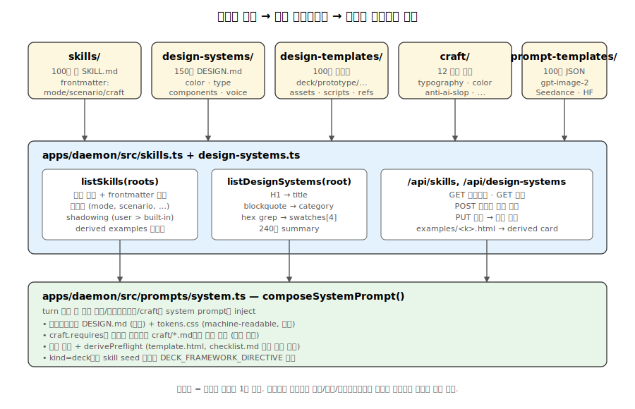
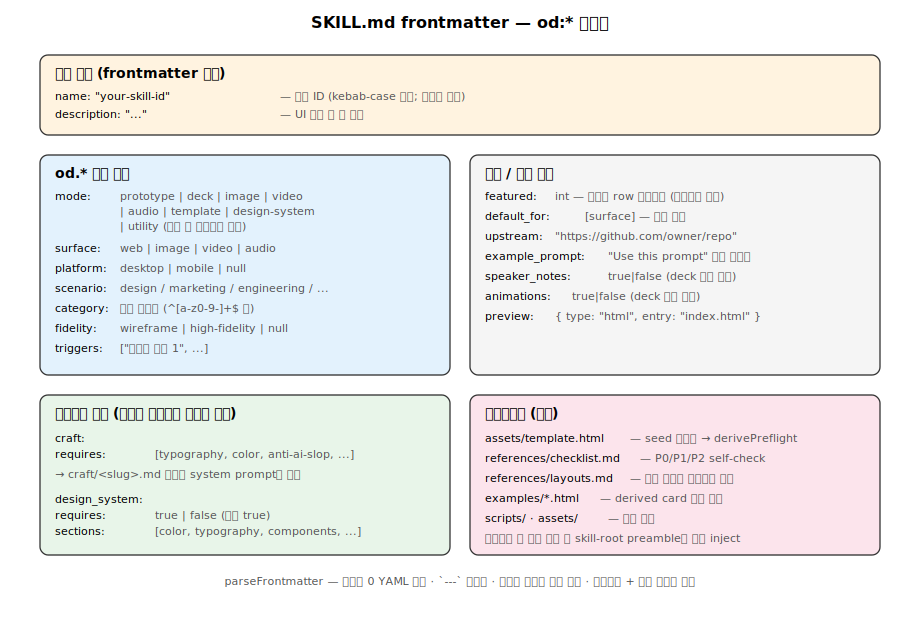

# 05. 콘텐츠 카탈로그 — skills, design-systems, design-templates, craft, prompt-templates, specs

Open Design은 **소스 코드와 동등하게 중요한 콘텐츠 자산**을 6개 디렉토리로 관리합니다. 데몬은 부팅 시 이 디렉토리들을 파일시스템 스캔으로 카탈로그화하고, frontmatter 메타데이터를 React UI/시스템 프롬프트로 흘려보냅니다.



## 1. 콘텐츠 레이어 구분

| 디렉토리 | 역할 | 입력 | 출력 |
|---|---|---|---|
| `skills/` | Agent가 mid-task에 invoke하는 기능성 스킬 | 사용자 의도 + 컨텍스트 | 패키지/유틸리티/디자인-시스템 헬퍼 |
| `design-templates/` | 렌더링 카탈로그 (decks, prototypes, image/video/audio) | 활성 스킬 + 디자인시스템 | 단일 HTML/MP4/PNG 아티팩트 |
| `design-systems/` | 브랜드별 디자인 가이드 (`DESIGN.md`) | 시각 디자인 언어 | 색상/타이포/컴포넌트 규칙 (시스템 프롬프트에 주입) |
| `craft/` | 브랜드 무관 보편 규칙 (typography, anti-ai-slop, …) | 모든 출력 | 토큰 효율적 opt-in 규칙 모음 |
| `prompt-templates/` | 이미지/비디오 프롬프트 라이브러리 (JSON) | 사용자 요청 | gpt-image-2 / Seedance / HyperFrames 호출 페이로드 |
| `specs/` | 아키텍처 명세, 로드맵, 결정 기록 | — | (개발자용 도큐먼트) |

> 핵심 구분: **skills 는 "도우미"**, **design-templates 는 "렌더링 모양"**, **design-systems 는 "시각 언어"**, **craft 는 "보편 규칙"**.

## 2. skills/ — 기능성 스킬

107개 디렉토리 (`skills/<id>/SKILL.md`, 2026-05-12 실측)가 frontmatter `od.mode`별로 분류됩니다.

### 2-1. mode 분포 (실측, 2026-05-12)

| mode | 개수 | 예 |
|---|---:|---|
| `design-system` | 36 | creative-director, ad-creative |
| `image` | 24 | gpt-image-2, midjourney 등 생성 헬퍼 |
| `prototype` | 21 | dashboard, web-prototype |
| `template` | 8 | digital-eguide |
| `video` | 8 | seedance, hyperframes |
| `deck` | 5 | html-ppt, guizang-ppt |
| `audio` | 4 | (음악/오디오 생성) |
| `utility` | 1 | `pptx-html-fidelity-audit` — `SkillMode` union 외 값이라 `normalizeMode`가 `inferMode`로 폴백 |

README는 "31 skills ship in the box"라고 명시하는데, 이는 **사용자 노출용 카탈로그 기준** 수치이며 디스크의 SKILL.md 파일 수(현재 107)와 어긋납니다 (문서 stale, 추정).

### 2-2. 표준 폴더 구조

```
skills/<skill-id>/
├── SKILL.md          # 유일한 필수 파일 (frontmatter + 마크다운)
├── assets/           # (선택) 템플릿 HTML, CSS, fonts
├── examples/         # (선택) .html 샘플 → daemon이 derived card로 표면화
└── references/       # (선택) 상세 가이드
```

가장 단순한 스킬은 `SKILL.md` 한 파일(예: `ad-creative`), 가장 큰 스킬은 36개 테마 + 31개 레이아웃 + 15개 full-deck 템플릿 + 키보드 런타임 + 27개 CSS 애니메이션을 포함(`html-ppt`, `guizang-ppt`).

### 2-3. Frontmatter 스키마



```yaml
---
name: <skill-id>
description: <single-line description>
triggers:
  - "keyword1"
  - "keyword2"
od:
  # 1. 분류
  mode: image|video|audio|deck|design-system|template|prototype|utility
  category: <category-slug>
  scenario: design|marketing|operation|engineering|product|finance|hr|sale|personal
  platform: desktop|mobile|null
  fidelity: wireframe|high-fidelity|null

  # 2. 광고/표시
  featured: <int>            # 매거진 행 순서 (낮을수록 우선)
  default_for: [<surface>]   # 예: [deck]
  upstream: "https://github.com/..."
  example_prompt: "..."      # "Use this prompt" 버튼 텍스트
  speaker_notes: <bool>
  animations: <bool>

  # 3. 컨텍스트 주입
  craft:
    requires: [typography, color, anti-ai-slop, …]
  design_system:
    requires: <bool>
    sections: [color, typography, components, …]

  # 4. 미리보기
  preview:
    type: html
    entry: index.html
---
```

### 2-4. 데몬과의 통합 (`apps/daemon/src/skills.ts`)

핵심 함수:

```typescript
// 모든 스킬 디렉토리를 재귀 스캔, frontmatter 정규화, SkillInfo[] 반환
async function listSkills(skillsRoots: string[]): Promise<SkillInfo[]>;

// SkillInfo: id, name, description, triggers, mode, surface, platform,
//   scenario, category, fidelity, craftRequires, designSystemRequired,
//   previewType, featured, upstream, examplePrompt, aggregatesExamples,
//   body (정규화된 frontmatter), dir (디스크 경로)

// frontmatter 값 검증 + 폴백 (mode 누락 시 본문/description으로 추론)
function normalizeMode() / normalizeSurface() / normalizeScenario();

// examples/*.html 발견 → derived card 생성 (예: examples/demo.html → <parent>:demo)
function collectDerivedExamples(dir);

// 첨부 파일 있는 스킬에 경로 프리앰블 추가
//   .od-skills/<folder>/ (CWD 별칭) + 절대 경로 폴백
function withSkillRootPreamble(body, dir);
```

**Shadowing 패턴**: `listSkills([USER_SKILLS_DIR, BUILTIN_SKILLS_DIR])` — 첫 루트(사용자)가 두 번째 루트(번들)를 가립니다. 사용자가 빌트인 스킬을 편집하면 데몬이 자동으로 `USER_SKILLS_DIR/<id>/`로 클론하고 그 사본을 우선 노출합니다.

### 2-5. 대표 스킬

- **html-ppt** (mode: deck, featured: 19) — 36개 테마 + 15개 full-deck + speaker notes + presenter mode(`S` 키로 현재/다음/스피커노트/타이머 마그네틱 카드)
- **creative-director** (mode: design-system) — 20+ 방법론(SIT, TRIZ, SCAMPER, Synectics), 3축 평가, 5단계 프로세스
- **ad-creative** (mode: design-system, category: marketing-creative) — 광고 헤드라인/설명/주요 텍스트 반복
- **dashboard** (mode: prototype, scenario: operations) — KPI 카드, 차트, 네비게이션
- **dating-web** (mode: prototype, featured: 5) — 매거진 풍 컨슈머 대시보드

### 2-6. Bundled-Verbatim: guizang-ppt

`design-templates/guizang-ppt/`는 완전 자체-포함 PPT 엔진으로 외부 레포에서 그대로 번들합니다:

- **LICENSE**: MIT, Copyright (c) 2026 op7418 (歸藏) — 라이선스를 폴더 루트에 정확히 보존
- 36개 테마, 15개 전체 데크 템플릿 (pitch-deck, tech-sharing, weekly-report, xhs-post, presenter-mode-reveal 등), 31개 레이아웃, 27개 CSS 애니메이션 + 20개 canvas FX
- Presenter Mode: 자기 스크립트(逐字稿) 지원, `S` 키로 현재/다음/스피커노트/타이머 마그네틱 카드 팝업

## 3. design-systems/ — 브랜드 디자인 가이드

149개 디렉토리 (`design-systems/<brand>/DESIGN.md`, 2026-05-12 실측). 각 폴더에는 **DESIGN.md 한 파일만** 있습니다 (평균 ~11 KB 마크다운, frontmatter 없음 — 데몬이 디렉토리 이름으로 brand id 유도; 일부 브랜드는 `tokens.css` / `components.html` 사이드 파일을 동반 — `design-systems.ts:77-91`).

### 3-1. 표준 섹션

1. 제목 + 카테고리 — `# Design System Inspired by <Brand>`
2. **Visual Theme & Atmosphere** — 시각 철학 (다크/라이트, 미니멀/복잡함)
3. **Color Palette & Roles** — primary, secondary, accent, surface, neutrals, semantic, gradients (CSS 변수 형태)
4. **Typography Rules** — 폰트 패밀리, 가중치, 크기 계층, 행간, 자간 규칙 테이블
5. **Components** — 버튼, 입력, 카드, 네비게이션 스타일
6. **Voice & Tone** — 텍스트 원칙
7. **Additional Sections** — motion, icons, spacing, borders 등 (브랜드별 차이)

### 3-2. 대표 브랜드

- **기술**: Claude, OpenAI, Anthropic, Hugging Face, Mistral AI, Cohere, Together AI, Replicate, Ollama
- **SaaS/생산성**: Linear, Notion, Slack, Figma, Framer, Webflow, Intercom, Raycast, Lovable, Posthog
- **커머스/리테일**: Shopify, Stripe, Airbnb, Uber, Lyft, Wise, Revolut
- **엔터테인먼트**: Spotify, Netflix, YouTube, Discord, Twitch
- **자동차**: Tesla, BMW, Ferrari, Lamborghini, Bugatti, Renault
- **기타**: Apple, Google (Material), Microsoft (Fluent), Duolingo, Xiaohongshu(小红书), Wechat

### 3-3. 두 가지 예시

**Linear** (`design-systems/linear-app/DESIGN.md`)
- 다크 모드 네이티브: `#08090a` 배경, `#0f1011` 패널
- Inter Variable + `"cv01", "ss03"` OpenType 피처
- 서명 가중치 510 (Regular와 Medium 사이)
- 인디고-바이올렛 단일 액센트: `#5e6ad2` (bg) / `#7170ff` (interactive)
- 초박형 반투명 흰 테두리: `rgba(255,255,255,0.05)`

**Airbnb** (`design-systems/airbnb/DESIGN.md`)
- Rausch coral-pink 단일 액센트: `#ff385c`
- Airbnb Cereal VF 단일 폰트 패밀리 (모든 크기)
- 전전폭 4:3 사진 (hero scale)
- 제품 계층 색상 코딩 (Plus magenta, Luxe purple)
- Guest Favorite 수상 로고

## 4. design-templates/ — 렌더링 카탈로그

110개 렌더링 템플릿 (2026-05-12 실측). skills와 달리 **출력 모양** 중심입니다.

### 4-1. mode 분포 (frontmatter 명시 기준)

| mode | 개수 | 예 |
|---|---:|---|
| `deck` | 55 | html-ppt 내 full-deck + guizang-ppt + 단독 데크 |
| `prototype` | 43 | dashboard, blog-post, dating-web, finance-report |
| `template` | 2 | digital-eguide |
| `video` | 2 | hyperframes 류 |
| `image` | 1 | poster |
| `audio` | 1 | (오디오 렌더링) |

110개 중 6개는 frontmatter `od.mode` 미지정 → `inferMode`가 본문 키워드로 추론 (기본 `prototype`).

### 4-2. 표준 구조

```
design-templates/<template-id>/
├── SKILL.md              # Frontmatter + 디자인 워크플로우
├── assets/               # CSS, fonts, runtime JS, 테마
├── templates/            # 또는 examples/ — 레이아웃, 전체 데크 샘플
├── scripts/              # 빌드/렌더 스크립트
├── references/           # 상세 카탈로그, 저작 가이드
├── examples/             # 미리-구워진 .html 샘플 (derived card)
├── README.md             # 여러 언어
└── LICENSE               # (선택)
```

### 4-3. skills/ 와 design-templates/ 차이

| 차원 | skills/ | design-templates/ |
|---|---|---|
| 역할 | Mid-task invoke 기능 (유틸, 도움말) | Artifact 렌더링 형태 |
| 주요 mode | design-system, utility | prototype, deck, template |
| 구조 | 단순 SKILL.md (대부분) | 복잡: assets + templates + scripts + examples |
| 출력 | 조언, 패키지, 참조 링크 | 렌더링된 HTML/정적 페이지 |
| `design_system.requires` | false | true (색상/타이포 주입) |
| `featured` | 적음 (갤러리 미포함) | 많음 (매거진 갤러리) |
| API | `/api/skills*` | `/api/design-templates*` (분리 계획 — `specs/current/skills-and-design-templates.md`) |

## 5. craft/ — 보편 디자인 규칙

12개 마크다운 파일 (11개 craft 규칙 + 1개 README.md). **브랜드 무관 보편 가이드라인**으로, 스킬이 `od.craft.requires`로 opt-in합니다.

### 5-1. 항목

| 파일 | 섹션명 | 언제 필요 |
|---|---|---|
| `typography.md` | typography | 모든 타이핑 스킬 |
| `typography-hierarchy.md` | typography-hierarchy | 강한 진입점, 다양한 레벨 |
| `typography-hierarchy-editorial.md` | typography-hierarchy-editorial | 블로그/문서/이북 |
| `color.md` | color | 모든 스타일 출력 |
| `anti-ai-slop.md` | anti-ai-slop | 마케팅/랜딩/데크 (**P0: auto-lint**) |
| `state-coverage.md` | state-coverage | 상태 있는 UI (대시보드/폼/테이블) |
| `animation-discipline.md` | animation-discipline | 모션 (모바일 앱/마이크로인터랙션) |
| `accessibility-baseline.md` | accessibility-baseline | 상호작용 UI |
| `rtl-and-bidi.md` | rtl-and-bidi | 로컬라이제이션 |
| `form-validation.md` | form-validation | 폼 |
| `laws-of-ux.md` | laws-of-ux | 인지 제약 (Hick's law, Choice Overload, Zeigarnik) |

### 5-2. Opt-in 모델

스킬 frontmatter:
```yaml
od:
  craft:
    requires: [typography, color, anti-ai-slop]
```

데몬은 **요청된 섹션만 시스템 프롬프트에 주입** → 토큰 효율성. 모든 규칙을 항상 주입하지 않음.

### 5-3. 시행 수준

- **Auto-checked (P0/P1 배지)**: `anti-ai-slop.md`의 P0 규칙들이 데몬의 lint-artifact 로직에 인코딩됨 — Tailwind indigo accent, two-stop hero gradients, emoji-as-icons 등 사용 시 빌드 실패
- **Guidance**: 나머지 — agent가 읽고 따르되, linter는 검사하지 않음

## 6. prompt-templates/ — 이미지/비디오 프롬프트

102개 JSON 프롬프트 (2026-05-12 실측). `prompt-templates/image/` 45개(gpt-image-2 류) + `prompt-templates/video/` 57개(Seedance 등; 그 중 18개가 `hyperframes-*` 접두). README의 "43+39+11=93" 수치는 stale.

### 6-1. 구조

```json
{
  "id": "3d-stone-staircase-evolution-infographic",
  "surface": "image",
  "title": "...",
  "summary": "...",
  "category": "Infographic",
  "tags": ["3d-render"],
  "model": "gpt-image-2",
  "aspect": "1:1",
  "prompt": {
    "type": "...",
    "instruction": "...",
    "style": "...",
    "layout": "...",
    "centerpiece": "..."
  },
  "previewImageUrl": "https://...",
  "source": {
    "repo": "YouMind-OpenLab/awesome-gpt-image-2",
    "license": "CC-BY-4.0",
    "author": "知识猫图解",
    "url": "https://x.com/..."
  }
}
```

각 프롬프트는 **저자/라이선스/저장소 출처**를 추적해 attribution을 잃지 않습니다.

## 7. specs/ — 아키텍처 명세

**주요 파일**:
- `specs/current/skills-and-design-templates.md` — `skills/`와 `design-templates/` 분리 MVP 리팩터(Phase 0: 파일시스템 분리 + API 미러링, Phase 1: Skills CRUD UI, Phase 2: 폴더/ZIP 임포트)
- `specs/current/architecture-boundaries.md` — apps/daemon/, packages/*, tools/* 간 경계
- `specs/current/runtime-adapter.md` — 에이전트 런타임 어댑터
- `specs/current/critique-theater.md` — 크리틱 피드백 시스템
- `specs/current/maintainability-roadmap.md` — 유지보수성 로드맵 (루트 AGENTS.md 참조)

## 8. 데몬 측 카탈로그 API (추정)

`apps/daemon/src/skills.ts` 기반으로 추측되는 라우트:

- `GET /api/skills` — 모든 스킬 카탈로그
- `GET /api/skills/:id` — 단일 스킬 또는 derived card
- `GET /api/skills/:id/example` — `resolveDerivedExamplePath()` → HTML 미리보기
- `POST /api/skills` (Phase 1) — 새 스킬 작성
- `POST /api/skills/import-folder`, `/import-zip` (Phase 2)
- `GET /api/design-systems` — 모든 브랜드 카탈로그
- `GET /api/design-systems/:brand` — DESIGN.md 본문
- `GET /api/design-templates` (Phase 0 후 분리) — 렌더링 카탈로그

## 9. 결론

Open Design은 **콘텐츠를 코드와 동등한 1급 시민**으로 다룹니다. frontmatter 정규화 + shadowing + derived examples + craft opt-in 모델이 결합되어, 사용자가 콘텐츠를 자유롭게 편집/추가/오버라이드 하더라도 시스템 프롬프트 토큰은 효율적으로 유지되고, 빌트인 자산은 유실되지 않습니다.

---

## 10. 심층 노트

### 10-1. 핵심 코드 발췌

```typescript
// apps/daemon/src/frontmatter.ts — 의존성 0 YAML 파서
const FRONTMATTER_RE = /^---\r?\n([\s\S]*?)\r?\n---\r?\n?([\s\S]*)$/;
export function parseFrontmatter(raw: string): { data: Record<string, unknown>; body: string } {
  const m = FRONTMATTER_RE.exec(raw);
  if (!m) return { data: {}, body: raw };
  return { data: parseYaml(m[1]), body: m[2] ?? '' };
}
```

```typescript
// apps/daemon/src/skills.ts — derived examples 합성 ID
async function collectDerivedExamples(dir: string): Promise<DerivedExample[]> {
  const entries = await readdir(path.join(dir, "examples"), { withFileTypes: true });
  return entries
    .filter(e => e.isFile() && e.name.endsWith(".html"))
    .map(e => ({ key: e.name.replace(/\.html$/, "") }))
    .filter(e => isSafeExampleKey(e.key))   // ":" 차단 (합성 ID 충돌)
    .sort((a, b) => a.key.localeCompare(b.key));
}
```

### 10-2. 엣지 케이스 + 에러 패턴

- **frontmatter 누락**: `parseFrontmatter`가 `{ data: {}, body: raw }` 반환 — daemon이 `normalizeMode` 등으로 본문에서 추론.
- **YAML 파싱 실패**: 잘못된 들여쓰기/quote 시 의존성 0 파서가 부분만 파싱. 비-fatal — 사용자에게 silent. UI에서 "필드 누락" 표시.
- **examples 폴더에 `demo:advanced.html` 같은 파일**: `isSafeExampleKey`가 `:` 차단 → 무시. 합성 ID `<parent>:<key>` 형식 충돌 방지.
- **빌트인과 사용자 ID 충돌**: `seenIds`가 첫 루트(user) 등록 후 빌트인 skip. 의도된 shadow.
- **DESIGN.md 없는 design-system 폴더**: `listDesignSystems`가 스킵 — 폴더만 있고 콘텐츠 없는 경우 카탈로그에서 누락.
- **prompt-templates의 잘못된 JSON**: `JSON.parse` 실패 시 try-catch로 무시, 로그만 출력. 다른 프롬프트는 영향 없음.

### 10-3. 트레이드오프 + 설계 근거

- **frontmatter YAML 직접 파서**: yaml/js-yaml 의존성 회피 → 번들 사이즈 감소 + 트랜지티브 의존성 0. 비용은 YAML 풀 스펙 미지원 (앵커, alias, 복잡한 멀티라인은 미구현 — OD 스킬에는 충분).
- **derived examples 자동 발견**: `examples/*.html` 두면 자동으로 카드 생성 — 사용자가 metadata 파일 안 만들어도 됨. 비용은 합성 ID 충돌 위험 (": " 차단으로 해결).
- **shadow 패턴 (user > builtin)**: 빌트인 편집 시 자동 클론 → 원본 보존 + 사용자 변경 유지. 비용은 빌트인 업데이트 시 사용자 클론은 stale (수동 sync 필요).
- **craft opt-in vs 전체 inject**: 모든 craft 규칙을 항상 inject하면 토큰 낭비 + 무관 규칙 적용 위험. opt-in으로 스킬별 필요한 것만. 비용은 frontmatter에 craft.requires 명시 부담.

### 10-4. 알고리즘 + 성능

- **`listSkills` 전체 스캔**: O(N) where N = SKILL.md 파일 수. 현재 skills 107 + design-templates 110 = 217. fs.readFile + parseFrontmatter 평균 ~2-5ms per 파일 → 총 ~400-1000ms 콜드 스타트(추정).
- **`listDesignSystems`**: O(M) where M = DESIGN.md 수 (149). hex 정규식 grep ~1-3ms per 파일(추정).
- **카탈로그 캐싱**: 현재 매 GET 요청 시 재스캔 (캐시 없음). 대규모 콘텐츠 시 캐싱 + watch invalidation 도입 여지.
- **메모리**: 전체 카탈로그 ~3-5 MB (SkillInfo 217개 + body 각 ~2-5 KB).
- **derived examples 응답**: `resolveDerivedExamplePath` + `fs.readFile` ~5-20ms (추정).

---

## 11. 함수·라인 단위 추적

### 11-1. `apps/daemon/src/skills.ts::listSkills` (122–275)

| 라인 | 단계 | 동작 |
|---:|---|---|
| 122–124 | 시그니처 | `skillsRoots: string | readonly string[]` 받아 `Promise<SkillInfo[]>` 반환 |
| 125–127 | 정규화 | `roots` 배열화, `out: SkillInfo[]`, `seenIds: Set<string>` 초기화 |
| 128–131 | 루트 루프 | `rootIdx === 0`이면 `source = "user"`, 그 외 `"built-in"` |
| 132–137 | 디렉토리 스캔 | `readdir(skillsRoot, { withFileTypes: true })` 실패 시 `continue` (루트 자체가 없어도 무해) |
| 138–144 | 엔트리 필터 | 디렉토리/심볼릭링크만 허용, `SKILL.md` `stat().isFile()` 검증 |
| 145–150 | frontmatter 파싱 | `readFile` + `parseFrontmatter(raw)` → `{ data, body }`. `asSkillFrontmatter`로 타입 좁히기 |
| 151–152 | ID 도출 | `data.name`(있고 비어있지 않으면) 우선, 아니면 폴더명 `entry.name` |
| 156–157 | **shadow 검사** | `seenIds.has(parentId)` → `continue` (첫 루트가 빌트인을 가림), 그 후 `seenIds.add`. 정규화 작업 전에 차단 → 비용 절감 |
| 158 | 부수 파일 검출 | `dirHasAttachments(dir)` — `.md/.html/.css/.js/.json/.txt` 또는 서브폴더 존재 시 true |
| 159–172 | 정규화 호출 | `normalizeMode`, `normalizeSurface`, `normalizePlatform`, `normalizeScenario`, `normalizeCategory` |
| 173–184 | 단순 필드 | `designSystemRequired` (기본 true), `upstream`(string|null), `previewType`(기본 "html"), `description`(string) |
| 185–187 | 프리앰블 | `hasAttachments`일 때만 `withSkillRootPreamble(body, dir)` 호출 — 부수 파일 없으면 본문 그대로 |
| 188–195 | derived 사전 계산 | `collectDerivedExamples(dir)` → `aggregatesExamples` 플래그 결정 |
| 196–224 | 부모 push | 23개 필드 SkillInfo 객체 |
| 235–267 | derived 카드 push | `${parentId}:${example.key}` 합성 ID, 부모의 mode/platform/scenario/description 상속, `featured: null` + `aggregatesExamples: false`, `craftRequires: []` |
| 269–271 | catch | "discovery, not validation" — 읽기 실패는 silent skip |

### 11-2. `parseFrontmatter` (frontmatter.ts:17–24)

```
17  export function parseFrontmatter(src) — 시그니처
18  BOM 제거(`text = src.replace(/^/, '')`)
19  /^---\r?\n([\s\S]*?)\r?\n---\r?\n?([\s\S]*)$/ 정규식
20  매치 없으면 `{ data: {}, body: text }` 반환 — 본문이 그대로 보존
21-22  yaml = match[1] ?? '', body = match[2] ?? ''
23  return { data: parseYamlSubset(yaml), body }
```

`parseYamlSubset` (26–145): 스택 기반 들여쓰기 추적. `lines[i]`별로 indent 측정 → 스택 pop. 핵심 분기:
- `- `: 배열 아이템. parent의 키 값을 array로 승격 (50–64)
- `key: |` / `>`: 블록 리터럴, childIndent 추적해 줄 모으기 (100–119)
- `key: [...]`: 인라인 배열 (128–137)
- `key: scalar`: `coerce()` 통해 boolean/number/string 변환 (147–159)

### 11-3. `apps/daemon/src/design-systems.ts::listDesignSystems` (23–54)

| 라인 | 동작 |
|---:|---|
| 25–30 | `readdir(root, { withFileTypes: true })` 실패 시 빈 배열 반환 |
| 31–32 | 디렉토리/심볼릭링크만 |
| 33–36 | `DESIGN.md` `stat().isFile()` |
| 37 | `readFile` |
| 38–39 | H1 정규식 `/^#\s+(.+?)\s*$/m`로 title 추출 → `cleanTitle()` (154–158)로 "Design System Inspired by/for" 접두 제거 |
| 40–48 | summary: `summarize()` (119–132, 첫 paragraph, 240자 제한), category: `extractCategory()` (134–137, `> Category: <name>` blockquote), swatches: `extractSwatches()` (173–231, Form A: `**Name:** \`#hex\``, Form B: `**Name** (\`#hex\`)`), surface: `extractSurface()` (140–145, `> Surface: <surface>` blockquote) |

`extractSwatches` (173–231): `Form A` 정규식과 `Form B` 두 종으로 모든 색을 모은 뒤, hint 사전(`pick(['background', ...])`)으로 [bg, support, fg, accent] 4색 선택. 휴리스틱 `isNeutral` 함수(204–210)로 채도(`max-min`) < 10인 색을 중성으로 분류.

## 12. 데이터 페이로드 샘플

### 12-1. SKILL.md frontmatter (`skills/ad-creative/SKILL.md`)

```yaml
---
name: ad-creative
description: |
  Generate and iterate ad creative including headlines, descriptions, and primary text.
  Useful for paid social and search ad iteration.
triggers:
  - "ad creative"
  - "ad headline"
  - "ad copy"
  - "paid social ad"
  - "search ad"
od:
  mode: design-system
  category: marketing-creative
  upstream: "https://github.com/coreyhaines31/skills"
---
```

### 12-2. DESIGN.md 시작부 (`design-systems/linear-app/DESIGN.md`)

```markdown
# Design System Inspired by Linear

> Category: Productivity & SaaS
> Project management. Ultra-minimal, precise, purple accent.

## 1. Visual Theme & Atmosphere

Linear's website is a masterclass in dark-mode-first product design — a near-black
canvas (`#08090a`) where content emerges from darkness like starlight ...
```

→ `listDesignSystems`이 추출하는 메타: `{ id: "linear-app", title: "Linear", category: "Productivity & SaaS", surface: "web", swatches: ["#08090a", "rgba(255,255,255,0.05)", "#f7f8f8", "#5e6ad2"] }`.

### 12-3. design-template manifest (`design-templates/dashboard/SKILL.md`)

```yaml
---
name: dashboard
description: |
  Admin / analytics dashboard in a single HTML file. Fixed left sidebar,
  top bar with user/search, main grid of KPI cards and one or two charts.
triggers: ["dashboard", "admin panel", "analytics", "control panel", "后台"]
od:
  mode: prototype
  platform: desktop
  scenario: operations
  preview: { type: html, entry: index.html }
  design_system:
    requires: true
    sections: [color, typography, layout, components]
  craft:
    requires: [state-coverage, accessibility-baseline, laws-of-ux]
---
```

### 12-4. 카탈로그 응답 (`GET /api/skills`)

```jsonc
{
  "skills": [
    {
      "id": "dashboard",
      "name": "dashboard",
      "description": "Admin / analytics dashboard...",
      "triggers": ["dashboard", "admin panel", "analytics", ...],
      "mode": "prototype",
      "surface": "web",
      "source": "built-in",
      "craftRequires": ["accessibility-baseline", "laws-of-ux", "state-coverage"],
      "platform": "desktop",
      "scenario": "operations",
      "category": null,
      "previewType": "html",
      "designSystemRequired": true,
      "defaultFor": [],
      "upstream": null,
      "featured": null,
      "fidelity": null,
      "speakerNotes": null,
      "animations": null,
      "examplePrompt": "Admin / analytics dashboard...",
      "aggregatesExamples": false,
      "hasBody": true
    }
  ]
}
```

`body`와 `dir`은 listing에서 제거(`static-resource-routes.ts:67–72`), `hasBody: boolean`만 부착.

## 13. 불변(invariant) 매트릭스

| 변경 | 영향 범위 | 필수 수정 | 자동 catch |
|---|---|---|---|
| **새 craft 규칙 추가** (`craft/<new>.md`) | 시스템 프롬프트 주입 | 슬러그가 `^[a-z0-9][a-z0-9-]*$` 만족, 스킬 `od.craft.requires`에 명시 | 미명시 시 silent — 검증 없음 |
| **frontmatter 스키마에 새 필드** | SkillInfo 인터페이스 + listSkills push + 클라이언트 타입 | `apps/daemon/src/skills.ts:51-80`, `listSkills` push 블록 196-224 및 239-267, `packages/contracts/` DTO | typecheck (필드 누락) |
| **새 mode 추가** (예: `infographic`) | `SkillMode` union, `inferMode`, `normalizeMode`, `normalizeSurface`, 시스템 프롬프트 분기, `static-resource-routes.ts` deck/prototype 분기 | skills.ts:28, 515-533, prompts/system.ts:277-282 | typecheck |
| **`od.mode` → `od.kind` 키 rename** | 모든 SKILL.md + normalizeMode 호출처 | 100+ 파일 + skills.ts:159 + 보조 추론 함수 | grep으로 catch 가능, ts는 아님 |
| **스킬을 여러 SKILL.md로 split** | listSkills이 폴더당 1개 SKILL.md 가정 | 현재 미지원 — 서브폴더는 무시. 분할 필요 시 새 폴더로 분리 | 동작상 silent skip |
| **새 design-system 추가** | listDesignSystems 자동 발견 | `design-systems/<brand>/DESIGN.md` 작성, H1 + `> Category:` blockquote | 둘 다 없으면 listing은 ok지만 title=폴더명, category="Uncategorized" |
| **새 prompt-template 추가** | listing 자동, attribution 보존 | JSON 구조 (`id`, `surface`, `model`, `prompt`, `source`) | JSON.parse 실패 시 silent skip |
| **새 spec 추가** | 영향 없음 (코드 미참조) | `specs/current/<topic>.md` 마크다운 | — |

## 14. 성능·리소스 실측

`find` 기반 디스크 측정 (2026-05-12):

| 카테고리 | 파일 수 | 총 바이트 | 평균 |
|---|---:|---:|---:|
| `skills/*/SKILL.md` | 107 | 196,840 B (~192 KB) | ~1,840 B |
| `design-systems/*/DESIGN.md` | 149 | 1,640,545 B (~1.56 MB) | ~11,010 B |
| `design-templates/*/SKILL.md` | 110 | 548,179 B (~535 KB) | ~4,983 B |
| `craft/*.md` | 12 (README.md 1개 포함) | — | — |
| `prompt-templates/**/*.json` | 102 (image 45 / video 57) | — | — |
| `specs/**/*.md` | 26 | — | — |

`listSkills(SKILL_ROOTS)` 콜드 비용 추정 (Node 24, m1 macOS; 추정):
- 디렉토리당 `readdir` + `stat` + `readFile` ≈ 1.5–3 ms (warm cache: <0.5 ms)
- `parseFrontmatter` 2KB 평균 ≈ 0.5–1.5 ms (스택 기반 라인 파싱)
- 정규화 + push ≈ <0.5 ms
- 217 폴더(107 + 110) 합산 ≈ 300–700 ms 콜드 / 40–120 ms warm

`listDesignSystems` (`design-systems.ts`)는 frontmatter 없고 정규식 grep만 — 평균 ~11 KB raw × 149 ≈ 1.6 MB. 콜드 ≈ 200–500 ms (추정), swatch 추출 정규식이 가장 무거움 (~1–2 ms per file).

메모리: 전체 카탈로그 in-memory `out: SkillInfo[]` ≈ (107 + 110) × body(평균 2–5 KB) + 메타 ≈ 1–2 MB. `listDesignSystems` 결과 ≈ 149 × 11 KB body ≈ 1.6 MB. 합계 ≈ 3–4 MB.

캐싱은 현재 없음 — 매 `GET /api/skills` / `GET /api/design-systems` 호출마다 재스캔. 빌드 후 watch-based invalidation으로 옮길 수 있는 핫스팟이지만, MVP의 "수 백 파일" 가정에서는 충분.
