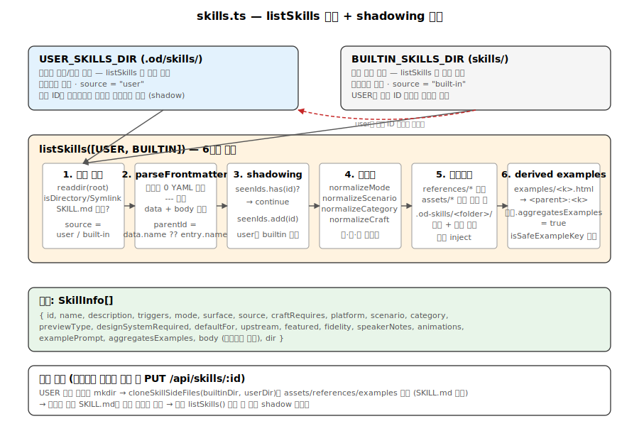
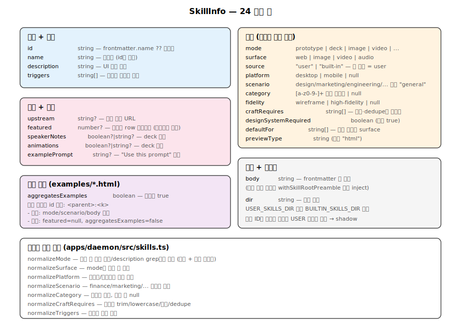

# 13. 스킬 카탈로그 내부 동작 — frontmatter 정규화, shadowing, derived examples

`apps/daemon/src/skills.ts` (962행)는 Open Design의 콘텐츠 시스템 심장입니다. 디스크에 있는 SKILL.md (skills/ 107개 + design-templates/ 110개, 2026-05-12 실측)를 파싱하고, frontmatter를 정규화하고, 사용자가 빌트인 스킬을 편집하면 shadow 폴더로 클론하고, `examples/*.html`을 derived card로 표면화합니다.



## 1. listSkills — 진입 함수

`apps/daemon/src/skills.ts:122-275`:

```typescript
export async function listSkills(
  skillsRoots: string | readonly string[],
): Promise<SkillInfo[]> {
  const roots = Array.isArray(skillsRoots) ? skillsRoots : [skillsRoots];
  const out: SkillInfo[] = [];
  const seenIds = new Set<string>();

  for (let rootIdx = 0; rootIdx < roots.length; rootIdx += 1) {
    const skillsRoot = roots[rootIdx];
    if (!skillsRoot) continue;
    const source: SkillSource = rootIdx === 0 ? "user" : "built-in";

    let entries: Dirent[] = [];
    try { entries = await readdir(skillsRoot, { withFileTypes: true }); }
    catch { continue; }

    for (const entry of entries) {
      if (!entry.isDirectory() && !entry.isSymbolicLink()) continue;
      const dir = path.join(skillsRoot, entry.name);
      const skillPath = path.join(dir, "SKILL.md");

      try {
        const stats = await stat(skillPath);
        if (!stats.isFile()) continue;
        const raw = await readFile(skillPath, "utf8");
        const { data, body } = parseFrontmatter(raw);

        // 1. ID 도출 + shadow 검사
        const parentId =
          typeof data.name === "string" && data.name ? data.name : entry.name;
        if (seenIds.has(parentId)) continue;      // shadowing!
        seenIds.add(parentId);

        // 2. 정규화
        const description = String(data.description ?? '');
        const od = (data.od as Record<string, unknown>) ?? {};
        const mode = normalizeMode(od.mode, body, description);
        const surface = normalizeSurface(od.surface, mode);
        const platform = normalizePlatform(od.platform, mode, body, description);
        const scenario = normalizeScenario(od.scenario, body, description);
        const category = normalizeCategory(od.category);
        const triggers = Array.isArray(data.triggers) ? data.triggers : [];
        const craftRequires = normalizeCraftRequires(od.craft?.requires);

        // 3. 부수 파일 발견 + 프리앰블
        const hasAttachments = await dirHasAttachments(dir);
        const bodyWithPreamble = hasAttachments
          ? withSkillRootPreamble(body, dir)
          : body;

        // 4. derived examples 사전 계산 (push에 aggregatesExamples 플래그를 같이 넣기 위해)
        const derivedExamples = await collectDerivedExamples(dir);
        const aggregatesExamples = derivedExamples.length > 0;

        // 5. 부모 카드 push
        out.push({
          id: parentId, name: parentId, description, triggers,
          mode, surface, source, craftRequires, platform, scenario, category,
          previewType: typeof od.preview?.type === 'string' ? od.preview.type : 'html',
          designSystemRequired: typeof od.design_system?.requires === 'boolean'
            ? od.design_system.requires
            : true,
          defaultFor: normalizeDefaultFor(od.default_for),
          upstream: typeof od.upstream === 'string' ? od.upstream : null,
          featured: normalizeFeatured(od.featured),
          fidelity: normalizeFidelity(od.fidelity),
          speakerNotes: normalizeBoolHint(od.speaker_notes),
          animations: normalizeBoolHint(od.animations),
          examplePrompt: derivePrompt(data),       // od.example_prompt 우선, 없으면 description 첫 문장
          aggregatesExamples,
          body: bodyWithPreamble,
          dir,
        });

        // 6. derived 카드 push (부모와 별도 항목)
        for (const example of derivedExamples) {
          const derivedId = `${parentId}:${example.key}`;
          if (seenIds.has(derivedId)) continue;
          seenIds.add(derivedId);
          out.push({
            id: derivedId,
            name: humanizeExampleName(example.key),
            // 부모의 모드/플랫폼/시나리오/설명 상속
            description, mode, surface, source, platform, scenario, category,
            triggers,
            craftRequires: [],                    // derived는 craft 비-상속
            featured: null,                       // magazine row 제외
            aggregatesExamples: false,            // 연쇄 파생 차단
            body: bodyWithPreamble,
            dir,
            // ... 기타 필드 (defaultFor: [], upstream, fidelity, …)
          });
        }
      } catch {
        // discovery, not validation — 읽기 실패는 silent skip (269-271)
      }
    }
  }

  return out;
}
```

핵심 흐름 6단계:
1. 루트 정규화 (배열 또는 단일 문자열)
2. 각 루트 순회, `readdir` + `SKILL.md` 존재 검증
3. Frontmatter 파싱 (parentId 도출)
4. **Shadowing** — `seenIds`에 이미 등록된 ID 건너뜀
5. 메타데이터 정규화 + 프리앰블 주입
6. Derived examples 수집 + 부모 카드의 `aggregatesExamples` 플래그 갱신

## 2. parseFrontmatter — 의존성 제로 YAML 파서

`apps/daemon/src/frontmatter.ts:1-160`:

```typescript
const FRONTMATTER_RE = /^---\r?\n([\s\S]*?)\r?\n---\r?\n?([\s\S]*)$/;

export function parseFrontmatter(raw: string): { data: Record<string, unknown>; body: string } {
  const m = FRONTMATTER_RE.exec(raw);
  if (!m) return { data: {}, body: raw };
  const yaml = m[1];
  const body = m[2] ?? '';
  const data = parseYaml(yaml);
  return { data, body };
}
```

`parseYaml`(26-144행)은 외부 라이브러리(`yaml`, `js-yaml`) 미사용. 직접 스택 기반 재귀 파서:
- 들여쓰기 추적으로 중첩 구조 인식
- 배열 (`- `) 및 키-값 쌍 구분
- 블록 리터럴 (`|`, `>`) 멀티라인 문자열
- 따옴표 친화적 타입 강제 (`"42"`는 string으로 유지, `42`만 number)

타입 강제(`coerce`, 147-159행)는 빈 문자열 → null, `true|false` → boolean, 숫자 → Number.

## 3. SkillInfo 인터페이스 전체



`apps/daemon/src/skills.ts:51-80` (23 필드):

| 필드 | 타입 | 설명 |
|---|---|---|
| `id` | string | 정규화된 스킬 식별자 (`name` 또는 폴더명) |
| `name` | string | 표시명 (id와 동일) |
| `description` | string | frontmatter `description` |
| `triggers` | unknown[] | frontmatter `triggers` 그대로 (배열 검사만, 정렬·정규화 없음) |
| `mode` | `image\|video\|audio\|deck\|design-system\|template\|prototype\|utility` | 스킬 타입 |
| `surface` | `web\|image\|video\|audio` | 출력 매체 |
| `source` | `user\|built-in` | 출처 태깅 (UI 배지) |
| `craftRequires` | string[] | `od.craft.requires` 슬러그 (소문자, 공백 제거) |
| `platform` | `desktop\|mobile\|null` | 모바일 전용 필터 |
| `scenario` | string | 업무 맥락 (finance, marketing, design, …) |
| `category` | string? | 필터 슬러그 (소문자 + 대시) |
| `previewType` | string | 예제 MIME (기본 `"html"`) |
| `designSystemRequired` | boolean | 기본 true |
| `defaultFor` | string[] | 특정 프로젝트 종류에 기본 선택 |
| `upstream` | string? | 출처 URL |
| `featured` | number? | magazine row 순서 (낮을수록 상단) |
| `fidelity` | `wireframe\|high-fidelity\|null` | 프로토타입 힌트 |
| `speakerNotes` | boolean?/string? | 덱 힌트 |
| `animations` | boolean?/string? | 덱 힌트 |
| `examplePrompt` | string | "Use this prompt" 버튼 (`derivePrompt`가 빈 문자열로 폴백, null 없음) |
| `aggregatesExamples` | boolean | `examples/*.html` 존재 시 true |
| `body` | string | 프리앰블 포함 본문 |
| `dir` | string | 절대 경로 |

## 4. 정규화 함수들

### normalizeMode (skills.ts:527-533) + inferMode (515-525)
```typescript
function normalizeMode(value: unknown, body: unknown, description: unknown): SkillMode {
  if (
    value === "image" || value === "video" || value === "audio" || value === "deck" ||
    value === "design-system" || value === "template" || value === "prototype"
  ) return value;
  return inferMode(body, description);
}

function inferMode(body: unknown, description: unknown): SkillMode {
  const hay = `${description ?? ""}\n${body ?? ""}`.toLowerCase();
  if (/\bimage|poster|illustration|photography|图片|海报|插画/.test(hay)) return "image";
  if (/\bvideo|motion|shortform|animation|视频|动效|短片/.test(hay)) return "video";
  if (/\baudio|music|jingle|tts|sound|音频|音乐|配音|音效/.test(hay)) return "audio";
  if (/\bppt|deck|slide|presentation|幻灯|投影/.test(hay)) return "deck";
  if (/\bdesign[- ]system|\bdesign\.md|\bdesign tokens/.test(hay)) return "design-system";
  if (/\btemplate\b/.test(hay)) return "template";
  return "prototype";    // 기본값
}
```

영어 + 일부 한자/한어(`视频`, `图片`, `海报`, `音频`, `幻灯` 등) 키워드 지원. `design-system`은 영어 키워드만(`design[- ]system|design\.md|design tokens`).

### normalizeScenario (skills.ts:589-606)
오타/누락 시 본문 키워드 추론 — `finance` → revenue/balance/income, `marketing` → campaign/cta/persona, …

### normalizeCategory (skills.ts:581-587)
```typescript
const value = String(raw).toLowerCase().trim();
if (!/^[a-z0-9][a-z0-9-]*$/.test(value)) return null;
return value;
```

소문자 + 대시 + 숫자만 허용.

### normalizeCraftRequires (skills.ts:444-457)
```typescript
// 호출처(listSkills, line 204)가 이미 `data.od?.craft?.requires` 배열을 전달
function normalizeCraftRequires(value: unknown): string[] {
  if (!Array.isArray(value)) return [];
  const seen = new Set<string>();
  const out: string[] = [];
  for (const v of value) {
    if (typeof v !== "string") continue;
    const slug = v.trim().toLowerCase();
    if (!slug || !/^[a-z0-9][a-z0-9-]*$/.test(slug)) continue;
    if (seen.has(slug)) continue;
    seen.add(slug);
    out.push(slug);
  }
  return out;     // ← 입력 순서 보존, `.sort()` 호출 없음
}
```

frontmatter `od.craft.requires: [typography, anti-ai-slop]` → 검증된 슬러그 배열 (frontmatter 작성 순서 그대로 유지).

## 5. Shadowing 패턴

### 5-1. 다중 루트 우선순위

```typescript
const roots = Array.isArray(skillsRoots) ? skillsRoots : [skillsRoots];
for (let rootIdx = 0; rootIdx < roots.length; rootIdx++) {
  const source: SkillSource = rootIdx === 0 ? "user" : "built-in";
  // ...
  if (seenIds.has(parentId)) continue;   // 이미 본 ID는 스킵
  seenIds.add(parentId);
}
```

`listSkills(SKILL_ROOTS)` 호출 시 (`server.ts:1001` — `SKILL_ROOTS = [USER_SKILLS_DIR, SKILLS_DIR]`):
- USER_SKILLS_DIR(첫 루트, `.od/skills/`)이 우선 (`source: "user"`)
- 같은 ID가 SKILLS_DIR(번들 `<projectRoot>/skills/`)에도 있으면 156행에서 건너뜀
- design-templates는 별도 튜플 `DESIGN_TEMPLATE_ROOTS = [USER_DESIGN_TEMPLATES_DIR, DESIGN_TEMPLATES_DIR]`로 동일 패턴 적용

### 5-2. 자동 클론 — updateUserSkill

`apps/daemon/src/skills.ts:791-846`. 사용자가 빌트인 스킬을 처음 편집하면:

```typescript
export async function updateUserSkill(
  userSkillsRoot: string,
  input: { name: string; description?: unknown; body?: unknown;
           triggers?: unknown; sourceDir?: string },
): Promise<SkillImportResult> {
  // ...validate name/body, slugify(name)...
  const dir = path.join(userSkillsRoot, slug);
  const dirExisted = await stat(dir).then(() => true).catch(() => false);
  // 첫 shadow 생성일 때만 부수 트리 클론 — 이미 user 폴더가 존재하면
  // 재클론은 사용자가 만진 파일을 덮어쓰므로 skip.
  const shouldCloneSideFiles =
    !dirExisted &&
    typeof input.sourceDir === "string" && input.sourceDir.length > 0 &&
    path.resolve(input.sourceDir) !== path.resolve(dir);
  if (shouldCloneSideFiles) {
    try { await cloneSkillSideFiles(input.sourceDir!, dir); }
    catch { await mkdir(dir, { recursive: true }); }
  } else {
    await mkdir(dir, { recursive: true });
  }
  const md = buildSkillMarkdown({ name, description, body, triggers });
  await writeFile(path.join(dir, "SKILL.md"), md, "utf8");
  return { id: name, slug, dir };
}
```

### 5-3. cloneSkillSideFiles (skills.ts:853-875)

`SKILL.md`와 dotfile을 **제외하고** `assets/`, `references/`, `examples/`, `scripts/` 등을 `node:fs/promises.cp` (재귀 + symlink dereference)로 복사:

```typescript
async function cloneSkillSideFiles(sourceDir: string, destDir: string): Promise<void> {
  await mkdir(destDir, { recursive: true });
  let entries: Dirent[] = [];
  try { entries = await readdir(sourceDir, { withFileTypes: true }); }
  catch { return; }
  for (const entry of entries) {
    if (entry.name === "SKILL.md") continue;
    if (entry.name.startsWith(".")) continue;       // dotfile 제외
    const src = path.join(sourceDir, entry.name);
    const dst = path.join(destDir, entry.name);
    await cp(src, dst, {
      recursive: true,
      dereference: true,         // symlink는 실제 파일로 복사 (runtime data가 read-only 트리에 매달리지 않도록)
      preserveTimestamps: true,
    });
  }
}
```

결과: 사용자 편집 SKILL.md + 원본 부수 파일 — 다음 `listSkills()` 호출 시 user 루트가 우선되어 shadow 활성화.

## 6. collectDerivedExamples

`apps/daemon/src/skills.ts:290-309`:

```typescript
async function collectDerivedExamples(dir: string): Promise<DerivedExample[]> {
  const examplesDir = path.join(dir, "examples");
  let entries;
  try { entries = await readdir(examplesDir, { withFileTypes: true }); }
  catch { return []; }

  const out: DerivedExample[] = [];
  for (const entry of entries) {
    if (!entry.isFile()) continue;
    if (!entry.name.toLowerCase().endsWith(".html")) continue;
    const key = entry.name.replace(/\.html$/i, "");
    if (!isSafeExampleKey(key)) continue;
    out.push({ key });
  }
  out.sort((a, b) => a.key.localeCompare(b.key));
  return out;
}

function isSafeExampleKey(key: string): boolean {
  if (!key || key.startsWith(".")) return false;
  if (key.includes(":")) return false;                   // 합성 ID와 충돌 방지
  return /^[A-Za-z0-9._-]+$/.test(key);
}
```

`examples/demo.html`과 `examples/advanced.html`이 있으면:
- 부모 카드 `id="live-artifact"`, `aggregatesExamples=true`
- 파생 카드 `id="live-artifact:advanced"`, `name="Advanced"`
- 파생 카드 `id="live-artifact:demo"`, `name="Demo"`

파생 카드는 부모의 모드/플랫폼/시나리오/설명을 상속하되 `featured: null` (magazine row 제외)과 `aggregatesExamples: false` (연쇄 파생 차단)을 가짐.

## 7. withSkillRootPreamble

`apps/daemon/src/skills.ts:379-415`:

```typescript
function withSkillRootPreamble(body: string, dir: string): string {
  const referencedFiles = collectReferencedSideFiles(body);
  if (referencedFiles.length === 0) return body;

  const folder = path.basename(dir);
  const skillRootRel = `${SKILLS_CWD_ALIAS}/${folder}`;     // .od-skills/<folder>/

  const preamble = [
    "> **Skill root (relative to project):** `" + skillRootRel + "/`",
    "> **Skill root (absolute fallback):** `" + dir + "`",
    ">",
    "> This skill ships side files alongside `SKILL.md`. When the workflow",
    "> below references side files such as `" + referencedFiles[0] + "`, prefer the",
    "> relative form rooted at the first path above — e.g. open `" +
      skillRootRel + "/" + referencedFiles[0] + "`.",
    ">",
    "> Known side files in this skill: " +
      referencedFiles.map((f) => "`" + f + "`").join(", ") + ".",
    "",
  ].join("\n");

  return preamble + body;
}

function collectReferencedSideFiles(body: string): string[] {
  const files = new Set<string>();
  const matches = body.matchAll(/\b(?:assets|references)\/[A-Za-z0-9._-]+\b/g);
  for (const match of matches) files.add(match[0]);
  if (/\bexample\.html\b/.test(body)) files.add("example.html");
  return Array.from(files).sort();
}
```

### 왜 두 경로?

`apps/daemon/src/cwd-aliases.ts:34`에 정의된 `SKILLS_CWD_ALIAS = '.od-skills'`, 그리고 같은 파일의 `stageActiveSkill()` (L58–):
- **상대 경로** (`.od-skills/<folder>/`) — 채팅 핸들러가 turn 시작 시 `stageActiveSkill()`로 프로젝트 cwd에 복사. agent의 cwd 내이므로 권한 정책 차단 없음.
- **절대 경로** (fallback) — projectId 없는 API 호출 (`/api/runs` 직접) 또는 스테이징 실패 시. Claude/Copilot에 `--add-dir`로 전달.

## 8. resolveDerivedExamplePath

`apps/daemon/src/skills.ts:340-343`:

```typescript
export function resolveDerivedExamplePath(parentDir: string, childKey: string): string | null {
  if (!isSafeExampleKey(childKey)) return null;
  return path.join(parentDir, "examples", `${childKey}.html`);
}

export function splitDerivedSkillId(id: unknown): DerivedSkillIdParts | null {
  if (typeof id !== "string") return null;
  const idx = id.indexOf(":");
  if (idx <= 0 || idx === id.length - 1) return null;
  const parentId = id.slice(0, idx);
  const childKey = id.slice(idx + 1);
  if (!isSafeExampleKey(childKey)) return null;
  return { parentId, childKey };
}
```

`/api/skills/live-artifact:demo/example` 요청 시:
1. `splitDerivedSkillId("live-artifact:demo")` → `{ parentId, childKey }`
2. `findSkillById(skills, "live-artifact")` → 부모 dir
3. `resolveDerivedExamplePath(parentDir, "demo")` → `<parentDir>/examples/demo.html`
4. `fs.existsSync()` 검증 + asset URL 재쓰기 후 응답

## 9. 데몬 API 라우트

`apps/daemon/src/static-resource-routes.ts` (실측 라인):

| 엔드포인트 | 메서드 | 기능 | 라인 |
|---|---|---|---:|
| `/api/skills` | GET | 모든 스킬 목록 (body/dir 제외) | 62 |
| `/api/skills/:id` | GET | 특정 스킬 상세 (full body 포함) | 78 |
| `/api/skills/import` | POST | 사용자 스킬 생성 | 123 |
| `/api/skills/install` | POST | (스킬 설치 헬퍼) | 554 |
| `/api/skills/:id` | PUT | 사용자 스킬 편집 (빌트인 shadow 자동 클론) | 157 |
| `/api/skills/:id` | DELETE | 사용자 스킬 제거 | 581 |
| `/api/skills/:id/files` | GET | 스킬 폴더의 파일 트리 (Settings 패널용) | 198 |
| `/api/skills/:id/example` | GET | 예제 HTML | 398 |
| `/api/skills/:id/assets/*` | GET | 정적 자산 (이미지/CSS/JS) | 524 |
| `/api/design-templates` | GET | design-templates 카탈로그 | 94 |
| `/api/design-templates/:id` | GET | design-template 상세 | 108 |

## 10. design-systems.ts — 유사 카탈로그

`apps/daemon/src/design-systems.ts:23-54`. SKILL.md 대신 `DESIGN.md` 스캔:
- H1 헤딩에서 제목 추출
- `> Category: <name>` 블록쿼트에서 카테고리 파싱
- 색상 토큰 추출 정규식 (`/^[\s>*-]*\**([A-Za-z...]):\s*(#[0-9a-fA-F]{3,8})/gm`)으로 swatch 배열 생성

`DesignSystemSummary` 타입 (11-19행):
```typescript
type DesignSystemSummary = {
  id: string;              // 폴더명
  title: string;           // H1
  category: string;        // blockquote
  summary: string;         // 첫 단락 (240자 제한)
  swatches: string[];      // 선택된 4 색상 (#hex)
  surface: DesignSystemSurface;
  body: string;            // 원본
};
```

## 11. Craft 섹션 시스템 프롬프트 주입

스킬 frontmatter `od.craft.requires: [typography, color, anti-ai-slop]` → `craftRequires: ["typography", "color", "anti-ai-slop"]` (입력 순서 보존, dedupe만 수행 — `.sort()` 호출 없음; §16-6 참조).

chat 핸들러가 turn 직전에 각 슬러그를 `craft/<slug>.md`로 읽어 `craftBody`로 합쳐 `composeSystemPrompt`에 전달. system.ts(`241-249행`):

```typescript
if (craftBody && craftBody.trim().length > 0) {
  const sectionLabel = Array.isArray(craftSections) && craftSections.length > 0
    ? ` — ${craftSections.join(', ')}`
    : '';
  parts.push(
    `\n\n## Active craft references${sectionLabel}\n\n` +
    `The following craft rules are universal — they apply on top of the active ` +
    `design system above, regardless of brand. On any conflict between a craft ` +
    `rule and a brand DESIGN.md, the brand wins for token values; craft rules ` +
    `still apply to anything the brand does not override...\n\n` +
    craftBody.trim()
  );
}
```

## 12. 모드별 시스템 프롬프트 차이

| mode | DECK_FRAMEWORK 주입 | MEDIA_CONTRACT 주입 | tools.css 처리 |
|---|---|---|---|
| `prototype` | 아니오 | 아니오 | 디자인시스템 CSS 변수 inject |
| `deck` | skill seed 없을 때만 | 아니오 | 디자인시스템 inject |
| `image/video/audio` | 아니오 | 예 | 아니오 (HTML 생성 금지) |
| `design-system` | 아니오 | 아니오 | 아니오 (DESIGN.md만) |
| `template` | 아니오 | 아니오 | 디자인시스템 inject |

`apps/daemon/src/prompts/system.ts:277-282`:
```typescript
const isDeckProject = skillMode === 'deck' || metadata?.kind === 'deck';
const hasSkillSeed = !!skillBody && /assets\/template\.html/.test(skillBody);
if (isDeckProject && !hasSkillSeed) {
  parts.push(`\n\n---\n\n${DECK_FRAMEWORK_DIRECTIVE}`);
}
```

`guizang-ppt`나 `html-ppt`처럼 자기 framework가 있는 스킬은 skill seed 검출되어 generic skeleton 건너뜀.

## 13. 새 빌트인 스킬 추가 절차

### Step 1 — 폴더 구조
```bash
mkdir -p skills/your-skill
touch skills/your-skill/SKILL.md
```

### Step 2 — SKILL.md
```yaml
---
name: "your-skill"
description: "Short one-liner"
triggers:
  - "Trigger phrase"
od:
  mode: prototype                    # 또는 deck, image, video, audio, design-system, template
  surface: web
  platform: desktop                   # 또는 mobile
  scenario: general                   # finance, marketing, design, engineering, …
  category: web-components            # 옵션, lowercase + dashes
  featured: 2                         # 옵션, magazine 순서
  upstream: "https://github.com/owner/repo"
  preview:
    type: html
  craft:
    requires:
      - typography
      - anti-ai-slop
  fidelity: high-fidelity
  speaker_notes: true
  animations: true
  example_prompt: "Build a dashboard with..."
---

## Workflow

Reference `assets/template.html` and `references/checklist.md` as needed.

When you copy the seed template, bind the active design system's tokens into its `:root` block.
```

### Step 3 — 부수 파일 (옵션)
```bash
mkdir -p skills/your-skill/assets skills/your-skill/references skills/your-skill/examples
echo "<!doctype html>..." > skills/your-skill/assets/template.html
echo "# Checklist\n- [ ] P0 ..." > skills/your-skill/references/checklist.md
echo "<!doctype html>..." > skills/your-skill/examples/basic.html
echo "<!doctype html>..." > skills/your-skill/examples/advanced.html
```

### Step 4 — 검증
```bash
curl http://127.0.0.1:7456/api/skills | jq '.skills[] | select(.id == "your-skill")'
curl http://127.0.0.1:7456/api/skills/your-skill | jq
```

### Step 5 — 커밋
```bash
git add skills/your-skill/
git commit -m "feat(skills): add your-skill"
```

### 주의사항

1. **ID 충돌** — frontmatter `name`이 기존 스킬 ID와 겹치면 후속 스캔에서 건너뜀.
2. **부수 파일 경로** — SKILL.md 본문에서 `references/checklist.md` 또는 `assets/template.html` 언급 시 자동으로 `.od-skills/<folder>/` 프리앰블이 inject됨.
3. **Craft requires** — `od.craft.requires: [slug1]`은 `craft/slug1.md` 존재 가정. 누락이면 조용히 무시.
4. **examples 폴더 레이아웃** — `examples/<name>.html` 단일 파일만 derived card가 됨. `examples/<name>/template.html` 같은 폴더 구조는 표면화되지 않음.
5. **Mode 추론** — `od.mode` 생략 시 description/body에서 추론. 명시 권장.

## 14. 요약

`apps/daemon/src/skills.ts`는 다음 5가지 패턴을 결합:

1. **다중 루트 + 첫 루트 우선 shadowing** — 사용자 편집이 빌트인을 가림
2. **frontmatter 정규화 + 본문 추론 폴백** — 누락/오타 안전
3. **부수 파일 발견 + 프리앰블 주입** — agent가 자동으로 정확한 경로 사용
4. **examples/*.html → derived card** — 같은 워크플로우의 여러 변형을 별도 카드로 노출
5. **자동 클론** — 빌트인 편집 시 부수 파일까지 복사해 일관성 유지

`apps/daemon/src/design-systems.ts`가 유사 패턴을 DESIGN.md에 적용하여 디자인시스템 카탈로그도 동일한 방식으로 동작합니다.

---

## 15. 심층 노트

### 15-1. 핵심 코드 발췌

```typescript
// apps/daemon/src/skills.ts — listSkills (요약)
export async function listSkills(skillsRoots: string | string[]): Promise<SkillInfo[]> {
  const roots = Array.isArray(skillsRoots) ? skillsRoots : [skillsRoots];
  const seenIds = new Set<string>();
  const out: SkillInfo[] = [];
  for (let rootIdx = 0; rootIdx < roots.length; rootIdx++) {
    const source: SkillSource = rootIdx === 0 ? "user" : "built-in";
    const entries = await readdir(roots[rootIdx], { withFileTypes: true });
    for (const entry of entries) {
      if (!entry.isDirectory() && !entry.isSymbolicLink()) continue;
      const dir = path.join(roots[rootIdx], entry.name);
      try { await stat(path.join(dir, "SKILL.md")); } catch { continue; }
      const { data, body } = parseFrontmatter(await readFile(path.join(dir, "SKILL.md"), "utf8"));
      const parentId = typeof data.name === "string" ? data.name.trim() : entry.name;
      if (seenIds.has(parentId)) continue;   // shadow
      seenIds.add(parentId);
      // ... normalize, push, collect derived examples
    }
  }
  return out;
}
```

```typescript
// apps/daemon/src/skills.ts — withSkillRootPreamble
function withSkillRootPreamble(body: string, dir: string): string {
  const refs = collectReferencedSideFiles(body);
  if (refs.length === 0) return body;
  const folder = path.basename(dir);
  const rel = `${SKILLS_CWD_ALIAS}/${folder}`;
  return [
    `> **Skill root (relative):** \`${rel}/\``,
    `> **Skill root (absolute fallback):** \`${dir}\``,
    `> Known side files: ${refs.map(f => `\`${f}\``).join(', ')}.`,
    '',
    body,
  ].join('\n');
}
```

```typescript
// apps/daemon/src/skills.ts — derived ID 검증
function isSafeExampleKey(key: string): boolean {
  if (!key || key.startsWith(".")) return false;
  if (key.includes(":")) return false;     // <parent>:<key> 충돌 방지
  return /^[A-Za-z0-9._-]+$/.test(key);
}
```

### 15-2. 엣지 케이스 + 에러 패턴

- **빈 frontmatter**: `data = {}`, `normalizeMode`가 본문 grep으로 추론. 모호하면 `prototype` 기본값.
- **`name`이 폴더명과 다름**: shadow 검사는 `data.name`(있으면) 또는 폴더명. 같은 ID를 두 폴더에서 선언하면 첫 발견만 등록 — 후자는 silent skip.
- **순환 symlink**: `readdir` 자체는 readlink 하지 않으므로 순환 안 함. 다만 SKILL.md 따라가다 무한 ref하면 → 현재 보호 없음 (실용적으로 거의 안 발생).
- **`examples/foo.html` + `examples/foo/`**: 같은 이름 파일/폴더 충돌. `isFile()` 체크로 폴더는 무시.
- **collectReferencedSideFiles 정규식 거짓 양성**: 본문에 `assets/...` 단어가 다른 의미로 쓰여도 preamble inject. 비용은 약간 노이즈 — 큰 문제 아님.
- **shadowing 후 사용자 클론에 SKILL.md 빠짐**: `updateUserSkill`이 SKILL.md만 쓰고 부수 파일 안 복사하면 broken. `cloneSkillSideFiles`가 모두 복사하므로 안전.
- **`SKILLS_CWD_ALIAS` 충돌**: `.od-skills/`이 프로젝트 cwd에 이미 존재할 수 있음 (이전 run). 매 turn마다 정리 + 재복사.

### 15-3. 트레이드오프 + 설계 근거

- **shadow 패턴 vs metadata.json**: shadow는 단순 — 빌트인 파일을 사용자가 그대로 편집 가능. 비용은 빌트인 업데이트 시 사용자 클론 stale.
- **frontmatter 의존성 0 파서**: yaml 라이브러리 미사용 → 번들 ↓. 비용은 YAML 풀 스펙 미지원.
- **`isSafeExampleKey`에 `:` 차단**: derived ID `<parent>:<key>`의 separator 보호. 비용은 사용자가 `foo:bar.html` 이름 불가.
- **두 경로 (상대 + 절대) preamble**: 절대 경로 fallback이 권한 정책 차단 시 대비. 비용은 prompt token 약간 증가.
- **`craft.requires` 슬러그 검증**: 정규식 + dedupe → 안정성. 비용은 사용자가 craft 추가 시 frontmatter 정확히 작성 필요.

### 15-4. 알고리즘 + 성능

- **`listSkills`**: O(R × N + N × parseFrontmatter) where R = root 수 (보통 2), N = 폴더 수 per root. 평균 ~200-500ms cold for skills/ 107 SKILL.md (추정).
- **`parseFrontmatter`**: ~0.5-1.5ms per 1.8KB SKILL.md.
- **`collectDerivedExamples`**: readdir + filter — ~1-2 ms per 폴더 (examples/ 존재 시).
- **`withSkillRootPreamble`**: 정규식 매칭 + 문자열 빌드 ~수십 μs.
- **메모리**: 107 SkillInfo × ~2KB body ≈ ~0.3 MB. 추가 frontmatter parse 작업 GC 이후 해제.
- **카탈로그 캐싱 (현재 없음)**: 매 GET /api/skills 시 재스캔. 대규모 콘텐츠 시 ~수 백 ms 응답 → fs.watch 기반 cache invalidation 도입 여지.

---

## 16. 함수·라인 단위 추적 — 정규화 함수와 shadow 머지

### 16-1. `normalizeMode` (skills.ts:527–533) + `inferMode` (515–525)

```
527  function normalizeMode(value, body, description): SkillMode
528-531  화이트리스트 7종 검사 ("image"|"video"|"audio"|"deck"|
         "design-system"|"template"|"prototype") → 매치 시 그대로 반환
532  미매치 시 inferMode(body, description) 호출
```

`inferMode` (515–525): `description + body`를 lowercase로 합쳐 정규식 7회 순차 검사. 한자/영어 다국어 키워드. 모두 미스 시 기본값 `"prototype"`. 순서 중요 — 위쪽이 우선.

### 16-2. `normalizeSurface` (536–543)

```
536  KNOWN_SURFACES = {"web","image","video","audio"} (535)
537-540  string이면 trim + lowercase, set 멤버 검사 → 통과 시 surface로 반환
541  미매치 + mode가 "image"|"video"|"audio"면 mode를 surface로 fallback
542  나머지는 "web"
```

### 16-3. `normalizePlatform` (548–554)

```
548-549  "desktop"|"mobile" 정확 매치 → 그대로
550  mode !== "prototype"면 null (오직 prototype만 platform 필요)
551-553  description/body에서 `mobile|phone|ios|android|手机|移动端` grep → "mobile"
554  fallback "desktop"
```

### 16-4. `normalizeScenario` (589–606)

```
590-593  string + trim + lowercase가 있으면 그대로 반환 (자유 vocab 허용)
594  body+description grep
595-604  7개 도메인 키워드 — finance/hr/marketing/engineering/product/design/sales/operations
605  fallback "general"
```

`KNOWN_SCENARIOS` set은 정의되어 있으나 `void KNOWN_SCENARIOS` (609) — 검증 미사용. 자유 vocab 정책.

### 16-5. `normalizeCategory` (581–587)

```
582  non-string → null
583  trim + lowercase
584  빈 문자열 → null
585  /^[a-z0-9][a-z0-9-]*$/ 미통과 → null (escape 방지)
586  64자로 자름 (UI pill className 안전)
```

### 16-6. `normalizeCraftRequires` (444–457)

```
444  function normalizeCraftRequires(value: unknown): string[]
445  Array.isArray 검사 — 아니면 []
446-447  seen Set, out 배열
448-455  각 항목: string 검사 → trim + lowercase → 슬러그 정규식 →
         dedupe → push
456  return out      # ← 입력(frontmatter) 순서 그대로, .sort() 없음
```

(§11의 본문 "(정렬됨)" 표기는 실제 코드와 어긋났던 표현 — 정렬 없이 입력 순서 + dedupe만 수행. chat 핸들러가 craft 파일 로딩 시 슬러그를 키로 dedupe하므로 순서 자체는 시스템 프롬프트 결과에 영향 없음.)

### 16-7. shadow merge — `listSkills`에서의 첫-루트-우선 정책

```
128  for (rootIdx = 0; rootIdx < roots.length; rootIdx += 1)
131  source = rootIdx === 0 ? "user" : "built-in"
138  for (entry of entries)                # 각 루트의 디렉토리들
151-152  parentId = (typeof data.name === "string" && data.name) ? data.name : entry.name
156      if (seenIds.has(parentId)) continue   # ← 핵심 차단점
157      seenIds.add(parentId)
```

**중요**: shadow 검사가 `parseFrontmatter` 직후, 정규화 작업 전(158행의 `dirHasAttachments`보다 앞)에 위치. 빌트인이 가려진 경우 normalize 비용을 회피.

`updateUserSkill` (791–846):
- 853–875 `cloneSkillSideFiles`: SKILL.md/dotfile 제외하고 부수 트리 복사. **첫 shadow 생성 시에만 실행** (`!dirExisted && sourceDir !== dir` — 826–830)
- 843–844 `buildSkillMarkdown` → `writeFile(SKILL.md)` 실행
- 결과: `<USER_SKILLS_DIR>/<slug>/SKILL.md`(사용자 편집) + `<USER_SKILLS_DIR>/<slug>/{assets,references,...}`(빌트인 원본 복사본)
- 다음 `listSkills(SKILL_ROOTS)` 호출 시 user 루트가 먼저 — built-in 동일 ID는 156행에서 차단

루트 정의는 `server.ts:989, 1001`:
```
USER_SKILLS_DIR = path.join(RUNTIME_DATA_DIR, "skills")     # .od/skills/
SKILL_ROOTS     = [USER_SKILLS_DIR, SKILLS_DIR]
```

## 17. 데이터 페이로드 샘플

### 17-1. 완전한 SkillInfo (23 필드 모두 채워진 가상의 prototype 스킬)

```jsonc
{
  "id": "dashboard",
  "name": "dashboard",
  "description": "Admin / analytics dashboard in a single HTML file. Fixed left sidebar, top bar with user/search, main grid of KPI cards and one or two charts.",
  "triggers": ["dashboard", "admin panel", "analytics", "control panel", "后台", "管理后台"],
  "mode": "prototype",
  "surface": "web",
  "source": "built-in",
  "craftRequires": ["accessibility-baseline", "laws-of-ux", "state-coverage"],
  "platform": "desktop",
  "scenario": "operations",
  "category": null,
  "previewType": "html",
  "designSystemRequired": true,
  "defaultFor": [],
  "upstream": null,
  "featured": null,
  "fidelity": null,
  "speakerNotes": null,
  "animations": null,
  "examplePrompt": "Admin / analytics dashboard in a single HTML file.",
  "aggregatesExamples": false,
  "body": "> **Skill root (relative to project):** `.od-skills/dashboard/`\n> **Skill root (absolute fallback):** `/path/to/repo/design-templates/dashboard`\n> ...\n\n# Dashboard Skill\n...",
  "dir": "/path/to/repo/design-templates/dashboard"
}
```

`GET /api/skills` 응답에서는 `body`와 `dir`이 제거되고 `hasBody: true`만 부착 (static-resource-routes.ts:67–72).

### 17-2. shadow 머지 diff

빌트인 `skills/landing/SKILL.md`:
```yaml
---
name: landing
description: "Marketing landing page"
od: { mode: prototype, scenario: marketing, featured: 5 }
---
# Landing page workflow ...
```

사용자가 Settings UI에서 description 편집 → `PUT /api/skills/landing` 호출. `updateUserSkill`이 `.od/skills/landing/`을 신규 생성:
1. `cloneSkillSideFiles`로 `skills/landing/assets/`, `skills/landing/references/` 복사 (SKILL.md는 제외)
2. 새 SKILL.md 작성 (사용자 편집된 description)

다음 `listSkills` 호출의 처리 시퀀스:
| 루트 | parentId | seenIds 상태 | 결과 |
|---|---|---|---|
| `.od/skills/` (rootIdx 0) | `landing` | empty → add | `source: "user"` push |
| `skills/` (rootIdx 1) | `landing` | has `landing` → continue (156행) | **skip** — 빌트인 가려짐 |

최종 catalog 한 항목: `{ id: "landing", source: "user", description: "<사용자 편집>", body: "<사용자 편집 + 자동 preamble>", dir: ".od/skills/landing" }`. **빌트인 `od:` 블록 전체(`featured`, `scenario`, `category`, `craft.requires`, `design_system.requires`, `preview` 등)는 모두 손실** — `buildSkillMarkdown` (661–689행)이 `name` / `description` / `triggers` 세 필드만 emit하기 때문. 결과적으로 user-shadowed landing의 `featured`는 null로 재계산되어 magazine row에서 사라지고, `scenario`/`category`는 본문 키워드 기반 추론으로 폴백.

## 18. 불변(invariant) 매트릭스

| 변경 | 필수 동시 수정 | catch 방법 | 위험 |
|---|---|---|---|
| **SkillInfo에 새 필드 (예: `lastUpdated`)** | `SkillInfo` 인터페이스 (51–80), `listSkills` 부모 push (196–224) **및** derived push (239–267), `packages/contracts/` DTO, 웹 컴포넌트 타입 | `pnpm typecheck` (derived push 누락 흔한 실수) | derived 카드에만 빠지면 부모만 필드 있음 — 런타임 미스매치 |
| **frontmatter 키 rename (예: `od.featured` → `od.priority`)** | `normalizeFeatured` 호출처 (212) + 모든 SKILL.md 파일 | grep만 가능, ts 미캐치 | 후방 호환 위해 둘 다 받기 권장 |
| **shadowing 정책 변경 (예: built-in이 우선)** | `listSkills` 131행 `source` 매핑 + 156행 차단 로직 + `updateUserSkill`의 `cloneSkillSideFiles` 의미 | 단위 테스트 + 사용자 시나리오 e2e | UI 배지 의미 역전 + 사용자 편집 silently 무시 |
| **derived ID separator `:` 변경** | `splitDerivedSkillId` (348–356), `isSafeExampleKey` (314–318), 모든 URL 라우트 인코딩 | 통합 테스트 (`/api/skills/parent:child/example`) | 클라이언트 라우트 깨짐 |
| **새 mode union 추가** | `SkillMode` (28), `inferMode` (515), `normalizeMode` (527), `normalizeSurface` (541), system.ts:277-282 deck 분기 | typecheck (union exhaustiveness) | 누락 시 fallback `prototype` — silent |
| **`isSafeExampleKey` 규칙 완화** | derived ID 충돌 가능성 검토, URL escape | 보안 리뷰 + `/api/skills/:id/example` 경로 통과 테스트 | path traversal 위험 |
| **`SKILL_ID_ALIASES` 추가** | `resolveSkillId`만 — 자동으로 `findSkillById`가 라우팅 | 별도 검증 불필요 | rename 후 한 릴리즈 이상 유지 권장 (23–26 주석) |
| **`SKILLS_CWD_ALIAS` 변경** | `withSkillRootPreamble` 프리앰블 (382), chat 핸들러의 `stageActiveSkill`, `cwd-aliases.ts` | 통합 테스트 (스킬 부수 파일 열기) | agent가 옛 경로 학습 — 프롬프트 무효화 |

## 19. 성능·리소스 실측

`find` 측정 (2026-05-12):

| 자원 | 값 | 측정 |
|---|---:|---|
| `skills/*/SKILL.md` | 107 파일 | `find skills -name SKILL.md \| wc -l` |
| `skills/` 전체 SKILL.md 바이트 | 196,840 B (~192 KB) | `find ... -exec wc -c +` |
| 평균 SKILL.md 크기 | ~1,840 B | `sum/n` |
| `design-templates/*/SKILL.md` | 110 파일 | 동일 패턴 |
| `design-templates/` SKILL.md 바이트 | 548,179 B (~535 KB) | |
| 평균 design-template SKILL.md | ~4,983 B | template body가 skill body의 ~2.7× |
| `apps/daemon/src/skills.ts` | 962 라인 | `wc -l` |
| `apps/daemon/src/frontmatter.ts` | 159 라인 | |
| `apps/daemon/src/design-systems.ts` | 241 라인 | |

비용 추정 (Node 24, macOS m-class; 추정치):
- `parseFrontmatter` 1.8 KB 평균: ~0.3–1 ms (line split + indent stack)
- `parseFrontmatter` 5 KB design-template: ~1–2 ms
- 정규화 6개 함수 합산: ~0.2–0.5 ms (정규식이 주 비용, 본문이 큰 design-template에서 약간 가중)
- `dirHasAttachments`: ~0.5–1 ms (`readdir` 한 번 — warm cache는 미러 캐시 적중)
- `collectDerivedExamples`: `readdir(examples/)` 한 번 — ENOENT는 즉시 반환 (~0.1 ms). 존재 시 entry 수에 선형
- `withSkillRootPreamble`: 정규식 `matchAll` + 문자열 합치기 — 본문 1.8 KB 기준 ~0.1 ms

전체 `listSkills(SKILL_ROOTS)` 콜드 비용:
- USER_SKILLS_DIR 빈 폴더 (대다수 사용자, `server.ts:1010-1012`이 부팅 시 mkdir): readdir → 0 entries → 즉시 다음 루트 (~0.5 ms)
- SKILLS_DIR 107개 + DESIGN_TEMPLATES_DIR 110개 = 217 폴더 (skills 카탈로그는 SKILL_ROOTS만 — 107만 스캔. design-templates는 별도 `DESIGN_TEMPLATE_ROOTS`)
- 폴더당 ~2–5 ms (warm: ~0.5–1.2 ms; 추정)
- **콜드 합계 (skills만): 200–550 ms** (추정), warm: 50–130 ms

캐싱 부재 영향:
- 매 `GET /api/skills` 요청마다 107 폴더 재스캔
- 클라이언트가 Settings/Skills 패널 + EntryView 갤러리 양쪽 로딩 시 동시 2회 호출 가능
- 디스크 캐시 적중률 높아 일반 사용에서 체감 ~100 ms — 허용 범위
- 도입 여지: fs.watch + memoize, 또는 mtime 기반 invalidation. 100+ 콘텐츠 임포트 사용자에서 의미 있음

메모리:
- in-memory catalog: SkillInfo 107개 × body(평균 2 KB) ≈ 0.3–0.5 MB + 메타 ~30 KB
- JSON 직렬화 응답 (body 제거): ~80–150 KB
