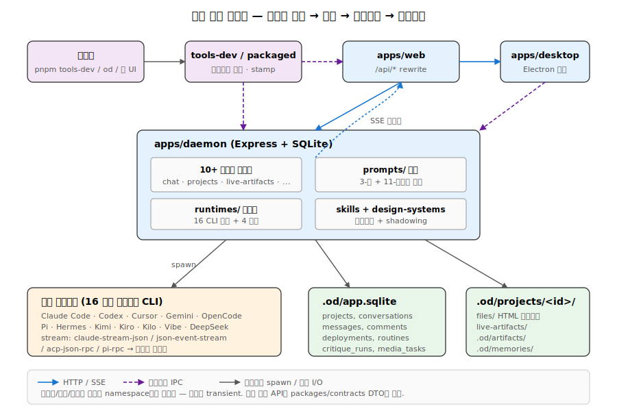
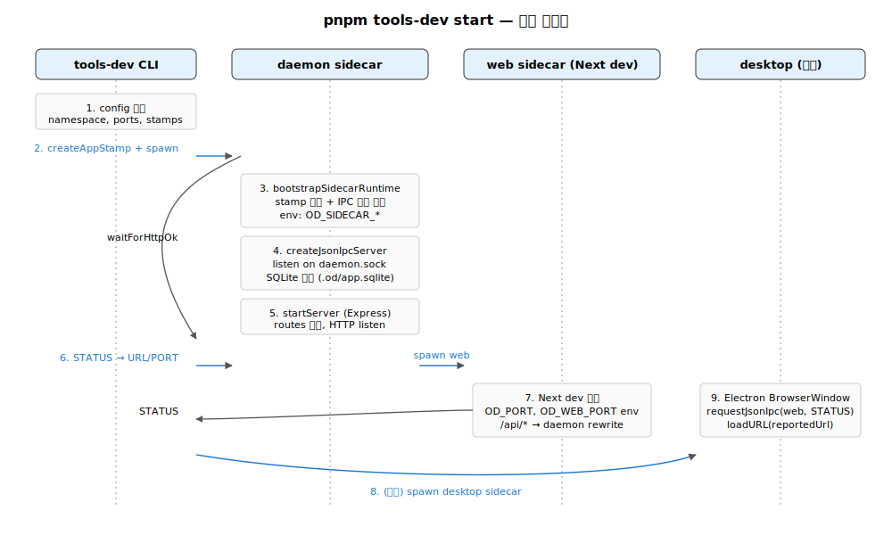

# 06. 주요 데이터 흐름과 시퀀스

이 문서는 Open Design의 **핵심 런타임 시나리오 6개**를 시퀀스 형태로 정리합니다. 앞 문서들의 컴포넌트 지식을 전제로 합니다.



## 1. `pnpm tools-dev start` — 로컬 라이프사이클 부트스트랩



```
사용자
  │ pnpm tools-dev start --namespace default
  ▼
tools/dev/src/index.ts (cac CLI)
  │ 1. config 해석: namespaceRoot = .tmp/tools-dev/default
  │    ipcPath = /tmp/open-design/ipc/default/{daemon,web,desktop}.sock
  ▼
spawnDaemonRuntime()
  │ 2. createAppStamp() → ["--od-stamp-app=daemon",
  │                       "--od-stamp-mode=runtime",
  │                       "--od-stamp-namespace=default",
  │                       "--od-stamp-ipc=...",
  │                       "--od-stamp-source=tools-dev"]
  │ 3. spawnBackgroundProcess({
  │      command: node,
  │      args: [tsx, apps/daemon/sidecar/, ...stampArgs],
  │      detached: true,
  │      env: { OD_PORT: 7456, OD_WEB_PORT: 0, OD_SIDECAR_* }
  │    })
  ▼
apps/daemon/sidecar/ (별도 프로세스)
  │ 4. bootstrapSidecarRuntime() → SidecarRuntimeContext
  │ 5. createJsonIpcServer() listening on /tmp/open-design/ipc/default/daemon.sock
  │ 6. startServer() → Express on 127.0.0.1:7456
  │ 7. SQLite open: .od/app.sqlite (WAL)
  │ 8. registerXxxRoutes() — 10여 개 도메인 라우트
  │ 9. writeJsonFile(current.json) — 자식 포인터
  ▼
spawnWebRuntime()
  │ 10. await requestJsonIpc(daemon.sock, {type: STATUS}) → url
  │ 11. spawnBackgroundProcess(web sidecar, env: OD_PORT=daemonPort)
  ▼
apps/web/sidecar (Next dev 서버)
  │ 12. listen on free port (또는 --web-port)
  │ 13. createJsonIpcServer() on web.sock
  │ 14. /api/*, /artifacts/*, /frames/* → http://127.0.0.1:OD_PORT 로 rewrite
  ▼
tools-dev: 사용자에게 web URL 출력
```

**불변(invariant)**:
- 데몬→웹 통신은 HTTP origin/port. Unix socket 전환은 Next.js SSR 프록시 가정 때문에 보류.
- 데이터/로그/런타임 경로는 namespace로만 스코프 — 포트가 경로에 끼지 않는다.
- 데스크탑은 포트를 추측하지 않고 `web.sock`의 STATUS로만 URL을 얻는다.

## 2. 채팅 요청 — Turn 1 discovery form

```
브라우저 (apps/web/src/App.tsx)
  │ 1. 사용자가 EntryView에 "make me a magazine-style pitch deck"
  │    skill: web-prototype, design-system: linear (선택)
  │ POST /api/chat { agentId, message, projectId?, skillIds, designSystemId }
  ▼
apps/web → rewrite → apps/daemon (Express)
  ▼
chat-routes.ts: handleChatRequest()
  │ 2. SSE 응답 시작 (Content-Type: text/event-stream)
  │ 3. 프로젝트 없으면 새로 생성 (SQLite INSERT INTO projects)
  │ 4. discovery 검사: 첫 턴인가? → composeDiscoveryPrompt()
  ▼
prompts/discovery.ts
  │ 5. discovery form spec emit:
  │    <question-form>
  │      surface: [website|landing|deck|mobile-app|...]
  │      audience: [...]
  │      tone: [...]
  │      brand_context: [...]
  │      scale: [...]
  │    </question-form>
  │ 6. event: start → event: agent {kind: question_form, payload} → event: end
  ▼
브라우저
  │ 7. <QuestionForm/> 렌더 (라디오 5개)
  │ 8. 사용자 응답 → POST /api/chat { previousAnswers: {surface: ..., ...} }
```

## 3. 채팅 요청 — Turn 2+ 에이전트 스폰 + 스트림

```
chat-routes.ts: handleChatRequest() (재진입)
  │ 1. discovery 완료 + brand 미정 → directions form (5개 방향)
  │    또는 brand 정함 → 바로 build
  │ 2. composeSystemPrompt() — apps/daemon/src/prompts/system.ts
  │    a. 활성 스킬의 SKILL.md 본문 주입
  │    b. design-system DESIGN.md 주입 (디렉토리 풀-텍스트)
  │    c. craft.requires 섹션들 주입 (typography, anti-ai-slop, …)
  │    d. 사용자 memory 주입
  │    e. discovery 답변 주입
  ▼
runtimes/defs/<agentId>.ts (예: claude.ts)
  │ 3. buildArgs(prompt, imagePaths, extraAllowedDirs, options)
  │    → ["--output-format=stream-json", "--add-dir=...", ...]
  │ 4. promptViaStdin: true → stdin으로 prompt 전송
  ▼
child_process.spawn(claudeBin, args, { cwd: .od/projects/<id> })
  │ 5. agent 실행 (실제 Read/Write/Bash/WebFetch 가능)
  ▼
agent stdout (claude-stream-json)
  │ {"type":"assistant","content":[{"type":"text","text":"..."}]}
  │ {"type":"assistant","content":[{"type":"tool_use","name":"TodoWrite","input":{...}}]}
  │ {"type":"user","content":[{"type":"tool_result","tool_use_id":"...","content":...}]}
  ▼
runtimes/<agent>/parser.ts: 정규화
  │ 6. claude-stream-json → ChatSseEvent (contracts/sse/chat.ts)
  │    agent {kind: status, payload: {...}}
  │    agent {kind: text_delta, payload: "..."}
  │    agent {kind: thinking_delta, payload: "..."}
  │    agent {kind: tool_use, payload: {name, input}}
  │    agent {kind: tool_result, payload: {tool_use_id, content}}
  │    agent {kind: usage, payload: {inputTokens, outputTokens}}
  ▼
SSE 스트림 → 브라우저
  │ 7. <TodoCard/> 실시간 업데이트 (in_progress → completed)
  │ 8. <ArtifactPreview/> srcdoc iframe 렌더
  ▼
브라우저: 사용자가 mid-flight 인터럽트 가능
  │ POST /api/runs/:id/cancel → design.runs.cancel(run)
  │   ACP/Pi 세션이면 acpSession.abort() → 3000ms 후 child.kill('SIGTERM')
  │   그 외 child.kill('SIGTERM')만 (SIGKILL 은 inactivity watchdog 경로에서만)
  │ (apps/daemon/src/runs.ts:155-175)
```

**아티팩트 emit 규약**: agent는 `<artifact>` 태그 한 번 emit → 데몬이 `.od/projects/<id>/files/` 또는 `live-artifacts/`에 기록 → `GET /api/artifacts/:id`로 미리보기.

## 4. 사이드카 IPC — 데스크탑 inspect

```
tools-dev inspect desktop screenshot --path /tmp/od.png
  │
  ▼
tools/dev/src/index.ts: inspectDesktop()
  │ 1. resolveDesktopIpcPath(config) → /tmp/open-design/ipc/default/desktop.sock
  │ 2. requestJsonIpc(socketPath, {
  │      type: "SCREENSHOT",
  │      input: { path: "/tmp/od.png" }
  │    }, { timeoutMs: 5000 })
  ▼
Unix Domain Socket
  │ {"type":"SCREENSHOT","input":{"path":"/tmp/od.png"}}\n
  ▼
apps/desktop/src/main/index.ts: createJsonIpcServer handler
  │ 3. normalizeDesktopSidecarMessage(payload) (sidecar-proto)
  │ 4. switch (type) { case SCREENSHOT: await window.webContents.capturePage(...) }
  │ 5. fs.writeFile("/tmp/od.png", buffer)
  ▼
응답: {"ok":true,"result":{"path":"/tmp/od.png","width":1440,"height":900}}\n
  ▼
tools-dev: 사용자에게 JSON/텍스트 출력
```

다른 메시지(EVAL, CONSOLE, CLICK, SHUTDOWN, STATUS)도 동일 패턴 — sidecar-proto의 메시지 타입에 따라 분기합니다.

## 5. 데스크탑 폴더 import — HMAC 인증 게이트

폴더 import는 데몬의 파일시스템에 임의 경로를 노출할 수 있어 위험합니다. 따라서 데스크탑↔데몬 HMAC 시그니처로 보호됩니다.

```
부팅 시 (한 번)
  │
apps/packaged → desktop runtime 시작
  │ 1. registerDesktopAuthWithDaemon():
  │    HMAC secret = randomBytes(32)
  │    requestJsonIpc(daemon.sock, {
  │      type: "REGISTER_DESKTOP_AUTH",
  │      input: { secret }
  │    })
  ▼
apps/daemon: chat-routes 또는 import-routes에 저장
  │ 2. desktopAuthSecret ← secret
  │ 3. DaemonStatusSnapshot.desktopAuthGateActive = true


사용자가 폴더 import 버튼 클릭
  │
apps/desktop: pickAndImportFolder()
  │ 4. dialog.showOpenDialog({properties: ["openDirectory"]})
  │ 5. validateExistingDirectory(folderPath)
  │ 6. token = HMAC-SHA256(desktopAuthSecret, JSON({nonce, path, expires: now+60s}))
  ▼
POST /api/import/folder
  Authorization: OD-Desktop <token>
  Body: { path, nonce, expires }
  ▼
apps/daemon: import-export-routes.ts
  │ 7. verifyDesktopImportToken(req): HMAC 검증 + expires 검증 + nonce 미사용 검증
  │ 8. 성공: 파일시스템에서 project 생성
  │    실패: 401 → 데스크탑 인증 게이트가 동작
```

## 6. 패키지 부트스트랩 — `apps/packaged` 단일 번들

```
사용자: Open Design.app 실행 (macOS)
  │
Electron 메인 프로세스 진입
  │
apps/packaged/src/index.ts: createDesktopRuntime()
  │ 1. paths = resolvePackagedPaths({appPath, namespace: "default"})
  │ 2. startPackagedSidecars(runtime, paths, {
  │      appVersion, daemonCliEntry, webSidecarEntry,
  │      requireDesktopAuth: true
  │    })
  ▼
sidecars.ts: 3개 사이드카 동시 부트스트랩
  │ 3. spawn daemon sidecar (apps/daemon/sidecar/ + stamp args)
  │    cwd = paths.namespaceRoot
  │    env: OD_PORT=0 (자유 포트), OD_RESOURCE_ROOT=resources/
  │ 4. await daemon ready (waitForHttpOk)
  │ 5. spawn web sidecar (Next standalone server)
  │    env: OD_PORT=daemonStatus.url의 포트
  │ 6. await web ready
  │ 7. createDesktopRuntime (Electron BrowserWindow)
  │    BrowserWindow.loadURL("od://app/")
  ▼
apps/packaged/src/protocol.ts: protocol.handle("od", handler)
  │ 8. od://app/foo → handleOdRequest()
  │    → fetch http://127.0.0.1:<webPort>/foo 프록시
  │    (loopback만 허용, 그 외 도메인은 거부)
  ▼
사용자에게 BrowserWindow 표시
```

**경로 격리**: 모든 데이터/로그/런타임/캐시는 `paths.namespaceRoot` 아래로 — 포트 정보가 경로에 들어가지 않으므로 재시작 시 포트가 바뀌어도 동일 데이터에 접근.

## 7. PR 트리아주 — `tools-pr list`

```
사용자: pnpm tools-pr list --bucket=merge-ready --json
  │
tools/pr/src/list.ts: handleList()
  │ 1. ghPrList({limit: 1000, includeDrafts}) → gh pr list --json ...
  │ 2. 병렬 enrichment (per-PR):
  │    a. ghPrView(num) → files, reviews, statuses
  │    b. deriveLane(files) → "skill" | "design-system" | "contract" | …
  │    c. deriveForbidden(files) → [restores-apps/nextjs?, restores-packages/shared?]
  │    d. derivePrBucket(...) →
  │       "merge-ready" | "approved-blocked" | "changes-requested" |
  │       "new" | "stale" | "needs-rebase" | "draft"
  │ 3. tag detectors (tags.ts) → 15+ 팩트 태그
  │ 4. 필터링 (bucket/lane/author)
  │ 5. JSON 또는 표 출력
```

**핵심 가치**: `tools-pr`는 read-only — 어떤 호출도 mutate 하지 않습니다. 메인테이너가 출력을 보고 직접 `gh pr review --approve`, `gh pr comment` 등을 실행합니다.

## 8. 통합 시야: 전체 호출 그래프

```
사용자
  │
  ▼
  ┌─ pnpm tools-dev (개발) ─┐
  │                          │
  │                          │ stamp + spawn
  │                          ▼
  │           ┌───────────────────────┐
  │           │ apps/daemon (Express) │ ◄────── apps/web (Next.js)
  │           │   SQLite, 16 agents   │  HTTP   │ rewrites /api/*
  │           └─────────┬─────────────┘         └──────┬─────────┘
  │                     │ spawn child                  │
  │                     ▼                              │
  │            child_process (claude/codex/...)        │
  │                     │ stream-json                  │
  │                     ▼                              │
  │              SSE → /api/chat ──────────────────────┘
  │
  │           apps/desktop (Electron)
  │              │ sidecar IPC ──► daemon, web
  │              └─ od:// → web HTTP 프록시
  │
  ├─ pnpm tools-pack (패키지) ─►  Mac/Win/Linux 번들
  │                                  └─ apps/packaged/src/sidecars.ts
  │
  └─ pnpm tools-pr (메인테이너) ─► gh API (read-only)
```

## 9. 요약된 불변(invariant) 목록

1. 데몬 외 어떤 앱도 SQLite에 직접 쓰지 않는다.
2. 데스크탑은 web 포트를 추측하지 않고 sidecar IPC STATUS로만 알아낸다.
3. 데이터/로그/런타임 경로는 **namespace**로만 스코프 — 포트는 일시적.
4. 사이드카 stamp는 **정확히 5필드** (app, mode, namespace, ipc, source).
5. 모든 외부 노출 API는 `packages/contracts`의 DTO를 통과한다.
6. `apps/web`은 `apps/daemon/src/**`를 import하지 않는다.
7. 코딩 에이전트 CLI 출력은 모두 `ChatSseEvent` union으로 정규화된다.
8. 위험한 데몬 API(폴더 import 등)는 HMAC 데스크탑 인증 게이트로 보호된다.
9. `tools-pr`는 read-only — mutate gh 호출이 없다.
10. 콘텐츠 자산(skills/design-systems/design-templates/craft)은 데몬이 부팅 시 frontmatter를 정규화·shadowing하여 카탈로그화한다.

---

## 10. 심층 노트

### 10-1. 핵심 코드 발췌

```typescript
// tools/dev/src/index.ts — 사이드카 부트 흐름
async function spawnDaemonRuntime(config, options) {
  const daemonPort = parsePortOption(options.daemonPort, "--daemon-port");
  const launchEnv = createSidecarLaunchEnv({...});
  return spawnSidecarRuntime({
    env: {
      [SIDECAR_ENV.DAEMON_PORT]: String(daemonPort ?? 0),
      [SIDECAR_ENV.WEB_PORT]: String(webPort),
    },
  });
}

// 데몬 ready 대기
await waitForHttpOk(`http://127.0.0.1:${daemonPort}/api/health`, { timeoutMs: 20000 });
```

```typescript
// apps/packaged/src/sidecars.ts — supervisor 패턴
async function startPackagedSidecars(runtime, paths, opts) {
  const daemon = await spawnDaemon(paths, opts);
  await waitForDaemonReady(daemon);
  const web = await spawnWeb(paths, opts, daemon.url);
  await waitForWebReady(web);
  return { daemon, web };
}
```

### 10-2. 엣지 케이스 + 에러 패턴

- **부팅 race**: web sidecar가 데몬보다 먼저 listen해도 STATUS 폴링이 데몬 ready 후 시작. `waitForHttpOk`이 데몬 health 보장.
- **데몬 부팅 실패 후 web 시도**: STATUS 폴링이 timeout → 사용자에게 명확한 에러. (현재) supervisor가 web 강제 종료.
- **`OD_REQUIRE_DESKTOP_AUTH=1` + 데스크탑 없는 환경**: 데몬이 secret 등록 안 됨 → folder import 등 보안 API 모두 401. 의도된 안전 모드.
- **packaged 모드 daemon crash + 재시작**: child exit code != 0 시 supervisor가 재시작. 그러나 SQLite WAL 잔존 파일 → 다음 부팅 시 자동 recovery (better-sqlite3 처리).
- **`od://` 프로토콜 + 인터넷 URL**: `toWebRuntimeUrl`이 host 강제 → 외부 도메인 요청은 자동으로 localhost web으로. CORS 차단으로 외부 API 호출은 별도 처리.
- **PR triage `awaiting-*-24h` 태그**: gh API timezone이 UTC. 로컬 timezone 차이로 +/- 시간이 됨 → 24h 경계가 약간 흔들림 (의도적 모호).

### 10-3. 트레이드오프 + 설계 근거

- **데몬 first, web second 부팅 순서**: web은 데몬 API 필요 → 의존성 명확. 비용은 ~1초 추가 cold boot.
- **STATUS IPC vs 환경변수로 URL 전달**: 환경변수는 부팅 시 한 번만 전달 가능 → 데몬 재시작 시 URL 변경 반영 불가. IPC는 동적 → 재시작 안전.
- **HMAC + nonce + TTL 결합**: 셋 중 하나만 빠져도 공격 가능 (시계 왜곡, replay, brute force). 셋이 모두 결합되어야 안전.
- **`tools-pr` read-only**: 메인테이너 정신 부담 ↑, 자동화 사고 위험 ↓. 신호 vs 작용 분리.

### 10-4. 알고리즘 + 성능

- **부트 시퀀스 총 시간**: cold ~2-4초, warm (캐시된 dist) ~0.8-1.5초.
- **3-턴 채팅 latency**: Turn 1 (폼 emit) ~500ms (모델 inference). Turn 2 (direction 선택) ~50ms (UI). Turn 3+ (실제 빌드) ~10-60초 (모델 + tool 호출).
- **SSE 이벤트 throughput**: 평균 5-20 이벤트/초 (text_delta + tool calls). 1 run에 1000+ 이벤트 누적.
- **데스크탑 폴더 import + HMAC**: 토큰 생성 ~1ms, HMAC 검증 ~1ms. 무시 가능 overhead.
- **packaged 부팅**: Electron startup 800ms + sidecar 부팅 1-2초 = 2-3초 cold.

---

## 11. 함수·라인 단위 추적 — 폴더 import HMAC 흐름

데스크탑이 임의 경로의 폴더를 데몬에 import 시키는 전체 흐름을 호출 hop마다 path:line으로 고정합니다. 한 turn이 데스크탑 프로세스 → IPC 소켓 → 데몬 HMAC verify → SQLite insert까지 6개 파일을 가로지릅니다.

**A. 부팅 시 secret 등록**

1. `apps/desktop/src/main/index.ts:203` — `const desktopAuthSecret = randomBytes(32);` (per-process 32바이트 secret 생성).
2. `apps/desktop/src/main/index.ts:204` — `await registerDesktopAuthWithDaemon(runtime, desktopAuthSecret)` 호출. BrowserWindow 생성 *전에* 끝나야 race 차단.
3. `apps/desktop/src/main/index.ts:141-145` — `resolveAppIpcPath({app: APP_KEYS.DAEMON, contract: OPEN_DESIGN_SIDECAR_CONTRACT, namespace: runtime.namespace})` — `/tmp/open-design/ipc/<ns>/daemon.sock` 산출.
4. `apps/desktop/src/main/index.ts:146-149` — `{type: SIDECAR_MESSAGES.REGISTER_DESKTOP_AUTH, input: {secret: secret.toString("base64")}}` 메시지 조립. 타입 상수는 `packages/sidecar-proto/src/index.ts:75`.
5. `apps/desktop/src/main/index.ts:151-167` — `[120, 240, 480, 960, 1500]`ms 백오프로 최대 5회 재시도, 각 호출 800ms timeout.
6. 데몬 측 수신: `apps/daemon/src/sidecar/server.ts:193-200` — `setDesktopAuthSecret(Buffer.from(request.input.secret, "base64"))` → `apps/daemon/src/server.ts:312-318` (`desktopAuthSecret = secret`, `desktopAuthEverRegistered = true`, `consumedImportNonces.clear()`).
7. 이 시점부터 `isDesktopAuthGateActive()` (`apps/daemon/src/server.ts:324-326`)가 영구히 `true`를 리턴 — sticky bit.

**B. 사용자 클릭 → 토큰 mint**

8. 사용자가 `dialog:pick-and-import` IPC 호출. `apps/desktop/src/main/runtime.ts:781-786`이 `pickAndImportFolder({apiBaseUrl, baseDir, desktopAuthSecret, registerDesktopAuth})` 호출.
9. `apps/desktop/src/main/runtime.ts:303-307` — `mintImportToken(secret, baseDir)`:
   - `nonce = randomBytes(16).toString("base64url")` (128비트)
   - `exp = new Date(Date.now() + 60_000).toISOString()` (TTL 60초)
10. `apps/desktop/src/main/runtime.ts:193-202` — `signDesktopImportToken()`: `HMAC-SHA256(secret, "<baseDir>\n<nonce>\n<exp>")` → base64url → `nonce~exp~signature` 포맷.
11. `apps/desktop/src/main/runtime.ts:366-376` — `postOnce()`: `fetch(apiBaseUrl + "/api/import/folder", { headers: {"X-OD-Desktop-Import-Token": token, "Content-Type": "application/json"}, body: JSON.stringify({baseDir, name?, skillId?, designSystemId?}) })`.

**C. 데몬 검증 + 프로젝트 생성**

12. `apps/daemon/src/import-export-routes.ts:95` — Express 핸들러 `app.post('/api/import/folder', ...)`.
13. `apps/daemon/src/import-export-routes.ts:102` — `isDesktopAuthGateActive()` 확인. False면 token 검증 skip (tools-dev에서 desktop 없이 부팅한 경우).
14. `apps/daemon/src/import-export-routes.ts:103-115` — secret이 null이면 `503 DESKTOP_AUTH_PENDING` → 데스크탑이 재핸드셰이크 (Round-5 lazy retry, `runtime.ts:392-410`).
15. `apps/daemon/src/import-export-routes.ts:116-117` — `req.get('x-od-desktop-import-token')` 추출.
16. `apps/daemon/src/import-export-routes.ts:119` — `pruneExpiredImportNonces(now)` (`server.ts:334-338`).
17. `apps/daemon/src/import-export-routes.ts:120-126` → `apps/daemon/src/server.ts:362-400` — `verifyDesktopImportToken`:
    - shape check (3 fields split by `~`)
    - exp parse + 만료 검증 + drift 한계(2× TTL) 검증
    - `createHmac('sha256', secret).update(\`\${baseDir}\n\${nonce}\n\${exp}\`).digest('base64url')` 재계산
    - `timingSafeEqual` 비교 (`server.ts:340-345`)
    - `consumedNonces.has(nonce)` 검사 — replay 차단.
18. `apps/daemon/src/import-export-routes.ts:127-135` — 검증 실패 시 `403 FORBIDDEN` + reason.
19. `apps/daemon/src/import-export-routes.ts:136` — `consumedImportNonces.set(verification.nonce, verification.exp)` — nonce 소비 마킹.
20. `apps/daemon/src/import-export-routes.ts:151` — `fs.promises.realpath(trimmedInput)` — symlink 평탄화 (escape 차단).
21. `apps/daemon/src/import-export-routes.ts:159-178` — `lstat` 디렉토리 확인 + `RUNTIME_DATA_DIR_CANONICAL` 자기참조 차단.
22. `apps/daemon/src/import-export-routes.ts:187` — `detectEntryFile(normalizedPath)` (index.html / src 탐지).
23. `apps/daemon/src/import-export-routes.ts:189-202` — `insertProject(db, {id, name, skillId, designSystemId, metadata: {kind: 'prototype', baseDir, importedFrom: 'folder', entryFile, fromTrustedPicker: true}, ...})` → SQLite INSERT.

**총 hop 수**: 데스크탑 5개 함수 → IPC 1개 hop → 데몬 8개 함수 → SQLite 1개 INSERT.

---

## 12. 데이터 페이로드 샘플

### 12-1. SSE 와이어 포맷 (3-event 시퀀스)

서버 측 writer는 `apps/daemon/src/server.ts:2022`:

```
event: start
data: {"runId":"r_01k9zx","agentId":"claude","bin":"claude","cwd":"/Users/u/.od/projects/p_3a","projectId":"p_3a","model":"sonnet","protocolVersion":1}

event: agent
data: {"type":"status","label":"initializing","model":"claude-sonnet-4-5","sessionId":"s_8e2"}

event: agent
data: {"type":"text_delta","delta":"Sure, I'll draft the deck. First "}

```

(블랭크 라인 두 줄로 frame 종결. `id:` 라인은 옵션 — 현재 chat run은 미사용.)

### 12-2. HMAC import 요청

```
POST /api/import/folder HTTP/1.1
Host: 127.0.0.1:7456
Content-Type: application/json
X-OD-Desktop-Import-Token: 9aZ-2bQc7Hd_4xY3VnSk6w~2026-05-12T03:15:00.000Z~AbCdEf...g0HiJk

{
  "baseDir": "/Users/u/Sites/marketing-site",
  "name": "Marketing site",
  "skillId": "web-prototype",
  "designSystemId": "linear"
}
```

토큰 3-튜플은 `nonce(22ch base64url) ~ ISO8601 expiry ~ HMAC-SHA256 base64url(43ch)`. 필드 구분자 `~`는 base64url/ISO8601 어디에도 나오지 않으므로 명확히 split (`runtime.ts:185`).

### 12-3. Desktop → Daemon IPC `register-desktop-auth`

```
\x00{"type":"register-desktop-auth","input":{"secret":"K3sB7s...base64..."}}\n
```

(Unix Domain Socket 한 줄 JSON. 응답: `{"ok":true,"result":{"accepted":true}}`. 메시지 타입 상수는 `packages/sidecar-proto/src/index.ts:70-79`.)

---

## 13. 불변(invariant) 매트릭스

| 변경 사항 | 어디를 같이 바꿔야 하는가 | 깨지면 어떻게 드러나는가 |
|---|---|---|
| 새 SSE event 추가 (예: `agent` 외) | `packages/contracts/src/sse/chat.ts:63` (union) + `apps/daemon/src/server.ts:2022` writer + `apps/web` consumer | TS 컴파일 실패 (union narrowing) 또는 클라이언트가 unknown event 무시 |
| `X-OD-Desktop-Import-Token` 헤더명 변경 | `apps/desktop/src/main/runtime.ts:300` + `apps/daemon/src/import-export-routes.ts:116` + 테스트 `apps/packaged/tests/desktop-pick-and-import.test.ts` | 401/403 즉시; e2e가 fail |
| 새 IPC 메시지 타입 추가 | `packages/sidecar-proto/src/index.ts:70-79` (상수) + `normalizeDaemonSidecarMessage`/`normalizeDesktopSidecarMessage` (`index.ts:436-475`) + 핸들러 (`apps/daemon/src/sidecar/server.ts:182` 또는 `apps/desktop/src/main/index.ts` switch) + tools-dev 호출부 | `SidecarContractError(UNKNOWN_MESSAGE)` |
| 새 boot stage 추가 (예: daemon→web 사이 `auth-bootstrap`) | `tools/dev/src/index.ts` orchestrator + `apps/packaged/src/sidecars.ts` (`startPackagedSidecars`) + `inspect status` JSON 쉐이프 | `tools-dev status --json` 필드 차이; packaged ready 폴링 timeout |
| HMAC TTL 60→다른 값 | `apps/desktop/src/main/runtime.ts:301` + `apps/daemon/src/server.ts:309` (`DESKTOP_IMPORT_TOKEN_TTL_MS`) + drift 한계 `server.ts:387` | clock skew 큰 사용자에서 `token expiry exceeds permitted window` |
| stamp 필드 추가 | `SIDECAR_STAMP_FIELDS` 길이 = 5 (`packages/sidecar-proto/src/index.ts:60`) — AGENTS.md 규약 위반. `guard.ts`가 차단 |

---

## 14. 성능·리소스 실측

### 14-1. 3-turn 채팅 latency 예산

| 단계 | wall-clock | 주요 비용 |
|---|---|---|
| Turn 1 — `POST /api/chat` 도착 → discovery emit | 400-800ms | LLM call (Anthropic API 1-shot, ~50 토큰 출력) |
| 사용자 폼 응답 (UX) | 5-30초 | 외부 |
| Turn 2 — directions form emit | 0.8-2초 | LLM (~200 토큰), brand 가져오기 |
| 사용자 direction 선택 | 1-10초 | 외부 |
| Turn 3 — 실제 build (spawn → 첫 text_delta) | 800-2500ms | child spawn (~50-200ms) + `composeSystemPrompt` IO (~50ms) + 모델 TTFT (~500-2000ms) |
| Turn 3 — text/tool stream | 10-60초 | 모델 inference + tool round-trip |
| Turn 3 — `end` event | <50ms | child close watch + DB flush |

순수 데몬 오버헤드(스폰 + 프롬프트 조립 + parser 어태치) cold ~250ms, warm ~80ms. 95% 시간은 모델 inference.

### 14-2. SSE throughput

- text_delta: token당 1 이벤트 ≈ 30-80 ev/s (Claude stream-json), ACP는 chunk 단위라 5-20 ev/s.
- tool_use + tool_result 쌍: run당 5-50쌍.
- 1회 build run 누적: 500-3000 SSE 프레임. 평균 프레임 크기 100-400B → 0.1-1MB/run.
- writer는 single `res.write` (서버 측 line 2022) → backpressure는 Node TCP buffer로.

### 14-3. HMAC verify 비용

| 작업 | per-call |
|---|---|
| `randomBytes(16)` nonce 생성 | ~3μs |
| `createHmac('sha256').update().digest('base64url')` (60-100B payload) | ~5-10μs |
| `timingSafeEqual` (43바이트 string) | ~1μs |
| `Map.has(nonce)` lookup | ~0.5μs |
| `realpath()` + `lstat()` (FS-bound) | 200μs-2ms |

전체 검증 ~5-15μs, FS 작업이 100배 더 큼 → 의미 있는 hot-path는 FS.
