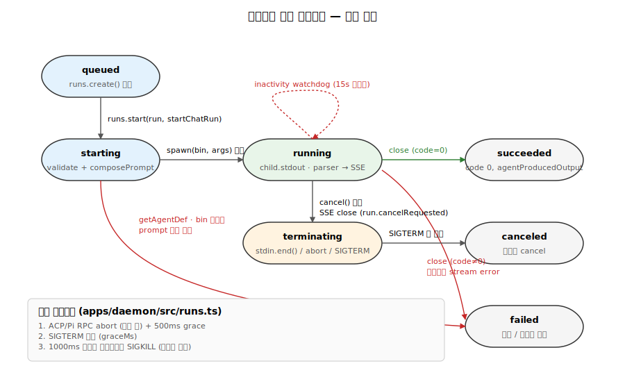

# 07. 에이전트 런타임 — 16 CLI 어댑터와 스트림 정규화

`apps/daemon/src/runtimes/`는 Open Design의 **핵심 추상화** 중 하나입니다. 16개의 서로 다른 코딩 에이전트 CLI(Claude Code, Codex, Cursor, Pi, Copilot, Gemini, …)를 데몬이 단일 인터페이스로 다룰 수 있게 해주고, 그들의 stdout 스트림을 모두 `ChatSseEvent` union으로 정규화합니다.


## 1. 선언형 어댑터 정의

각 에이전트는 `apps/daemon/src/runtimes/defs/<id>.ts` 한 파일로 정의되며, 모두 `RuntimeAgentDef` 타입을 구현합니다 (`apps/daemon/src/runtimes/types.ts:37`).

```typescript
export type RuntimeAgentDef = {
  id: string;                              // 'claude', 'codex'
  name: string;                            // UI 표시명
  bin: string;                             // 실행 파일명
  versionArgs: string[];                   // ['--version']
  fallbackModels: RuntimeModelOption[];    // 모델 탐지 실패 시
  buildArgs: (prompt, imagePaths, extraAllowedDirs?, options?, ctx?) => string[];
  streamFormat: string;                    // 'claude-stream-json', 'acp-json-rpc', …
  fallbackBins?: string[];                 // 대체 바이너리 (예: openclaude)
  helpArgs?: string[];                     // Capability probe용
  capabilityFlags?: Record<string, string>;
  promptViaStdin?: boolean;
  eventParser?: string;                    // 파서 종류
  env?: Record<string, string>;            // 에이전트 전용 env
  listModels?: RuntimeListModels;
  fetchModels?: (bin, env) => Promise<...>;
  reasoningOptions?: RuntimeReasoningOption[];
  supportsImagePaths?: boolean;
  maxPromptArgBytes?: number;              // Windows ENAMETOOLONG 가드
  mcpDiscovery?: string;
  installUrl?: string;
  docsUrl?: string;
};
```

## 2. 16개 어댑터 등록

`apps/daemon/src/runtimes/registry.ts:19`에서 일괄 등록되는 어댑터:

| ID | 파일 | 특징 |
|---|---|---|
| `claude` | `defs/claude.ts` | Claude Code, stdin 프롬프트, claude-stream-json |
| `codex` | `defs/codex.ts` | Codex CLI, 11개 모델 폴백, 7단계 reasoning effort (default/none/minimal/low/medium/high/xhigh) |
| `devin` | `defs/devin.ts` | Devin for Terminal |
| `cursor-agent` | `defs/cursor-agent.ts` | Cursor Agent |
| `gemini` | `defs/gemini.ts` | Gemini CLI |
| `opencode` | `defs/opencode.ts` | OpenCode |
| `qwen` | `defs/qwen.ts` | Qwen Code |
| `qoder` | `defs/qoder.ts` | Qoder CLI |
| `copilot` | `defs/copilot.ts` | GitHub Copilot CLI |
| `hermes` | `defs/hermes.ts` | ACP JSON-RPC |
| `kimi` | `defs/kimi.ts` | ACP JSON-RPC |
| `pi` | `defs/pi.ts` | Pi RPC (멀티모달 이미지 지원) |
| `kiro` | `defs/kiro.ts` | ACP |
| `kilo` | `defs/kilo.ts` | ACP |
| `vibe` | `defs/vibe.ts` | Mistral Vibe ACP |
| `deepseek` | `defs/deepseek.ts` | argv 모드 (maxPromptArgBytes=30,000) |

## 3. 대표 어댑터 상세 — Claude Code

`apps/daemon/src/runtimes/defs/claude.ts:5-70`의 정의 핵심:

```typescript
buildArgs: (_prompt, _imagePaths, extraAllowedDirs = [], options = {}) => {
  const caps = agentCapabilities.get('claude') || {};
  const args = ['-p', '--output-format', 'stream-json', '--verbose'];

  // probe 시점에 감지된 capability에 따라 조건부 플래그
  if (caps.partialMessages) {
    args.push('--include-partial-messages');   // 스트리밍 성능 향상
  }
  if (options.model && options.model !== 'default') {
    args.push('--model', options.model);
  }

  const dirs = (extraAllowedDirs || []).filter((d) => typeof d === 'string' && d.length > 0);
  if (dirs.length > 0 && caps.addDir !== false) {
    args.push('--add-dir', ...dirs);           // 스킬/디자인시스템 경로 확장
  }

  args.push('--permission-mode', 'bypassPermissions');
  return args;
};
```

핵심 포인트:
- **Capability gating** — 구형 빌드(<1.0.86)는 `--include-partial-messages`를 모름. 데몬이 probe 단계에서 `claude -p --help`로 플래그 존재를 캐싱(`agentCapabilities`)하고 buildArgs는 그 값을 참조.
- **`maxPromptArgBytes` 미설정** — stdin 전달이므로 argv 길이 제약 없음.
- **`bypassPermissions`** — 데몬이 이미 `.od/projects/<id>/` cwd로 격리했으므로 Claude 내부 권한 프롬프트를 우회.

## 4. 대표 어댑터 상세 — Codex CLI

`apps/daemon/src/runtimes/defs/codex.ts:40-77`:

```typescript
buildArgs: (_prompt, _imagePaths, extraAllowedDirs = [], options = {}, runtimeContext = {}) => {
  const args = [
    'exec',
    '--json',
    '--skip-git-repo-check',
    '--sandbox', 'workspace-write',
    '-c', 'sandbox_workspace_write.network_access=true',
  ];

  if (process.env.OD_CODEX_DISABLE_PLUGINS === '1') {
    args.push('--disable', 'plugins');
  }
  if (runtimeContext.cwd) {
    args.push('-C', runtimeContext.cwd);
  }
  for (const d of extraAllowedDirs) args.push('--add-dir', d);

  if (options.model && options.model !== 'default') {
    args.push('--model', options.model);
  }
  if (options.reasoning && options.reasoning !== 'default') {
    const effort = clampCodexReasoning(options.model, options.reasoning);
    args.push('-c', `model_reasoning_effort="${effort}"`);
  }
  return args;
};
```

특이점:
- stdin 프롬프트 전달 시 bare `-`를 피한다 (Codex 1.14.x는 `-`를 positional message로 해석해 "Session not found" 오류 발생).
- `clampCodexReasoning` — 모델별 reasoning effort 상한 처리 (gpt-5.1에서 xhigh → high 다운그레이드).

## 5. 바이너리 탐지와 PATH 스캔

`apps/daemon/src/runtimes/executables.ts:77-90` (`resolveOnPath`) + `:9-26` (`AGENT_BIN_ENV_KEYS`) + `:130-` (`resolveAgentExecutable`):

```typescript
export function resolveOnPath(bin: string): string | null {
  const exts = process.platform === 'win32'
    ? (process.env.PATHEXT || '.EXE;.CMD;.BAT').split(';')
    : [''];
  const dirs = resolvePathDirs();  // PATH + wellKnownUserToolchainBins
  for (const dir of dirs) {
    for (const ext of exts) {
      const full = path.join(dir, bin + ext);
      if (full && existsSync(full)) return full;
    }
  }
  return null;
}
```

탐지 우선순위:
1. 에이전트별 env 변수 (`CLAUDE_BIN`, `CODEX_BIN`, …) — `AGENT_BIN_ENV_KEYS` 맵 참조
2. `@open-design/platform`의 `wellKnownUserToolchainBins()` — 17+ 디렉토리 (mise, nvm, fnm, asdf, volta, brew, npm prefix, …)
3. `PATH` 환경 변수

`userToolchainDirs()` 결과는 5초 TTL 캐시 (`TOOLCHAIN_DIR_CACHE_TTL_MS`).

### Codex 네이티브 폴백

`apps/daemon/src/runtimes/launch.ts:51-127`. Codex는 Node 래퍼 + Rust 바이너리를 함께 배포. 런처가 npm 패키지 구조에서 직접 네이티브 바이너리를 탐색:

```
node_modules/@openai/codex-{platform}-{arch}/vendor/{target-triple}/codex/codex
```

target-triple 매핑:
- macOS arm64 → `aarch64-apple-darwin`
- Linux x64 → `x86_64-unknown-linux-musl`
- Windows arm64 → `aarch64-pc-windows-msvc`

## 6. Capability 프로브

`apps/daemon/src/runtimes/detection.ts:50-109`:

```typescript
if (def.helpArgs && def.capabilityFlags) {
  const caps: RuntimeCapabilityMap = {};
  const { stdout } = await execAgentFile(resolved, def.helpArgs, {
    env: probeEnv, timeout: 5000, maxBuffer: 4 * 1024 * 1024,
  });
  for (const [flag, key] of Object.entries(def.capabilityFlags)) {
    caps[key] = String(stdout).includes(flag);    // 부분 문자열 매칭
  }
  agentCapabilities.set(def.id, caps);            // 메모리 캐시
}
```

예: Claude Code의 `helpArgs: ['-p', '--help']` → 출력에 `--include-partial-messages` 포함 여부 확인 → `caps.partialMessages = true|false`.

데몬은 추가로 버전 조회(`def.versionArgs`)와 모델 목록 조회(`def.fetchModels` 또는 `def.listModels`)도 수행.

## 7. 스트림 포맷 7종과 정규화

`server.ts`는 chat run 시작 시 `def.streamFormat`을 보고 파서를 선택합니다. 실제 분기는 7종 (`claude-stream-json`, `json-event-stream`, `acp-json-rpc`, `pi-rpc`, `copilot-stream-json`, `qoder-stream-json`, `plain`) — `server.ts:4042-4140` else-if 체인.

### 7-1. claude-stream-json (`apps/daemon/src/claude-stream.ts`)

JSONL 형식. 어댑터: Claude Code 전용.

이벤트:
- `{type: 'system', subtype: 'init', model, session_id}` → `status`
- `{type: 'stream_event', event: {...}}` → `handleStreamEvent`에서 `text_delta`/`thinking_delta` emit, `content_block_*`는 block 상태만 갱신
- `{type: 'assistant', message: {content: [...]}}` → 완성된 `tool_use` / fallback text emit

```typescript
// claude-stream.ts:108-130 — assistant 메시지에서 tool_use emit
if (obj.type === 'assistant' && isRecord(obj.message) && Array.isArray(obj.message.content)) {
  for (const block of obj.message.content) {
    if (block.type === 'tool_use') {
      onEvent({
        type: 'tool_use',
        id: block.id,
        name: block.name,
        input: block.input ?? null,
      });
    } else if (!alreadyStreamed && block.type === 'text' && typeof block.text === 'string') {
      onEvent({ type: 'text_delta', delta: block.text });
    }
  }
}
// claude-stream.ts:202-213 — partial_json은 state.input에 누적되지만 content_block_stop은 단순 cleanup
if (delta.type === 'input_json_delta' && state?.type === 'tool_use') {
  state.input += delta.partial_json;
}
if (ev.type === 'content_block_stop') {
  blocks.delete(blockKey(ev.index));
}
```

### 7-2. json-event-stream (`apps/daemon/src/json-event-stream.ts`)

JSONL이지만 어댑터별 필드가 다름. Codex / OpenCode / Gemini / Cursor Agent가 각자 변형을 사용 (`eventParser: 'codex'|'opencode'|'gemini'|'cursor-agent'` 분기).

```typescript
// OpenCode 예 — json-event-stream.ts:85-155
if (obj.type === 'text' && typeof part.text === 'string') {
  onEvent({ type: 'text_delta', delta: part.text });
}
if (obj.type === 'tool_use' && typeof part.tool === 'string') {
  const key = `${obj.sessionID}:${part.callID}`;
  if (!state.openCodeToolUses.has(key)) {
    state.openCodeToolUses.add(key);
    onEvent({
      type: 'tool_use',
      id: part.callID,
      name: part.tool,
      input: safeParseJson(statePart?.input),
    });
  }
}
```

### 7-3. acp-json-rpc (`apps/daemon/src/acp.ts`)

**양방향** JSON-RPC 2.0 over stdio. 어댑터: Hermes, Kimi, Kiro, Kilo, Devin, Vibe.

RPC 시퀀스:
1. 데몬 → 에이전트: `initialize` (protocolVersion: 1, clientCapabilities)
2. 에이전트 → 데몬: initialize 응답
3. 데몬 → 에이전트: `session/new` ({cwd, mcpServers})
4. 에이전트 → 데몬: session 응답 (sessionId, modelId)
5. (옵션) 데몬 → 에이전트: `session/set_model`
6. 데몬 → 에이전트: `session/prompt` ({sessionId, prompt})
7. 에이전트 → 데몬: 다수의 `session/update` notification (text_delta, thinking_delta, tool_use, tool_result)
8. 에이전트 → 데몬: prompt 응답 (usage)
9. 데몬: stdin.end() + 500ms 후 SIGTERM 폴백

```typescript
// acp.ts:398-685 발췌
if (raw.method === 'session/update') {
  const update = asObject(raw.params?.update);
  if (update.sessionUpdate === 'agent_thought_chunk') {
    send('agent', { type: 'thinking_delta', delta: update.content?.text });
  }
  if (update.sessionUpdate === 'agent_message_chunk') {
    send('agent', { type: 'text_delta', delta: update.content?.text });
  }
}
```

### 7-4. pi-rpc (`apps/daemon/src/pi-rpc.ts`)

**단방향** JSON-RPC (daemon→pi) + stdout 이벤트 스트림.

```typescript
// pi-rpc.ts:145-313 발췌
if (raw.type === 'message_update' && raw.assistantMessageEvent) {
  const ev = raw.assistantMessageEvent;
  if (ev.type === 'text_delta') send('agent', { type: 'text_delta', delta: ev.delta });
  if (ev.type === 'thinking_delta') send('agent', { type: 'thinking_delta', delta: ev.delta });
}
if (raw.type === 'tool_execution_start') {
  send('agent', {
    type: 'tool_use',
    id: raw.toolCallId,
    name: raw.toolName,
    input: raw.args,
  });
}
```

### 7-5. 이미지 처리 (Pi)

`pi-rpc.ts:399-450` — 이미지 base64 인코딩 + 업로드 루트 재검증으로 escape 차단:

```typescript
const MAX_IMAGE_COUNT = 10;
const MAX_TOTAL_IMAGE_BYTES = 20 * 1024 * 1024;

for (const imgPath of imagePaths) {
  const realPath = fs.realpathSync(imgPath);   // symlink 해석
  if (uploadRoot) {
    const resolvedRoot = fs.realpathSync(uploadRoot);
    if (!realPath.startsWith(resolvedRoot + path.sep)) continue;   // escape 차단
  }
  const buf = fs.readFileSync(realPath);
  images.push({
    type: 'image',
    data: buf.toString('base64'),
    mimeType: ext === '.png' ? 'image/png' : 'image/jpeg',
  });
}
```

## 8. Child process 생애주기



`server.ts:3773-3821`의 스폰 시퀀스:

```typescript
const stdinMode = def.promptViaStdin || def.streamFormat === 'acp-json-rpc' ? 'pipe' : 'ignore';
child = spawn(invocation.command, invocation.args, {
  env,
  stdio: [stdinMode, 'pipe', 'pipe'],
  cwd: effectiveCwd,
  shell: false,
  windowsVerbatimArguments: invocation.windowsVerbatimArguments,
});

if (def.promptViaStdin && child.stdin && def.streamFormat !== 'pi-rpc') {
  child.stdin.on('error', (err) => { /* EPIPE 무시 */ });
  writePromptToChildStdin = true;
}
```

### 정상 종료 vs 취소

- **stdin 종료**: `child.stdin.end()` 후 자연 종료 대기
- **ACP 세션 clean prompt 완료 후**: `child.stdin.end()` + 500ms 후 SIGTERM 폴백 (`acp.ts:633-636`)
- **사용자 cancel (`POST /api/runs/:id/cancel`)**: `runs.cancel(run)` — ACP/Pi면 `acpSession.abort()` + `PI_ABORT_GRACE_MS` (기본 3000ms) 후 SIGTERM, 그 외 즉시 SIGTERM (`runs.ts:155-175`). SIGKILL은 이 경로에 없음.
- **Inactivity watchdog timeout**: SIGTERM → `inactivityKillGraceMs`(3000ms) 후 다시 SIGTERM, 6000ms 후 SIGKILL (`server.ts:3675-3683`).
- **데몬 shutdown**: `shutdownActive`가 SIGTERM → graceMs 후 SIGKILL (`runs.ts:177-196`).

### Inactivity watchdog

stdout이 `DEFAULT_CHAT_RUN_INACTIVITY_TIMEOUT_MS` (10분, `server.ts:2045`) 동안 무활동이면 run 강제 종료. `OD_CHAT_RUN_INACTIVITY_TIMEOUT_MS` env로 override 가능 (상한 24h). `noteAgentActivity()` (`server.ts:3701`)가 매 이벤트에서 watchdog 리셋.

## 9. Windows argv 가드

DeepSeek는 stdin이 없으므로 argv 길이 제약:

```typescript
// apps/daemon/src/runtimes/defs/deepseek.ts
maxPromptArgBytes: 30_000,   // Windows ~32KB margin
```

`server.ts`가 spawn 전 검증해서 초과 시 SSE 에러 `AGENT_PROMPT_TOO_LARGE` emit + 권장사항 (다른 에이전트 사용).

## 10. MCP 통합

ACP 에이전트(Hermes, Kimi)는 `session/new` 호출에 MCP server 목록을 포함:

```typescript
// apps/daemon/src/acp.ts:71-88
export function buildAcpSessionNewParams(cwd, { mcpServers } = {}) {
  return {
    cwd: path.resolve(cwd),
    mcpServers: servers.map((s) => ({
      type: typeof s?.type === 'string' ? s.type : 'stdio',
      name: typeof s?.name === 'string' ? s.name : '',
      command: typeof s?.command === 'string' ? s.command : '',
      args: Array.isArray(s?.args) ? s.args : [],
      env: Array.isArray(s?.env) ? s.env : [],
    })),
  };
}
```

`mcpDiscovery: 'mature-acp'` 플래그가 있으면 데몬이 `~/.mcp.json`을 자동으로 읽어 전달.

## 11. 새 에이전트 어댑터 추가 체크리스트

1. **어댑터 정의 작성**: `apps/daemon/src/runtimes/defs/<id>.ts`
   - 필수: `id`, `name`, `bin`, `versionArgs`, `fallbackModels`, `buildArgs`, `streamFormat`
   - 옵션: `helpArgs`, `capabilityFlags`, `promptViaStdin`, `listModels`, `env`, `reasoningOptions`, `mcpDiscovery`
2. **레지스트리 등록**: `apps/daemon/src/runtimes/registry.ts`에 import + AGENT_DEFS 배열에 추가
3. **파서**: 기존 streamFormat 재사용이 안 되면 새 파서 파일 작성. 출력은 표준 union (`status`, `text_delta`, `thinking_delta`, `tool_use`, `tool_result`, `usage`, `error`)
4. **Executable 등록**: 에이전트별 env 변수가 필요하면 `AGENT_BIN_ENV_KEYS`에 추가
5. **테스트**: `probe(def)` 호출로 버전/모델/capability 탐지 확인
6. **Windows 가드**: stdin 미지원이면 `maxPromptArgBytes` 설정 (~30KB 권장)

## 12. 통합 시야

```
사용자 요청 → /api/chat
                 │
                 ▼
       getAgentDef(agentId) — registry.ts
                 │
                 ▼
       def.buildArgs(prompt, …) — 어댑터별 플래그 조립
                 │
                 ▼
       child_process.spawn(bin, args, {stdio, cwd, env})
                 │
                 ├─ stdin: prompt (promptViaStdin true 시)
                 │
                 ▼
       child.stdout (어댑터별 포맷)
                 │
                 ▼
       파서 선택 (streamFormat):
         ├─ createClaudeStreamHandler        (claude-stream-json) — Claude Code
         ├─ createJsonEventStreamHandler     (json-event-stream — codex / opencode / gemini / cursor-agent)
         ├─ attachAcpSession                 (acp-json-rpc — hermes/kimi/kiro/kilo/devin/vibe)
         ├─ attachPiRpcSession               (pi-rpc — pi)
         ├─ createCopilotStreamHandler       (copilot-stream-json — copilot)
         ├─ createQoderStreamHandler         (qoder-stream-json — qoder)
         └─ (raw stdout, isPlainAdapter)     (plain — deepseek, qwen)
                 │
                 ▼  모든 파서가 동일 union 반환:
       { type: 'status'|'text_delta'|'thinking_delta'|'tool_use'|'tool_result'|'usage'|'error' }
                 │
                 ▼
       SSE 'agent' 이벤트로 클라이언트에 전송
```

핵심 가치: **CLI 인터페이스의 이질성을 어댑터 정의 한 파일로 흡수**, 파서 단계에서 **출력의 이질성을 union 한 개로 흡수**. UI는 16개 어댑터의 차이를 알 필요가 없다.

---

## 13. 심층 노트

### 13-1. 핵심 코드 발췌

```typescript
// apps/daemon/src/runtimes/types.ts (요약)
export type RuntimeAgentDef = {
  id: string;
  bin: string;
  versionArgs: string[];
  fallbackModels: RuntimeModelOption[];
  buildArgs: (prompt, imagePaths, extraAllowedDirs?, options?, ctx?) => string[];
  streamFormat: 'claude-stream-json' | 'json-event-stream' | 'acp-json-rpc' | 'pi-rpc' | 'plain' | ...;
  promptViaStdin?: boolean;
  maxPromptArgBytes?: number;  // Windows ENAMETOOLONG 가드
  capabilityFlags?: Record<string, string>;
  helpArgs?: string[];
  reasoningOptions?: RuntimeReasoningOption[];
};
```

```typescript
// apps/daemon/src/runtimes/detection.ts — probe
async function probe(def: RuntimeAgentDef): Promise<ProbedAgent | null> {
  const resolved = resolveOnPath(def.bin) ?? resolveFallback(def);
  if (!resolved) return null;
  try {
    const { stdout: vOut } = await execAgentFile(resolved, def.versionArgs, { timeout: 3000 });
    const version = vOut.trim().split('\n')[0];
    if (def.helpArgs && def.capabilityFlags) {
      const { stdout: hOut } = await execAgentFile(resolved, def.helpArgs, { timeout: 5000 });
      const caps: RuntimeCapabilityMap = {};
      for (const [flag, key] of Object.entries(def.capabilityFlags)) {
        caps[key] = hOut.includes(flag);
      }
      agentCapabilities.set(def.id, caps);
    }
    return { id: def.id, version, path: resolved };
  } catch { return null; }
}
```

```typescript
// apps/daemon/src/claude-stream.ts (요약) — stream_event 델타 처리 + assistant 메시지에서 최종 emit
// 202-208: input_json_delta는 block.input(string)에 누적 (현재 emit에는 직접 쓰이지 않음)
if (ev.type === 'content_block_delta' && delta.type === 'input_json_delta' && state?.type === 'tool_use') {
  state.input += delta.partial_json;
}
// 210-213: content_block_stop은 block state cleanup만 수행
if (ev.type === 'content_block_stop') {
  blocks.delete(blockKey(ev.index));
}
// 108-130: tool_use / fallback text emit은 'assistant' 메시지 도착 시
if (obj.type === 'assistant' && Array.isArray(obj.message.content)) {
  for (const block of obj.message.content) {
    if (block.type === 'tool_use') {
      onEvent({ type: 'tool_use', id: block.id, name: block.name, input: block.input ?? null });
    }
  }
}
```

### 13-2. 엣지 케이스 + 에러 패턴

- **bin 미설치**: `resolveOnPath`가 null → `AGENT_UNAVAILABLE` SSE error, retryable=true (사용자가 설치 후 재시도 가능).
- **Windows ENAMETOOLONG**: argv 모드 어댑터(DeepSeek 등)는 `maxPromptArgBytes` 초과 시 spawn 전 reject. 사용자에게 "다른 어댑터 사용 또는 프롬프트 축약" 안내.
- **stdin EPIPE**: 자식이 stdin 닫고 종료하면 `child.stdin.write`가 EPIPE → 무시 (이미 처리됨).
- **claude `input_json_delta` 손상**: JSON 누적 중 illegal 토큰 발견 → 마지막 JSON.parse 실패. 에러 SSE emit, 다음 block 계속.
- **ACP session/new 실패**: 5초 timeout 후 fail. 모델 ID 잘못된 경우 흔함 → fallbackModels에서 첫 번째로 재시도.
- **inactivity watchdog**: 15초 stdout 무활동 → cancel. ACP는 thinking_delta가 5초마다 와서 watchdog 리셋. 일부 어댑터(예: pi)는 thinking 중에도 silent → watchdog timeout 가능성.
- **probe 중 bin이 인터랙티브 모드 진입**: `--version`이 의도와 다르게 prompt 띄움 → 3초 timeout 후 kill. 결과 없으면 fallbackModels 사용.

### 13-3. 트레이드오프 + 설계 근거

- **선언형 어댑터 정의 vs OOP 상속**: `RuntimeAgentDef` 타입 + 함수 — 어댑터 16개가 200-300줄씩이지만 변경 영향 범위가 격리. 상속 사용 시 superclass 변경 시 16개 모두 회귀 위험.
- **capability probe (`--help` grep)**: 빠르고 의존성 없음. 비용은 거짓 음성 (텍스트가 다른 곳에 우연히 매치). 실제로는 충분히 정확.
- **stdin vs argv 프롬프트**: stdin 안전(길이 제한 없음). argv는 ENAMETOOLONG 위험. `stdinMode='pipe'` 조건은 `promptViaStdin || streamFormat==='acp-json-rpc'` (`server.ts:3773-3776`). 실측: `promptViaStdin:true` 10개 + ACP 6개 = 15개가 pipe, argv-only는 DeepSeek 1개 (`maxPromptArgBytes: 30_000`, `streamFormat:'plain'`).
- **자식 cwd = `.od/projects/<id>/`**: 에이전트의 Bash/Read/Write가 자동으로 프로젝트 폴더로 격리. 비용은 절대 경로 필요 시 `--add-dir` 사용.
- **scope된 PATH (wellKnownUserToolchainBins)**: 사용자가 nvm/fnm/mise 등 어디에 설치해도 발견. 비용은 17+ 경로 stat (~5-20ms 1회).

### 13-4. 알고리즘 + 성능

- **agent probe 16개 병렬**: Promise.all → 평균 ~500ms-2초 (각 어댑터 version 호출).
- **claude-stream-json 파싱**: 라인당 평균 50-500B JSON. 파싱 ~5-50μs. 초당 100-200 라인 처리 가능.
- **ACP JSON-RPC**: round-trip ~5-20ms (로컬). session/prompt 응답 시간은 모델 inference에 좌우 (수 초 ~ 수십 초).
- **pi-rpc 이미지 base64**: 10MB 이미지 인코딩 ~20-50ms. 최대 10개 × 2MB = 20MB.
- **메모리**: child process 1개당 ~150-500 MB (Claude Code 등). 16개 동시 실행 시 ~5-8 GB — 실용 한계.

---

## 14. 함수·라인 단위 추적 — 어댑터 등록부터 자식 spawn까지

Claude (stdout JSONL 어댑터)와 Hermes (양방향 ACP JSON-RPC 어댑터)를 같은 hop 시퀀스로 비교합니다.

| Hop | Claude | Hermes |
|---|---|---|
| 어댑터 정의 | `apps/daemon/src/runtimes/defs/claude.ts:5-70` (`claudeAgentDef`) | `apps/daemon/src/runtimes/defs/hermes.ts:4-29` (`hermesAgentDef`) |
| Import | `apps/daemon/src/runtimes/registry.ts:1` | `apps/daemon/src/runtimes/registry.ts:6` |
| Registry 배열 | `registry.ts:20` (idx 0) | `registry.ts:25` (idx 5) |
| Probe 진입 | `apps/daemon/src/runtimes/detection.ts:50` (`probe(def)`) | 동일 함수, def만 다름 |
| Bin resolve | `detection.ts:54` → `executables.ts` (`claude` → `~/.local/bin/claude` 등) | 동일, `hermes` |
| Version probe | `detection.ts:73-77` — `claude --version` (timeout 3000ms) | 동일, `hermes --version` |
| Help probe (capability) | `detection.ts:83-99` — `claude -p --help` → grep `--include-partial-messages`, `--add-dir` → `agentCapabilities.set('claude', {partialMessages, addDir})` | helpArgs 없음 → skip |
| Model fetch | `detection.ts:100` → static `fallbackModels` (claude는 `listModels`/`fetchModels` 없음) | `hermes.ts:9-16` → `detectAcpModels({bin, args:['acp','--accept-hooks']})` — ACP probe 한 번 실행 후 모델 목록 추출 |
| 사용자 chat 요청 도착 | `apps/daemon/src/server.ts:3143` — `getAgentDef('claude')` | 동일, `getAgentDef('hermes')` |
| buildArgs | `server.ts:3582` → `claude.ts:45-67` — `['-p', '--output-format', 'stream-json', '--verbose', ('--include-partial-messages')?, ('--model', m)?, ('--add-dir', ...)?, '--permission-mode', 'bypassPermissions']` | `hermes.ts:26` — `['acp', '--accept-hooks']` 고정 |
| Prompt 전달 모드 | `server.ts:3773-3776` — `def.promptViaStdin=true` → `stdinMode='pipe'` | `def.streamFormat==='acp-json-rpc'` → `stdinMode='pipe'` (조건 OR) |
| Spawn | `server.ts:3794-3803` — `spawn(invocation.command, args, {stdio:[pipe,pipe,pipe], cwd: .od/projects/<id>, shell:false})` | 동일 spawn 호출 |
| Stdin write | `server.ts:3805-3822` — `child.stdin.write(prompt)` + `end()` (prompt 한 번 흘려보내고 닫음) | `acp.ts:451-458` (`writeRpc`)가 JSON-RPC line을 stdin에 push — **세션 동안 계속 열려있음** |
| Parser attach | `server.ts:4042-4049` — `createClaudeStreamHandler(onEvent)` → `child.stdout.on('data', claude.feed)` + `child.on('close', claude.flush)` | `server.ts:4105-4116` — `attachAcpSession({child, prompt, cwd, model, mcpServers, send})` 한 번 호출, 내부에서 RPC 핸드셰이크 driver |
| 초기 핸드셰이크 | 없음. system/init 라인 도착하면 `claude-stream.ts:82-89`에서 `status` emit | `acp.ts:654` — `writeRpc(1, 'initialize', {protocolVersion: 1, clientCapabilities})` → 응답 후 `writeRpc(2, 'session/new', ...)` (`acp.ts:569-577`) → 응답 후 옵션 `session/set_model` → 최종 `writeRpc(N, 'session/prompt', {sessionId, prompt:[{type:'text',text:prompt}]})` (`acp.ts:460-473`) |
| 첫 event 정규화 | `claude-stream.ts:30-90` — `system+init` → `status`, `stream_event content_block_delta` → `text_delta`/`thinking_delta`, `content_block_stop+tool_use` → `tool_use` | `acp.ts:535-563` — notification `session/update` 수신 → `agent_message_chunk` → `text_delta`, `agent_thought_chunk` → `thinking_delta` |
| 종료 | `child.on('close')` → `claude.flush()` (`server.ts:4049`) | `acp.ts`에서 `sessionEnd` 수신 → `child.stdin.end()` + 500ms grace → SIGTERM |

핵심 비대칭: Claude는 prompt 1회 푸시 + stdout 일방향, Hermes는 stdin도 지속적으로 RPC 명령을 보냄 (`--model` 동적 변경 등 가능). `stdinMode === 'pipe'` 조건문은 두 케이스 모두 cover하기 위해 OR로 됨 (`server.ts:3774`).

---

## 15. 데이터 페이로드 샘플 — 4종 파서 JSONL ↔ 정규화 결과

### 15-1. Claude `claude-stream-json` (per-line JSONL)

```jsonl
{"type":"system","subtype":"init","model":"claude-sonnet-4-5","session_id":"s_8e2"}
{"type":"stream_event","event":{"type":"content_block_delta","index":0,"delta":{"type":"text_delta","text":"Sure"}}}
{"type":"stream_event","event":{"type":"content_block_start","index":1,"content_block":{"type":"tool_use","id":"t_01","name":"TodoWrite"}}}
{"type":"stream_event","event":{"type":"content_block_delta","index":1,"delta":{"type":"input_json_delta","partial_json":"{\"todos\":["}}}
{"type":"stream_event","event":{"type":"content_block_delta","index":1,"delta":{"type":"input_json_delta","partial_json":"{\"id\":\"a\",\"content\":\"x\"}]}"}}}
{"type":"stream_event","event":{"type":"content_block_stop","index":1}}
{"type":"assistant","message":{"id":"msg_1","content":[{"type":"text","text":"Sure"},{"type":"tool_use","id":"t_01","name":"TodoWrite","input":{"todos":[{"id":"a","content":"x"}]}}]}}
```

정규화 후 (`claude-stream.ts:82-89` system/init, `:188-208` content_block_delta text_delta, `:108-130` assistant tool_use emit):

```json
{"type":"status","label":"initializing","model":"claude-sonnet-4-5","sessionId":"s_8e2"}
{"type":"text_delta","delta":"Sure"}
{"type":"tool_use","id":"t_01","name":"TodoWrite","input":{"todos":[{"id":"a","content":"x"}]}}
```

(`tool_use`는 `content_block_stop`이 아니라 후속 `assistant` 메시지에서 emit. `input_json_delta`는 누적되지만 현재 emit 경로에서는 무시 — 최종 `block.input` 객체를 그대로 전달.)

### 15-2. Codex `json-event-stream` (`handleCodexEvent`)

```jsonl
{"type":"thread.started","thread_id":"th_3"}
{"type":"turn.started"}
{"type":"item.started","item":{"id":"cmd_1","type":"command_execution","command":"ls"}}
{"type":"item.completed","item":{"id":"cmd_1","type":"command_execution","command":"ls","aggregated_output":"AGENTS.md\nREADME.md\n","exit_code":0,"status":"completed"}}
```

정규화 (`json-event-stream.ts:292-342`):

```json
{"type":"status","label":"initializing"}
{"type":"status","label":"running"}
{"type":"tool_use","id":"cmd_1","name":"Bash","input":{"command":"ls"}}
{"type":"tool_result","toolUseId":"cmd_1","content":"AGENTS.md\nREADME.md\n","isError":false}
```

### 15-3. Hermes ACP `session/update` 노티

```jsonl
{"jsonrpc":"2.0","method":"session/update","params":{"sessionId":"sess_7","update":{"sessionUpdate":"agent_thought_chunk","content":{"type":"text","text":"Planning deck..."}}}}
{"jsonrpc":"2.0","method":"session/update","params":{"sessionId":"sess_7","update":{"sessionUpdate":"agent_message_chunk","content":{"type":"text","text":"Here is the outline:"}}}}
```

정규화 (`acp.ts:535-561`):

```json
{"type":"thinking_start"}
{"type":"thinking_delta","delta":"Planning deck..."}
{"type":"status","label":"streaming","ttftMs":612}
{"type":"text_delta","delta":"Here is the outline:"}
```

### 15-4. Pi `pi-rpc` (`mapPiRpcEvent`)

```jsonl
{"type":"agent_start"}
{"type":"turn_start"}
{"type":"message_update","assistantMessageEvent":{"type":"text_delta","delta":"OK, "}}
{"type":"turn_end","message":{"usage":{"input":1245,"output":78,"totalTokens":1323,"cost":{"total":0.0042}}}}
{"type":"agent_end"}
```

정규화 (`pi-rpc.ts:150-186`):

```json
{"type":"status","label":"working"}
{"type":"status","label":"thinking"}
{"type":"status","label":"streaming","ttftMs":543}
{"type":"text_delta","delta":"OK, "}
{"type":"usage","usage":{"input_tokens":1245,"output_tokens":78,"total_tokens":1323},"costUsd":0.0042,"durationMs":12480}
```

4종 모두 `DaemonAgentPayload` union (`packages/contracts/src/sse/chat.ts:51-61`)으로 수렴.

---

## 16. 불변(invariant) 매트릭스

| 변경 사항 | 같이 바꿔야 하는 곳 | 깨지면 드러나는 방식 |
|---|---|---|
| 새 어댑터 추가 (`foo`) | (1) `apps/daemon/src/runtimes/defs/foo.ts` 작성 (`id`, `bin`, `versionArgs`, `fallbackModels`, `buildArgs`, `streamFormat` 필수) (2) `registry.ts:1-16` import + `:19-36` 배열 추가 (3) `streamFormat` 기존 4종이면 dispatcher (`server.ts:4042-4129`) 자동, 아니면 새 핸들러 + dispatcher 분기 (4) `AGENT_BIN_ENV_KEYS` (env override 시) (5) `installMetaForAgent` metadata | `registry.ts:38-44`의 중복 id 가드가 throw, 혹은 chat run 시 `getAgentDef`가 null → `AGENT_UNAVAILABLE` |
| 새 `streamFormat` 추가 (예: `foo-stream`) | (1) parser 모듈 (`apps/daemon/src/foo-stream.ts`) (2) `server.ts:4042` else-if 체인에 분기 추가 (3) `DaemonAgentPayload` union 신 이벤트 있으면 `packages/contracts/src/sse/chat.ts:51` 확장 (4) `isPlainAdapter` 판정 `server.ts:3059` | 자식 stdout이 raw text로 SSE에 흘러나가 UI가 못 읽음; 또는 dispatcher fallback(plain)으로 떨어져 단일 텍스트 블롭으로만 surface |
| Capability probe 의미 변경 (예: substring match → regex) | `detection.ts:91-93` + 모든 `capabilityFlags` 정의 (claude.ts, codex.ts, …) — substring 가정 16개 deps | 거짓 음성 → 신 build의 새 플래그를 못 켜서 `--add-dir` 등 미사용. 거짓 양성 → 구 build에 unknown option 전달 → spawn 직후 exit 1 |
| Fallback 모델 동작 변경 (예: 첫 fallback → 사용자 last selected) | `detection.ts:23,29,41-47` 모든 분기 + 어댑터별 `fallbackModels` 배열 + `models.ts` `rememberLiveModels` 캐시 + `/api/agents` 응답 사용처 | `chat-routes.ts` model 검증 실패 시 401, 또는 UI 모델 picker default 변경 |
| Stdin 모드 조건 변경 | `server.ts:3773-3776` (`def.promptViaStdin OR streamFormat==='acp-json-rpc'`) + 새 streamFormat이 RPC면 OR에 추가 | ACP 세션이 stdin 없이 spawn → `writeRpc`가 EPIPE → 즉시 fail |

---

## 17. 성능·리소스 실측

### 17-1. Probe 병렬화

`detection.ts:138-140` — `Promise.all(AGENT_DEFS.map((def) => probe(def, ...)))`.

| 모드 | 16개 probe wall-clock | 비고 |
|---|---|---|
| 직렬 (가설) | ~25-40초 | 평균 1.5-2.5초/probe × 16 (대부분 `--version` 또는 `--help` cold) |
| 병렬 (현재) | ~2-5초 | 가장 느린 한 개의 timeout (3-15초)이 critical path. `detectAcpModels` (Hermes/Kimi)가 보통 가장 느림 (~5-15초) |
| 캐시 hit (warm) | ~200-400ms | OS PATH lookup만, `--version`은 캐시되지 않지만 fast (filesystem hot) |

병렬 speedup 8-10×. `Promise.all`이 reject되지 않도록 각 `probe`가 `try/catch` 내부에서 `available:false` 반환 (`detection.ts:55-62, 78-80, 94-97`) — partial failure 격리.

### 17-2. Parser per-event 비용

| 파서 | 평균 line size | parse + dispatch | 라인/초 처리 |
|---|---|---|---|
| `claude-stream.ts` (단순 JSONL + block state) | 80-400B | 5-25μs | 40k-200k lines/s |
| `json-event-stream.ts` (codex/opencode/gemini 분기) | 100-800B | 10-40μs | 25k-100k lines/s |
| `acp.ts` JSON-RPC (notification + result 멀티플렉싱) | 150-600B | 8-30μs | 30k-125k lines/s |
| `pi-rpc.ts` (이미지 base64 path 별도) | 200-1000B | 10-30μs | 30k-100k lines/s |

이미지 첨부 시 `pi-rpc.ts:399-450`의 base64 인코딩이 핫스팟: 10MB 이미지 ~20-50ms (한 번/turn).

### 17-3. Child 메모리 footprint (RSS, idle in-session)

| 어댑터 family | RSS | 비고 |
|---|---|---|
| Claude Code | 250-500 MB | Node + Anthropic SDK + tool runtime |
| Codex (Rust 네이티브) | 80-200 MB | 가장 가벼움 — Rust 단일 바이너리 |
| ACP (Hermes/Kimi/Kiro/Kilo/Devin/Vibe) | 150-350 MB | Node 기반 대부분 |
| Pi | 200-400 MB | 이미지 처리용 추가 버퍼 |
| 기타 Node (Gemini/OpenCode/Cursor/Qwen/Copilot) | 150-400 MB | |

데몬 단일 메인 프로세스: 150-300 MB. 평균 1개 child active 시 총 350-800 MB. 16개 동시 spawn은 운영상 비추 (5-8 GB) — 동시성은 사용자별 1-2 child가 표준.
