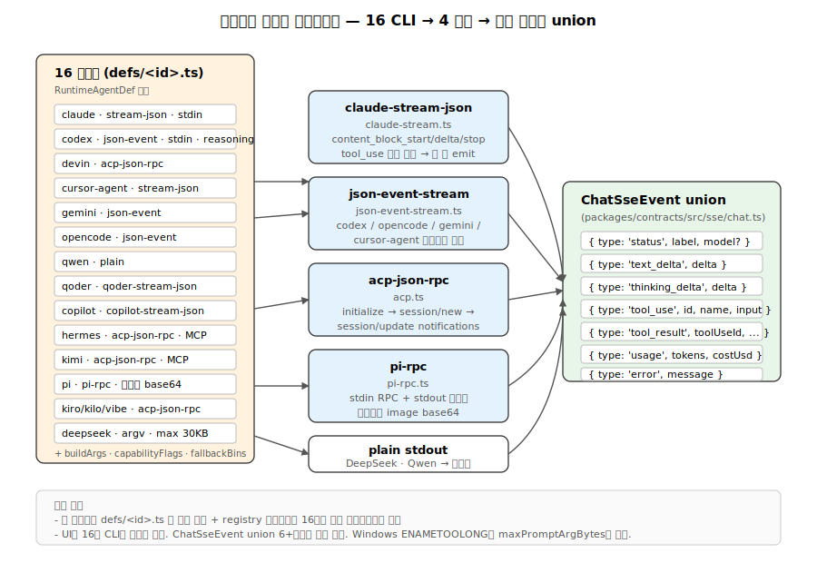

# 07. 에이전트 런타임 — 16 CLI 어댑터와 스트림 정규화

`apps/daemon/src/runtimes/`는 Open Design의 **핵심 추상화** 중 하나입니다. 16개의 서로 다른 코딩 에이전트 CLI(Claude Code, Codex, Cursor, Pi, Copilot, Gemini, …)를 데몬이 단일 인터페이스로 다룰 수 있게 해주고, 그들의 stdout 스트림을 모두 `ChatSseEvent` union으로 정규화합니다.



## 1. 선언형 어댑터 정의

각 에이전트는 `apps/daemon/src/runtimes/defs/<id>.ts` 한 파일로 정의되며, 모두 `RuntimeAgentDef` 타입을 구현합니다 (`apps/daemon/src/runtimes/types.ts:37`).

```typescript
export type RuntimeAgentDef = {
  id: string;                              // 'claude', 'codex'
  name: string;                            // UI 표시명
  bin: string;                             // 실행 파일명
  versionArgs: string[];                   // ['--version']
  fallbackModels: RuntimeModelOption[];    // 모델 탐지 실패 시
  buildArgs: (prompt, imagePaths, extraAllowedDirs?, options?, ctx?) => string[];
  streamFormat: string;                    // 'claude-stream-json', 'acp-json-rpc', …
  fallbackBins?: string[];                 // 대체 바이너리 (예: openclaude)
  helpArgs?: string[];                     // Capability probe용
  capabilityFlags?: Record<string, string>;
  promptViaStdin?: boolean;
  eventParser?: string;                    // 파서 종류
  env?: Record<string, string>;            // 에이전트 전용 env
  listModels?: RuntimeListModels;
  fetchModels?: (bin, env) => Promise<...>;
  reasoningOptions?: RuntimeReasoningOption[];
  supportsImagePaths?: boolean;
  maxPromptArgBytes?: number;              // Windows ENAMETOOLONG 가드
  mcpDiscovery?: string;
  installUrl?: string;
  docsUrl?: string;
};
```

## 2. 16개 어댑터 등록

`apps/daemon/src/runtimes/registry.ts:19`에서 일괄 등록되는 어댑터:

| ID | 파일 | 특징 |
|---|---|---|
| `claude` | `defs/claude.ts` | Claude Code, stdin 프롬프트, claude-stream-json |
| `codex` | `defs/codex.ts` | Codex CLI, 11개 모델 폴백, 6단계 reasoning effort |
| `devin` | `defs/devin.ts` | Devin for Terminal |
| `cursor-agent` | `defs/cursor-agent.ts` | Cursor Agent |
| `gemini` | `defs/gemini.ts` | Gemini CLI |
| `opencode` | `defs/opencode.ts` | OpenCode |
| `qwen` | `defs/qwen.ts` | Qwen Code |
| `qoder` | `defs/qoder.ts` | Qoder CLI |
| `copilot` | `defs/copilot.ts` | GitHub Copilot CLI |
| `hermes` | `defs/hermes.ts` | ACP JSON-RPC |
| `kimi` | `defs/kimi.ts` | ACP JSON-RPC |
| `pi` | `defs/pi.ts` | Pi RPC (멀티모달 이미지 지원) |
| `kiro` | `defs/kiro.ts` | ACP |
| `kilo` | `defs/kilo.ts` | ACP |
| `vibe` | `defs/vibe.ts` | Mistral Vibe ACP |
| `deepseek` | `defs/deepseek.ts` | argv 모드 (maxPromptArgBytes=30,000) |

## 3. 대표 어댑터 상세 — Claude Code

`apps/daemon/src/runtimes/defs/claude.ts:5-70`의 정의 핵심:

```typescript
buildArgs: (_prompt, _imagePaths, extraAllowedDirs = [], options = {}) => {
  const caps = agentCapabilities.get('claude') || {};
  const args = ['-p', '--output-format', 'stream-json', '--verbose'];

  // probe 시점에 감지된 capability에 따라 조건부 플래그
  if (caps.partialMessages) {
    args.push('--include-partial-messages');   // 스트리밍 성능 향상
  }
  if (options.model && options.model !== 'default') {
    args.push('--model', options.model);
  }

  const dirs = (extraAllowedDirs || []).filter((d) => typeof d === 'string' && d.length > 0);
  if (dirs.length > 0 && caps.addDir !== false) {
    args.push('--add-dir', ...dirs);           // 스킬/디자인시스템 경로 확장
  }

  args.push('--permission-mode', 'bypassPermissions');
  return args;
};
```

핵심 포인트:
- **Capability gating** — 구형 빌드(<1.0.86)는 `--include-partial-messages`를 모름. 데몬이 probe 단계에서 `claude -p --help`로 플래그 존재를 캐싱(`agentCapabilities`)하고 buildArgs는 그 값을 참조.
- **`maxPromptArgBytes` 미설정** — stdin 전달이므로 argv 길이 제약 없음.
- **`bypassPermissions`** — 데몬이 이미 `.od/projects/<id>/` cwd로 격리했으므로 Claude 내부 권한 프롬프트를 우회.

## 4. 대표 어댑터 상세 — Codex CLI

`apps/daemon/src/runtimes/defs/codex.ts:40-77`:

```typescript
buildArgs: (_prompt, _imagePaths, extraAllowedDirs = [], options = {}, runtimeContext = {}) => {
  const args = [
    'exec',
    '--json',
    '--skip-git-repo-check',
    '--sandbox', 'workspace-write',
    '-c', 'sandbox_workspace_write.network_access=true',
  ];

  if (process.env.OD_CODEX_DISABLE_PLUGINS === '1') {
    args.push('--disable', 'plugins');
  }
  if (runtimeContext.cwd) {
    args.push('-C', runtimeContext.cwd);
  }
  for (const d of extraAllowedDirs) args.push('--add-dir', d);

  if (options.model && options.model !== 'default') {
    args.push('--model', options.model);
  }
  if (options.reasoning && options.reasoning !== 'default') {
    const effort = clampCodexReasoning(options.model, options.reasoning);
    args.push('-c', `model_reasoning_effort="${effort}"`);
  }
  return args;
};
```

특이점:
- stdin 프롬프트 전달 시 bare `-`를 피한다 (Codex 1.14.x는 `-`를 positional message로 해석해 "Session not found" 오류 발생).
- `clampCodexReasoning` — 모델별 reasoning effort 상한 처리 (gpt-5.1에서 xhigh → high 다운그레이드).

## 5. 바이너리 탐지와 PATH 스캔

`apps/daemon/src/runtimes/executables.ts:9-90`:

```typescript
export function resolveOnPath(bin: string): string | null {
  const exts = process.platform === 'win32'
    ? (process.env.PATHEXT || '.EXE;.CMD;.BAT').split(';')
    : [''];
  const dirs = resolvePathDirs();  // PATH + wellKnownUserToolchainBins
  for (const dir of dirs) {
    for (const ext of exts) {
      const full = path.join(dir, bin + ext);
      if (full && existsSync(full)) return full;
    }
  }
  return null;
}
```

탐지 우선순위:
1. 에이전트별 env 변수 (`CLAUDE_BIN`, `CODEX_BIN`, …) — `AGENT_BIN_ENV_KEYS` 맵 참조
2. `@open-design/platform`의 `wellKnownUserToolchainBins()` — 17+ 디렉토리 (mise, nvm, fnm, asdf, volta, brew, npm prefix, …)
3. `PATH` 환경 변수

`userToolchainDirs()` 결과는 5초 TTL 캐시 (`TOOLCHAIN_DIR_CACHE_TTL_MS`).

### Codex 네이티브 폴백

`apps/daemon/src/runtimes/launch.ts:51-127`. Codex는 Node 래퍼 + Rust 바이너리를 함께 배포. 런처가 npm 패키지 구조에서 직접 네이티브 바이너리를 탐색:

```
node_modules/@openai/codex-{platform}-{arch}/vendor/{target-triple}/codex/codex
```

target-triple 매핑:
- macOS arm64 → `aarch64-apple-darwin`
- Linux x64 → `x86_64-unknown-linux-musl`
- Windows arm64 → `aarch64-pc-windows-msvc`

## 6. Capability 프로브

`apps/daemon/src/runtimes/detection.ts:50-109`:

```typescript
if (def.helpArgs && def.capabilityFlags) {
  const caps: RuntimeCapabilityMap = {};
  const { stdout } = await execAgentFile(resolved, def.helpArgs, {
    env: probeEnv, timeout: 5000, maxBuffer: 4 * 1024 * 1024,
  });
  for (const [flag, key] of Object.entries(def.capabilityFlags)) {
    caps[key] = String(stdout).includes(flag);    // 부분 문자열 매칭
  }
  agentCapabilities.set(def.id, caps);            // 메모리 캐시
}
```

예: Claude Code의 `helpArgs: ['-p', '--help']` → 출력에 `--include-partial-messages` 포함 여부 확인 → `caps.partialMessages = true|false`.

데몬은 추가로 버전 조회(`def.versionArgs`)와 모델 목록 조회(`def.fetchModels` 또는 `def.listModels`)도 수행.

## 7. 스트림 포맷 4종과 정규화

`server.ts`는 chat run 시작 시 `def.streamFormat`을 보고 파서를 선택합니다.

### 7-1. claude-stream-json (`apps/daemon/src/claude-stream.ts`)

JSONL 형식. 어댑터: Claude Code, Cursor Agent.

이벤트:
- `{type: 'system', subtype: 'init', model, session_id}` → `status`
- `{type: 'stream_event', event: {content_block_start|delta|stop}}` → block 단위 누적
  - `content_block_delta` + `input_json_delta` → 도구 입력 JSON 증분 누적
  - `content_block_stop` → 완성된 `tool_use` 한 번 emit

```typescript
// claude-stream.ts:30-150 발췌
if (event.type === 'content_block_delta' && event.delta?.type === 'input_json_delta') {
  const key = blockKey(event.index);
  const block = blocks.get(key);
  if (block?.type === 'tool_use') {
    block.input += event.delta.partial_json ?? '';
  }
}
if (event.type === 'content_block_stop') {
  const block = blocks.get(blockKey(event.index));
  if (block?.type === 'tool_use') {
    onEvent({
      type: 'tool_use',
      id: block.id,
      name: block.name,
      input: JSON.parse(block.input),
    });
    blocks.delete(blockKey(event.index));
  }
}
```

### 7-2. json-event-stream (`apps/daemon/src/json-event-stream.ts`)

JSONL이지만 어댑터별 필드가 다름. Codex / OpenCode / Gemini / Cursor Agent가 각자 변형을 사용.

```typescript
// OpenCode 예 — json-event-stream.ts:85-155
if (obj.type === 'text' && typeof part.text === 'string') {
  onEvent({ type: 'text_delta', delta: part.text });
}
if (obj.type === 'tool_use' && typeof part.tool === 'string') {
  const key = `${obj.sessionID}:${part.callID}`;
  if (!state.openCodeToolUses.has(key)) {
    state.openCodeToolUses.add(key);
    onEvent({
      type: 'tool_use',
      id: part.callID,
      name: part.tool,
      input: safeParseJson(statePart?.input),
    });
  }
}
```

### 7-3. acp-json-rpc (`apps/daemon/src/acp.ts`)

**양방향** JSON-RPC 2.0 over stdio. 어댑터: Hermes, Kimi, Kiro, Kilo, Devin, Vibe.

RPC 시퀀스:
1. 데몬 → 에이전트: `initialize` (protocolVersion: 1, clientCapabilities)
2. 에이전트 → 데몬: initialize 응답
3. 데몬 → 에이전트: `session/new` ({cwd, mcpServers})
4. 에이전트 → 데몬: session 응답 (sessionId, modelId)
5. (옵션) 데몬 → 에이전트: `session/set_model`
6. 데몬 → 에이전트: `session/prompt` ({sessionId, prompt})
7. 에이전트 → 데몬: 다수의 `session/update` notification (text_delta, thinking_delta, tool_use, tool_result)
8. 에이전트 → 데몬: prompt 응답 (usage)
9. 데몬: stdin.end() + 500ms 후 SIGTERM 폴백

```typescript
// acp.ts:398-685 발췌
if (raw.method === 'session/update') {
  const update = asObject(raw.params?.update);
  if (update.sessionUpdate === 'agent_thought_chunk') {
    send('agent', { type: 'thinking_delta', delta: update.content?.text });
  }
  if (update.sessionUpdate === 'agent_message_chunk') {
    send('agent', { type: 'text_delta', delta: update.content?.text });
  }
}
```

### 7-4. pi-rpc (`apps/daemon/src/pi-rpc.ts`)

**단방향** JSON-RPC (daemon→pi) + stdout 이벤트 스트림.

```typescript
// pi-rpc.ts:145-313 발췌
if (raw.type === 'message_update' && raw.assistantMessageEvent) {
  const ev = raw.assistantMessageEvent;
  if (ev.type === 'text_delta') send('agent', { type: 'text_delta', delta: ev.delta });
  if (ev.type === 'thinking_delta') send('agent', { type: 'thinking_delta', delta: ev.delta });
}
if (raw.type === 'tool_execution_start') {
  send('agent', {
    type: 'tool_use',
    id: raw.toolCallId,
    name: raw.toolName,
    input: raw.args,
  });
}
```

### 7-5. 이미지 처리 (Pi)

`pi-rpc.ts:399-450` — 이미지 base64 인코딩 + 업로드 루트 재검증으로 escape 차단:

```typescript
const MAX_IMAGE_COUNT = 10;
const MAX_TOTAL_IMAGE_BYTES = 20 * 1024 * 1024;

for (const imgPath of imagePaths) {
  const realPath = fs.realpathSync(imgPath);   // symlink 해석
  if (uploadRoot) {
    const resolvedRoot = fs.realpathSync(uploadRoot);
    if (!realPath.startsWith(resolvedRoot + path.sep)) continue;   // escape 차단
  }
  const buf = fs.readFileSync(realPath);
  images.push({
    type: 'image',
    data: buf.toString('base64'),
    mimeType: ext === '.png' ? 'image/png' : 'image/jpeg',
  });
}
```

## 8. Child process 생애주기

`server.ts:3777-3821`의 스폰 시퀀스:

```typescript
const stdinMode = def.promptViaStdin || def.streamFormat === 'acp-json-rpc' ? 'pipe' : 'ignore';
child = spawn(invocation.command, invocation.args, {
  env,
  stdio: [stdinMode, 'pipe', 'pipe'],
  cwd: effectiveCwd,
  shell: false,
  windowsVerbatimArguments: invocation.windowsVerbatimArguments,
});

if (def.promptViaStdin && child.stdin && def.streamFormat !== 'pi-rpc') {
  child.stdin.on('error', (err) => { /* EPIPE 무시 */ });
  writePromptToChildStdin = true;
}
```

### 정상 종료 vs 취소

- **stdin 종료**: `child.stdin.end()` 후 자연 종료 대기
- **ACP/Pi 세션**: `session.abort?.()` + 500ms grace → SIGTERM
- **일반 취소**: SIGTERM → 1000ms 후 SIGKILL (최후의 수단)

### Inactivity watchdog

stdout이 15초간 무활동이면 run 강제 종료. `noteAgentActivity()`가 매 이벤트에서 watchdog 리셋.

## 9. Windows argv 가드

DeepSeek는 stdin이 없으므로 argv 길이 제약:

```typescript
// apps/daemon/src/runtimes/defs/deepseek.ts
maxPromptArgBytes: 30_000,   // Windows ~32KB margin
```

`server.ts`가 spawn 전 검증해서 초과 시 SSE 에러 `AGENT_PROMPT_TOO_LARGE` emit + 권장사항 (다른 에이전트 사용).

## 10. MCP 통합

ACP 에이전트(Hermes, Kimi)는 `session/new` 호출에 MCP server 목록을 포함:

```typescript
// apps/daemon/src/acp.ts:71-88
export function buildAcpSessionNewParams(cwd, { mcpServers } = {}) {
  return {
    cwd: path.resolve(cwd),
    mcpServers: servers.map((s) => ({
      type: typeof s?.type === 'string' ? s.type : 'stdio',
      name: typeof s?.name === 'string' ? s.name : '',
      command: typeof s?.command === 'string' ? s.command : '',
      args: Array.isArray(s?.args) ? s.args : [],
      env: Array.isArray(s?.env) ? s.env : [],
    })),
  };
}
```

`mcpDiscovery: 'mature-acp'` 플래그가 있으면 데몬이 `~/.mcp.json`을 자동으로 읽어 전달.

## 11. 새 에이전트 어댑터 추가 체크리스트

1. **어댑터 정의 작성**: `apps/daemon/src/runtimes/defs/<id>.ts`
   - 필수: `id`, `name`, `bin`, `versionArgs`, `fallbackModels`, `buildArgs`, `streamFormat`
   - 옵션: `helpArgs`, `capabilityFlags`, `promptViaStdin`, `listModels`, `env`, `reasoningOptions`, `mcpDiscovery`
2. **레지스트리 등록**: `apps/daemon/src/runtimes/registry.ts`에 import + AGENT_DEFS 배열에 추가
3. **파서**: 기존 streamFormat 재사용이 안 되면 새 파서 파일 작성. 출력은 표준 union (`status`, `text_delta`, `thinking_delta`, `tool_use`, `tool_result`, `usage`, `error`)
4. **Executable 등록**: 에이전트별 env 변수가 필요하면 `AGENT_BIN_ENV_KEYS`에 추가
5. **테스트**: `probe(def)` 호출로 버전/모델/capability 탐지 확인
6. **Windows 가드**: stdin 미지원이면 `maxPromptArgBytes` 설정 (~30KB 권장)

## 12. 통합 시야

```
사용자 요청 → /api/chat
                 │
                 ▼
       getAgentDef(agentId) — registry.ts
                 │
                 ▼
       def.buildArgs(prompt, …) — 어댑터별 플래그 조립
                 │
                 ▼
       child_process.spawn(bin, args, {stdio, cwd, env})
                 │
                 ├─ stdin: prompt (promptViaStdin true 시)
                 │
                 ▼
       child.stdout (어댑터별 포맷)
                 │
                 ▼
       파서 선택 (streamFormat):
         ├─ createClaudeStreamHandler        (claude-stream-json)
         ├─ createJsonEventStreamHandler     (json-event-stream / codex / opencode / gemini)
         ├─ attachAcpSession                 (acp-json-rpc)
         ├─ attachPiRpcSession               (pi-rpc)
         ├─ createCopilotStreamHandler       (copilot-stream-json)
         └─ createQoderStreamHandler         (qoder-stream-json)
                 │
                 ▼  모든 파서가 동일 union 반환:
       { type: 'status'|'text_delta'|'thinking_delta'|'tool_use'|'tool_result'|'usage'|'error' }
                 │
                 ▼
       SSE 'agent' 이벤트로 클라이언트에 전송
```

핵심 가치: **CLI 인터페이스의 이질성을 어댑터 정의 한 파일로 흡수**, 파서 단계에서 **출력의 이질성을 union 한 개로 흡수**. UI는 16개 어댑터의 차이를 알 필요가 없다.
