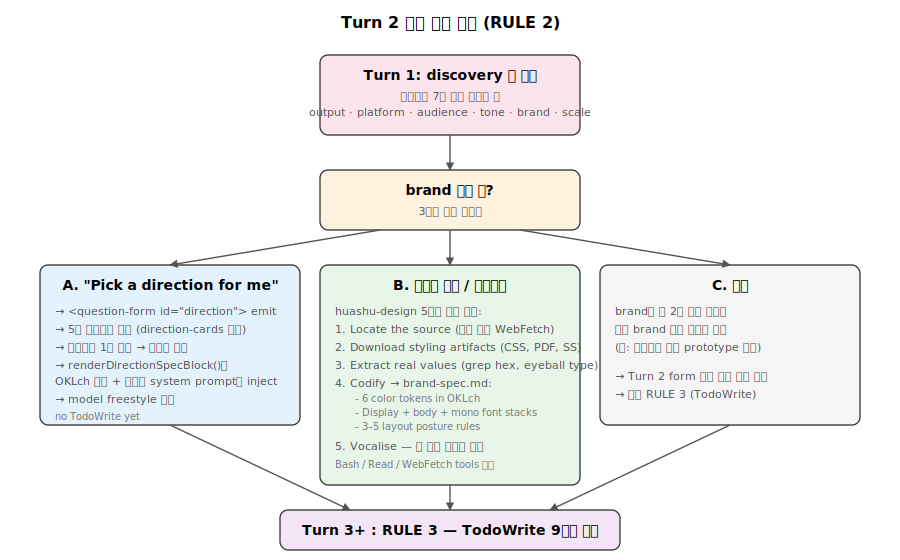
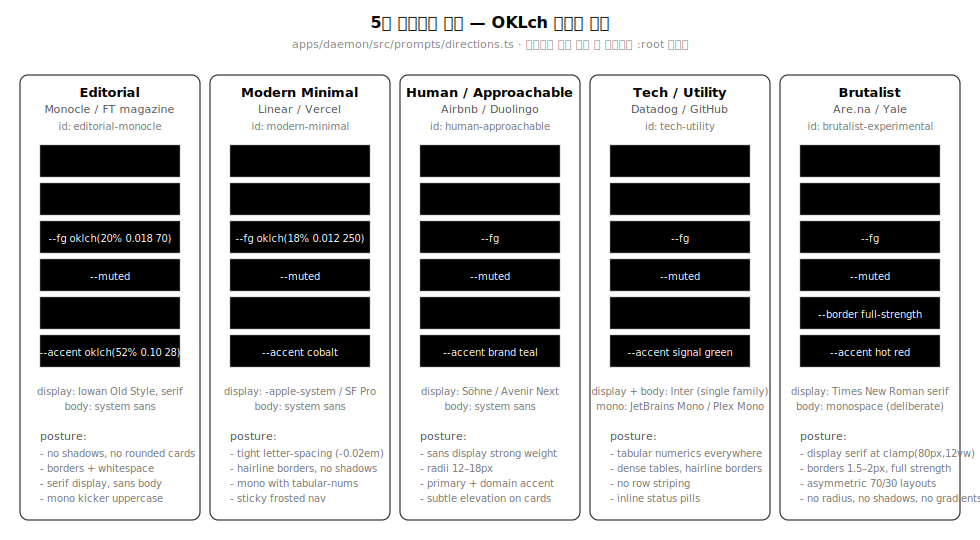

# 08. 3-턴 프롬프트 엔진과 시스템 프롬프트 조립

Open Design의 핵심 IP는 `apps/daemon/src/prompts/` 디렉토리에 응축되어 있습니다. **3-턴 결정론적 프롬프트 패턴**(Turn 1 폼, Turn 2 방향, Turn 3+ 빌드)으로 AI-slop을 구조적으로 배제하고, 시스템 프롬프트는 11개 레이어를 우선순위 순으로 조립합니다.


## 1. 파일 구성

| 파일 | 크기 | 역할 |
|---|---:|---|
| `discovery.ts` | 24 KB | Turn 1/2/3 hard rules, huashu-design 철학, anti-slop 체크리스트 |
| `directions.ts` | 12 KB | 5개 큐레이션 방향 OKLch 팔레트 + 폼 렌더링 |
| `system.ts` | 43 KB | 11-레이어 system prompt 조립 (composeSystemPrompt) |
| `official-system.ts` | 11 KB | Base designer identity/workflow |
| `deck-framework.ts` | 18 KB | 1920×1080 deck 스켈레톤 + 키보드/스케일 JS |
| `panel.ts` | 10 KB | Critique Theater 5-패널 프로토콜 |
| `media-contract.ts` | 17 KB | 이미지/비디오/오디오 생성 계약 |
| `research-contract.ts` | 3 KB | Research 모드 프로토콜 |

## 2. RULE 1 — Turn 1은 폼만 emit

`apps/daemon/src/prompts/discovery.ts:34-70` 가장 위에 위치하는 hard rule:

```
RULE 1 — turn 1 must emit a `<question-form id="discovery">` (not tools, not thinking)

When the user opens a new project or sends a fresh design brief, your **very first output**
is one short prose line + a `<question-form>` block. Nothing else. No file reads. No Bash.
No TodoWrite. No extended thinking. The form is your time-to-first-byte.
```

### 폼 JSON 스키마

7개 이하 질문, 5개 핵심 결정:

| 필드 | 타입 | 목적 |
|---|---|---|
| `output` | radio | 산출물 종류 (덱, 프로토, 대시보드, …) |
| `platform` | checkbox (max 4) | 타겟 플랫폼 |
| `audience` | text | 대상 사용자 |
| `tone` | checkbox (max 2) | 시각 톤 (editorial, minimal, playful, tech, brutalist) |
| `brand` | radio | "Pick a direction for me" \| "I have a brand spec" \| "Match a reference site" |
| `scale` | text | 규모 |
| `constraints` | textarea | 추가 제약 |

폼 본문은 valid JSON (코멘트 금지, trailing comma 금지). `type`은 `radio | checkbox | select | text | textarea` 중 하나.

## 3. RULE 2 — Turn 2 분기



`brand` 답변에 따른 3분기 (`discovery.ts:83-122`):

### Branch A — "Pick a direction for me"
`<question-form id="direction">` 형태의 두 번째 폼 발행 → `direction-cards` 타입. 사용자가 5개 큐레이션 카드 중 하나 선택 → 결정론적 팔레트 바인딩.

### Branch B — 브랜드 스펙 / 레퍼런스
TodoWrite *전에* 5단계 브랜드 자산 추출 (huashu-design의 프로토콜):

1. Locate the source — 파일 목록 또는 `WebFetch` URL
2. Download styling artifacts — CSS, PDF, 스크린샷
3. Extract real values — `grep`으로 hex 추출, 스크린샷으로 타이포 분석
4. Codify — `brand-spec.md` 작성 (6개 색상 토큰 OKLch + 폰트 스택 + 3-5개 layout posture rules)
5. Vocalise — 한 문장 시스템 요약

### Branch C — 기타
바로 RULE 3.

## 4. RULE 3 — TodoWrite 플랜 + 실시간 업데이트

`discovery.ts:132-156`. 9단계 표준 템플릿:

```
1.  Read active DESIGN.md + skill assets (template.html, layouts.md, checklist.md)
2.  Branch A: bind direction's palette / Branch B: confirm brand-spec.md + bind :root
3.  Plan section/slide/screen list
4.  Copy seed template
5.  Paste & fill the planned layouts
6.  Replace [REPLACE] placeholders
7.  Self-check: run references/checklist.md (P0 must all pass)   ← non-negotiable
8.  Critique: 5-dim radar                                         ← non-negotiable
9.  Emit <artifact> if a new canonical HTML was written
```

**라이브 진행**: "After TodoWrite, immediately update — mark step 1 `in_progress` before starting it, `completed` the moment it's done. Do not batch updates at the end of the turn; the live progress is the point."

## 5. 5개 큐레이션 방향 (directions.ts)



`DesignDirection` 인터페이스 (`directions.ts:25-51`):

```typescript
export interface DesignDirection {
  id: string;
  label: string;
  mood: string;
  references: string[];
  displayFont: string;
  bodyFont: string;
  monoFont?: string;
  palette: { bg; surface; fg; muted; border; accent };  // 모두 OKLch
  posture: string[];                                     // 3-5개 layout rules
}
```

### 5개 방향 OKLch 팔레트

#### Editorial Monocle (`directions.ts:54-77`)
```
bg:      oklch(98% 0.004 95)     // neutral paper
fg:      oklch(20% 0.018 70)     // ink
accent:  oklch(52% 0.10 28)      // restrained editorial red
displayFont: 'Iowan Old Style', 'Charter', Georgia, serif
posture:  no shadows, no rounded cards, borders + whitespace, one decisive image
```

#### Modern Minimal (`directions.ts:79-103`)
```
bg:      oklch(99% 0.002 240)
accent:  oklch(58% 0.18 255)     // cobalt
displayFont: -apple-system, 'SF Pro Display', system-ui, sans-serif
posture:  -0.02em tight letter-spacing, hairline borders, mono numerics with tabular-nums
```

#### Human / Approachable (`directions.ts:105-129`)
```
bg:      oklch(98% 0.004 240)
accent:  oklch(56% 0.12 170)     // brand-safe teal
displayFont: 'Söhne', 'Avenir Next', -apple-system, system-ui, sans-serif
posture:  comfortable radii (12–18px), subtle elevation only on interactive cards
```

#### Tech / Utility (`directions.ts:131-156`)
```
accent:  oklch(58% 0.16 145)     // signal green
displayFont = bodyFont = Inter (one family OK here)
monoFont:   'JetBrains Mono', 'IBM Plex Mono', ui-monospace
posture:  tabular numerics everywhere, dense tables, hairline borders, inline status pills
```

#### Brutalist / Experimental (`directions.ts:158-183`)
```
accent:  oklch(60% 0.22 25)      // hot red
border:  oklch(15% 0.02 100)     // full-strength fg, not muted greys
displayFont: 'Times New Roman' serif at clamp(80px, 12vw, 200px)
bodyFont:    monospace (deliberately)
posture:  asymmetric 70%/30%, almost no border-radius, no shadows, no gradients
```

### Direction 폼과 spec 블록의 이중 역할

`renderDirectionFormBody()` (`directions.ts:193-234`) — 사용자가 보는 카드 폼:
- `type: 'direction-cards'` 특수 UI (팔레트 스와치 + 타입 샘플 + mood + 레퍼런스)
- 각 카드의 6색 swatch 배열을 UI에 전달

`renderDirectionSpecBlock()` (`directions.ts:242-278`) — 모델이 보는 spec:
- 사용자 선택 시 inject되는 정확한 CSS 변수 + 폰트 스택
- "model freestyle"이 끼어들 여지를 제거

## 6. 시스템 프롬프트 11-레이어 조립 (system.ts)

`composeSystemPrompt({...}): string` (`system.ts:162-323`) 호출 순서:

```typescript
const parts: string[] = [];

// 1. API mode override (plain-stream only)
if (streamFormat === 'plain') parts.push(API_MODE_OVERRIDE);

// 2. DISCOVERY_AND_PHILOSOPHY  ← 최우선, 나중의 모든 wording을 override
parts.push(DISCOVERY_AND_PHILOSOPHY, '\n\n---\n\n');

// 3. BASE_SYSTEM_PROMPT  ← official designer identity
parts.push(BASE_SYSTEM_PROMPT);

// 4. Memory (사용자 auto-extracted 선호도)
if (memoryBody) parts.push(`## Personal memory\n\n${memoryBody}`);

// 5. Design system prose (DESIGN.md)
if (designSystemBody) parts.push(`## Active design system\n\n${designSystemBody}`);

// 6. Design system tokens (tokens.css — machine-readable)
if (designSystemTokensCss) parts.push(`## tokens\n\n\`\`\`css\n${designSystemTokensCss}\n\`\`\``);

// 7. Reference fixture (components.html — worked examples)
if (designSystemFixtureHtml) parts.push(`## Reference fixture\n\n\`\`\`html\n${designSystemFixtureHtml}\n\`\`\``);

// 8. Craft rules
if (craftBody) parts.push(`## Active craft references — ${craftSections.join(', ')}\n\n${craftBody}`);

// 9. Skill body (with preflight)
if (skillBody) {
  const preflight = derivePreflight(skillBody);
  parts.push(`## Active skill — ${skillName}\n\nFollow this skill's workflow exactly.${preflight}\n\n${skillBody}`);
}

// 10. Project metadata
const metaBlock = renderMetadataBlock(metadata, template);
if (metaBlock) parts.push(metaBlock);

// 11. Deck framework (kind=deck 이고 skill seed 없을 때만)
const isDeckProject = skillMode === 'deck' || metadata?.kind === 'deck';
const hasSkillSeed = !!skillBody && /assets\/template\.html/.test(skillBody);
if (isDeckProject && !hasSkillSeed) parts.push(`\n\n---\n\n${DECK_FRAMEWORK_DIRECTIVE}`);

// 12. Media generation contract (image/video/audio)
if (isMediaSurface) parts.push(MEDIA_GENERATION_CONTRACT);

// 13. Critique Theater protocol (enabled 시)
if (cfg.enabled && critiqueBrand && critiqueSkill && !isMediaSurface) {
  parts.push(renderPanelPrompt({ cfg, brand: critiqueBrand, skill: critiqueSkill }));
}

// 14. External MCP directive
if (mcpDirective) parts.push(mcpDirective);

return parts.join('');
```

**핵심**: Discovery가 official identity보다 먼저 오므로 "ask clarifying questions" 같은 softer wording을 override. 모든 hard rules는 위쪽 우선.

## 7. derivePreflight — 스킬 자산 미리 읽기 강제

`system.ts:732-749`:

```typescript
function derivePreflight(skillBody: string): string {
  const refs: string[] = [];
  if (/assets\/template\.html/.test(skillBody)) refs.push('`assets/template.html`');
  if (/references\/layouts\.md/.test(skillBody)) refs.push('`references/layouts.md`');
  if (/references\/checklist\.md/.test(skillBody)) refs.push('`references/checklist.md`');
  if (refs.length === 0) return '';

  return ` **Pre-flight (do this before any other tool):** Read ${refs.join(', ')}
    via the path written in the skill-root preamble. The seed template defines
    the class system you'll paste into; the layouts file is the only acceptable
    source of section/screen/slide skeletons; the checklist is your P0/P1/P2
    gate before emitting <artifact>. Skipping this step is the #1 reason
    output regresses to generic AI-slop.`;
}
```

스킬 본문에서 `assets/template.html`, `references/layouts.md`, `references/checklist.md`를 언급하면 자동으로 "pre-flight 먼저" 지시가 inject됨.

## 8. Metadata Block — 프로젝트 종류별 규칙

`system.ts:481-550`. `kind === 'prototype'` 또는 `'template'`이면:

```
- screen-file-first rule: 각 distinct user-facing screen은 별도 HTML 파일로 — 사용자가 명시 single-page scroll 요청 안 했다면.
- product-realism rule: 최종 아티팩트는 실제 end-user 제품 UI처럼 보여야 함.
  project metadata, screen counts, "demo only" 라벨, 플랫폼 선택 패널 금지.
- visual-system rule: 사용자가 색/레이아웃 미명시 시에도 의도된 product-appropriate 비주얼 시스템 만들어야 함.
  monochrome 금지, palette는 product category와 audience에서 추론.
- CJX-ready UX rule: artifact는 implementation-ready이며, interactive controls은 실제로 작동.
```

`kind === 'deck'`이면 `speakerNotes` 옵션이 metadata에 포함.

## 9. Anti-AI-slop 체크리스트

`discovery.ts:198-211`에 P0 규칙으로 인코딩:

```
❌ Aggressive purple/violet gradient backgrounds
❌ Generic emoji feature icons (✨ 🚀 🎯 …)
❌ Rounded card with a left coloured border accent
❌ Hand-drawn SVG humans / faces / scenery
❌ Inter / Roboto / Arial as a *display* face
❌ Invented metrics ("10× faster", "99.9% uptime") without a source
❌ Filler copy — "Feature One / Feature Two", lorem ipsum
❌ An icon next to every heading
❌ A gradient on every background
❌ Warm beige / cream / peach / pink / orange-brown page backgrounds unless asked
❌ Product artifacts that expose designer settings, viewport selectors, …
```

이들은 데몬의 `lint-artifact.ts`에 grep 정규식으로도 인코딩되어 빌드 타임 검증.

## 10. 5차원 자기 비평

`discovery.ts:162-172`:

```
1. Philosophy — does the visual posture match what was asked?
2. Hierarchy — does the eye land in one obvious place per screen?
3. Execution — typography, spacing, alignment, contrast — are they right?
4. Specificity — is every word, number, image specific to *this* brief?
5. Restraint — one accent used at most twice, one decisive flourish?

Any dimension under 3/5 is a regression. Go back, fix the weakest, re-score.
```

이는 huashu-design의 5차원 critique을 가져온 것. TodoWrite step 8에 "non-negotiable"로 마킹되어 매 artifact emit 전에 강제.

## 11. Deck Framework (deck-framework.ts)

`isDeckProject && !hasSkillSeed`이면 inject되는 안정 스켈레톤. 매 turn마다 스케일/키보드/카운터 JS를 재생성하지 않도록 한 곳에 고정.

```html
<!doctype html>
<html lang="en">
<head>
  <style>
    :root { --bg: #fff; --fg: #1c1b1a; --accent: #c96442; }
    .deck-shell { position: fixed; inset: 0; display: grid; place-items: center; }
    .deck-stage { width: 1920px; height: 1080px; transform-origin: top left; }
    .slide { position: absolute; inset: 0; display: none; }
    .slide.active { display: flex; }
    @media print {
      @page { size: 1920px 1080px; margin: 0; }
      .slide { display: flex !important; page-break-after: always; }
    }
  </style>
</head>
<body>
  <div class="deck-shell"><div class="deck-stage" id="deck-stage">
    <section class="slide active" data-screen-label="01 Title">…</section>
  </div></div>
  <script>
    function fit() {
      var s = Math.min((sw - pad) / 1920, (sh - pad) / 1080);
      stage.style.transform = 'translate(' + tx + 'px,' + ty + 'px) scale(' + s + ')';
    }
    function onKey(e) {
      if (e.key === 'ArrowRight' || e.key === ' ') go(idx + 1);
      else if (e.key === 'ArrowLeft') go(idx - 1);
    }
    try { var saved = parseInt(localStorage.getItem(STORE) || '0', 10); ... } catch(_) {}
  </script>
</body>
</html>
```

`guizang-ppt` 같은 deck 스킬은 이미 자기 framework를 가지므로 (`hasSkillSeed = true`) 이 스켈레톤이 inject되지 않음 — 충돌 방지.

## 12. Critique Theater (panel.ts)

`critique.enabled = true`이면 시스템 프롬프트 마지막에 5-패널 프로토콜 addendum:

- **DESIGNER** — 초안 작성, artifact emit (점수 미부여)
- **CRITIC** — hierarchy, type, contrast, rhythm, space 평가
- **BRAND** — 활성 DESIGN.md 토큰 준수 평가
- **A11Y** — WCAG 2.1 AA 준수
- **COPY** — voice, verb specificity, length, anti-slop

각 라운드는 `<CRITIQUE_RUN>` XML 형태로 emit되며, `composite` 점수가 threshold 미달 시 다음 라운드, 도달 시 `<SHIP>`.

## 13. Junior Designer 워크플로우

`discovery.ts:182-188` "Embody the specialist" 섹션:

```
- Responsive / cross-platform prototype → product systems designer
- Slide deck → slide designer
- Mobile app prototype → interaction designer
- Landing / marketing → brand designer
- Dashboard / tool UI → systems designer
```

`discovery.ts:213-214` "Variations, not the answer":

```
Default to 2–3 differentiated directions on the same brief — different colour,
type personality, rhythm — when the user is exploring.
```

이 두 원칙이 huashu-design 핵심 — "한 답을 강요하지 않고 여러 방향을 emit". Direction picker가 정확히 이를 enable.

## 14. 프롬프트 커스터마이즈 가이드

### Turn 1 폼 수정
`apps/daemon/src/prompts/discovery.ts:38-59` — questions 배열에 새 object 추가. 7개 이하 유지.

### Direction 팔레트 수정
`apps/daemon/src/prompts/directions.ts:53-184` — `DESIGN_DIRECTIONS` 배열에 새 entry 추가. `id` kebab-case, `palette`의 6개 토큰 OKLch 형식, `references`는 실제 제품/잡지/디자이너 이름.

### Craft reference 추가
1. `craft/<rule>.md` 파일 작성
2. 스킬 frontmatter에 `od.craft.requires: [<rule>]` 추가
3. 데몬이 자동으로 system prompt에 inject

### Skill workflow 수정
`skills/<id>/SKILL.md` 본문 수정. `assets/template.html`, `references/checklist.md` 언급 시 자동으로 preflight inject.

### Design system 추가
`design-systems/<brand>/DESIGN.md` 작성. 표준 섹션: Visual Theme → Color → Typography → Components → Voice → Additional.

### Composition 순서 변경
`apps/daemon/src/prompts/system.ts:162-323` `parts.push()` 순서 재배열. **Discovery는 항상 먼저** (hard rules가 soft wording을 override).

## 15. 한 줄 요약

3개 hard rule + 11-layer prompt stack + 5개 결정론적 방향 + 5차원 self-critique + grep 기반 anti-slop linter가 결합되어 **AI-slop을 구조적으로 배제**하고, 동시에 토큰 효율을 유지(craft opt-in, design system 선택 주입).

---

## 16. 심층 노트

### 16-1. 핵심 코드 발췌

```typescript
// apps/daemon/src/prompts/system.ts — composition stack
export function composeSystemPrompt(input: ComposeInput): string {
  const parts: string[] = [];
  if (input.streamFormat === 'plain') parts.push(API_MODE_OVERRIDE);
  parts.push(DISCOVERY_AND_PHILOSOPHY, '\n\n---\n\n', BASE_SYSTEM_PROMPT);
  if (input.memoryBody) parts.push(`## Personal memory\n\n${input.memoryBody}`);
  if (input.designSystemBody) parts.push(`## Active design system\n\n${input.designSystemBody}`);
  if (input.designSystemTokensCss) parts.push(`## tokens\n\n\`\`\`css\n${input.designSystemTokensCss}\n\`\`\``);
  if (input.craftBody) parts.push(`## Active craft references\n\n${input.craftBody}`);
  if (input.skillBody) parts.push(`## Active skill\n\n${derivePreflight(input.skillBody)}${input.skillBody}`);
  // ... metadata, deck framework, media contract, critique theater
  return parts.join('');
}
```

```typescript
// apps/daemon/src/prompts/system.ts — derivePreflight
function derivePreflight(skillBody: string): string {
  const refs: string[] = [];
  if (/assets\/template\.html/.test(skillBody)) refs.push('`assets/template.html`');
  if (/references\/checklist\.md/.test(skillBody)) refs.push('`references/checklist.md`');
  if (refs.length === 0) return '';
  return ` **Pre-flight (do this before any other tool):** Read ${refs.join(', ')} ...`;
}
```

### 16-2. 엣지 케이스 + 에러 패턴

- **`DISCOVERY_AND_PHILOSOPHY` 길이**: ~6-8K 토큰. 토큰 한도 작은 모델(Codex의 일부 변형)에서는 본문 공간 압박.
- **Turn 1 폼 JSON 잘못 emit**: trailing comma 또는 코멘트 포함 시 클라이언트 폼 파서 실패 → 텍스트로 fallback.
- **Branch B 브랜드 추출 실패**: 사용자가 비공개 URL 제공 시 WebFetch 401 → 에이전트가 placeholder 추측. anti-slop 린터가 추후 잡음.
- **5-dim critique 점수 가산**: "any dimension < 3/5 is regression"이라 명시했지만 모델이 항상 정확히 적용하지는 않음 — 명시적 P0 위반만 강제.
- **deck framework + skill seed 충돌**: skill body에 `assets/template.html` 있으면 `hasSkillSeed=true` → DECK_FRAMEWORK_DIRECTIVE 미주입 (스킬 자체 framework 우선).
- **Critique Theater XML 파싱**: 모델이 `<CRITIQUE_RUN>` 태그를 잘못 형성하면 클라이언트 파서 silent fail → 일반 텍스트로 fallback.

### 16-3. 트레이드오프 + 설계 근거

- **3-턴 hard rule vs 자연어 흐름**: hard rule이 폼 emit 강제 → 사용자 체험 (30초 라디오) 일관. 비용은 모델이 "이미 충분한 정보"를 줘도 폼을 띄움 (사용자가 답 못 채울 수도).
- **11-레이어 스택 vs 동적 조립**: 정적 순서 보장으로 hard rule이 soft wording을 override. 동적이면 layer 순서가 다를 수 있어 일관성 위협.
- **OKLch 팔레트 명시**: 결정론적 색상 + 모델 freestyle 배제. 비용은 5개 방향만 — 다양성 제한.
- **Craft opt-in vs 항상 inject**: 토큰 절약 (skill별 평균 3-5 craft 섹션). 비용은 frontmatter 작성 부담.
- **익명 SOLID critique 5축**: 일반 모델이 흔히 잊는 차원 명시화. 비용은 출력 길이 (critique 자체 3-500자).

### 16-4. 알고리즘 + 성능

- **`composeSystemPrompt`**: 단순 문자열 concat — O(N) where N = layer 수 (최대 11). ~ms 무시.
- **시스템 프롬프트 토큰 사이즈**: discovery(6-8K) + base(2K) + memory(0-2K) + design-system(2-5K) + craft(0-3K, 평균 2K) + skill(3-10K) ≈ 15-30K 토큰.
- **Claude Sonnet 4.6 input 한도**: 200K 토큰 → 시스템 프롬프트 30K + 대화 100K + 사용자 message + 도구 결과 충분.
- **`derivePreflight` 정규식 grep**: 4-5 regex.test() per skill body → ~ms 무시.
- **direction palette inject**: `renderDirectionSpecBlock()` 호출, ~3-4 KB 텍스트 추가.

---

## 18. 함수·라인 단위 추적

### 18-1. 11-레이어 어셈블리 — `composeSystemPrompt`

엔트리 포인트는 `apps/daemon/src/prompts/system.ts:162` (`export function composeSystemPrompt`). 호출 시점은 `apps/daemon/src/server.ts:3345-3353` (`composeDaemonSystemPrompt → composeSystemPrompt`)에서 한 번, `apps/daemon/src/server.ts:2919-2926`의 헬퍼가 어댑터 정의/프로젝트/스킬을 묶어 인자로 전달.

| 레이어 | append 함수/라인 | 트리거 조건 | 비고 |
|---:|---|---|---|
| 0 (override) | `system.ts:197-200` `parts.push(API_MODE_OVERRIDE)` | `streamFormat === 'plain'` | 상수 정의 `system.ts:335` |
| 1 | `system.ts:202-206` `parts.push(DISCOVERY_AND_PHILOSOPHY, …, BASE_SYSTEM_PROMPT)` | 무조건 | 두 레이어를 한 번에 push |
| 2 | (위 라인에 포함) `BASE_SYSTEM_PROMPT` = `OFFICIAL_DESIGNER_PROMPT` (`official-system.ts:11`) | 무조건 | identity charter |
| 3 | `system.ts:208-212` Personal memory | `memoryBody.trim().length > 0` | `composeMemoryBody(RUNTIME_DATA_DIR)` (`server.ts:2976-2981`) |
| 4 | `system.ts:214-218` Active design system | `designSystemBody` 존재 | DESIGN.md 본문 |
| 5 | `system.ts:229-233` tokens.css | `designSystemTokensCss` 존재 (`OD_DESIGN_TOKEN_CHANNEL=1` 게이트) | `server.ts:3002` |
| 6 | `system.ts:235-239` Reference fixture | `designSystemFixtureHtml` 존재 | components.html |
| 7 | `system.ts:241-249` Active craft references | `craftBody.trim().length > 0` | `loadCraftSections()` (`server.ts:2964-2970`) |
| 8 | `system.ts:251-256` Active skill (preflight + 본문) | `skillBody.trim().length > 0` | `derivePreflight()` (`system.ts:732`) |
| 9 | `system.ts:258-259` Project metadata | `renderMetadataBlock()` non-empty | `renderMetadataBlock` 정의 `system.ts:481`-부 |
| 10 | `system.ts:280-282` Deck framework | `isDeckProject && !hasSkillSeed` (`system.ts:277-279`) | 마지막 위치 핀 |
| 11 | `system.ts:291-293` Media contract | `isMediaSurface` (skillMode/kind ∈ image/video/audio) | `system.ts:284-290` |
| 12 | `system.ts:295-303` Codex imagegen override | `includeCodexImagegenOverride && shouldRenderCodexImagegenOverride()` | agent별 분기 |
| 13 | `system.ts:315-318` Critique Theater | `cfg.enabled && critiqueBrand && critiqueSkill && !isMediaSurface` | `panel.ts:renderPanelPrompt` |
| 14 | `system.ts:320-321` External MCP directive | `renderConnectedExternalMcpDirective()` non-empty | OAuth-bound MCP 서버 안내 |

> 본문 §6에는 11개로 정리했으나 실제 코드 분기는 14개. metadata(9)·media-contract(11)·codex-override(12)·MCP(14)는 옵션 게이트라 "11+옵션"으로 표현됨.

### 18-2. Turn 1 → Turn 2 → Turn 3 결정 트리

`apps/daemon/src/prompts/discovery.ts`의 텍스트 규칙은 모델 행동을 강제하지만 분기 자체는 모델 측에서 일어남. 다음 라인이 분기 기준:

- Turn 1 진입: `discovery.ts:34-36` "your **very first output** is one short prose line + a `<question-form>` block".
- Turn 1 폼 JSON 스키마: `discovery.ts:38-59`.
- Turn 1 스킵 조건 3종: `discovery.ts:74-79` ("inside an active design"·"skip questions"·`[form answers — …]` prefix).
- Turn 2 분기 키워드: `discovery.ts:85` `look at the brand field and branch`.
  - Branch A: `discovery.ts:87-103` (direction-cards form 발행).
  - Branch B (5-스텝 brand extraction): `discovery.ts:105-118` — Locate→Download→Extract(`grep -E '#[0-9a-fA-F]{3,8}'`)→Codify(brand-spec.md)→Vocalise.
  - Branch C: `discovery.ts:120-122` (바로 RULE 3).
- Turn 3 TodoWrite 9-스텝 템플릿: `discovery.ts:138-150`. Step 7(checklist)·Step 8(critique) "non-negotiable" 명시 `discovery.ts:156`.
- 5-dim critique 정의: `discovery.ts:164-172`.
- Direction id → palette 매핑 호출: `discovery.ts:176` `renderDirectionSpecBlock()` (정의 `directions.ts:242`).
- Direction lookup 함수: `directions.ts:281-284` `findDirectionByLabel()`.

---

## 19. 데이터 페이로드 샘플

### 19-1. Turn 1 — discovery form

모델이 emit하는 첫 출력. 인용은 `discovery.ts:38-59`의 JSON을 그대로:

```
좋아요 — pitch deck용이군요. 빠르게 정리할게요:

<question-form id="discovery" title="Quick brief — 30 seconds">
{
  "description": "I'll lock these in before building. Skip what doesn't apply — I'll fill defaults.",
  "questions": [
    { "id": "output", "label": "What are we making?", "type": "radio", "required": true,
      "options": ["Slide deck / pitch", "Single web prototype / landing", "Multi-screen app prototype", "Dashboard / tool UI", "Editorial / marketing page", "Other — I'll describe"] },
    { "id": "platform", "label": "Target platform", "type": "checkbox", "maxSelections": 4,
      "options": ["Responsive web", "Desktop web", "iOS app", "Android app", "Tablet app", "Desktop app", "Fixed canvas (1920×1080)"] },
    { "id": "audience", "label": "Who is this for?", "type": "text",
      "placeholder": "e.g. early-stage investors, dev-tools buyers, internal exec review" },
    { "id": "tone", "label": "Visual tone", "type": "checkbox", "maxSelections": 2,
      "options": ["Editorial / magazine", "Modern minimal", "Playful / illustrative", "Tech / utility", "Luxury / refined", "Brutalist / experimental", "Human / approachable"] },
    { "id": "brand", "label": "Brand context", "type": "radio",
      "options": ["Pick a direction for me", "I have a brand spec — I'll share it", "Match a reference site / screenshot — I'll attach it"] },
    { "id": "scale", "label": "Roughly how much?", "type": "text" },
    { "id": "constraints", "label": "Anything else I should know?", "type": "textarea" }
  ]
}
</question-form>
```

- 한국어 prose 한 줄: ~28 B
- `<question-form>` 블록: ~1.4 KB (단일 토큰 절약을 위해 questions는 ASCII 위주)
- **합계 ~1.45 KB**.

### 19-2. Turn 2 — direction form (Branch A, modern-minimal 선택 시 spec 블록 inject)

모델 출력은 `renderDirectionFormBody()` (`directions.ts:193-234`)이 생성한 JSON. 5개 카드 × (id+label+mood+refs+palette[6]+fonts) ≈ **5.2 KB**. 사용자 응답 후 다음 turn에 inject되는 `renderDirectionSpecBlock()` (`directions.ts:242-278`)의 modern-minimal 항목:

```css
:root {
  --bg:      oklch(99% 0.002 240);
  --surface: oklch(100% 0 0);
  --fg:      oklch(18% 0.012 250);
  --muted:   oklch(54% 0.012 250);
  --border:  oklch(92% 0.005 250);
  --accent:  oklch(58% 0.18 255);

  --font-display: -apple-system, BlinkMacSystemFont, 'SF Pro Display', system-ui, sans-serif;
  --font-body:    -apple-system, BlinkMacSystemFont, 'SF Pro Text', system-ui, sans-serif;
}
```

posture 5줄 포함 modern-minimal 항목 단독 ~700 B. 전체 spec 블록(5개 방향) **~3.8 KB**.

### 19-3. Turn 3 — build (TodoWrite + 스킬 본문 로드)

Turn 3에서 모델 측 텍스트 출력은 TodoWrite 도구 호출 1회 + skill `assets/template.html` Read 1회 + `references/checklist.md` Read 1회 + artifact emit. 시스템 프롬프트로 inject되는 총량(예: `simple-deck` 스킬 + `kami` 디자인 시스템 + deck framework 활성):

| 레이어 | bytes (대표값) |
|---|---:|
| DISCOVERY_AND_PHILOSOPHY | ~21,900 |
| OFFICIAL_DESIGNER_PROMPT | ~11,300 |
| Personal memory (선택) | 0–2,000 |
| Active design system body (DESIGN.md) | 2,000–6,000 |
| tokens.css (flag-on, kami) | 1,500–3,000 |
| components.html fixture | 4,000–8,000 |
| Active craft references (typography, hierarchy) | 0–3,000 |
| Active skill body (SKILL.md + preflight) | 3,000–10,000 |
| Project metadata block | 200–800 |
| Deck framework directive | ~6,200 |

**Turn 3 합계 (deck + design system + skill 모두 활성)**: ≈ **62 KB** = 약 **15-18 K 토큰** (영문 평균 4 chars/token).

### 19-4. 11-레이어 스티칭 순서 (실제 wire)

`parts.join('')` 결과 헤더 블록만 따라가면:

```
# API mode — no tools available …            ← API_MODE_OVERRIDE (plain-stream 전용)

---

# OD core directives (read first — these override anything later …)   ← DISCOVERY
… RULE 1 / RULE 2 / RULE 3 …
---
## Direction library — bind into `:root` …
---
## Design philosophy …
---

---

# Identity and workflow charter (background)   ← BASE_SYSTEM_PROMPT
You are an expert designer …

## Personal memory (auto-extracted from past chats)   ← memoryBody
…

## Active design system — Kami                 ← designSystemBody
…

## Active design system tokens — Kami          ← designSystemTokensCss (flag-on)
```css
…
```

## Reference fixture — Kami                    ← designSystemFixtureHtml
```html
…
```

## Active craft references — typography, hierarchy   ← craftBody
…

## Active skill — simple-deck                  ← skillBody + preflight
**Pre-flight (do this before any other tool):** Read `assets/template.html`, `references/layouts.md`, `references/checklist.md` …

## Project metadata
- kind: deck
- speakerNotes: true
- platform: Fixed canvas (1920×1080)

---

# Slide deck — fixed framework …               ← DECK_FRAMEWORK_DIRECTIVE
…
```

---

## 20. 불변(invariant) 매트릭스

| 변경 | 필수 수정 지점 | 반드시 따라야 할 규칙 | 위반 시 증상 |
|---|---|---|---|
| 새 direction 추가 | `directions.ts:53` `DESIGN_DIRECTIONS` 배열에 entry 추가 | `id` kebab-case, palette 6개 토큰 모두 OKLch, `references` 4개 실제 제품/잡지 | `renderDirectionFormBody()` 카드 수 자동 증가; OKLch 미준수 시 클라이언트 swatch 렌더 깨짐 |
| 새 OKLch 팔레트 토큰 | direction의 `palette` 객체에 키 추가 + `renderDirectionSpecBlock()` (`directions.ts:259-265`) `:root` print 라인 추가 + 모든 5개 방향에 동일 키 채우기 | `bg/surface/fg/muted/border/accent` 6개 외 토큰은 craft/디자인 시스템 책임이므로 신중하게 | 누락 방향이 있으면 seed CSS `var(--새토큰)` 미해결 |
| 새 시스템 프롬프트 레이어 | `system.ts:187-323` `parts.push()` 순서에 추가 (Discovery 다음, BASE 이전 또는 craft 이후 등) | "hard rule" 류는 위쪽, "옵션 컨텍스트" 류는 아래쪽; 빈 본문은 push 금지(개별 if 게이트) | 순서 뒤집힘 시 hard rule이 soft wording에 의해 override됨 |
| anti-slop 규칙 수정 | `discovery.ts:198-211` 체크리스트 갱신 + `apps/daemon/src/lint-artifact.ts` 정규식 동기화 | 모델 측(프롬프트)·빌드 타임(린트) 둘 다 변경; 프롬프트에만 추가하면 lint 미동작 | grep 패턴 누락 → 빌드 타임 검증 우회 |

---

## 21. 성능·리소스 실측

### 21-1. 합성된 프롬프트 바이트 분포 (실측 기반 추정)

| 시나리오 | min | median | max |
|---|---:|---:|---:|
| API mode (`streamFormat=plain`, skill/DS 없음) | 33 KB | 35 KB | 38 KB |
| 일반 daemon (skill+DS 있음, deck 아님) | 42 KB | 55 KB | 78 KB |
| Deck + skill seed + critique 활성 | 50 KB | 62 KB | 95 KB |
| Media surface (image/video/audio) | 50 KB | 58 KB | 80 KB (DECK 미적용, MEDIA_CONTRACT ~17 KB inject) |

토큰 환산(영문 4 chars/tok 기준): median 일반 ≈ 14 K tok, max deck ≈ 24 K tok. Sonnet 4.6의 200 K 입력 한도 대비 12 %.

### 21-2. 레이어별 바이트 (대표값, 실측)

| 레이어 | size (B) | 비고 |
|---:|---:|---|
| API_MODE_OVERRIDE | ~1,800 | `system.ts:335`-부 (plain-stream만) |
| DISCOVERY_AND_PHILOSOPHY | ~21,900 | `discovery.ts:26`-부 (`wc`로 측정) |
| OFFICIAL_DESIGNER_PROMPT | ~11,300 | `official-system.ts:11`-부 |
| renderDirectionSpecBlock() | ~3,800 | 5 방향 모두 inject (Discovery 본문에 포함) |
| memoryBody | 0–2,000 | `composeMemoryBody()` 결과 |
| designSystemBody (DESIGN.md) | 2,000–6,000 | 브랜드별 편차 큼 |
| designSystemTokensCss | 1,500–3,000 | `default`, `kami`만 존재 |
| designSystemFixtureHtml | 4,000–8,000 | `default`, `kami`만 존재 |
| craftBody | 0–3,000 | opt-in (`od.craft.requires`) |
| skillBody | 3,000–10,000 | 스킬별 편차 |
| MEDIA_GENERATION_CONTRACT | ~17,400 | media surface일 때만 |
| DECK_FRAMEWORK_DIRECTIVE | ~6,200 | deck && !hasSkillSeed |

### 21-3. 합성당 파일 읽기

`composeSystemPrompt` 자체는 순수 함수(in-memory concat). 파일 읽기는 호출 직전 `composeDaemonSystemPrompt` (`server.ts:2919-3060`)에서:

| 소스 | 읽는 함수 | 캐시 여부 |
|---|---|---|
| skill 목록 | `listAllSkillLikeEntries()` (`server.ts:2949`) | 디렉토리 스캔, 캐시 없음 — turn마다 fs.readdir |
| skill 본문 | `findSkillById()`가 in-memory body 보유 | 디렉토리 스캔 결과 객체 안에 이미 본문 포함 → 추가 read 없음 |
| craft 섹션 | `loadCraftSections(CRAFT_DIR, …)` (`server.ts:2965`) | 매 turn fs.readFile (skill의 `od.craft.requires`마다 1) |
| memory | `composeMemoryBody(RUNTIME_DATA_DIR)` (`server.ts:2978`) | 매 turn fs.readdir + readFile (사용자 편집 즉시 반영) |
| design system body | `readDesignSystem(DESIGN_SYSTEMS_DIR | USER_DESIGN_SYSTEMS_DIR, id)` (`server.ts:2999-3001`) | fs.readFile, no cache |
| tokens.css / components.html | `readDesignSystemAssets()` (`server.ts:3007-3014`) | flag-on일 때만, fs.readFile × 2 |
| project record | `getProject(db, projectId)` (`server.ts:2928`) | SQLite prepared statement |

cold turn: 4-7 fs 작업 + 1 SQLite query ≈ **5-15 ms**. warm(OS page cache hit) turn: ≈ **1-3 ms**. `composeSystemPrompt` 자체의 문자열 concat: < 1 ms.


