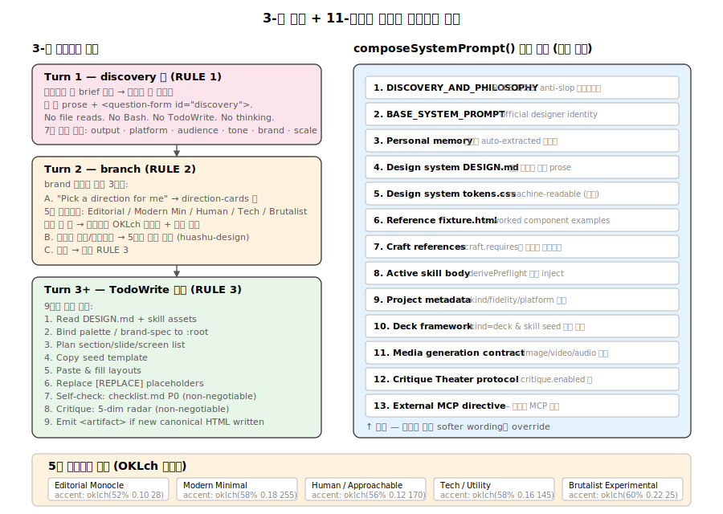

# 08. 3-턴 프롬프트 엔진과 시스템 프롬프트 조립

Open Design의 핵심 IP는 `apps/daemon/src/prompts/` 디렉토리에 응축되어 있습니다. **3-턴 결정론적 프롬프트 패턴**(Turn 1 폼, Turn 2 방향, Turn 3+ 빌드)으로 AI-slop을 구조적으로 배제하고, 시스템 프롬프트는 11개 레이어를 우선순위 순으로 조립합니다.



## 1. 파일 구성

| 파일 | 크기 | 역할 |
|---|---:|---|
| `discovery.ts` | 24 KB | Turn 1/2/3 hard rules, huashu-design 철학, anti-slop 체크리스트 |
| `directions.ts` | 12 KB | 5개 큐레이션 방향 OKLch 팔레트 + 폼 렌더링 |
| `system.ts` | 43 KB | 11-레이어 system prompt 조립 (composeSystemPrompt) |
| `official-system.ts` | 11 KB | Base designer identity/workflow |
| `deck-framework.ts` | 18 KB | 1920×1080 deck 스켈레톤 + 키보드/스케일 JS |
| `panel.ts` | 10 KB | Critique Theater 5-패널 프로토콜 |
| `media-contract.ts` | 17 KB | 이미지/비디오/오디오 생성 계약 |
| `research-contract.ts` | 3 KB | Research 모드 프로토콜 |

## 2. RULE 1 — Turn 1은 폼만 emit

`apps/daemon/src/prompts/discovery.ts:34-70` 가장 위에 위치하는 hard rule:

```
RULE 1 — turn 1 must emit a `<question-form id="discovery">` (not tools, not thinking)

When the user opens a new project or sends a fresh design brief, your **very first output**
is one short prose line + a `<question-form>` block. Nothing else. No file reads. No Bash.
No TodoWrite. No extended thinking. The form is your time-to-first-byte.
```

### 폼 JSON 스키마

7개 이하 질문, 5개 핵심 결정:

| 필드 | 타입 | 목적 |
|---|---|---|
| `output` | radio | 산출물 종류 (덱, 프로토, 대시보드, …) |
| `platform` | checkbox (max 4) | 타겟 플랫폼 |
| `audience` | text | 대상 사용자 |
| `tone` | checkbox (max 2) | 시각 톤 (editorial, minimal, playful, tech, brutalist) |
| `brand` | radio | "Pick a direction for me" \| "I have a brand spec" \| "Match a reference site" |
| `scale` | text | 규모 |
| `constraints` | textarea | 추가 제약 |

폼 본문은 valid JSON (코멘트 금지, trailing comma 금지). `type`은 `radio | checkbox | select | text | textarea` 중 하나.

## 3. RULE 2 — Turn 2 분기

`brand` 답변에 따른 3분기 (`discovery.ts:83-122`):

### Branch A — "Pick a direction for me"
`<question-form id="direction">` 형태의 두 번째 폼 발행 → `direction-cards` 타입. 사용자가 5개 큐레이션 카드 중 하나 선택 → 결정론적 팔레트 바인딩.

### Branch B — 브랜드 스펙 / 레퍼런스
TodoWrite *전에* 5단계 브랜드 자산 추출 (huashu-design의 프로토콜):

1. Locate the source — 파일 목록 또는 `WebFetch` URL
2. Download styling artifacts — CSS, PDF, 스크린샷
3. Extract real values — `grep`으로 hex 추출, 스크린샷으로 타이포 분석
4. Codify — `brand-spec.md` 작성 (6개 색상 토큰 OKLch + 폰트 스택 + 3-5개 layout posture rules)
5. Vocalise — 한 문장 시스템 요약

### Branch C — 기타
바로 RULE 3.

## 4. RULE 3 — TodoWrite 플랜 + 실시간 업데이트

`discovery.ts:132-156`. 9단계 표준 템플릿:

```
1.  Read active DESIGN.md + skill assets (template.html, layouts.md, checklist.md)
2.  Branch A: bind direction's palette / Branch B: confirm brand-spec.md + bind :root
3.  Plan section/slide/screen list
4.  Copy seed template
5.  Paste & fill the planned layouts
6.  Replace [REPLACE] placeholders
7.  Self-check: run references/checklist.md (P0 must all pass)   ← non-negotiable
8.  Critique: 5-dim radar                                         ← non-negotiable
9.  Emit <artifact> if a new canonical HTML was written
```

**라이브 진행**: "After TodoWrite, immediately update — mark step 1 `in_progress` before starting it, `completed` the moment it's done. Do not batch updates at the end of the turn; the live progress is the point."

## 5. 5개 큐레이션 방향 (directions.ts)

`DesignDirection` 인터페이스 (`directions.ts:25-51`):

```typescript
export interface DesignDirection {
  id: string;
  label: string;
  mood: string;
  references: string[];
  displayFont: string;
  bodyFont: string;
  monoFont?: string;
  palette: { bg; surface; fg; muted; border; accent };  // 모두 OKLch
  posture: string[];                                     // 3-5개 layout rules
}
```

### 5개 방향 OKLch 팔레트

#### Editorial Monocle (`directions.ts:54-77`)
```
bg:      oklch(98% 0.004 95)     // neutral paper
fg:      oklch(20% 0.018 70)     // ink
accent:  oklch(52% 0.10 28)      // restrained editorial red
displayFont: 'Iowan Old Style', 'Charter', Georgia, serif
posture:  no shadows, no rounded cards, borders + whitespace, one decisive image
```

#### Modern Minimal (`directions.ts:79-103`)
```
bg:      oklch(99% 0.002 240)
accent:  oklch(58% 0.18 255)     // cobalt
displayFont: -apple-system, 'SF Pro Display', system-ui, sans-serif
posture:  -0.02em tight letter-spacing, hairline borders, mono numerics with tabular-nums
```

#### Human / Approachable (`directions.ts:105-129`)
```
bg:      oklch(98% 0.004 240)
accent:  oklch(56% 0.12 170)     // brand-safe teal
displayFont: 'Söhne', 'Avenir Next', -apple-system, system-ui, sans-serif
posture:  comfortable radii (12–18px), subtle elevation only on interactive cards
```

#### Tech / Utility (`directions.ts:131-156`)
```
accent:  oklch(58% 0.16 145)     // signal green
displayFont = bodyFont = Inter (one family OK here)
monoFont:   'JetBrains Mono', 'IBM Plex Mono', ui-monospace
posture:  tabular numerics everywhere, dense tables, hairline borders, inline status pills
```

#### Brutalist / Experimental (`directions.ts:158-183`)
```
accent:  oklch(60% 0.22 25)      // hot red
border:  oklch(15% 0.02 100)     // full-strength fg, not muted greys
displayFont: 'Times New Roman' serif at clamp(80px, 12vw, 200px)
bodyFont:    monospace (deliberately)
posture:  asymmetric 70%/30%, almost no border-radius, no shadows, no gradients
```

### Direction 폼과 spec 블록의 이중 역할

`renderDirectionFormBody()` (`directions.ts:193-234`) — 사용자가 보는 카드 폼:
- `type: 'direction-cards'` 특수 UI (팔레트 스와치 + 타입 샘플 + mood + 레퍼런스)
- 각 카드의 6색 swatch 배열을 UI에 전달

`renderDirectionSpecBlock()` (`directions.ts:242-278`) — 모델이 보는 spec:
- 사용자 선택 시 inject되는 정확한 CSS 변수 + 폰트 스택
- "model freestyle"이 끼어들 여지를 제거

## 6. 시스템 프롬프트 11-레이어 조립 (system.ts)

`composeSystemPrompt({...}): string` (`system.ts:162-323`) 호출 순서:

```typescript
const parts: string[] = [];

// 1. API mode override (plain-stream only)
if (streamFormat === 'plain') parts.push(API_MODE_OVERRIDE);

// 2. DISCOVERY_AND_PHILOSOPHY  ← 최우선, 나중의 모든 wording을 override
parts.push(DISCOVERY_AND_PHILOSOPHY, '\n\n---\n\n');

// 3. BASE_SYSTEM_PROMPT  ← official designer identity
parts.push(BASE_SYSTEM_PROMPT);

// 4. Memory (사용자 auto-extracted 선호도)
if (memoryBody) parts.push(`## Personal memory\n\n${memoryBody}`);

// 5. Design system prose (DESIGN.md)
if (designSystemBody) parts.push(`## Active design system\n\n${designSystemBody}`);

// 6. Design system tokens (tokens.css — machine-readable)
if (designSystemTokensCss) parts.push(`## tokens\n\n\`\`\`css\n${designSystemTokensCss}\n\`\`\``);

// 7. Reference fixture (components.html — worked examples)
if (designSystemFixtureHtml) parts.push(`## Reference fixture\n\n\`\`\`html\n${designSystemFixtureHtml}\n\`\`\``);

// 8. Craft rules
if (craftBody) parts.push(`## Active craft references — ${craftSections.join(', ')}\n\n${craftBody}`);

// 9. Skill body (with preflight)
if (skillBody) {
  const preflight = derivePreflight(skillBody);
  parts.push(`## Active skill — ${skillName}\n\nFollow this skill's workflow exactly.${preflight}\n\n${skillBody}`);
}

// 10. Project metadata
const metaBlock = renderMetadataBlock(metadata, template);
if (metaBlock) parts.push(metaBlock);

// 11. Deck framework (kind=deck 이고 skill seed 없을 때만)
const isDeckProject = skillMode === 'deck' || metadata?.kind === 'deck';
const hasSkillSeed = !!skillBody && /assets\/template\.html/.test(skillBody);
if (isDeckProject && !hasSkillSeed) parts.push(`\n\n---\n\n${DECK_FRAMEWORK_DIRECTIVE}`);

// 12. Media generation contract (image/video/audio)
if (isMediaSurface) parts.push(MEDIA_GENERATION_CONTRACT);

// 13. Critique Theater protocol (enabled 시)
if (cfg.enabled && critiqueBrand && critiqueSkill && !isMediaSurface) {
  parts.push(renderPanelPrompt({ cfg, brand: critiqueBrand, skill: critiqueSkill }));
}

// 14. External MCP directive
if (mcpDirective) parts.push(mcpDirective);

return parts.join('');
```

**핵심**: Discovery가 official identity보다 먼저 오므로 "ask clarifying questions" 같은 softer wording을 override. 모든 hard rules는 위쪽 우선.

## 7. derivePreflight — 스킬 자산 미리 읽기 강제

`system.ts:732-749`:

```typescript
function derivePreflight(skillBody: string): string {
  const refs: string[] = [];
  if (/assets\/template\.html/.test(skillBody)) refs.push('`assets/template.html`');
  if (/references\/layouts\.md/.test(skillBody)) refs.push('`references/layouts.md`');
  if (/references\/checklist\.md/.test(skillBody)) refs.push('`references/checklist.md`');
  if (refs.length === 0) return '';

  return ` **Pre-flight (do this before any other tool):** Read ${refs.join(', ')}
    via the path written in the skill-root preamble. The seed template defines
    the class system you'll paste into; the layouts file is the only acceptable
    source of section/screen/slide skeletons; the checklist is your P0/P1/P2
    gate before emitting <artifact>. Skipping this step is the #1 reason
    output regresses to generic AI-slop.`;
}
```

스킬 본문에서 `assets/template.html`, `references/layouts.md`, `references/checklist.md`를 언급하면 자동으로 "pre-flight 먼저" 지시가 inject됨.

## 8. Metadata Block — 프로젝트 종류별 규칙

`system.ts:481-550`. `kind === 'prototype'` 또는 `'template'`이면:

```
- screen-file-first rule: 각 distinct user-facing screen은 별도 HTML 파일로 — 사용자가 명시 single-page scroll 요청 안 했다면.
- product-realism rule: 최종 아티팩트는 실제 end-user 제품 UI처럼 보여야 함.
  project metadata, screen counts, "demo only" 라벨, 플랫폼 선택 패널 금지.
- visual-system rule: 사용자가 색/레이아웃 미명시 시에도 의도된 product-appropriate 비주얼 시스템 만들어야 함.
  monochrome 금지, palette는 product category와 audience에서 추론.
- CJX-ready UX rule: artifact는 implementation-ready이며, interactive controls은 실제로 작동.
```

`kind === 'deck'`이면 `speakerNotes` 옵션이 metadata에 포함.

## 9. Anti-AI-slop 체크리스트

`discovery.ts:198-211`에 P0 규칙으로 인코딩:

```
❌ Aggressive purple/violet gradient backgrounds
❌ Generic emoji feature icons (✨ 🚀 🎯 …)
❌ Rounded card with a left coloured border accent
❌ Hand-drawn SVG humans / faces / scenery
❌ Inter / Roboto / Arial as a *display* face
❌ Invented metrics ("10× faster", "99.9% uptime") without a source
❌ Filler copy — "Feature One / Feature Two", lorem ipsum
❌ An icon next to every heading
❌ A gradient on every background
❌ Warm beige / cream / peach / pink / orange-brown page backgrounds unless asked
❌ Product artifacts that expose designer settings, viewport selectors, …
```

이들은 데몬의 `lint-artifact.ts`에 grep 정규식으로도 인코딩되어 빌드 타임 검증.

## 10. 5차원 자기 비평

`discovery.ts:162-172`:

```
1. Philosophy — does the visual posture match what was asked?
2. Hierarchy — does the eye land in one obvious place per screen?
3. Execution — typography, spacing, alignment, contrast — are they right?
4. Specificity — is every word, number, image specific to *this* brief?
5. Restraint — one accent used at most twice, one decisive flourish?

Any dimension under 3/5 is a regression. Go back, fix the weakest, re-score.
```

이는 huashu-design의 5차원 critique을 가져온 것. TodoWrite step 8에 "non-negotiable"로 마킹되어 매 artifact emit 전에 강제.

## 11. Deck Framework (deck-framework.ts)

`isDeckProject && !hasSkillSeed`이면 inject되는 안정 스켈레톤. 매 turn마다 스케일/키보드/카운터 JS를 재생성하지 않도록 한 곳에 고정.

```html
<!doctype html>
<html lang="en">
<head>
  <style>
    :root { --bg: #fff; --fg: #1c1b1a; --accent: #c96442; }
    .deck-shell { position: fixed; inset: 0; display: grid; place-items: center; }
    .deck-stage { width: 1920px; height: 1080px; transform-origin: top left; }
    .slide { position: absolute; inset: 0; display: none; }
    .slide.active { display: flex; }
    @media print {
      @page { size: 1920px 1080px; margin: 0; }
      .slide { display: flex !important; page-break-after: always; }
    }
  </style>
</head>
<body>
  <div class="deck-shell"><div class="deck-stage" id="deck-stage">
    <section class="slide active" data-screen-label="01 Title">…</section>
  </div></div>
  <script>
    function fit() {
      var s = Math.min((sw - pad) / 1920, (sh - pad) / 1080);
      stage.style.transform = 'translate(' + tx + 'px,' + ty + 'px) scale(' + s + ')';
    }
    function onKey(e) {
      if (e.key === 'ArrowRight' || e.key === ' ') go(idx + 1);
      else if (e.key === 'ArrowLeft') go(idx - 1);
    }
    try { var saved = parseInt(localStorage.getItem(STORE) || '0', 10); ... } catch(_) {}
  </script>
</body>
</html>
```

`guizang-ppt` 같은 deck 스킬은 이미 자기 framework를 가지므로 (`hasSkillSeed = true`) 이 스켈레톤이 inject되지 않음 — 충돌 방지.

## 12. Critique Theater (panel.ts)

`critique.enabled = true`이면 시스템 프롬프트 마지막에 5-패널 프로토콜 addendum:

- **DESIGNER** — 초안 작성, artifact emit (점수 미부여)
- **CRITIC** — hierarchy, type, contrast, rhythm, space 평가
- **BRAND** — 활성 DESIGN.md 토큰 준수 평가
- **A11Y** — WCAG 2.1 AA 준수
- **COPY** — voice, verb specificity, length, anti-slop

각 라운드는 `<CRITIQUE_RUN>` XML 형태로 emit되며, `composite` 점수가 threshold 미달 시 다음 라운드, 도달 시 `<SHIP>`.

## 13. Junior Designer 워크플로우

`discovery.ts:182-188` "Embody the specialist" 섹션:

```
- Responsive / cross-platform prototype → product systems designer
- Slide deck → slide designer
- Mobile app prototype → interaction designer
- Landing / marketing → brand designer
- Dashboard / tool UI → systems designer
```

`discovery.ts:213-214` "Variations, not the answer":

```
Default to 2–3 differentiated directions on the same brief — different colour,
type personality, rhythm — when the user is exploring.
```

이 두 원칙이 huashu-design 핵심 — "한 답을 강요하지 않고 여러 방향을 emit". Direction picker가 정확히 이를 enable.

## 14. 프롬프트 커스터마이즈 가이드

### Turn 1 폼 수정
`apps/daemon/src/prompts/discovery.ts:38-59` — questions 배열에 새 object 추가. 7개 이하 유지.

### Direction 팔레트 수정
`apps/daemon/src/prompts/directions.ts:53-184` — `DESIGN_DIRECTIONS` 배열에 새 entry 추가. `id` kebab-case, `palette`의 6개 토큰 OKLch 형식, `references`는 실제 제품/잡지/디자이너 이름.

### Craft reference 추가
1. `craft/<rule>.md` 파일 작성
2. 스킬 frontmatter에 `od.craft.requires: [<rule>]` 추가
3. 데몬이 자동으로 system prompt에 inject

### Skill workflow 수정
`skills/<id>/SKILL.md` 본문 수정. `assets/template.html`, `references/checklist.md` 언급 시 자동으로 preflight inject.

### Design system 추가
`design-systems/<brand>/DESIGN.md` 작성. 표준 섹션: Visual Theme → Color → Typography → Components → Voice → Additional.

### Composition 순서 변경
`apps/daemon/src/prompts/system.ts:162-323` `parts.push()` 순서 재배열. **Discovery는 항상 먼저** (hard rules가 soft wording을 override).

## 15. 한 줄 요약

3개 hard rule + 11-layer prompt stack + 5개 결정론적 방향 + 5차원 self-critique + grep 기반 anti-slop linter가 결합되어 **AI-slop을 구조적으로 배제**하고, 동시에 토큰 효율을 유지(craft opt-in, design system 선택 주입).
