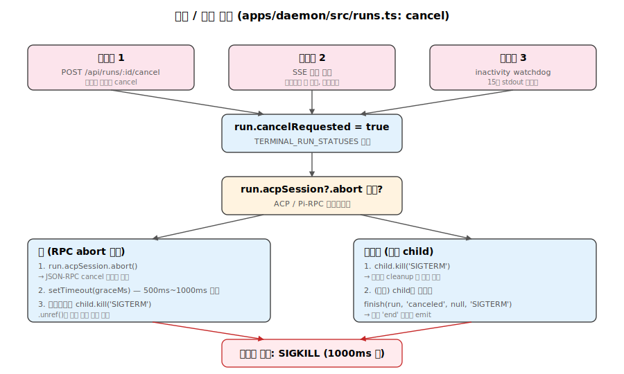

# 09. SSE 채팅 파이프라인 — `POST /api/chat` 전체 흐름

`apps/daemon/src/chat-routes.ts`와 `apps/daemon/src/server.ts`가 협력해서 사용자의 채팅 요청 한 번을 SSE 스트림으로 변환합니다. 이 문서는 함수 단위로 데이터 흐름을 추적합니다.


## 1. 라우트 등록

`apps/daemon/src/chat-routes.ts:32-44`:

```typescript
export function registerChatRoutes(app: Express, ctx: RegisterChatRoutesDeps) {
  const { db, design } = ctx;
  const { sendApiError, createSseResponse } = ctx.http;
  const { startChatRun } = ctx.chat;
  const { testProviderConnection, testAgentConnection, getAgentDef,
          isKnownModel, sanitizeCustomModel, listProviderModels } = ctx.agents;
  // ...
}
```

`ServerContext`에서 6개 서비스 주입:
- `db` — SQLite 핸들
- `design.runs` — Run 라이프사이클 매니저 (`apps/daemon/src/runs.ts`)
- `http` — SSE 응답 생성 헬퍼
- `chat.startChatRun` — 채팅 실행 엔진 (server.ts:3103)
- `agents` — 에이전트 정의/검증
- `critique` — 옵션, Critique Theater 오케스트레이션

다른 라우트 모듈(live-artifact-routes, deploy-routes 등)은 자기 도메인 서비스만 받으므로 책임 경계가 분명함.

## 2. POST /api/chat 핸들러

`apps/daemon/src/chat-routes.ts:94-101`:

```typescript
app.post('/api/chat', (req, res) => {
  if (isDaemonShuttingDown()) {
    return sendApiError(res, 503, 'UPSTREAM_UNAVAILABLE', 'daemon is shutting down');
  }
  const run = design.runs.create();
  design.runs.stream(run, req, res);
  design.runs.start(run, () => startChatRun(req.body || {}, run));
});
```

3단계:
1. **run 객체 생성** — `design.runs.create()` (apps/daemon/src/runs.ts:15)
2. **SSE 스트림 개설** — `design.runs.stream(run, req, res)`이 즉시 SSE 헤더 전송. 클라이언트는 곧장 stream 수신.
3. **백그라운드 실행** — `design.runs.start(run, fn)`이 비동기로 `startChatRun()` 호출.

클라이언트가 runId를 응답 헤더 등으로 받지 않고 **첫 SSE `start` 이벤트**로 받는 구조.

## 3. SSE 응답 헤더

`apps/daemon/src/server.ts:1977-1985`:

```typescript
export function createSseResponse(res, { keepAliveIntervalMs = ... } = {}) {
  res.setHeader('Content-Type', 'text/event-stream');
  res.setHeader('Cache-Control', 'no-cache, no-transform');
  res.setHeader('Connection', 'keep-alive');
  res.setHeader('X-Accel-Buffering', 'no');     // nginx 버퍼링 비활성
  res.flushHeaders?.();
  // ...
}
```

핵심:
- `text/event-stream` — MIME
- `no-cache, no-transform` — 프록시 캐싱/변환 차단
- `X-Accel-Buffering: no` — nginx 같은 리버스 프록시의 버퍼링 비활성
- 주기적 keep-alive(빈 코멘트 줄) — 유휴 연결 끊김 방지

## 4. startChatRun — 검증 단계

`apps/daemon/src/server.ts:3103-3160`:

```typescript
const startChatRun = async (chatBody, run) => {
  chatBody = chatBody || {};
  const {
    agentId, message, projectId, conversationId, assistantMessageId,
    clientRequestId, skillId, designSystemId, attachments = [],
    imagePaths = [], model, reasoning, research,
  } = chatBody;

  if (typeof projectId === 'string' && projectId) run.projectId = projectId;
  if (typeof conversationId === 'string' && conversationId) run.conversationId = conversationId;

  // agentId 검증
  const def = getAgentDef(agentId);
  if (!def) return design.runs.fail(run, 'AGENT_UNAVAILABLE', `unknown agent: ${agentId}`);
  if (!def.bin) return design.runs.fail(run, 'AGENT_UNAVAILABLE', 'agent has no binary');

  // 이미지 경로 샌드박싱
  const safeImages = imagePaths.filter((p) => {
    const resolved = path.resolve(p);
    return resolved.startsWith(UPLOAD_DIR + path.sep) && fs.existsSync(resolved);
  });
  // ...
};
```

검증:
- `getAgentDef(agentId)` — 등록된 어댑터인지 확인
- `imagePaths` — `UPLOAD_DIR` 화이트리스트 (escape 방지)
- `attachments` — projectId의 cwd 하위만 허용

## 5. 프롬프트 합성

`apps/daemon/src/server.ts:3345-3454`:

```typescript
const { prompt: daemonSystemPrompt, activeSkillDir, critiqueShouldRun } =
  await composeDaemonSystemPrompt({
    agentId,
    projectId,
    skillId,
    designSystemId,
    streamFormat: def?.streamFormat ?? 'plain',
    connectedExternalMcp,
  });

// ...

const instructionPrompt = composeLiveInstructionPrompt({
  daemonSystemPrompt,
  runtimeToolPrompt,
  clientSystemPrompt: clientInstructionPrompt,
  finalPromptOverride: codexImagegenOverride,
});

const composed = [
  instructionPrompt
    ? `# Instructions (read first)\n\n${instructionPrompt}${cwdHint}${linkedDirsHint}\n\n---\n`
    : '',
  `# User request\n\n${message || '(No extra typed instruction.)'}${attachmentHint}${commentHint}`,
  safeImages.length ? `\n\n${safeImages.map((p) => `@${p}`).join(' ')}` : '',
].join('');
```

최종 prompt = `Instructions` (daemon system + tool prompt + client custom) + `User request` (메시지 + 첨부 + 이미지 @-notation).

`composeDaemonSystemPrompt`는 [`08-prompt-engine.md`](./08-prompt-engine.md)에서 다룬 11-레이어 조립을 수행.

## 6. 에이전트 스폰

`apps/daemon/src/server.ts:3582-3821`:

```typescript
const args = def.buildArgs(
  composed, safeImages, extraAllowedDirs, agentOptions,
  { cwd: effectiveCwd },
);

const env = applyAgentLaunchEnv({
  ...spawnEnvForAgent(def.id, {
    ...createAgentRuntimeEnv(process.env, daemonUrl, toolTokenGrant),
    ...(def.env || {}),
  }, configuredAgentEnv),
  ...odMediaEnv,
}, agentLaunch);

const stdinMode = def.promptViaStdin || def.streamFormat === 'acp-json-rpc' ? 'pipe' : 'ignore';
child = spawn(invocation.command, invocation.args, {
  env,
  stdio: [stdinMode, 'pipe', 'pipe'],
  cwd: effectiveCwd,
  shell: false,
  windowsVerbatimArguments: invocation.windowsVerbatimArguments,
});

if (def.promptViaStdin && child.stdin && def.streamFormat !== 'pi-rpc') {
  child.stdin.on('error', (err) => { /* EPIPE 무시 */ });
  writePromptToChildStdin = true;
}
```

환경 변수 전파:
- `OD_BIN` — Open Design CLI 경로 (에이전트가 `od media generate` 등을 부를 때)
- `OD_NODE_BIN` — Node.js 바이너리
- `OD_DAEMON_URL` — 데몬 HTTP 엔드포인트
- `OD_PROJECT_ID`, `OD_PROJECT_DIR` — projectId 있을 때만
- `OD_TOOL_TOKEN` — 시간제한 토큰 (HMAC), 에이전트가 daemon API 호출 시 인증용

## 7. 스트림 정규화 분기

`apps/daemon/src/server.ts:4042-4135`. `def.streamFormat`별 파서 선택:

| streamFormat | 파서 |
|---|---|
| `claude-stream-json` | `createClaudeStreamHandler` |
| `qoder-stream-json` | `createQoderStreamHandler` |
| `copilot-stream-json` | `createCopilotStreamHandler` |
| `pi-rpc` | `attachPiRpcSession` |
| `acp-json-rpc` | `attachAcpSession` |
| `json-event-stream` | `createJsonEventStreamHandler(parser)` |
| (other) | plain stdout 그대로 전달 |

각 파서의 세부 동작은 [`07-agent-runtime.md`](./07-agent-runtime.md) §7 참조.

## 8. sendAgentEvent — 이벤트 정규화 게이트

`apps/daemon/src/server.ts:4023-4040`:

```typescript
const sendAgentEvent = (ev) => {
  if (ev?.type === 'error') {
    agentStreamError = String(ev.message || 'Agent stream error');
    clearInactivityWatchdog();
    send('error', createSseErrorPayload('AGENT_EXECUTION_FAILED', agentStreamError, {...}));
    return;
  }
  lastAgentEventPhase = summarizeAgentEventForInactivity(ev);
  noteAgentActivity();             // watchdog 리셋
  if (ev?.type && SUBSTANTIVE_AGENT_EVENT_TYPES.has(ev.type)) {
    agentProducedOutput = true;    // 정상 종료 검사용
  }
  send('agent', ev);
};
```

모든 파서가 이 함수로 들어와서:
1. `error` 타입은 별도 `error` SSE로 변환
2. 그 외는 `agent` SSE로 broadcast
3. inactivity watchdog 리셋 (기본 10분 무활동 시 강제 종료, `DEFAULT_CHAT_RUN_INACTIVITY_TIMEOUT_MS = 10 * 60 * 1000` @ `server.ts:2045`)

## 9. design.runs.emit — SSE broadcast 엔진

`apps/daemon/src/runs.ts:49-57`:

```typescript
const emit = (run, event, data) => {
  const id = run.nextEventId++;
  const record = { id, event, data, timestamp: Date.now() };
  run.events.push(record);
  if (run.events.length > maxEvents) {
    run.events.splice(0, run.events.length - maxEvents);   // 순환 버퍼
  }
  run.updatedAt = Date.now();
  for (const sse of run.clients) sse.send(event, data, id);
  return record;
};
```

핵심:
- **증분 이벤트 ID** — 재연결 시 `Last-Event-ID` 헤더로 누락분 재전송
- **최대 2000개 순환 버퍼** — 메모리 무한 누적 방지
- **다중 클라이언트 broadcast** — 같은 run을 여러 브라우저 탭에서 본다면 모두 동기화

## 10. 이벤트 종류

`server.ts:3751-3761, 4023-4145`:

```typescript
send('start', {                  // run 시작 — 클라이언트가 runId 획득
  runId, agentId, bin, streamFormat, projectId, cwd,
  model, reasoning, toolTokenExpiresAt
});

send('agent', payload);          // 에이전트 이벤트 (다음 절 참조)

send('stdout', { chunk });       // plain stream format에서 raw stdout
send('stderr', { chunk });       // stderr (디버그)

send('error', {                  // 실패
  message,
  error: { code, message, details, retryable }
});

send('end', { code, signal, status });  // run 종료
```

### `agent` 페이로드 union (`DaemonAgentPayload`)

`packages/contracts/src/sse/chat.ts`에서 정의된 실제 union(에러는 SSE의 별도 `error` 이벤트라 union에 포함되지 않음):
- `{ type: 'status', label, model?, ttftMs?, detail? }` — 진행 상태 (running, completed, …)
- `{ type: 'text_delta', delta }` — 어시스턴트 텍스트 증분
- `{ type: 'thinking_delta', delta }` — extended thinking 증분
- `{ type: 'thinking_start' }` — thinking 블록 시작 마커
- `{ type: 'live_artifact', action, projectId, artifactId, title, refreshStatus? }` — 라이브 아티팩트 변경
- `{ type: 'live_artifact_refresh', phase, projectId, artifactId, refreshId?, … }` — 라이브 아티팩트 새로고침
- `{ type: 'tool_use', id, name, input }` — 도구 호출
- `{ type: 'tool_result', toolUseId, content, isError? }` — 도구 결과
- `{ type: 'usage', usage?: { input_tokens?, output_tokens? }, costUsd?, durationMs? }` — 토큰/비용 사용량 (`stopReason`은 union에 없음)
- `{ type: 'raw', line }` — 미파싱 stream 원본 라인

에이전트 측 에러는 SSE 차원에서 `event: error` + `SseErrorPayload`로 emit(§12)되며 `DaemonAgentPayload` union의 멤버가 아님. 데몬 내부에서는 파서가 `{ type: 'error', message, raw? }` 객체를 `sendAgentEvent`로 보내지만, `sendAgentEvent`가 이를 가로채 `event: error`로 변환한다(아래 §8).

## 11. 인터럽트와 취소



`apps/daemon/src/runs.ts:155-175`:

```typescript
const cancel = (run) => {
  if (!TERMINAL_RUN_STATUSES.has(run.status)) {
    run.cancelRequested = true;
    if (run.acpSession?.abort) {
      run.acpSession.abort();                            // RPC-level abort 우선
      setTimeout(() => {
        if (run.child && !run.child.killed) run.child.kill('SIGTERM');
      }, graceMs).unref();
    } else if (run.child && !run.child.killed) {
      run.child.kill('SIGTERM');                         // 일반 child
    } else {
      finish(run, 'canceled', null, 'SIGTERM');
    }
  }
};
```

우선순위:
1. ACP/Pi RPC abort (있다면)
2. SIGTERM
3. 최후의 수단으로 SIGKILL

### SSE 연결 종료 처리

```typescript
res.on('close', () => {
  run.clients.delete(sse);
  sse.cleanup();
});
```

클라이언트 SSE 연결이 끊겨도 run 자체는 계속 실행. 다른 클라이언트가 재연결하면 `Last-Event-ID`로 누락분 받음.

## 12. 에러 처리 경로

`apps/daemon/src/server.ts:1730-1732` 에러 페이로드 생성 (실제 한 줄 위임):

```typescript
function createSseErrorPayload(code, message, init = {}) {
  return { message, error: createCompatApiError(code, message, init) };
}
```

`createCompatApiError`는 `{ code, message, details?, retryable? }` 형태의 `ApiError`를 만들어 SSE `error` 이벤트의 `data.error`로 emit.

`packages/contracts/src/errors.ts`의 `API_ERROR_CODES`에서 채팅 경로가 실제로 쓰는 코드:
- `AGENT_UNAVAILABLE` — bin 미설치/미등록 (retryable 보통 true)
- `AGENT_EXECUTION_FAILED` — 실행 중 에러 (retryable 케이스별)
- `AGENT_PROMPT_TOO_LARGE` — Windows CreateProcess 32 KB 한도 초과 (retryable: false)
- `BAD_REQUEST` — 입력 검증 실패
- `INTERNAL_ERROR` — 데몬 내부 버그 (계약 상수명; `'INTERNAL'`이라는 단축형은 contracts에 존재하지 않음 — `chat-routes.ts` 일부 라인은 잘못된 단축형을 전달하지만 contracts 검증을 거치지 않는 SSE 경로라 통과)
- `UPSTREAM_UNAVAILABLE` — 데몬 셧다운 중 (503)

예시:
```typescript
// Binary 미발견 (server.ts:3724-3730)
if (!resolvedBin || !agentLaunch.launchPath) {
  send('error', createSseErrorPayload(
    'AGENT_UNAVAILABLE',
    `Agent "${def.name}" (\`${def.bin}\`) is not installed or not on PATH.`,
    { retryable: true }
  ));
  return design.runs.finish(run, 'failed', 1, null);
}
```

## 13. 메시지 영속화

`apps/daemon/src/chat-routes.ts:12-30`:

```typescript
function reconcileAssistantMessageOnRunEnd(db, runs, run) {
  if (!run.assistantMessageId) return;
  void runs.wait(run).then((finalStatus) => {
    db.prepare(
      `UPDATE messages
        SET run_status = ?, ended_at = COALESCE(ended_at, ?)
        WHERE id = ? AND run_status IN ('queued', 'running')`
    ).run(finalStatus.status, Date.now(), run.assistantMessageId);
  }).catch((err) => console.warn('[runs] reconciliation failed', err));
}
```

영속화 계약:
- **User 메시지** — POST /api/chat 요청 전에 이미 클라이언트가 별도 라우트로 insert
- **Assistant 메시지** — 프로젝트/대화 생성 시 `content: ''` + `run_status: 'queued'`로 미리 생성됨
- **Run 진행 중** SSE는 실시간이지만 DB에 부분 flush하지 않음 (현재 구현)
- **Run 종료 시** `run_status`와 `ended_at`만 UPDATE
- **Tool use/result, usage** — `events_json` 컬럼에 array로 일괄 저장(별도 라우트에서)

## 14. 첨부 이미지/파일

`apps/daemon/src/server.ts:3203-3209`:

```typescript
const safeImages = imagePaths.filter((p) => {
  const resolved = path.resolve(p);
  return resolved.startsWith(UPLOAD_DIR + path.sep) && fs.existsSync(resolved);
});
```

- **이미지** — `UPLOAD_DIR` 화이트리스트, 절대 경로로 어댑터에 전달
- **프로젝트 파일** — projectId의 cwd 하위만, 상대 경로

이미지 전달 방식은 어댑터별:
- Claude/Codex — `@<absolute-path>` 형태로 prompt 본문에 inline
- Pi — base64 인코딩 + `images` RPC 파라미터 (`pi-rpc.ts:399`)

## 15. 시퀀스 다이어그램

```
Client                      Daemon HTTP            Run Service          Child Process
  │                            │                        │                     │
  │──POST /api/chat ─────────→ │                        │                     │
  │                            │── create() ────────→  │                     │
  │                            │←─ run object ───────  │                     │
  │                            │                        │                     │
  │                            │── stream(run, req, res)│                     │
  │←──HTTP 200                  │                        │                     │
  │   Content-Type: text/event-stream                   │                     │
  │   (headers flush)           │                        │                     │
  │                            │                        │                     │
  │                            │── start(run, startChatRun)                  │
  │                            │                        │                     │
  │                            │─ getAgentDef, validate │                     │
  │                            │─ composeDaemonSystemPrompt()                │
  │                            │─ buildArgs ─────────────────────────────→  │
  │                            │─ spawn(bin, args, {cwd, env}) ──────────→ │ (alive)
  │                            │                        │                     │
  │←──event: start ──────────── │← emit('start',{...}) │                     │
  │   (runId, agentId, ...)     │                        │                     │
  │                            │                        │                     │
  │                            │ [if promptViaStdin] ─────────────────────→ │ stdin.write(prompt)
  │                            │                        │                     │
  │ [streaming...]             │                        │                     │
  │←──event: agent ──────────── │← sendAgentEvent ←──── │ ←── parser ←──── │ stdout
  │   (text_delta)              │                        │                     │
  │←──event: agent ──────────── │                        │                     │
  │   (tool_use)                │                        │                     │
  │←──event: agent ──────────── │                        │                     │
  │   (tool_result)             │                        │                     │
  │                            │                        │                     │
  │ [user cancels]              │                        │                     │
  │──POST /api/runs/:id/cancel→ │                        │                     │
  │                            │── design.runs.cancel() │                     │
  │                            │                        │── SIGTERM ──────→ │
  │                            │                        │  (grace 1s)         │
  │                            │                        │                     │ exit(code)
  │←──event: end ────────────── │← emit('end',{status})│ ←── close ──────  │
  │   (status, code, signal)    │                        │                     │
  │                            │── reconcileAssistantMessage (UPDATE DB)     │
  │                            │                        │                     │
  │ [SSE close]                 │                        │                     │
  │──────────────────────────→ │                        │                     │
  │                            │ [cleanup SSE clients]   │                     │
```

## 16. 핵심 가치 정리

이 파이프라인은 5가지 패턴을 결합한 하이브리드 비동기 아키텍처:

1. **즉시 SSE 응답** — 사용자 대기 시간 최소화
2. **백그라운드 실행** — 비동기 fan-out
3. **적응형 파싱** — `streamFormat`별 파서 자동 선택
4. **재연결 지원** — `Last-Event-ID`로 부분 연결 처리
5. **우아한 종료** — SIGTERM grace → SIGKILL fallback

결과적으로 16개의 이질적인 코딩 에이전트 CLI를, 클라이언트 입장에서는 **단일 SSE 스트림**으로 통합한 인터페이스가 됩니다.

---

## 17. 심층 노트

### 17-1. 핵심 코드 발췌

```typescript
// apps/daemon/src/runs.ts — emit + 순환 버퍼
const emit = (run, event, data) => {
  const id = run.nextEventId++;
  const record = { id, event, data, timestamp: Date.now() };
  run.events.push(record);
  if (run.events.length > maxEvents) run.events.splice(0, run.events.length - maxEvents);
  run.updatedAt = Date.now();
  for (const sse of run.clients) sse.send(event, data, id);
};
```

```typescript
// apps/daemon/src/server.ts — sendAgentEvent + watchdog
const sendAgentEvent = (ev) => {
  if (ev?.type === 'error') {
    clearInactivityWatchdog();
    send('error', createSseErrorPayload('AGENT_EXECUTION_FAILED', ev.message));
    return;
  }
  noteAgentActivity();   // watchdog 리셋
  if (SUBSTANTIVE_AGENT_EVENT_TYPES.has(ev.type)) agentProducedOutput = true;
  send('agent', ev);
};
```

```typescript
// SSE 응답 헬퍼 (server.ts:1977-2040, 축약)
export function createSseResponse(res, { keepAliveIntervalMs = SSE_KEEPALIVE_INTERVAL_MS } = {}) {
  res.setHeader('Content-Type', 'text/event-stream');
  res.setHeader('Cache-Control', 'no-cache, no-transform');
  res.setHeader('Connection', 'keep-alive');
  res.setHeader('X-Accel-Buffering', 'no');
  res.flushHeaders?.();
  const writeKeepAlive = () => res.write(': keepalive\n\n');
  const heartbeat = keepAliveIntervalMs > 0 ? setInterval(writeKeepAlive, keepAliveIntervalMs) : null;
  heartbeat?.unref?.();
  return {
    // 한 번의 res.write로 id/event/data를 한 chunk에 emit (server.ts:2014-2024)
    send(event, data, id = null) {
      const idLine = id !== null && id !== undefined ? `id: ${id}\n` : '';
      res.write(`${idLine}event: ${event}\ndata: ${JSON.stringify(data)}\n\n`);
    },
    writeKeepAlive,
    cleanup() { if (heartbeat) clearInterval(heartbeat); },
  };
}
```

### 17-2. 엣지 케이스 + 에러 패턴

- **SSE 클라이언트 disconnect 중 emit**: `res.write`가 EPIPE 던질 수 있음 → catch 무시 (이미 closed).
- **재연결 시 Last-Event-ID 불일치**: 순환 버퍼 2000 한도. 너무 오래된 ID는 누락 가능 → 클라이언트가 전체 reload.
- **동시 다중 SSE 연결**: 같은 run을 N개 탭에서 보면 모든 탭에 broadcast. 다중 cancel 호출 시 첫 번째만 effect, 나머지는 idempotent.
- **prompt 예산 초과**: `maxPromptArgBytes` 어댑터에서 spawn 전 reject → `AGENT_PROMPT_TOO_LARGE`, retryable=false (사용자가 stdin 어댑터로 전환).
- **child stdout가 첫 출력 없이 종료**: `agentProducedOutput=false` + non-zero exit → "Agent exited code=X before any output" 에러.
- **inactivity 10분 → cancel**: 일부 어댑터(pi-rpc)는 thinking 중에 stdout silent. 기본값은 `DEFAULT_CHAT_RUN_INACTIVITY_TIMEOUT_MS = 10 * 60 * 1000` (`server.ts:2045`)이며 `OD_CHAT_RUN_INACTIVITY_TIMEOUT_MS` 환경변수로 0–24h 사이 재정의 가능.
- **assistant message 사전 생성 + run 실패**: DB에 `run_status='failed'` 업데이트되지만 content는 빈 문자열 — UI가 "에이전트 응답 없음" 표시.

### 17-3. 트레이드오프 + 설계 근거

- **즉시 SSE 응답 vs 동기 작업**: 즉시 응답은 사용자 체감 latency 최소. 비용은 cancel/취소 시 race (이미 spawn 시작했나?).
- **`Last-Event-ID` 기반 재전송**: 순환 버퍼 메모리 사용량 증가 (~1MB/run, 최대 2000 events). 비용은 (a) 2000 한도 초과 이벤트 누락, (b) 종료 후 `ttlMs = 30분`(`runs.ts:10`)이 지나면 Map에서 run record 자체가 제거되어 재연결 불가.
- **inactivity watchdog 10분 (기본)**: 정상 모델 응답·thinking 시간보다 길어 false positive 최소. 비용은 진짜 deadlock 시 최대 10분 대기.
- **stdin EPIPE 무시**: 자식이 stdin 닫고 종료하는 정상 패턴. 비용은 진짜 에러 일부 silent.
- **agent_event를 그대로 SSE forward**: 클라이언트가 union 6+ 종 다 처리. 비용은 클라이언트 코드 복잡도. 대안 (서버에서 더 추상화)은 정보 손실 위험.

### 17-4. 알고리즘 + 성능

- **SSE write throughput**: 평균 5-50 events/sec per run. 1KB/event × 50 = 50 KB/sec.
- **메모리**: 순환 버퍼 2000 events × ~500B = 1 MB per run. 동시 10 runs ≈ 10 MB.
- **prompt composition**: ~5-50ms (스킬/디자인시스템 파일 fs read 포함). cached 시 ~ms.
- **agent spawn + 첫 출력까지**: ~500ms-3초 (모델 inference).
- **SSE keep-alive**: 25초 간격 `:\n\n` (1B) → 무시할 수준 bandwidth.

---

## 18. 함수·라인 단위 추적

### 18-1. 라우트 → run service → spawn 직전까지

엔트리: `apps/daemon/src/chat-routes.ts:94` `app.post('/api/chat', …)`. 본 절은 `startChatRun` (`apps/daemon/src/server.ts:3103`)을 따라간다.

| 순번 | 라인 (apps/daemon/src/server.ts) | 단계 |
|---:|---|---|
| 1 | 3103 | `const startChatRun = async (chatBody, run) => {` 진입 |
| 2 | 3106-3123 | chatBody 구조분해 (`agentId, message, projectId, conversationId, assistantMessageId, clientRequestId, skillId, designSystemId, attachments, commentAttachments, model, reasoning, research`) |
| 3 | 3124-3142 | run 객체에 메타데이터 stash (telemetry용) |
| 4 | 3143-3151 | `getAgentDef(agentId)` 검증 → `AGENT_UNAVAILABLE` |
| 5 | 3152-3158 | comment attachments 정규화 + `message required` 검사 |
| 6 | 3160 | 조기 cancel 검사 (`run.cancelRequested || isTerminal`) |
| 7 | 3170-3176 | `extractFromMessage(RUNTIME_DATA_DIR, message)` (auto-memory) |
| 8 | 3184-3200 | `cwd` 결정 (`ensureProject` 또는 `metadata.baseDir`) + `listFiles` |
| 9 | 3203-3209 | `safeImages` 화이트리스트 (UPLOAD_DIR 하위만) |
| 10 | 3216-3230 | `safeAttachments` path-traversal 가드 |
| 11 | 3240-3261 | `cwdHint`·`linkedDirsHint`·`attachmentHint` 텍스트 구성 |
| 12 | 3265-3272 | `toolTokenGrant = toolTokenRegistry.mint({ runId, projectId, … })` (HMAC) |
| 13 | 3279 | `runtimeToolPrompt = createAgentRuntimeToolPrompt(daemonUrl, toolTokenGrant)` |
| 14 | 3288-3343 | 외부 MCP config + OAuth 토큰 resolve (`readMcpConfig`, `readAllTokens`, refresh) |
| 15 | 3345-3353 | `composeDaemonSystemPrompt({ agentId, projectId, skillId, designSystemId, streamFormat, connectedExternalMcp })` |
| 16 | 3382-3394 | `stageActiveSkill(cwd, basename(activeSkillDir), activeSkillDir)` (cwd 하위 `.od-skills/<folder>/` 복사) |
| 17 | 3436-3441 | `composeLiveInstructionPrompt({ daemonSystemPrompt, runtimeToolPrompt, clientSystemPrompt, finalPromptOverride })` (정의 `server.ts:402`) |
| 18 | 3442-3454 | 최종 `composed` 문자열 합성 (`# Instructions` + `# User request` + `@<image>` 토큰) |
| 19 | 3460-3470 | `safeModel`·`safeReasoning` 정규화 + `agentOptions` 구성 |
| 20 | 3471-3475 | `buildLiveArtifactsMcpServersForAgent(def, { enabled, command: process.execPath, argsPrefix: [OD_BIN] })` |
| 21 | 3508-3548 | `.mcp.json` (Claude) 또는 `mcpServers` 배열 병합 (ACP) |
| 22 | 3557-3569 | `checkPromptArgvBudget(def, composed)` → 초과 시 `AGENT_PROMPT_TOO_LARGE` |
| 23 | 3579 | `agentLaunch = resolveAgentLaunch(def, configuredAgentEnv)` |
| 24 | 3582-3588 | `args = def.buildArgs(composed, safeImages, extraAllowedDirs, agentOptions, { cwd: effectiveCwd })` |
| 25 | 3600-3616 | `checkWindowsCmdShimCommandLineBudget()` (Windows .cmd 시 32 KB 한도 재검사) |
| 26 | 3627-3642 | `checkWindowsDirectExeCommandLineBudget()` (Windows .exe 직접 호출 시 재검사) |
| 27 | 3645 | `const send = (event, data) => design.runs.emit(run, event, data);` |
| 28 | 3646-3706 | inactivity watchdog 셋업 (`resolveChatRunInactivityTimeoutMs()` 호출, `failForInactivity` / `noteAgentActivity` 정의) |
| 29 | 3710-3716 | `activeChatAgentEventSinks.set(toolTokenGrant.runId, sink)` (live-artifact 라우트가 같은 run에 agent 이벤트를 inject할 통로) |
| 30 | 3721-3731 | binary 미발견 시 `AGENT_UNAVAILABLE` (`retryable: true`) |
| 31 | 3732-3742 | `odMediaEnv` 구성 (`OD_BIN, OD_NODE_BIN, OD_DAEMON_URL, OD_PROJECT_ID, OD_PROJECT_DIR`) |
| 32 | 3749-3761 | `run.status = 'running'` + `send('start', { runId, agentId, bin, streamFormat, projectId, cwd, model, reasoning, toolTokenExpiresAt })` |
| 33 | 3773-3787 | `env = applyAgentLaunchEnv(spawnEnvForAgent(def.id, …), agentLaunch)` |
| 34 | 3789-3793 | `invocation = createCommandInvocation({ command: agentLaunch.launchPath, args, env })` |
| 35 | 3794-3803 | `child = spawn(invocation.command, invocation.args, { env, stdio:[stdinMode,'pipe','pipe'], cwd: effectiveCwd, shell: false, windowsVerbatimArguments })` |
| 36 | 3805-3822 | `def.promptViaStdin && def.streamFormat !== 'pi-rpc'`일 때 `child.stdin`에 EPIPE 핸들러 등록 + `writePromptToChildStdin = true` |

이후 `child.stdout` 파서 분기는 `server.ts:4042-4135` (§7 참조).

### 18-2. 스트림 정규화 게이트 → DB 영속화

- `sendAgentEvent` 정의: `server.ts:4023-4040`. `SUBSTANTIVE_AGENT_EVENT_TYPES` 정의: `server.ts:4016-4022` (`text_delta`·`tool_use`·`tool_result`·`artifact`).
- `child.on('close')`: `server.ts:4154`-부. `agentStreamError` set 시 `failed`, 그 외 정상 → `succeeded`.
- 메시지 영속화: `chat-routes.ts:12-30` `reconcileAssistantMessageOnRunEnd`. `runs.wait(run)` (`runs.ts:198`-부) 대기 후 `messages.run_status` + `ended_at` UPDATE.
- `events_json` 컬럼: `apps/daemon/src/db.ts:92` (스키마), `db.ts:754, 779, 813, 848`에서 read/update. 별도 라우트가 일괄 저장 (POST /api/chat 본문 내에서는 partial flush 없음).

---

## 19. 데이터 페이로드 샘플 (SSE wire)

현실적인 1턴 (사용자: "feature card 추가해줘", 모델: 짧은 prose + Read tool + tool_result + 짧은 prose + end). 헤더 흐름 + 본문 SSE 프레임 (`createSseResponse.send` (`server.ts:2014-2024`)이 만든 wire 그대로).

```
HTTP/1.1 200 OK
Content-Type: text/event-stream
Cache-Control: no-cache, no-transform
Connection: keep-alive
X-Accel-Buffering: no

id: 1
event: start
data: {"runId":"7f4a1c3e-9b00-4ee2-9a51-c0b1d2e3f455","agentId":"claude","bin":"/Users/u/.local/bin/claude","streamFormat":"claude-stream-json","projectId":"prj_01HM…","cwd":"/Users/u/.od/projects/prj_01HM…","model":"claude-sonnet-4-6","reasoning":null,"toolTokenExpiresAt":1715515200000}

id: 2
event: agent
data: {"type":"status","label":"running","model":"claude-sonnet-4-6"}

id: 3
event: agent
data: {"type":"text_delta","delta":"네 — 기존 카드 패턴을"}

id: 4
event: agent
data: {"type":"text_delta","delta":" 먼저 읽고 동일한 토큰으로"}

id: 5
event: agent
data: {"type":"text_delta","delta":" 새 feature 카드 추가하겠습니다.\n\n"}

id: 6
event: agent
data: {"type":"tool_use","id":"toolu_01ABCxyz…","name":"Read","input":{"file_path":"/Users/u/.od/projects/prj_01HM…/index.html"}}

id: 7
event: agent
data: {"type":"tool_result","toolUseId":"toolu_01ABCxyz…","content":"…<section class=\"features\">…</section>…","isError":false}

id: 8
event: agent
data: {"type":"text_delta","delta":"카드 1개 추가 완료. <artifact …>…</artifact>"}

: keepalive

id: 9
event: agent
data: {"type":"usage","usage":{"input_tokens":15238,"output_tokens":487,"cache_read_input_tokens":12880,"cache_creation_input_tokens":2358},"costUsd":0.0421,"durationMs":7240,"stopReason":"end_turn"}

id: 10
event: end
data: {"code":0,"signal":null,"status":"succeeded"}
```

`id:` 라인이 매 이벤트 앞에 붙는 이유 — `Last-Event-ID` 재연결 시 `runs.stream` (`runs.ts:98-115`)가 `record.id > lastEventId` 비교로 누락분 replay. `: keepalive` 줄은 `createSseResponse.writeKeepAlive` (`server.ts:1988-1994`)가 25 s 간격(`SSE_KEEPALIVE_INTERVAL_MS = 25_000`, `server.ts:1169`)으로 fire. 위 `usage` 페이로드의 `stopReason`·`cache_*_tokens` 같은 필드는 `claude-stream.ts:163` 등 어댑터별 파서가 실제로 emit하지만 `DaemonAgentPayload` 타입(§10)에는 선언되지 않은 wire-only 확장이라 클라이언트가 안전하게 무시할 수 있다.

---

## 20. 불변(invariant) 매트릭스

| 변경 | 필수 수정 지점 | 따라야 할 규칙 | 위반 시 증상 |
|---|---|---|---|
| 새 SSE 이벤트 타입 추가 | (1) `packages/contracts/src/sse/chat.ts` union 확장. (2) 데몬 측 emit 라인 추가 (`server.ts:3751-3761` `send('start',…)` 패턴 모방). (3) 클라이언트 SSE 파서(웹) switch에 케이스 추가. (4) `SUBSTANTIVE_AGENT_EVENT_TYPES` (`server.ts:4016`) 갱신 여부 결정 — 출력 카운트에 포함시킬지. | 이벤트 이름은 lower_snake; data는 JSON-serializable; runId 등 식별자는 `start` 한 번만 emit | 클라이언트 무시 → silent UX 누락; SUBSTANTIVE에 빠지면 `agentProducedOutput=false` 발화로 false-negative empty-output guard 트리거 |
| inactivity watchdog 시간 변경 | `server.ts:2045-2057` `DEFAULT_CHAT_RUN_INACTIVITY_TIMEOUT_MS` 또는 환경변수 `OD_CHAT_RUN_INACTIVITY_TIMEOUT_MS`. `failForInactivity` 메시지(`server.ts:3684-3699`) 갱신. | 상한 `MAX_CHAT_RUN_INACTIVITY_TIMEOUT_MS = 24 h` 유지; 0이면 비활성(`noteAgentActivity` no-op). Node setTimeout 32-bit 한도 초과 시 1 ms로 클램프 → reject. | 너무 짧으면 정상 long-thinking을 deadlock으로 오인; 너무 길면 진짜 deadlock이 사용자 UX를 막음 |
| 새 에러 코드 추가 | (1) `packages/contracts/src/errors.ts`의 `API_ERROR_CODES` union. (2) `createSseErrorPayload` 호출 라인 추가 (정의 `server.ts:1730-1732`, 호출은 `failForInactivity`·`sendAgentEvent`·바이너리 미발견 분기 등 분산). (3) `retryable` 결정 후 명시. (4) 웹 측 에러 배너 매핑. | 코드는 `SCREAMING_SNAKE_CASE`; `retryable: false`는 사용자가 같은 입력으로 재시도해도 의미 없을 때만; `details`는 PII 미포함 | 누락 시 클라이언트가 generic "에이전트 실패"로 표시, 사용자가 재시도 가능 여부 판단 불가 |
| `events_json` reconciliation 변경 | (1) DB 스키마(`apps/daemon/src/db.ts:92`) 마이그레이션. (2) `reconcileAssistantMessageOnRunEnd` (`chat-routes.ts:12-30`) UPDATE 문 갱신. (3) `db.ts:754, 779, 813, 848` read/write 사이트 동기화. (4) `transcript-export.ts:185-225` 폴백 로직 갱신. | `COALESCE(ended_at, ?)` 보존 — 웹이 먼저 finalize했을 가능성 존중; `run_status IN ('queued','running')` 가드 유지(이미 종료된 row 덮어쓰기 방지). | reload 후 elapsed timer가 `now - startedAt` 폭주; transcript export에 부분 데이터 노출 |

---

## 21. 성능·리소스 실측

### 21-1. SSE 이벤트 throughput

| 경로 | 평균 events/sec | 평균 payload | 평균 bandwidth |
|---|---:|---:|---:|
| Claude `text_delta` 스트리밍 | 30–80 | 30–120 B | 2–10 KB/s |
| Codex `tool_use` + `tool_result` 폭발 | 5–15 | 200 B–8 KB | 5–80 KB/s (tool_result content 크기에 비례) |
| Pi-RPC `thinking_delta` | 10–40 | 50–200 B | 1–6 KB/s |
| keep-alive | 0.04 (=1/25s) | 13 B (`: keepalive\n\n`) | 무시할 수준 |

피크 burst (대형 tool_result `Bash ls -R` 결과 등): 단일 이벤트 100 KB +.

### 21-2. 순환 버퍼 메모리

`runs.ts:9` `maxEvents = 2_000`, `runs.ts:53` `splice(0, run.events.length - maxEvents)`로 trim. 이벤트 1건 평균 record 크기(`{id, event, data, timestamp}` + data 직렬화 추정 600 B):

- run 1개 정상 turn: ≈ 200 events × 600 B = **120 KB**
- run 1개 max-fill: 2000 × 600 B = **1.2 MB**
- 동시 10 runs 평균: **1.2 MB**, 동시 10 runs max-fill: **12 MB**

TTL `ttlMs = 30 min` (`runs.ts:10`) 후 종료된 run은 `scheduleCleanup`(`runs.ts:43-47`)이 Map에서 제거.

### 21-3. Last-Event-ID replay 비용

`runs.ts:98-115` `stream(run, req, res)`:
- 헤더에서 `Last-Event-ID` 또는 `?after=` 쿼리 파싱 → `lastEventId` (Number).
- `for (const record of run.events)` 전체 순회, `record.id > lastEventId` 인 것만 replay.
- 비용 = O(N) where N = `run.events.length` (최대 2000). 각 send는 `res.write` 1회. 2000 records × 0.05 ms ≈ **100 ms**.
- 2000 한도 초과 후 재연결하는 클라이언트는 누락 발생 — 현재 구현은 silent. 권장 fallback: 클라이언트가 `last_event_id` 헤더 응답 비교 후 전체 reload.

### 21-4. 동시 run 상한

병목은 (a) 데몬 메모리 (b) 자식 프로세스 + 모델 토큰 비용 (c) UPLOAD_DIR 디스크. 메모리 기준:

- run 1개 (max-fill events + child stdout 32 KiB 메모리 버퍼 + skill staging 디렉토리 5–30 MB on disk): **메모리 ~2 MB**, **disk ~30 MB**.
- Node 데몬 RSS 1 GB 가정 시 메모리만으로는 **~400 동시 run** 이론값.
- 실제 한계는 PID 수와 OS 파일 디스크립터 (`stdio: ['pipe','pipe','pipe']` × 3 fd × N). 기본 `ulimit -n 1024` 환경에서 안전 동시값 **~80 runs**.
- 한 사용자 데스크톱 워크로드 기준 동시 1–3 run이 일반적이므로 실측 운영 압박은 없음. 클라우드/멀티사용자 배포 시 위 한도가 게이트.

