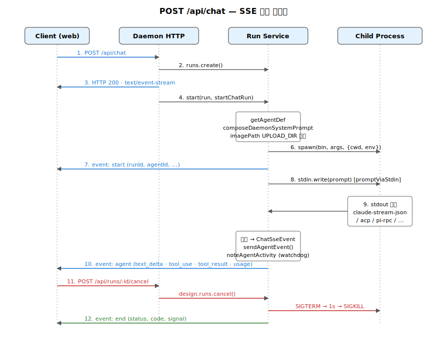

# 09. SSE 채팅 파이프라인 — `POST /api/chat` 전체 흐름

`apps/daemon/src/chat-routes.ts`와 `apps/daemon/src/server.ts`가 협력해서 사용자의 채팅 요청 한 번을 SSE 스트림으로 변환합니다. 이 문서는 함수 단위로 데이터 흐름을 추적합니다.



## 1. 라우트 등록

`apps/daemon/src/chat-routes.ts:32-44`:

```typescript
export function registerChatRoutes(app: Express, ctx: RegisterChatRoutesDeps) {
  const { db, design } = ctx;
  const { sendApiError, createSseResponse } = ctx.http;
  const { startChatRun } = ctx.chat;
  const { testProviderConnection, testAgentConnection, getAgentDef,
          isKnownModel, sanitizeCustomModel, listProviderModels } = ctx.agents;
  // ...
}
```

`ServerContext`에서 6개 서비스 주입:
- `db` — SQLite 핸들
- `design.runs` — Run 라이프사이클 매니저 (`apps/daemon/src/runs.ts`)
- `http` — SSE 응답 생성 헬퍼
- `chat.startChatRun` — 채팅 실행 엔진 (server.ts:3103)
- `agents` — 에이전트 정의/검증
- `critique` — 옵션, Critique Theater 오케스트레이션

다른 라우트 모듈(live-artifact-routes, deploy-routes 등)은 자기 도메인 서비스만 받으므로 책임 경계가 분명함.

## 2. POST /api/chat 핸들러

`apps/daemon/src/chat-routes.ts:94-101`:

```typescript
app.post('/api/chat', (req, res) => {
  if (isDaemonShuttingDown()) {
    return sendApiError(res, 503, 'UPSTREAM_UNAVAILABLE', 'daemon is shutting down');
  }
  const run = design.runs.create();
  design.runs.stream(run, req, res);
  design.runs.start(run, () => startChatRun(req.body || {}, run));
});
```

3단계:
1. **run 객체 생성** — `design.runs.create()` (apps/daemon/src/runs.ts:30)
2. **SSE 스트림 개설** — `design.runs.stream(run, req, res)`이 즉시 SSE 헤더 전송. 클라이언트는 곧장 stream 수신.
3. **백그라운드 실행** — `design.runs.start(run, fn)`이 비동기로 `startChatRun()` 호출.

클라이언트가 runId를 응답 헤더 등으로 받지 않고 **첫 SSE `start` 이벤트**로 받는 구조.

## 3. SSE 응답 헤더

`apps/daemon/src/server.ts:1977-1985`:

```typescript
export function createSseResponse(res, { keepAliveIntervalMs = ... } = {}) {
  res.setHeader('Content-Type', 'text/event-stream');
  res.setHeader('Cache-Control', 'no-cache, no-transform');
  res.setHeader('Connection', 'keep-alive');
  res.setHeader('X-Accel-Buffering', 'no');     // nginx 버퍼링 비활성
  res.flushHeaders?.();
  // ...
}
```

핵심:
- `text/event-stream` — MIME
- `no-cache, no-transform` — 프록시 캐싱/변환 차단
- `X-Accel-Buffering: no` — nginx 같은 리버스 프록시의 버퍼링 비활성
- 주기적 keep-alive(빈 코멘트 줄) — 유휴 연결 끊김 방지

## 4. startChatRun — 검증 단계

`apps/daemon/src/server.ts:3103-3160`:

```typescript
const startChatRun = async (chatBody, run) => {
  chatBody = chatBody || {};
  const {
    agentId, message, projectId, conversationId, assistantMessageId,
    clientRequestId, skillId, designSystemId, attachments = [],
    imagePaths = [], model, reasoning, research,
  } = chatBody;

  if (typeof projectId === 'string' && projectId) run.projectId = projectId;
  if (typeof conversationId === 'string' && conversationId) run.conversationId = conversationId;

  // agentId 검증
  const def = getAgentDef(agentId);
  if (!def) return design.runs.fail(run, 'AGENT_UNAVAILABLE', `unknown agent: ${agentId}`);
  if (!def.bin) return design.runs.fail(run, 'AGENT_UNAVAILABLE', 'agent has no binary');

  // 이미지 경로 샌드박싱
  const safeImages = imagePaths.filter((p) => {
    const resolved = path.resolve(p);
    return resolved.startsWith(UPLOAD_DIR + path.sep) && fs.existsSync(resolved);
  });
  // ...
};
```

검증:
- `getAgentDef(agentId)` — 등록된 어댑터인지 확인
- `imagePaths` — `UPLOAD_DIR` 화이트리스트 (escape 방지)
- `attachments` — projectId의 cwd 하위만 허용

## 5. 프롬프트 합성

`apps/daemon/src/server.ts:3345-3454`:

```typescript
const { prompt: daemonSystemPrompt, activeSkillDir, critiqueShouldRun } =
  await composeDaemonSystemPrompt({
    agentId,
    projectId,
    skillId,
    designSystemId,
    streamFormat: def?.streamFormat ?? 'plain',
    connectedExternalMcp,
  });

// ...

const instructionPrompt = composeLiveInstructionPrompt({
  daemonSystemPrompt,
  runtimeToolPrompt,
  clientSystemPrompt: clientInstructionPrompt,
  finalPromptOverride: codexImagegenOverride,
});

const composed = [
  instructionPrompt
    ? `# Instructions (read first)\n\n${instructionPrompt}${cwdHint}${linkedDirsHint}\n\n---\n`
    : '',
  `# User request\n\n${message || '(No extra typed instruction.)'}${attachmentHint}${commentHint}`,
  safeImages.length ? `\n\n${safeImages.map((p) => `@${p}`).join(' ')}` : '',
].join('');
```

최종 prompt = `Instructions` (daemon system + tool prompt + client custom) + `User request` (메시지 + 첨부 + 이미지 @-notation).

`composeDaemonSystemPrompt`는 [`08-prompt-engine.md`](./08-prompt-engine.md)에서 다룬 11-레이어 조립을 수행.

## 6. 에이전트 스폰

`apps/daemon/src/server.ts:3582-3821`:

```typescript
const args = def.buildArgs(
  composed, safeImages, extraAllowedDirs, agentOptions,
  { cwd: effectiveCwd },
);

const env = applyAgentLaunchEnv({
  ...spawnEnvForAgent(def.id, {
    ...createAgentRuntimeEnv(process.env, daemonUrl, toolTokenGrant),
    ...(def.env || {}),
  }, configuredAgentEnv),
  ...odMediaEnv,
}, agentLaunch);

const stdinMode = def.promptViaStdin || def.streamFormat === 'acp-json-rpc' ? 'pipe' : 'ignore';
child = spawn(invocation.command, invocation.args, {
  env,
  stdio: [stdinMode, 'pipe', 'pipe'],
  cwd: effectiveCwd,
  shell: false,
  windowsVerbatimArguments: invocation.windowsVerbatimArguments,
});

if (def.promptViaStdin && child.stdin && def.streamFormat !== 'pi-rpc') {
  child.stdin.on('error', (err) => { /* EPIPE 무시 */ });
  writePromptToChildStdin = true;
}
```

환경 변수 전파:
- `OD_BIN` — Open Design CLI 경로 (에이전트가 `od media generate` 등을 부를 때)
- `OD_NODE_BIN` — Node.js 바이너리
- `OD_DAEMON_URL` — 데몬 HTTP 엔드포인트
- `OD_PROJECT_ID`, `OD_PROJECT_DIR` — projectId 있을 때만
- `OD_TOOL_TOKEN` — 시간제한 토큰 (HMAC), 에이전트가 daemon API 호출 시 인증용

## 7. 스트림 정규화 분기

`apps/daemon/src/server.ts:4042-4135`. `def.streamFormat`별 파서 선택:

| streamFormat | 파서 |
|---|---|
| `claude-stream-json` | `createClaudeStreamHandler` |
| `qoder-stream-json` | `createQoderStreamHandler` |
| `copilot-stream-json` | `createCopilotStreamHandler` |
| `pi-rpc` | `attachPiRpcSession` |
| `acp-json-rpc` | `attachAcpSession` |
| `json-event-stream` | `createJsonEventStreamHandler(parser)` |
| (other) | plain stdout 그대로 전달 |

각 파서의 세부 동작은 [`07-agent-runtime.md`](./07-agent-runtime.md) §7 참조.

## 8. sendAgentEvent — 이벤트 정규화 게이트

`apps/daemon/src/server.ts:4023-4040`:

```typescript
const sendAgentEvent = (ev) => {
  if (ev?.type === 'error') {
    agentStreamError = String(ev.message || 'Agent stream error');
    clearInactivityWatchdog();
    send('error', createSseErrorPayload('AGENT_EXECUTION_FAILED', agentStreamError, {...}));
    return;
  }
  lastAgentEventPhase = summarizeAgentEventForInactivity(ev);
  noteAgentActivity();             // watchdog 리셋
  if (ev?.type && SUBSTANTIVE_AGENT_EVENT_TYPES.has(ev.type)) {
    agentProducedOutput = true;    // 정상 종료 검사용
  }
  send('agent', ev);
};
```

모든 파서가 이 함수로 들어와서:
1. `error` 타입은 별도 `error` SSE로 변환
2. 그 외는 `agent` SSE로 broadcast
3. inactivity watchdog 리셋 (15초 무활동 시 강제 종료)

## 9. design.runs.emit — SSE broadcast 엔진

`apps/daemon/src/runs.ts:49-57`:

```typescript
const emit = (run, event, data) => {
  const id = run.nextEventId++;
  const record = { id, event, data, timestamp: Date.now() };
  run.events.push(record);
  if (run.events.length > maxEvents) {
    run.events.splice(0, run.events.length - maxEvents);   // 순환 버퍼
  }
  run.updatedAt = Date.now();
  for (const sse of run.clients) sse.send(event, data, id);
  return record;
};
```

핵심:
- **증분 이벤트 ID** — 재연결 시 `Last-Event-ID` 헤더로 누락분 재전송
- **최대 2000개 순환 버퍼** — 메모리 무한 누적 방지
- **다중 클라이언트 broadcast** — 같은 run을 여러 브라우저 탭에서 본다면 모두 동기화

## 10. 이벤트 종류

`server.ts:3751-3761, 4023-4145`:

```typescript
send('start', {                  // run 시작 — 클라이언트가 runId 획득
  runId, agentId, bin, streamFormat, projectId, cwd,
  model, reasoning, toolTokenExpiresAt
});

send('agent', payload);          // 에이전트 이벤트 (다음 절 참조)

send('stdout', { chunk });       // plain stream format에서 raw stdout
send('stderr', { chunk });       // stderr (디버그)

send('error', {                  // 실패
  message,
  error: { code, message, details, retryable }
});

send('end', { code, signal, status });  // run 종료
```

### `agent` 페이로드 union (`DaemonAgentPayload`)

`packages/contracts/src/sse/chat.ts`에서 정의된 6+개 케이스:
- `{ type: 'text_delta', delta }` — 어시스턴트 텍스트 증분
- `{ type: 'thinking_delta', delta }` — extended thinking 증분
- `{ type: 'tool_use', id, name, input }` — 도구 호출
- `{ type: 'tool_result', toolUseId, content, isError }` — 도구 결과
- `{ type: 'status', label, [model] }` — 진행 상태 (running, completed, …)
- `{ type: 'usage', usage, costUsd, durationMs, stopReason }` — 토큰/비용 사용량
- `{ type: 'error', message, raw? }` — 에이전트 측 에러

## 11. 인터럽트와 취소

`apps/daemon/src/runs.ts:155-175`:

```typescript
const cancel = (run) => {
  if (!TERMINAL_RUN_STATUSES.has(run.status)) {
    run.cancelRequested = true;
    if (run.acpSession?.abort) {
      run.acpSession.abort();                            // RPC-level abort 우선
      setTimeout(() => {
        if (run.child && !run.child.killed) run.child.kill('SIGTERM');
      }, graceMs).unref();
    } else if (run.child && !run.child.killed) {
      run.child.kill('SIGTERM');                         // 일반 child
    } else {
      finish(run, 'canceled', null, 'SIGTERM');
    }
  }
};
```

우선순위:
1. ACP/Pi RPC abort (있다면)
2. SIGTERM
3. 최후의 수단으로 SIGKILL

### SSE 연결 종료 처리

```typescript
res.on('close', () => {
  run.clients.delete(sse);
  sse.cleanup();
});
```

클라이언트 SSE 연결이 끊겨도 run 자체는 계속 실행. 다른 클라이언트가 재연결하면 `Last-Event-ID`로 누락분 받음.

## 12. 에러 처리 경로

`apps/daemon/src/server.ts:2390-2406` 에러 페이로드 생성:

```typescript
function createSseErrorPayload(code, message, init = {}) {
  return {
    message,
    error: {
      code,
      message,
      ...(init.details === undefined ? {} : { details: init.details }),
      ...(init.retryable === undefined ? {} : { retryable: init.retryable }),
    },
  };
}
```

`packages/contracts/src/errors.ts`의 코드들:
- `AGENT_UNAVAILABLE` — bin 미설치 또는 미등록 (retryable 보통 true)
- `AGENT_EXECUTION_FAILED` — 실행 중 에러
- `AGENT_PROMPT_TOO_LARGE` — Windows ENAMETOOLONG (retryable: false)
- `BAD_REQUEST` — 입력 검증 실패
- `INTERNAL` — 데몬 내부 버그
- `UPSTREAM_UNAVAILABLE` — 데몬 셧다운 중

예시:
```typescript
// Binary 미발견 (server.ts:3724-3730)
if (!resolvedBin || !agentLaunch.launchPath) {
  send('error', createSseErrorPayload(
    'AGENT_UNAVAILABLE',
    `Agent "${def.name}" (\`${def.bin}\`) is not installed or not on PATH.`,
    { retryable: true }
  ));
  return design.runs.finish(run, 'failed', 1, null);
}
```

## 13. 메시지 영속화

`apps/daemon/src/chat-routes.ts:12-30`:

```typescript
function reconcileAssistantMessageOnRunEnd(db, runs, run) {
  if (!run.assistantMessageId) return;
  void runs.wait(run).then((finalStatus) => {
    db.prepare(
      `UPDATE messages
        SET run_status = ?, ended_at = COALESCE(ended_at, ?)
        WHERE id = ? AND run_status IN ('queued', 'running')`
    ).run(finalStatus.status, Date.now(), run.assistantMessageId);
  }).catch((err) => console.warn('[runs] reconciliation failed', err));
}
```

영속화 계약:
- **User 메시지** — POST /api/chat 요청 전에 이미 클라이언트가 별도 라우트로 insert
- **Assistant 메시지** — 프로젝트/대화 생성 시 `content: ''` + `run_status: 'queued'`로 미리 생성됨
- **Run 진행 중** SSE는 실시간이지만 DB에 부분 flush하지 않음 (현재 구현)
- **Run 종료 시** `run_status`와 `ended_at`만 UPDATE
- **Tool use/result, usage** — `events_json` 컬럼에 array로 일괄 저장(별도 라우트에서)

## 14. 첨부 이미지/파일

`apps/daemon/src/server.ts:3203-3209`:

```typescript
const safeImages = imagePaths.filter((p) => {
  const resolved = path.resolve(p);
  return resolved.startsWith(UPLOAD_DIR + path.sep) && fs.existsSync(resolved);
});
```

- **이미지** — `UPLOAD_DIR` 화이트리스트, 절대 경로로 어댑터에 전달
- **프로젝트 파일** — projectId의 cwd 하위만, 상대 경로

이미지 전달 방식은 어댑터별:
- Claude/Codex — `@<absolute-path>` 형태로 prompt 본문에 inline
- Pi — base64 인코딩 + `images` RPC 파라미터 (`pi-rpc.ts:399`)

## 15. 시퀀스 다이어그램

```
Client                      Daemon HTTP            Run Service          Child Process
  │                            │                        │                     │
  │──POST /api/chat ─────────→ │                        │                     │
  │                            │── create() ────────→  │                     │
  │                            │←─ run object ───────  │                     │
  │                            │                        │                     │
  │                            │── stream(run, req, res)│                     │
  │←──HTTP 200                  │                        │                     │
  │   Content-Type: text/event-stream                   │                     │
  │   (headers flush)           │                        │                     │
  │                            │                        │                     │
  │                            │── start(run, startChatRun)                  │
  │                            │                        │                     │
  │                            │─ getAgentDef, validate │                     │
  │                            │─ composeDaemonSystemPrompt()                │
  │                            │─ buildArgs ─────────────────────────────→  │
  │                            │─ spawn(bin, args, {cwd, env}) ──────────→ │ (alive)
  │                            │                        │                     │
  │←──event: start ──────────── │← emit('start',{...}) │                     │
  │   (runId, agentId, ...)     │                        │                     │
  │                            │                        │                     │
  │                            │ [if promptViaStdin] ─────────────────────→ │ stdin.write(prompt)
  │                            │                        │                     │
  │ [streaming...]             │                        │                     │
  │←──event: agent ──────────── │← sendAgentEvent ←──── │ ←── parser ←──── │ stdout
  │   (text_delta)              │                        │                     │
  │←──event: agent ──────────── │                        │                     │
  │   (tool_use)                │                        │                     │
  │←──event: agent ──────────── │                        │                     │
  │   (tool_result)             │                        │                     │
  │                            │                        │                     │
  │ [user cancels]              │                        │                     │
  │──POST /api/runs/:id/cancel→ │                        │                     │
  │                            │── design.runs.cancel() │                     │
  │                            │                        │── SIGTERM ──────→ │
  │                            │                        │  (grace 1s)         │
  │                            │                        │                     │ exit(code)
  │←──event: end ────────────── │← emit('end',{status})│ ←── close ──────  │
  │   (status, code, signal)    │                        │                     │
  │                            │── reconcileAssistantMessage (UPDATE DB)     │
  │                            │                        │                     │
  │ [SSE close]                 │                        │                     │
  │──────────────────────────→ │                        │                     │
  │                            │ [cleanup SSE clients]   │                     │
```

## 16. 핵심 가치 정리

이 파이프라인은 5가지 패턴을 결합한 하이브리드 비동기 아키텍처:

1. **즉시 SSE 응답** — 사용자 대기 시간 최소화
2. **백그라운드 실행** — 비동기 fan-out
3. **적응형 파싱** — `streamFormat`별 파서 자동 선택
4. **재연결 지원** — `Last-Event-ID`로 부분 연결 처리
5. **우아한 종료** — SIGTERM grace → SIGKILL fallback

결과적으로 16개의 이질적인 코딩 에이전트 CLI를, 클라이언트 입장에서는 **단일 SSE 스트림**으로 통합한 인터페이스가 됩니다.
