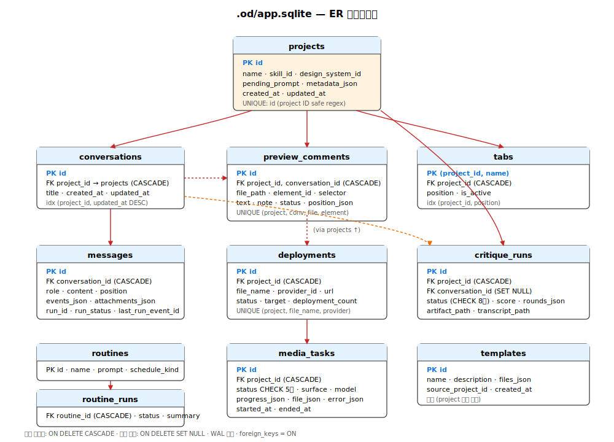

# 10. 영속성 레이어 — SQLite + `.od/` 디렉토리

데몬의 영속성은 **두 축**으로 나뉩니다.

- **`apps/daemon/src/db.ts`** (~1,300 라인) — 메타데이터/관계 데이터를 담는 SQLite (`app.sqlite`, WAL 모드, 12+ 테이블).
- **`.od/` 디렉토리 트리** — 실제 아티팩트, 대화 로그, 메모리, MCP 설정, BYOK 자격증명 파일.



이 분리는 **GC 안전성**(SQLite 백업으로 대용량 HTML 아티팩트가 누락되지 않게)과 **git 친화성**(GitHub 연결 프로젝트는 `metadata.baseDir`로 사용자 폴더에 직접 작업)을 동시에 보장합니다.

## 1. SQLite 연결과 Pragma

`apps/daemon/src/db.ts:29-42`:

```typescript
export function openDatabase(projectRoot, { dataDir } = {}) {
  const dir = dataDir ? path.resolve(dataDir) : path.join(projectRoot, '.od');
  const file = path.join(dir, 'app.sqlite');
  if (dbInstance && dbFile === file) return dbInstance;
  if (dbInstance) closeDatabase();
  fs.mkdirSync(dir, { recursive: true });
  const db = new Database(file);
  db.pragma('journal_mode = WAL');     // Write-Ahead Logging
  db.pragma('foreign_keys = ON');      // FK 제약 활성
  migrate(db);
  dbInstance = db;
  dbFile = file;
  return db;
}
```

주요 결정:
- **WAL 모드** — 읽기 중 쓰기 가능. WAL 모드에서 `synchronous`는 자동으로 NORMAL로 조정되어 안전성/속도 균형.
- **`foreign_keys = ON`** — `ON DELETE CASCADE` 정상 동작 보장.
- **싱글턴 인스턴스** — 같은 파일 재오픈 방지.
- **`synchronous`, `cache_size`, `mmap_size` 미설정** — SQLite 기본값 사용.

## 2. 누적식 마이그레이션 시스템

`apps/daemon/src/db.ts:51-260`의 `migrate(db)`:

```typescript
function migrate(db) {
  db.exec(`
    CREATE TABLE IF NOT EXISTS projects (...);
    CREATE TABLE IF NOT EXISTS conversations (...);
    CREATE TABLE IF NOT EXISTS messages (...);
    -- 모든 베이스 테이블 IF NOT EXISTS로
  `);

  // 신규 컬럼은 PRAGMA로 검사
  const cols = db.prepare(`PRAGMA table_info(projects)`).all();
  if (!cols.some((c) => c.name === 'metadata_json')) {
    db.exec(`ALTER TABLE projects ADD COLUMN metadata_json TEXT`);
  }

  // 도메인별 모듈 마이그레이션 호출
  migrateCritique(db);
  migrateMediaTasks(db);
}
```

특징:
1. **IF NOT EXISTS 패턴** — 멱등성 보장.
2. **PRAGMA table_info 체크** — SQLite는 `ALTER TABLE IF NOT EXISTS COLUMN` 미지원이므로 직접 검사.
3. **누적식** — 과거 마이그레이션을 지우지 않아 기존 DB도 안전 업그레이드.
4. **도메인 모듈 분리** — `critique/persistence.ts`, `media-tasks.ts`가 자기 테이블을 책임.

## 3. 테이블 스키마 카탈로그

### 3-1. projects (db.ts:53)
```sql
CREATE TABLE projects (
  id TEXT PRIMARY KEY,
  name TEXT NOT NULL,
  skill_id TEXT,
  design_system_id TEXT,
  pending_prompt TEXT,
  metadata_json TEXT,             -- JSON: baseDir, kind, fidelity, …
  created_at INTEGER NOT NULL,
  updated_at INTEGER NOT NULL
);
```

`id`는 `isSafeId(id)` 검증 (`apps/daemon/src/projects.ts:25`): `[A-Za-z0-9._-]{1,128}` 정규식.

### 3-2. conversations (db.ts:73)
```sql
CREATE TABLE conversations (
  id TEXT PRIMARY KEY,
  project_id TEXT NOT NULL,
  title TEXT,
  created_at INTEGER NOT NULL,
  updated_at INTEGER NOT NULL,
  FOREIGN KEY(project_id) REFERENCES projects(id) ON DELETE CASCADE
);
CREATE INDEX idx_conv_project ON conversations(project_id, updated_at DESC);
```

### 3-3. messages (db.ts:85)
```sql
CREATE TABLE messages (
  id TEXT PRIMARY KEY,
  conversation_id TEXT NOT NULL,
  role TEXT NOT NULL,              -- 'user' | 'assistant'
  content TEXT NOT NULL,
  agent_id TEXT,
  agent_name TEXT,
  events_json TEXT,                -- JSON: tool_use/tool_result/usage 이벤트 배열
  attachments_json TEXT,           -- JSON: 첨부 파일/이미지
  produced_files_json TEXT,        -- JSON: AI 생성 파일 목록
  feedback_json TEXT,              -- JSON: 👍/👎 등
  comment_attachments_json TEXT,   -- JSON: 인라인 코멘트
  started_at INTEGER,
  ended_at INTEGER,
  position INTEGER NOT NULL,       -- 메시지 순서 (0부터)
  created_at INTEGER NOT NULL,
  -- 마이그레이션 컬럼
  run_id TEXT,
  run_status TEXT,                 -- queued|running|succeeded|failed|canceled
  last_run_event_id TEXT,
  FOREIGN KEY(conversation_id) REFERENCES conversations(id) ON DELETE CASCADE
);
CREATE INDEX idx_messages_conv ON messages(conversation_id, position);
```

### 3-4. preview_comments (db.ts:106)
```sql
CREATE TABLE preview_comments (
  id TEXT PRIMARY KEY,             -- cmt_xxxxxxxx
  project_id TEXT NOT NULL,
  conversation_id TEXT NOT NULL,
  file_path TEXT NOT NULL,         -- 아티팩트 파일
  element_id TEXT NOT NULL,        -- DOM element id
  selector TEXT NOT NULL,          -- CSS 선택자
  label TEXT NOT NULL,
  text TEXT NOT NULL,              -- 요소 텍스트 (≤160자)
  position_json TEXT NOT NULL,     -- JSON: {x, y, width, height}
  html_hint TEXT NOT NULL,         -- 요소 HTML 스니펫 (≤180자)
  note TEXT NOT NULL,
  status TEXT NOT NULL,            -- open|attached|applying|needs_review|resolved|failed
  created_at INTEGER NOT NULL,
  updated_at INTEGER NOT NULL,
  -- 마이그레이션 컬럼 (멀티 요소 pod 코멘트)
  selection_kind TEXT,             -- 'element' | 'pod'
  member_count INTEGER,
  pod_members_json TEXT,
  UNIQUE(project_id, conversation_id, file_path, element_id),
  FOREIGN KEY(project_id) REFERENCES projects(id) ON DELETE CASCADE,
  FOREIGN KEY(conversation_id) REFERENCES conversations(id) ON DELETE CASCADE
);
CREATE INDEX idx_preview_comments_conversation
  ON preview_comments(project_id, conversation_id, updated_at DESC);
```

### 3-5. tabs (db.ts:129)
```sql
CREATE TABLE tabs (
  project_id TEXT NOT NULL,
  name TEXT NOT NULL,
  position INTEGER NOT NULL,
  is_active INTEGER NOT NULL DEFAULT 0,
  PRIMARY KEY(project_id, name),
  FOREIGN KEY(project_id) REFERENCES projects(id) ON DELETE CASCADE
);
CREATE INDEX idx_tabs_project ON tabs(project_id, position);
```

### 3-6. deployments (db.ts:141)
```sql
CREATE TABLE deployments (
  id TEXT PRIMARY KEY,
  project_id TEXT NOT NULL,
  file_name TEXT NOT NULL,
  provider_id TEXT NOT NULL,        -- cloudflare-pages | github-pages | vercel | …
  url TEXT NOT NULL,
  deployment_id TEXT,
  deployment_count INTEGER NOT NULL DEFAULT 1,
  target TEXT NOT NULL DEFAULT 'preview',
  status TEXT NOT NULL DEFAULT 'ready',
  status_message TEXT,
  reachable_at INTEGER,
  provider_metadata_json TEXT,
  created_at INTEGER NOT NULL,
  updated_at INTEGER NOT NULL,
  UNIQUE(project_id, file_name, provider_id),
  FOREIGN KEY(project_id) REFERENCES projects(id) ON DELETE CASCADE
);
CREATE INDEX idx_deployments_project ON deployments(project_id, updated_at DESC);
```

### 3-7. routines + routine_runs (db.ts:163)
```sql
CREATE TABLE routines (
  id TEXT PRIMARY KEY,
  name TEXT NOT NULL,
  prompt TEXT NOT NULL,
  schedule_kind TEXT NOT NULL,      -- once|hourly|daily|weekly|cron
  schedule_value TEXT NOT NULL,      -- (레거시)
  schedule_json TEXT,                -- (신규) RoutineSchedule 객체
  project_mode TEXT NOT NULL,        -- all|specific
  project_id TEXT,
  skill_id TEXT,
  agent_id TEXT,
  enabled INTEGER NOT NULL DEFAULT 1,
  created_at INTEGER NOT NULL,
  updated_at INTEGER NOT NULL
);

CREATE TABLE routine_runs (
  id TEXT PRIMARY KEY,
  routine_id TEXT NOT NULL,
  trigger TEXT NOT NULL,             -- scheduled|manual|webhook
  status TEXT NOT NULL,              -- queued|running|succeeded|failed
  project_id TEXT NOT NULL,
  conversation_id TEXT NOT NULL,
  agent_run_id TEXT NOT NULL,
  started_at INTEGER NOT NULL,
  completed_at INTEGER,
  summary TEXT,
  error TEXT,
  FOREIGN KEY(routine_id) REFERENCES routines(id) ON DELETE CASCADE
);
CREATE INDEX idx_routine_runs_routine ON routine_runs(routine_id, started_at DESC);
```

### 3-8. critique_runs (`apps/daemon/src/critique/persistence.ts:174`)
```sql
CREATE TABLE critique_runs (
  id TEXT PRIMARY KEY,
  project_id TEXT NOT NULL,
  conversation_id TEXT,
  artifact_path TEXT,
  status TEXT NOT NULL CHECK (status IN
    ('shipped','below_threshold','timed_out','interrupted','degraded','failed','legacy','running')),
  score REAL,
  rounds_json TEXT NOT NULL DEFAULT '[]',
  transcript_path TEXT,
  protocol_version INTEGER NOT NULL,
  created_at INTEGER NOT NULL,
  updated_at INTEGER NOT NULL,
  FOREIGN KEY(project_id) REFERENCES projects(id) ON DELETE CASCADE,
  FOREIGN KEY(conversation_id) REFERENCES conversations(id) ON DELETE SET NULL
);
CREATE INDEX idx_critique_runs_project ON critique_runs(project_id, updated_at DESC);
CREATE INDEX idx_critique_runs_status ON critique_runs(status);
```

### 3-9. media_tasks (`apps/daemon/src/media-tasks.ts:99`)
```sql
CREATE TABLE media_tasks (
  id TEXT PRIMARY KEY,
  project_id TEXT NOT NULL,
  status TEXT NOT NULL CHECK (status IN
    ('queued','running','done','failed','interrupted')),
  surface TEXT,
  model TEXT,
  progress_json TEXT NOT NULL DEFAULT '[]',
  file_json TEXT,
  error_json TEXT,
  started_at INTEGER NOT NULL,
  ended_at INTEGER,
  created_at INTEGER NOT NULL,
  updated_at INTEGER NOT NULL,
  FOREIGN KEY(project_id) REFERENCES projects(id) ON DELETE CASCADE
);
CREATE INDEX idx_media_tasks_project ON media_tasks(project_id, updated_at DESC);
CREATE INDEX idx_media_tasks_status ON media_tasks(status, updated_at DESC);
```

### 3-10. templates (db.ts:64)
```sql
CREATE TABLE templates (
  id TEXT PRIMARY KEY,
  name TEXT NOT NULL,
  description TEXT,
  source_project_id TEXT,
  files_json TEXT NOT NULL,
  created_at INTEGER NOT NULL
);
```

## 4. JSON 컬럼 정책

`apps/daemon/src/db.ts:411-414`:

```typescript
function stringifyJsonObjectOrNull(value) {
  if (!value || typeof value !== 'object' || Array.isArray(value)) return null;
  return Object.keys(value).length > 0 ? JSON.stringify(value) : null;
}

function parseJsonOrUndef(s) {
  if (typeof s !== 'string' || !s) return undefined;
  try { return JSON.parse(s); }
  catch { return undefined; }    // 손상된 JSON은 undefined (에러 throw 안 함)
}
```

읽기 시 모든 `*_json` 컬럼은 `parseJsonOrUndef`로 복원, 실패 시 undefined → UI는 빈 상태로 fallback. 쓰기 시 빈 객체는 `null`로 저장 (공간 절약).

## 5. ER 다이어그램 (텍스트)

```
projects (id PK)
  ├─ conversations (id PK, project_id FK CASCADE)
  │   └─ messages (id PK, conversation_id FK CASCADE)
  │
  ├─ preview_comments (id PK, project_id FK CASCADE, conversation_id FK CASCADE)
  │   UNIQUE(project_id, conversation_id, file_path, element_id)
  │
  ├─ tabs (project_id PK, name PK, position, is_active)
  │
  ├─ deployments (id PK, project_id FK CASCADE)
  │   UNIQUE(project_id, file_name, provider_id)
  │
  ├─ critique_runs (id PK, project_id FK CASCADE, conversation_id FK SET NULL)
  │
  └─ media_tasks (id PK, project_id FK CASCADE)

routines (id PK)
  └─ routine_runs (id PK, routine_id FK CASCADE)

templates (id PK)   -- 독립 (project 참조 없음)
```

## 6. `.od/` 디렉토리 레이아웃

```
<projectRoot>/.od/                 (또는 OD_DATA_DIR)
├── app.sqlite                     # 메인 DB
├── app.sqlite-shm                 # WAL 공유 메모리 (임시)
├── app.sqlite-wal                 # WAL 로그 (임시)
├── app-config.json                # 앱 설정 (onboarding, agent/skill 선택)
├── media-config.json              # BYOK 자격증명
├── projects/
│   └── <projectId>/
│       ├── index.html             # 메인 아티팩트
│       ├── *.html, *.css, *.js
│       ├── *.sketch.json          # 편집 가능 스케치
│       ├── *.png|jpg              # 이미지
│       ├── .live-artifacts/       # 실시간 미리보기 캐시
│       └── *.artifact.json        # 아티팩트 메타데이터
├── artifacts/                     # 공유 아티팩트 저장소
├── critique-artifacts/             # 평가 결과
│   └── <critiqueRunId>.json
├── design-systems/                # 사용자 추가 디자인시스템 (shadow)
├── design-templates/              # 사용자 추가 템플릿
├── skills/                        # 사용자 추가/편집 스킬 (shadow)
├── memories/                      # 사용자 메모리 (Markdown)
├── mcp/                           # MCP 서버 설정
└── connectors/                    # 외부 커넥터 상태
```

### Git 연결 프로젝트

`apps/daemon/src/projects.ts:33-48`:

```typescript
export function resolveProjectDir(projectsRoot, projectId, metadata) {
  if (typeof metadata?.baseDir === 'string') {
    const p = path.normalize(metadata.baseDir);
    if (path.isAbsolute(p)) return p;     // 사용자 폴더 직접 사용
  }
  if (!isSafeId(projectId)) throw new Error('invalid project id');
  return path.join(projectsRoot, projectId);
}
```

- **표준 프로젝트** → `.od/projects/<id>/` (생성된 파일이 격리된 영역에 보관)
- **Git 연결 프로젝트** → `metadata.baseDir`가 가리키는 사용자 폴더 (DB는 여전히 중앙 `.od/app.sqlite` 사용)

### 숨김 폴더 화이트리스트

파일 목록 조회 시 제외되는 디렉토리: `.git`, `node_modules`, `.next`, `.nuxt`, `.cache`, `.turbo`, `.od`, `.tmp`, …

## 7. 경로 검증 (보안)

`apps/daemon/src/projects.ts:908-943`:

```typescript
function resolveSafe(dir, name) {
  const safePath = validateProjectPath(name);
  const target = path.resolve(dir, safePath);
  if (!target.startsWith(dir + path.sep) && target !== dir) {
    throw new Error('path escapes project dir');
  }
  return target;
}

async function resolveSafeReal(dir, name) {
  const candidate = resolveSafe(dir, name);
  const rootReal = await realpath(dir).catch(() => dir);
  let real;
  try { real = await realpath(candidate); }
  catch (err) {
    if (err.code !== 'ENOENT') throw err;
    real = await resolveExistingPrefix(candidate);
  }
  if (!real.startsWith(rootReal + path.sep) && real !== rootReal) {
    throw new Error('path escapes project dir via symlink');
  }
  return real;
}
```

- 문자열 prefix 검증 — `..` 으로 디렉토리 탈출 차단
- **realpath 해석 후** prefix 재검증 — symlink escape 차단

## 8. OD_DATA_DIR / OD_MEDIA_CONFIG_DIR 오버라이드

우선순위 (높음 → 낮음):
1. `dataDir` 파라미터 (프로그래매틱)
2. `OD_MEDIA_CONFIG_DIR` 환경 변수 (media-config.json만)
3. `OD_DATA_DIR` 환경 변수 (전체 데이터 루트)
4. `<projectRoot>/.od` (기본)

### 홈 확장 (`apps/daemon/src/home-expansion.ts:20-39`)

```typescript
const HOME_BARE_TOKENS = new Set(['~', '$HOME', '${HOME}']);
const HOME_PREFIX_RE = /^(~|\$\{HOME\}|\$HOME)[/\\](.*)$/;

export function expandHomePrefix(raw: string): string {
  const home = os.homedir();
  if (HOME_BARE_TOKENS.has(raw)) return home;
  const match = HOME_PREFIX_RE.exec(raw);
  if (match) return path.join(home, match[2] ?? '');
  return raw;
}
```

지원: `~`, `~/path`, `$HOME`, `${HOME}/path`. 절대/상대 경로는 그대로.

## 9. 트랜잭션 패턴

### 9-1. setTabs — 원자 swap

`apps/daemon/src/db.ts:1329-1342`:

```typescript
export function setTabs(db, projectId, names, activeName) {
  const tx = db.transaction(() => {
    db.prepare(`DELETE FROM tabs WHERE project_id = ?`).run(projectId);
    const ins = db.prepare(
      `INSERT INTO tabs (project_id, name, position, is_active) VALUES (?, ?, ?, ?)`,
    );
    names.forEach((name, i) => {
      ins.run(projectId, name, i, name === activeName ? 1 : 0);
    });
  });
  tx();   // 실행 (실패 시 자동 롤백)
  return listTabs(db, projectId);
}
```

### 9-2. upsertMessage — 준원자

신규면 INSERT (position 자동 계산), 기존이면 UPDATE. 별도 SQL로 `conversations.updated_at` 갱신 — **같은 트랜잭션 아님** (대화 정렬 최신성 유지 목적).

## 10. 데이터 무결성 가드

### Foreign Key
- `conversations.project_id` → `projects.id` CASCADE
- `messages.conversation_id` → `conversations.id` CASCADE
- `preview_comments.{project_id, conversation_id}` → CASCADE
- `critique_runs.project_id` → CASCADE, `conversation_id` → SET NULL
- `media_tasks.project_id` → CASCADE
- `routine_runs.routine_id` → CASCADE

### UNIQUE
- `deployments(project_id, file_name, provider_id)` — 같은 파일/제공자당 최대 1개
- `preview_comments(project_id, conversation_id, file_path, element_id)` — 같은 요소당 최대 1개
- `tabs(project_id, name)` — 프로젝트당 파일명 유일

### CHECK
- `media_tasks.status IN ('queued','running','done','failed','interrupted')`
- `critique_runs.status IN ('shipped','below_threshold','timed_out','interrupted','degraded','failed','legacy','running')`

## 11. 적극적 인덱싱

모든 주요 쿼리 경로에 인덱스:
- `idx_conv_project (project_id, updated_at DESC)`
- `idx_messages_conv (conversation_id, position)`
- `idx_preview_comments_conversation (project_id, conversation_id, updated_at DESC)`
- `idx_deployments_project (project_id, updated_at DESC)`
- `idx_tabs_project (project_id, position)`
- `idx_routine_runs_routine (routine_id, started_at DESC)`
- `idx_critique_runs_project (project_id, updated_at DESC)`
- `idx_critique_runs_status (status)`
- `idx_media_tasks_project (project_id, updated_at DESC)`
- `idx_media_tasks_status (status, updated_at DESC)`

better-sqlite3는 내부적으로 prepared statement 결과를 캐싱하므로 같은 SQL 문자열은 자동 재사용됨.

## 12. 마이그레이션 추가 가이드

### 신규 테이블 (기본 도메인)
1. `db.ts`의 `migrate()` 함수에 `CREATE TABLE IF NOT EXISTS` 추가
2. Normalize/Insert/Update/Delete 헬퍼 작성
3. DB 인스턴스 닫고 재오픈해서 마이그레이션 확인

### 기존 테이블 컬럼 추가
```typescript
const cols = db.prepare(`PRAGMA table_info(existing_table)`).all();
if (!cols.some((c) => c.name === 'new_column')) {
  db.exec(`ALTER TABLE existing_table ADD COLUMN new_column TYPE DEFAULT value`);
}
```
Normalize 함수에 `newColumn: row.newColumn ?? undefined` 추가, Insert/Update SQL 업데이트.

### 신규 도메인 (전문 모듈)
1. `<domain>/persistence.ts` 또는 `<domain>-tasks.ts` 작성 — `critique/persistence.ts`, `media-tasks.ts` 참고
2. `migrateDomain(db)` export
3. `db.ts`의 `migrate()` 끝에서 호출
4. 도메인 모듈은 자기 테이블 + 인덱스 + Normalize 함수까지 책임

### 검증 및 롤아웃
- 로컬: 기존 DB + 신규 마이그레이션 → 하위 호환 확인
- 스테이징: 실제 데이터셋으로 PRAGMA 검사 성능 측정
- 프로덕션: 메인 배포 시 모든 데몬이 자동으로 마이그레이션 (재시작 시 `migrate()` 실행)

## 13. DB 헬퍼 API 정리

자주 쓰이는 함수들 (`apps/daemon/src/db.ts`):

| 범주 | 함수 |
|---|---|
| Projects | `getProject`, `listProjects`, `insertProject`, `updateProject`, `deleteProject` |
| Conversations | `getConversation`, `listConversations`, `insertConversation`, `updateConversation`, `deleteConversation` |
| Messages | `listMessages`, `upsertMessage`, `deleteMessage` |
| Preview Comments | `listPreviewComments`, `upsertPreviewComment`, `updatePreviewCommentStatus`, `deletePreviewComment` |
| Deployments | `listDeployments`, `getDeployment`, `upsertDeployment` |
| Routines | `listRoutines`, `getRoutine`, `insertRoutine`, `updateRoutine`, `deleteRoutine`, `listRoutineRuns`, `getLatestRoutineRun`, `insertRoutineRun`, `updateRoutineRun` |
| Tabs | `listTabs`, `setTabs` |
| Critique | `insertCritiqueRun`, `getCritiqueRun`, `updateCritiqueRun`, `listCritiqueRunsByProject` |
| Media Tasks | `insertMediaTask`, `getMediaTask`, `updateMediaTask`, `listMediaTasksByProject` |

## 14. 요약

- **중앙화된 메타데이터** — SQLite ACID + WAL 모드
- **분리된 아티팩트** — `.od/projects/<id>/` 파일시스템 (GC 안전)
- **누적식 마이그레이션** — IF NOT EXISTS + PRAGMA 검증
- **경로 보안** — `resolveSafe`/`resolveSafeReal`로 path traversal + symlink escape 차단
- **확장 포인트** — `<domain>/persistence.ts` 모듈로 새 도메인 추가가 격리됨
- **인덱싱** — 모든 정렬/필터 컬럼에 인덱스
- **트랜잭션** — `db.transaction()`으로 멀티 INSERT/DELETE 원자성 보장
