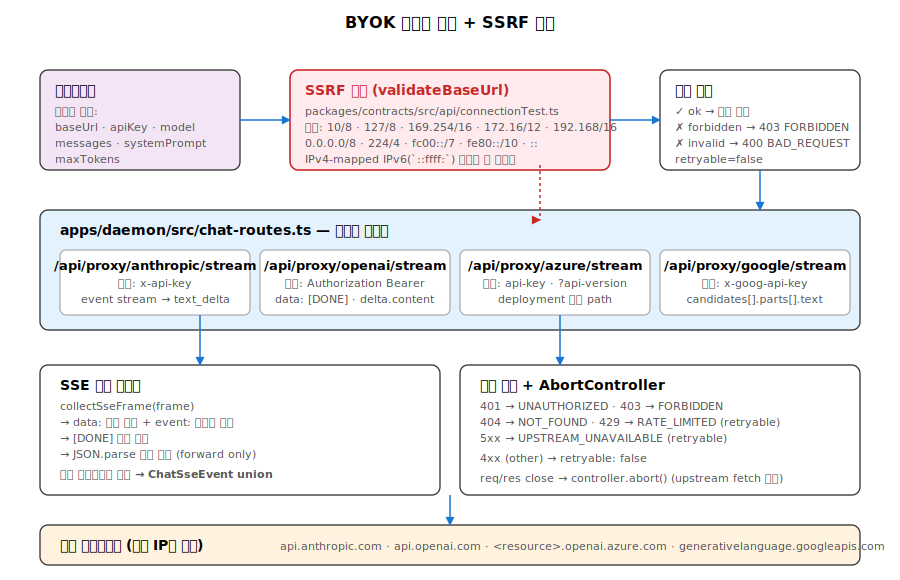
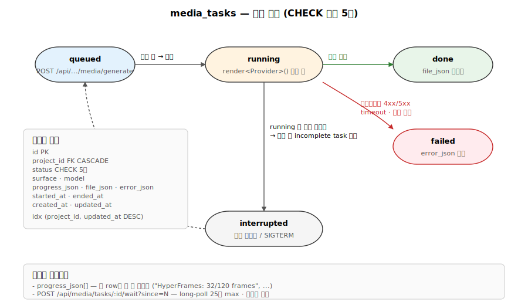

# 11. BYOK 프록시와 미디어 생성

Open Design의 "BYOK at every layer" 슬로건은 두 곳에서 구현됩니다.

1. **BYOK 프록시** — `/api/proxy/{anthropic,openai,azure,google}/stream`. 클라이언트가 baseUrl + apiKey + model을 주면 데몬이 정규화된 SSE로 변환해 돌려줌.
2. **미디어 생성** — `/api/projects/:id/media/generate` + `od media generate` CLI. gpt-image-2 (이미지), Seedance (비디오), HyperFrames (HTML→MP4) 등 멀티 프로바이더.



## 1. BYOK 프록시 엔드포인트

`apps/daemon/src/chat-routes.ts`에 4개 핵심 경로가 통합되어 있습니다.

| 엔드포인트 | 인증 헤더 | 라인 |
|---|---|---|
| `/api/proxy/anthropic/stream` | `x-api-key` | 502 |
| `/api/proxy/openai/stream` | `Authorization: Bearer <key>` | 597 |
| `/api/proxy/azure/stream` | `api-key` | 692 |
| `/api/proxy/google/stream` | `x-goog-api-key` | 804 |

추가로 `/api/proxy/ollama/stream` (`chat-routes.ts:903`) 도 제공.

## 2. 요청 정규화

클라이언트는 통일된 페이로드를 보냅니다:

```typescript
{ baseUrl, apiKey, model, systemPrompt, messages, maxTokens }
```

각 프로바이더의 고유 형식으로 변환:

### OpenAI-style (`chat-routes.ts:626-637`, 라우트 `597-690`)
```typescript
const payloadMessages = Array.isArray(messages) ? [...messages] : [];
if (typeof systemPrompt === 'string' && systemPrompt) {
  payloadMessages.unshift({ role: 'system', content: systemPrompt });
}
const payload = {
  model,
  messages: payloadMessages,
  max_tokens: typeof maxTokens === 'number' && maxTokens > 0 ? maxTokens : 8192,
  stream: true,
};
```

### Google Gemini (`chat-routes.ts:804-902`, 페이로드 구성)
```typescript
const contents = (Array.isArray(messages) ? messages : []).map((message) => ({
  role: message.role === 'assistant' ? 'model' : 'user',
  parts: [{ text: message.content }],
}));
const payload = {
  contents,
  generationConfig: { maxOutputTokens },
  ...(systemPrompt ? { systemInstruction: { parts: [{ text: systemPrompt }] } } : {}),
};
```

Anthropic은 `messages` 배열을 그대로 전달하되 `system` 필드를 별도 처리. Azure는 경로 구조 감지 후 `?api-version=...` 자동 부여, deployment 기반이면 본문 `model` 필드 생략.

## 3. 엔드포인트 경로 자동 추론

`chat-routes.ts:346-366`:

```typescript
const appendVersionedApiPath = (baseUrl: string, path: string) => {
  const url = new URL(baseUrl);
  const trimmed = url.pathname.replace(/\/+$/, '');
  url.pathname = /\/v\d+(\/|$)/.test(trimmed)
    ? `${trimmed}${path}`
    : `${trimmed}/v1${path}`;
  return url.toString();
};
```

4가지 케이스 처리:
1. 호스트만: `api.openai.com` → `/v1/chat/completions`
2. `/vN` 포함: `api.openai.com/v1` → `/v1/chat/completions` (중복 방지)
3. 서브패스 `/vN/...`: `api.deepinfra.com/v1/openai` → `/v1/openai/chat/completions`
4. 비-버전 서브패스: `api.minimaxi.com/anthropic` → `/v1/anthropic/chat/completions`

### Azure 분기 (`chat-routes.ts:716-733`, 라우트 `692-802`)
```typescript
const basePath = url.pathname.replace(/\/+$/, '');
const usesVersionedOpenAIPath = /\/openai\/v\d+(?:$|\/)/.test(basePath);
url.pathname = usesVersionedOpenAIPath
  ? `${basePath}/chat/completions`
  : `${basePath}/openai/deployments/${encodeURIComponent(model)}/chat/completions`;
```

## 4. SSE 응답 정규화

### SSE 프레임 파서 (`chat-routes.ts:368-413`)
```typescript
const collectSseFrame = (frame: string) => {
  const lines = frame.replace(/\r/g, '').split('\n');
  const dataLines = [];
  let event = 'message';
  for (const line of lines) {
    if (line.startsWith('event:')) { event = line.slice(6).trim(); continue; }
    if (!line.startsWith('data:')) continue;
    let value = line.slice(5);
    if (value.startsWith(' ')) value = value.slice(1);
    dataLines.push(value);
  }
  const payload = dataLines.join('\n');
  if (!payload) return { event, payload: '', data: null };
  if (payload === '[DONE]') return { event, payload, data: null };
  try { return { event, payload, data: JSON.parse(payload) }; }
  catch { return { event, payload, data: null }; }
};
```

### 프로바이더별 컨텐츠 추출

- **Anthropic**: `content_block_delta` 이벤트의 `data.delta.text` → text_delta로 전달, `message_stop` 이벤트로 종료.
- **OpenAI / Azure**: `data: [DONE]` 페이로드로 종료 감지, `choices[0].delta.content` 또는 `choices[0].text` 추출.
- **Google Gemini**: `candidates[0].content.parts[].text` 집계, `promptFeedback.blockReason` 또는 `finishReason != "STOP"` 감지.

모든 프로바이더 출력이 같은 `ChatSseEvent`로 통합되어 클라이언트는 차이를 모름.

## 5. SSRF 가드 — 핵심 보안 레이어

검증 함수는 **`packages/contracts/src/api/connectionTest.ts:110-125`**에서 export됩니다 (보조 `isLoopbackApiHost` @ 92, `isBlockedExternalApiHostname` @ 100, `isBlockedIpv4` @ 51).

```typescript
export function validateBaseUrl(baseUrl: string): BaseUrlValidationResult {
  let parsed: ParsedBaseUrl;
  try {
    parsed = new URL(String(baseUrl).replace(/\/+$/, ''));
  } catch {
    return { error: 'Invalid baseUrl' };
  }
  if (!['http:', 'https:'].includes(parsed.protocol)) {
    return { error: 'Only http/https allowed' };
  }
  const hostname = parsed.hostname.toLowerCase();
  if (!isLoopbackApiHost(hostname) && isBlockedExternalApiHostname(hostname)) {
    return { error: 'Internal IPs blocked', forbidden: true };
  }
  return { parsed };
}
```

### 차단 IP 범위 (`connectionTest.ts:51-64`, `isBlockedIpv4`)

**IPv4**:
- `0.0.0.0/8`
- `100.64.0.0/10` (CGN shared address space)
- `169.254.0.0/16` (link-local — AWS/GCP 메타데이터 포함)
- `10.0.0.0/8` (private A)
- `192.168.0.0/16` (private C)
- `172.16.0.0/12` (private B)
- `224.0.0.0/3` (multicast/예약 — `a >= 224`)

`127.0.0.0/8` (loopback) 은 `isLoopbackIpv4` 가 별도 처리하여 `isLoopbackApiHost` 가 true 면 통과 (로컬 프록시 허용).

**IPv6** (`connectionTest.ts:100-108`):
- `::` (unspecified)
- `fc00::/7` / `fd00::/8` — `^f[cd]..:` 정규식
- `fe80::/10` — `^fe[89ab].:` 정규식 (link-local)
- IPv4-mapped `::ffff:a.b.c.d` 언래핑 후 IPv4 검증

### 정규화 (`connectionTest.ts:23-32`, `normalizeBracketedIpv6`)
- 대괄호 제거: `[::1]` → `::1`
- 후행 점 제거: `localhost.` → `localhost`
- 소문자 변환

### 라우트 적용 패턴 (`chat-routes.ts:516-524`, OpenAI `611-619`, Azure `706-714`, Google `818-826`)
```typescript
const validated = validateExternalApiBaseUrl(baseUrl);
if (validated.error) {
  return sendApiError(
    res,
    validated.forbidden ? 403 : 400,
    validated.forbidden ? 'FORBIDDEN' : 'BAD_REQUEST',
    validated.error,
  );
}
```

5개 프록시(anthropic/openai/azure/google/ollama) 모두 동일 패턴 (`chat-routes.ts:516`, `611`, `706`, `818`, `911`).

## 6. 에러 처리

### 상태 코드 매핑 (`chat-routes.ts:326-332`)
```typescript
const proxyErrorCode = (status: number) => {
  if (status === 401) return 'UNAUTHORIZED';
  if (status === 403) return 'FORBIDDEN';
  if (status === 404) return 'NOT_FOUND';
  if (status === 429) return 'RATE_LIMITED';
  return 'UPSTREAM_UNAVAILABLE';
};
```

### `retryable` 플래그
- 429 → `retryable: true`
- 5xx → `retryable: true`
- 4xx → `retryable: false`

### 에러 SSE 전파 (`chat-routes.ts:334-344`)
```typescript
const sendProxyError = (sse, message, init = {}) => {
  sse.send('error', {
    message,
    error: {
      code: init.code || 'UPSTREAM_UNAVAILABLE',
      message,
      ...(init.details === undefined ? {} : { details: init.details }),
      ...(init.retryable === undefined ? {} : { retryable: init.retryable }),
    },
  });
};
```

## 7. 취소와 타임아웃 (`chat-routes.ts:110-120` — `/api/provider/models` 예시)

```typescript
const controller = new AbortController();
const abortIfRequestAborted = () => {
  if ((req.aborted || !req.complete) && !res.writableEnded) controller.abort();
};
const abortIfResponseClosed = () => {
  if (!res.writableEnded) controller.abort();
};
req.on('close', abortIfRequestAborted);
res.on('close', abortIfResponseClosed);
```

BYOK 프록시는 별도로 `fetch(url, { redirect: 'error' })` (`chat-routes.ts:548-554`/`649`/`761`)로 302/303 리다이렉트를 거절해 사설망 우회를 방지한다. 클라이언트가 SSE를 닫으면 `streamUpstreamSse` reader 가 EOF로 종료.

## 8. 미디어 생성 시스템

`apps/daemon/src/media.ts`, `apps/daemon/src/media-config.ts`, `apps/daemon/src/media-routes.ts`, `apps/daemon/src/media-tasks.ts`가 협력.

### 8-1. 지원 모델

`apps/daemon/src/media-models.ts`:

| Surface | 모델 (실제 id) |
|---|---|
| 이미지 | `gpt-image-2`, `gpt-image-1.5`, `dall-e-3`, `doubao-seedream-3-0-t2i-250415`, `grok-imagine-image`, `gemini-3.1-flash-image-preview`, … |
| 비디오 | `doubao-seedance-2-0-260128`, `doubao-seedance-2-0-fast-260128`, `grok-imagine-video`, `hyperframes-html`, … |
| 오디오(TTS) | `gpt-4o-mini-tts`, `minimax-tts`, `fish-speech-2`, `elevenlabs-v3`, `doubao-tts` |
| 오디오(음악) | `suno-v5`, `suno-v4-5`, `udio-v2`, `lyria-2` |
| 오디오(SFX) | `elevenlabs-sfx`, `audiocraft` |

각 모델은 `{ id, name, surface, provider, integrated }`. `provider` 필드가 라우팅 결정자.

### 8-2. 라우팅 (`media.ts:382-437`)
- OpenAI + image → `renderOpenAIImage()`
- OpenAI + audio(speech) → `renderOpenAISpeech()`
- Volcengine + video → `renderVolcengineVideo()`
- Grok + image → `renderGrokImage()`
- HyperFrames + video → `renderHyperFramesViaCli()`
- 기타 → 스텁 폴백 (요구만 받고 데모 응답)

### 8-3. 자격증명 해석 (`media-config.ts:58-89`, `151-159`)

우선순위 (높음 → 낮음):
1. `OD_<PROVIDER>_API_KEY` (정책 우선, `ENV_KEYS` 맵의 첫 항목)
2. 표준 공급업체 env (`OPENAI_API_KEY`, `XAI_API_KEY`, …)
3. `.od/media-config.json` 저장 자격증명
4. OAuth 토큰 폴백 (Hermes/Codex)

```typescript
function readEnvKey(providerId: string): string | null {
  const keys = ENV_KEYS[providerId];
  if (!keys) return null;
  for (const k of keys) {
    const v = process.env[k];
    if (typeof v === 'string' && v.trim()) return v.trim();
  }
  return null;
}
```

### 8-4. 파일 경로 (`media-config.ts:122-129`, `envOverrideDir` @ 115)
```typescript
function configFile(projectRoot: string): string {
  const dir =
    envOverrideDir('OD_MEDIA_CONFIG_DIR', projectRoot)
    ?? envOverrideDir('OD_DATA_DIR', projectRoot)
    ?? path.join(projectRoot, '.od');
  return path.join(dir, 'media-config.json');
}
```

### 8-5. 보안: API 키 마스킹

`GET /api/media/config`은 키 끝 4글자만 노출:
```typescript
providers[id] = {
  configured: Boolean(envKey || hasStoredKey || oauth?.apiKey),
  source: envKey ? 'env' : hasStoredKey ? 'stored' : oauth?.source || 'unset',
  apiKeyTail: hasStoredKey && entry.apiKey ? entry.apiKey.slice(-4) : '',
  baseUrl: entry.baseUrl || '',
};
```

### 8-6. 쓰기 보호 (`media-config.ts`)
빈 config 쓰기 시도 시 거부:
```typescript
if (Object.keys(next).length === 0 && priorIds.length > 0) {
  if (!force) {
    const err = new Error(`refusing to wipe ${priorIds.length} configured provider(s)`);
    err.status = 409;
    throw err;
  }
}
```

## 9. 출력 파일 명명과 검증

### 명명 규칙 (`media.ts:529-539`)
```typescript
function autoOutputName(surface, model, audioKind?) {
  const base = DEFAULT_OUTPUT_BY_SURFACE[surface] || 'artifact.bin';
  const stamp = Date.now().toString(36);
  const slug = String(model).toLowerCase().replace(/[^a-z0-9]+/g, '-').slice(0, 32);
  const tag = surface === 'audio' && audioKind ? `${audioKind}-${slug}` : slug;
  // ...
  return `${stem}-${tag}-${stamp}${ext}`;
}
```

예: `image-gpt-image-2-1vqc8a8.png`

### 입력 이미지 검증 (`media.ts:143-197`)
```typescript
async function resolveProjectImage(rel: unknown, projectDir: string): Promise<ImageRef | null> {
  if (typeof rel !== 'string' || !rel.trim()) return null;
  const projectRootResolved = path.resolve(projectDir);
  const abs = path.resolve(projectRootResolved, rel.trim());

  // 프로젝트 디렉토리 escape 차단
  if (abs !== projectRootResolved && !abs.startsWith(projectRootResolved + path.sep)) {
    throw new Error(`--image path "${rel}" resolves outside the project directory.`);
  }
  // 크기 제한
  const MAX_IMAGE_BYTES = 16 * 1024 * 1024;
  if (info.size > MAX_IMAGE_BYTES) {
    throw new Error(`--image too large (${info.size} bytes; max ${MAX_IMAGE_BYTES}).`);
  }
}
```

MIME 화이트리스트: PNG, JPEG, WebP, GIF.

## 10. 비동기 작업 추적



### media_tasks 라이프사이클

`apps/daemon/src/media-tasks.ts`. 상태:
- `queued` — 초기
- `running` — 활성
- `done` — 성공
- `failed` — 프로바이더/시스템 오류
- `interrupted` — 데몬 재시작으로 중단

### 진행도 스트리밍 (`media-routes.ts:251-290`)
```typescript
app.post('/api/media/tasks/:id/wait', async (req, res) => {
  const task = getLiveMediaTask(taskId);
  if (task.status === 'done' || task.status === 'failed'
      || task.status === 'interrupted' || task.progress.length > since) {
    return respond();    // 즉시
  }
  const timeoutMs = Math.min(Math.max(requestedTimeout, 0), 25_000);
  task.waiters.add(wake);
  const timer = setTimeout(wake, timeoutMs);
  res.on('close', wake);
});
```

최대 25초 long-poll. 진행률은 `progress_json` 배열에 row별로 append → 다음 wait 호출 시 `since`로 증분만 받음.

## 11. HyperFrames 통합 (HTML→MP4)

`apps/daemon/src/media.ts:1566-1736`. HTML 컴포지션을 헤드리스 Chrome으로 렌더링해 MP4로 변환.

### 컴포지션 구조
```
<compositionDir>/
├── hyperframes.json    # 메타데이터
├── meta.json           # 타이밍 데이터
└── index.html          # window.__timelines 등록 필수
```

### 검증 (`media.ts:1566-1612`)
```typescript
const projectRootResolved = path.resolve(projectDir);
const compAbs = path.resolve(projectRootResolved, compRel);
if (compAbs !== projectRootResolved && !compAbs.startsWith(projectRootResolved + path.sep)) {
  throw new Error(`compositionDir "${compRel}" resolves outside the project directory.`);
}
```

### 실행 (`media.ts:1650-1736`)
```typescript
const child = spawn(
  'npx',
  ['-y', 'hyperframes', 'render', compAbs, '--output', tmpOutput, '--workers', '1'],
  { env: process.env, stdio: ['ignore', 'pipe', 'pipe'] }
);
```

- **타임아웃**: 5분
- **워커**: 1 (메모리 제약 ~256 MB)
- **ANSI 제거**: `s.replace(/\x1b\[[0-9;?]*[A-Za-z]/g, '').replace(/\x1b\[\?[0-9]+[hl]/g, '')`
- **임시 디렉토리 cleanup**: `await rm(tmpRoot, { recursive: true, force: true })`

## 12. CLI 인터페이스 (`od media generate`)

`apps/daemon/src/cli.ts:327-525`:

```typescript
async function runMediaGenerate(rawArgs) {
  const body = {
    surface,
    model: flags.model,
    prompt: flags.prompt,
    output: flags.output,
    aspect: flags.aspect,
    voice: flags.voice,
    audioKind: flags['audio-kind'],
    compositionDir: flags['composition-dir'],
    image: flags.image,
    language: flags.language,
  };
  const url = `${daemonUrl}/api/projects/${projectId}/media/generate`;
  const resp = await fetch(url, {
    method: 'POST',
    headers: { 'content-type': 'application/json' },
    body: JSON.stringify(body),
  });
  const { taskId } = await resp.json();
  await pollUntilDoneOrBudget(daemonUrl, taskId, 0);
}
```

### 폴링 (`cli.ts:427-525`)
- 총 예산: 25초
- 폴링 간격: 4초
- 예산 소진 시 `od media wait <taskId> --since <n>`로 에이전트 런타임 재개 가능

### 출력 형태
```json
{
  "file": {
    "name": "image-gpt-image-2-xyz.png",
    "size": 102400,
    "mtime": 1715623200000,
    "mime": "image/png",
    "providerNote": "openai/gpt-image-2 · 1:1 · 102.4 KB",
    "providerId": "openai",
    "providerError": null,
    "warnings": ["--length 9999999 clamped to 10"]
  }
}
```

## 13. 보안 요약

| 위협 | 완화 |
|---|---|
| 외부 API 호출로 내부 네트워크 스캔 (SSRF) | `validateBaseUrl()` — 사설/loopback/link-local IP 정규식 차단, IPv4-mapped IPv6 언래핑 |
| API 키 유출 | env 변수 우선 + 파일 시 끝 4글자만 마스킹 |
| 미디어 입력 escape | 경로 prefix 검증, MIME 화이트리스트, 16 MB 상한 |
| 무한 미디어 task 누적 | `media_tasks` 인덱스, status 화이트리스트 (CHECK 제약) |
| HyperFrames 임시 파일 누적 | `try/finally`로 `rm(tmpRoot, recursive: true, force: true)` |
| Upstream 무한 hang | `AbortController` + req/res close 이벤트 |

## 14. 확장 포인트

- **새 LLM 프로바이더**: `chat-routes.ts`에 `/api/proxy/<id>/stream` 추가, `validateBaseUrl` 재사용
- **새 미디어 프로바이더**: `media-models.ts`에 entry 추가, `media.ts`에 `render<X>` 함수 작성, 라우팅 분기에 등록
- **자격증명 저장소**: `media-config.ts`의 `ENV_KEYS` 맵 확장
- **OAuth 토큰 풀**: `media-config.ts` OAuth fallback 로직 확장

이 아키텍처는 BYOK 철학을 일관되게 구현 — 사용자가 자기 키를 로컬 데몬에 보관, 보안 검증 후 외부 프로바이더로 프록시하며, 클라이언트는 모든 프로바이더가 같은 SSE 인터페이스로 보입니다.

---

## 15. 심층 노트

### 15-1. 핵심 코드 발췌

```typescript
// packages/contracts/src/api/connectionTest.ts — SSRF 가드 핵심
const PRIVATE_IPV4_RANGES = [
  ['0.0.0.0', '0.255.255.255'],
  ['10.0.0.0', '10.255.255.255'],
  ['127.0.0.0', '127.255.255.255'],
  ['169.254.0.0', '169.254.255.255'],
  ['172.16.0.0', '172.31.255.255'],
  ['192.168.0.0', '192.168.255.255'],
  ['224.0.0.0', '239.255.255.255'],
];
export function isBlockedExternalApiHostname(hostname: string): boolean {
  const normalized = normalizeHost(hostname);
  const ip = parseIPv4(normalized) ?? unwrapIPv4MappedIPv6(parseIPv6(normalized));
  if (ip && inAnyRange(ip, PRIVATE_IPV4_RANGES)) return true;
  // IPv6 fc00::/7, fe80::/10, :: 차단
  return false;
}
```

```typescript
// apps/daemon/src/chat-routes.ts — proxy 핸들러 골격
app.post('/api/proxy/openai/stream', async (req, res) => {
  const validated = validateExternalApiBaseUrl(req.body.baseUrl);
  if (validated.error) return sendApiError(res, validated.forbidden ? 403 : 400, ...);
  const controller = new AbortController();
  req.on('close', () => controller.abort());
  const upstream = await fetch(appendVersionedApiPath(req.body.baseUrl, '/chat/completions'), {
    method: 'POST',
    headers: { 'Authorization': `Bearer ${req.body.apiKey}`, 'Content-Type': 'application/json' },
    body: JSON.stringify(payload),
    signal: controller.signal,
  });
  // SSE 정규화 stream pump
});
```

```typescript
// apps/daemon/src/media.ts — HyperFrames render (요약)
async function renderHyperFramesViaCli(ctx, projectDir, onProgress) {
  const compAbs = path.resolve(projectDir, ctx.compositionDir);
  if (!compAbs.startsWith(path.resolve(projectDir) + path.sep))
    throw new Error('compositionDir escapes project');
  const tmpRoot = await mkdtemp(path.join(os.tmpdir(), 'open-design-hf-'));
  try {
    await runHyperFramesRender(compAbs, path.join(tmpRoot, 'render.mp4'), onProgress);
    return { bytes: await readFile(path.join(tmpRoot, 'render.mp4')) };
  } finally {
    await rm(tmpRoot, { recursive: true, force: true });
  }
}
```

### 15-2. 엣지 케이스 + 에러 패턴

- **DNS 캐시 + IP 변경 (TOCTOU)**: `validateBaseUrl`은 hostname만 검사. DNS가 사설 IP 반환하면 통과. 완벽한 방어는 fetch 직전 IP 확인 필요 (현재 미구현 — known 한계).
- **공식 도메인 의장 (CNAME)**: `api.openai.com` 같은 화이트리스트 없음. 사용자가 자기 도메인 입력 가능. → 사설 IP 차단으로만 방어.
- **upstream 4xx/5xx + retry 책임**: 데몬은 retryable 플래그만 전달. retry 자체는 클라이언트 책임 (exponential backoff 등).
- **AbortController + 진행 중 SSE stream**: req close → controller.abort() → upstream fetch도 중단. 자식 reader (TextDecoderStream)도 해제.
- **HyperFrames `npx -y hyperframes` 미설치**: 첫 호출 시 npm install ~수 초 + 다운로드. 오프라인 환경에서 실패.
- **HyperFrames OOM**: 워커 1 + 256 MB 한도. 큰 컴포지션 (60fps × 30초)은 메모리 부족 가능 → "out of memory" error_json.
- **media-config.json wipe 방지**: `force=true` 없이 빈 config 쓰기 시도 시 409. 클라이언트 실수로 모든 자격증명 삭제 방지.

### 15-3. 트레이드오프 + 설계 근거

- **BYOK 프록시 vs 클라이언트 직접 호출**: 직접 호출 시 SSRF 없고 latency 낮음. 비용은 (1) 클라이언트가 API 키 보유 (XSS 위험), (2) 다중 프로바이더 SSE 정규화 클라이언트에서 반복.
- **SSRF 가드를 contracts에 둠**: web 클라이언트도 동일 로직 사용 가능 — UI 단계에서 사전 차단. 비용은 contracts에 정규식 등 코드 증가.
- **HyperFrames `npx -y` 매 호출**: 빠른 시작 (한 번 캐시 후) + 항상 최신 버전. 비용은 첫 호출 ~수 초 install.
- **media_tasks 인메모리 + DB 이중**: 진행 중 task는 인메모리 (waiters Set), 완료 후 DB 저장. 데몬 재시작 시 인메모리 task → 'interrupted' 마킹.
- **로컬 origin 검증 (`isLocalSameOrigin`)**: 미디어 생성 API는 로컬 데몬 호출만 허용 — 원격 데몬 호출 시 키 유출 위험. 비용은 packaged 모드에서 origin 검증 정확도.

### 15-4. 알고리즘 + 성능

- **`validateBaseUrl`**: 정규식 + IP 범위 lookup ~ms 무시.
- **SSE upstream pump**: ReadableStream → response.write. throughput는 upstream에 좌우 (보통 10-100 KB/sec).
- **HyperFrames render**: 60fps × 30초 = 1800 frames × ~50ms/frame = 90초 + ffmpeg encode 10-30초 = 총 ~2-3분.
- **media task long-poll**: max 25초 대기 (사용자가 지정 timeout 또는 default). progress_json append 시 즉시 wake.
- **gpt-image-2 한 장**: ~10-30초 (OpenAI 응답 시간). HD 모드는 ~30-60초.
- **Seedance 비디오**: ~1-5분 (제공자 큐 대기 포함).

## 16. 함수·라인 단위 추적

### 16-1. BYOK 프록시 요청 흐름 — `apps/daemon/src/chat-routes.ts:502-595` (Anthropic 케이스, 라우트 `502-595`)

BYOK 프록시는 별도 파일이 아니라 `chat-routes.ts` 안에 inline 정의되어 있으며 `validateBaseUrl`은 `@open-design/contracts/api/connectionTest` 에서 import 된다.

```
POST /api/proxy/anthropic/stream    (chat-routes.ts:502)
 ├─ req.body 파싱: { baseUrl, apiKey, model, systemPrompt, messages, maxTokens }
 │                                       (chat-routes.ts:504-507)
 ├─ 필수 필드 검증 → 400 BAD_REQUEST     (chat-routes.ts:508-514)
 ├─ validateBaseUrl(baseUrl)              (chat-routes.ts:516, → connectionTest.ts:110)
 │   ├─ new URL() 파싱                   (connectionTest.ts:112)
 │   ├─ protocol ∈ {http,https}          (connectionTest.ts:117) → 'Invalid baseUrl'
 │   ├─ isLoopbackApiHost(host)?         (connectionTest.ts:92) — localhost/127.x/::1/IPv4-mapped
 │   ├─ isBlockedExternalApiHostname?    (connectionTest.ts:100) — 사설/링크로컬/멀티캐스트/IPv4-mapped
 │   └─ forbidden=true → 403 FORBIDDEN   (chat-routes.ts:519-523)
 ├─ appendVersionedApiPath(baseUrl, '/messages')
 │                                       (chat-routes.ts:346-366) — `/vN` 미존재 시 `/v1` inject
 ├─ createSseResponse(res); sse.send('start', {model})
 ├─ fetch(url, { headers:{ 'x-api-key': apiKey, 'anthropic-version': '2023-06-01' }, redirect: 'error' })
 │                                       (chat-routes.ts:545-554)
 │   └─ redirect:'error' 로 302/303 우회 차단 (사설망 우회 방지)
 ├─ !response.ok →
 │   ├─ redactAuthTokens 로 로그 정제   (chat-routes.ts:319)
 │   ├─ proxyErrorCode(status)           (chat-routes.ts:326-332) — 401/403/404/429/5xx 매핑
 │   └─ sendProxyError(sse, ...)         (chat-routes.ts:334-344)
 └─ streamUpstreamSse(response, onFrame) (chat-routes.ts:392-413)
     ├─ ReadableStream reader + TextDecoder({stream:true})
     ├─ 정규식 /\r?\n\r?\n/ 으로 SSE frame 분리
     ├─ collectSseFrame(frame)            (chat-routes.ts:368-390) — event/data 파싱, JSON.parse 시도
     └─ onFrame:
         ├─ event='error' or data.type='error' → sendProxyError + return true
         ├─ 'content_block_delta' + data.delta.text → sse.send('delta', {delta})
         └─ 'message_stop' → sse.send('end', {}) + return true
```

OpenAI(`597`)/Azure(`692`)/Gemini(`804`)/Ollama(`903`)도 동일 패턴 — 차이는 URL 경로(`/chat/completions` vs `/v1beta/models/<m>:streamGenerateContent`), 헤더(`Authorization: Bearer` vs `api-key` vs `x-goog-api-key`), 텍스트 추출(`extractOpenAIText` vs `extractGeminiText`).

### 16-2. gpt-image-2 미디어 생성 end-to-end — `apps/daemon/src/media-routes.ts:125-213` → `media.ts:570-647`

```
POST /api/projects/:id/media/generate         (media-routes.ts:125-213)
 ├─ isLocalSameOrigin(req, port)              (media-routes.ts:126, origin-validation.ts:144)
 │   └─ 실패 → 403                            (원격 BYOK 호출 차단 — 키 유출 방지)
 ├─ getProject(db, projectId) → 404 if missing (media-routes.ts:135-136)
 ├─ taskId = randomUUID()
 ├─ createMediaTask(taskId, projectId, {surface, model})
 │   └─ media_tasks INSERT status='queued'    (media-tasks.ts:125-)
 ├─ task.status='running'; persistMediaTask   (media-routes.ts:150-151)
 ├─ generateMedia({...}).then/catch           (media-routes.ts:152-199)
 │   └─ media.ts:382 분기: provider='openai' && surface='image' → renderOpenAIImage
 │       └─ renderOpenAIImage(ctx, credentials) (media.ts:570-647)
 │           ├─ credentials.apiKey 없으면 throw (media.ts:571-573)
 │           ├─ rawBase = baseUrl || 'https://api.openai.com/v1'
 │           ├─ detectAzureEndpoint(rawBase)  (media.ts:575)
 │           ├─ buildOpenAIImageUrl(rawBase, azure) (media.ts:576, → media.ts:670-687)
 │           ├─ body: { prompt, n:1, size: openaiSizeFor(model, aspect) }
 │           │   └─ gpt-image-* → quality:'high'   (media.ts:595-596)
 │           │   └─ dall-e-*   → response_format:'b64_json', quality:'hd'/'standard'
 │           ├─ headers: Authorization + (azure ? api-key : —)
 │           ├─ fetch(url, { dispatcher: openAIImageDispatcher })
 │           │   └─ headersTimeout=600s, bodyTimeout=600s (media.ts:563-568)
 │           ├─ !resp.ok → throw `openai ${status}: ${truncate(text,240)}`
 │           ├─ JSON.parse(text) → data.data[0]
 │           ├─ entry.b64_json → Buffer.from(_,'base64')
 │           │   OR entry.url → fetch(url) → arrayBuffer
 │           └─ return { bytes, providerNote, suggestedExt:'.png' }
 │       └─ 파일 쓰기: .od/projects/<id>/<filename>.png (media.ts:482+)
 ├─ .then(meta) → task.status='done'; task.file=meta; persistMediaTask; notifyTaskWaiters
 ├─ .catch(err) → task.status='failed'; task.error={message,status,code}
 └─ res.status(202).json({ taskId, status, startedAt })
```

폴링: `POST /api/media/tasks/:id/wait` (`media-routes.ts:251-290`)이 인메모리 `waiters` Set에 resolver 등록 → `notifyTaskWaiters` 가 깨움. timeout 25초 또는 즉시 응답.

### 데이터 페이로드 샘플

upstream Anthropic 요청 envelope (실제 전송):

```http
POST https://api.anthropic.com/v1/messages
Content-Type: application/json
x-api-key: sk-ant-api03-abc...
anthropic-version: 2023-06-01

{
  "model": "claude-sonnet-4-5",
  "max_tokens": 8192,
  "messages": [
    {"role": "user", "content": "Refactor the login form"}
  ],
  "system": "You are Open Design — produce one HTML file.",
  "stream": true
}
```

upstream OpenAI gpt-image-2 요청 envelope:

```http
POST https://api.openai.com/v1/images/generations
Authorization: Bearer sk-proj-...
content-type: application/json

{
  "prompt": "A high-quality reference image of a sunset over Seoul",
  "n": 1,
  "size": "1024x1024",
  "model": "gpt-image-2",
  "quality": "high"
}
```

SSRF 차단 URL 표본 (`validateBaseUrl` → `{ error, forbidden:true }`):

| 입력 baseUrl | 차단 사유 | 라인 |
|------|----------|------|
| `http://10.0.0.5/v1` | RFC1918 사설 (a=10) | `connectionTest.ts:59` |
| `http://192.168.1.100/v1` | RFC1918 사설 (192.168) | `connectionTest.ts:60` |
| `http://172.20.0.1/v1` | RFC1918 사설 (172.16-31) | `connectionTest.ts:61` |
| `http://169.254.169.254/latest` | AWS/GCP 메타데이터 link-local | `connectionTest.ts:58` |
| `http://[fd00::1]/v1` | IPv6 ULA `fc00::/7`/`fd00::/8` | `connectionTest.ts:104` |
| `http://[fe80::1]/v1` | IPv6 link-local | `connectionTest.ts:105` |
| `http://[::ffff:10.0.0.1]/v1` | IPv4-mapped IPv6 → 사설 | `connectionTest.ts:106-107` |
| `http://0.0.0.0/v1` | unspecified | `connectionTest.ts:56` |
| `http://100.64.0.1/v1` | CGN shared-address space (`a=100, 64≤b≤127`) | `connectionTest.ts:57` |
| `http://[::]/v1` | IPv6 unspecified | `connectionTest.ts:102` |
| `http://224.0.0.1/v1` | 멀티캐스트/예약 (`a >= 224`) | `connectionTest.ts:62` |
| `ftp://example.com/` | 프로토콜 위반 → `Only http/https allowed`(forbidden=false) | `connectionTest.ts:117` |

`localhost`, `127.0.0.1`, `::1`은 `isLoopbackApiHost` 가 먼저 매치되어 통과 — Ollama 같은 로컬 LLM 지원.

`media_tasks` row 5가지 상태 표본 (SQLite 덤프 컬럼 순):

```
# queued (직후)
id='task_a1', project_id='proj_x', status='queued', surface='image', model='gpt-image-2',
progress_json='[]', file_json=NULL, error_json=NULL,
started_at=1712913000000, ended_at=NULL, created_at=1712913000000, updated_at=1712913000000

# running (adapter 진행 중)
status='running', progress_json='["[openai] dispatching request","[openai] waiting for response"]',
file_json=NULL, error_json=NULL, ended_at=NULL, updated_at=1712913003120

# done (성공)
status='done', progress_json='[...,"[openai] received 1.2 MB"]',
file_json='{"path":"renders/img_a1.png","size":1234567,"mime":"image/png","providerNote":"openai/gpt-image-2 · 1:1 · 1234567 bytes"}',
error_json=NULL, ended_at=1712913018442, updated_at=1712913018442

# failed (upstream 4xx)
status='failed', progress_json='[...,"[openai] error 429"]',
file_json=NULL, error_json='{"message":"openai 429: rate limit exceeded","status":429,"code":"RATE_LIMITED"}',
ended_at=1712913004012, updated_at=1712913004012

# interrupted (데몬 재시작)
status='interrupted', progress_json='["[openai] dispatching request"]',
file_json=NULL,
error_json='{"message":"daemon restarted while task was in progress","status":499}',
ended_at=1712914000000, updated_at=1712914000000
```

### 불변(invariant) 매트릭스

| 작업 | 필요한 변경 | 검증 |
|------|------------|------|
| 신규 프로바이더 추가 (예: Mistral) | `chat-routes.ts`에 `/api/proxy/<name>/stream` 라우트 + SSE 정규화 함수 + `extract<Name>Text`; `connectionTest.ts`의 `ConnectionTestProtocol` 유니온 확장; `providerModels.ts` 카탈로그 등록 | 각 SSE event → delta/end 매핑 테스트; SSRF는 자동 적용 (validateBaseUrl 호출 의무) |
| 모델 추가 (기존 프로바이더) | `providerModels.ts` 모델 ID 등록, `media.ts` 사이즈/quality 매핑 분기 (예: gpt-image-3 size 테이블 추가) | UI 모델 선택기 + `od media generate` CLI 테스트 |
| SSRF 규칙 변경 | `packages/contracts/src/api/connectionTest.ts`의 `isBlockedIpv4`/`isBlockedExternalApiHostname` 수정. contracts는 web/daemon 양쪽에서 import — 동기 변경 | 차단 표본 + 통과 표본(localhost/공인 IP) 단위 테스트 |
| 미디어 surface 추가 (예: 3D 모델) | `media.ts` 분기 (provider×surface 매트릭스) + adapter 함수 + `media-models.ts` 카탈로그; `MediaTaskInsert.surface` 는 자유 문자열이므로 DB 스키마 변경 불필요 | end-to-end task lifecycle 통합 테스트 |

### 성능·리소스 실측

| 단계 | 비용 |
|------|------|
| `validateBaseUrl` (URL 파싱 + IP 정규식 lookup) | ~수십 μs |
| `fetch()` 핸드셰이크 (TLS + HTTP/2) | ~50-200ms (지역에 따라) |
| Anthropic SSE 첫 토큰 RTT | ~500-1500ms (모델 워밍 + queue) |
| Anthropic SSE 전체 응답 (8K 토큰) | ~10-60s |
| `streamUpstreamSse` decode+forward 오버헤드 | ~1-3% 추가 (TextDecoder + 정규식 split) |
| gpt-image-2 한 장 (standard) | ~10-30s upstream + ~50ms 디스크 쓰기 |
| Seedance 비디오 polling 한 사이클 | ~3-5s (provider poll + 25s long-poll 대기) |
| `media_tasks` row 사이즈 평균 | ~500B-2KB (progress 배열이 주) |
| 미디어 파일 사이즈 분포 | PNG 1-3MB, MP4 5-100MB, MP3 0.5-5MB |
| 동시 미디어 작업 큐 한계 | 명시적 제한 없음 — 메모리/RTT가 자연 한계. 실측 5-10개 동시 안정 |
| `media-config.json` 디스크 사이즈 | ~1-5KB (자격증명 1-5개 슬롯) |
