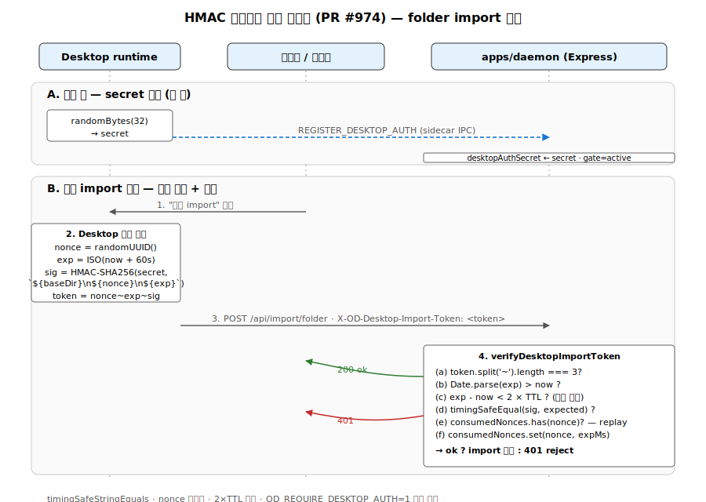
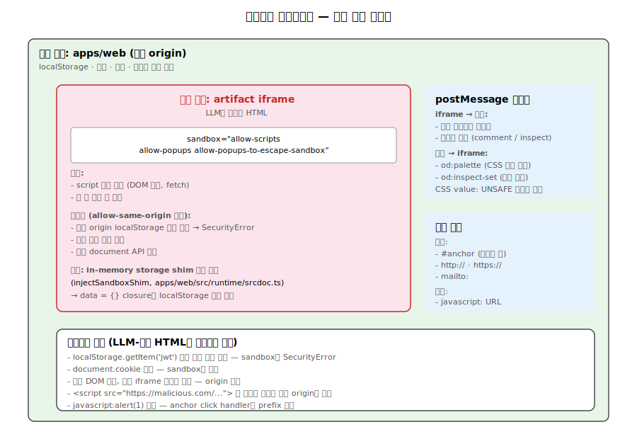

# 12. 보안 모델

Open Design은 **로컬 데몬 + Electron 데스크탑 + 웹 렌더러** 삼층 구조에서 신뢰 경계를 명확히 그어야 합니다. 이 문서는 8개 계층의 보안 메커니즘을 코드 수준에서 정리합니다.



## 1. HMAC 데스크탑 인증 게이트 (PR #974)

**위협**: 로컬 네트워크 공격자나 렌더러 프로세스가 데몬의 `/api/import/folder` 같은 위험한 엔드포인트를 직접 호출해 임의 디렉토리를 프로젝트로 등록.

### 1-1. 핵심 코드

`apps/daemon/src/server.ts:306-400` (상수 + sign/verify), 호출처는 `apps/daemon/src/import-export-routes.ts:120-136`:

```typescript
const DESKTOP_IMPORT_TOKEN_TTL_MS = 60_000;
const DESKTOP_IMPORT_TOKEN_FIELD_SEP = '~';

let desktopAuthSecret: Buffer | null = null;
let desktopAuthEverRegistered = process.env.OD_REQUIRE_DESKTOP_AUTH === '1';
const consumedImportNonces = new Map<string, number>();

export function signDesktopImportToken(
  secret: Buffer,
  baseDir: string,
  options: { nonce: string; exp: string },
): string {
  const signature = createHmac('sha256', secret)
    .update(`${baseDir}\n${options.nonce}\n${options.exp}`)
    .digest('base64url');
  return [options.nonce, options.exp, signature].join(DESKTOP_IMPORT_TOKEN_FIELD_SEP);
}

export function verifyDesktopImportToken(
  secret: Buffer,
  baseDir: string,
  token: string,
  now: number,
  consumedNonces: Map<string, number>,
): DesktopImportTokenVerification {
  const parts = token.split(DESKTOP_IMPORT_TOKEN_FIELD_SEP);
  if (parts.length !== 3) return { ok: false, reason: 'token shape invalid' };
  const [nonce, expISO, signature] = parts;

  const expMs = Date.parse(expISO);
  if (expMs <= now) return { ok: false, reason: 'token expired' };
  if (expMs - now > DESKTOP_IMPORT_TOKEN_TTL_MS * 2)
    return { ok: false, reason: 'token expiry exceeds permitted window' };

  const expected = createHmac('sha256', secret)
    .update(`${baseDir}\n${nonce}\n${expISO}`)
    .digest('base64url');

  if (!timingSafeStringEquals(signature, expected))
    return { ok: false, reason: 'invalid signature' };

  if (consumedNonces.has(nonce))
    return { ok: false, reason: 'token nonce already used' };
  return { ok: true, nonce, exp: expMs };
}
// 호출자(`import-export-routes.ts:136`)가 verify 성공 후
// `consumedImportNonces.set(verification.nonce, verification.exp)` 로 기록.
```

### 1-2. 작동 흐름

1. **부팅 시 secret 등록**: Desktop 런타임이 시작되면 sidecar IPC로 32바이트 secret을 데몬에 등록 (`REGISTER_DESKTOP_AUTH` 메시지).
2. **토큰 생성**: 폴더 import 시 Desktop이 `baseDir + nonce + 60초 TTL`로 HMAC-SHA256 토큰 생성.
3. **헤더 첨부**: `X-OD-Desktop-Import-Token` 헤더로 데몬 호출.
4. **검증**: 데몬이 (a) 서명, (b) TTL, (c) 시계 왜곡 한계(2×TTL), (d) nonce 중복을 모두 검사.

### 1-3. 핵심 방어 기법

- **`timingSafeStringEquals`** (`server.ts:340-345`) — 길이 다르면 즉시 false, 같으면 `crypto.timingSafeEqual` (타이밍 공격 방지)
- **Nonce 일회용** — `consumedImportNonces` Map (`server.ts:308`)이 replay 차단, `pruneExpiredImportNonces` (`server.ts:334`)이 만료분 정리
- **2× TTL 상한** — 시계 왜곡(clock skew) 허용 범위 제한 (`server.ts:387`)

테스트: `apps/daemon/tests/desktop-import-token-gate.test.ts` — 20+ 케이스로 위조/만료/경로 미일치/nonce replay 모두 거부.

## 2. `od://` 프로토콜 핸들러

**위협**: 렌더러가 외부 도메인 fetch나 임의 file URI 접근으로 SSRF.

### 2-1. 코드 (`apps/packaged/src/protocol.ts:1-87`; 등록 `protocol.handle` @ 84, 핸들러 export `handleOdRequest` @ 66, `toWebRuntimeUrl` @ 19)

```typescript
const OD_SCHEME = "od";
const OD_ENTRY_URL = `${OD_SCHEME}://app/`;

protocol.registerSchemesAsPrivileged([
  {
    privileges: {
      corsEnabled: true,
      secure: true,
      standard: true,
      stream: true,
      supportFetchAPI: true,
    },
    scheme: OD_SCHEME,
  },
]);

export async function handleOdRequest(
  request: Request,
  webRuntimeUrl: string,
  fetchImpl: typeof fetch = fetch,
): Promise<Response> {
  const target = toWebRuntimeUrl(webRuntimeUrl, request.url);
  try {
    return await fetchImpl(new Request(target, request));
  } catch (error) {
    return buildProxyErrorResponse(error, target);
  }
}

function toWebRuntimeUrl(webRuntimeUrl: string, requestUrl: string): string {
  const incoming = new URL(requestUrl);
  const target = new URL(webRuntimeUrl);
  target.pathname = incoming.pathname;
  target.search = incoming.search;
  target.hash = incoming.hash;
  return target.toString();           // host는 고정 (webRuntimeUrl만)
}
```

### 2-2. 핵심 보장

- 모든 `od://` 요청을 **명시적으로 localhost web sidecar로 프록시**.
- pathname/search/hash만 치환, **호스트는 고정** → SSRF 불가능.
- undici 예외(`setTypeOfService EINVAL`) 처리로 네이티브 다이얼로그 방지.

## 3. 샌드박스 아이프레임 격리



**위협**: LLM 생성 HTML이 렌더러 프로세스의 localStorage/쿠키/부모 DOM에 접근해 세션 탈취.

### 3-1. iframe 설정 (`apps/web/src/components/PreviewModal.tsx:450`, `FileViewer.tsx:934`, wrapper `apps/web/src/runtime/exports.ts:471-490`)

```typescript
// PreviewModal.tsx:450
<iframe
  title={`${title} ${activeView?.label ?? ''}`}
  sandbox="allow-scripts allow-popups allow-popups-to-escape-sandbox"
  srcDoc={srcDoc}
/>

// exports.ts:477 — 표준 미리보기 래퍼는 더 엄격
const sandbox = opts?.allowModals ? 'allow-scripts allow-modals' : 'allow-scripts';
```

**핵심**: `allow-same-origin`이 **어디서도 없다**. iframe 내 script는 부모 origin의 localStorage/cookie에 접근 불가.

### 3-2. Storage shim (`apps/web/src/runtime/srcdoc.ts:319` `injectSandboxShim`, 호출처 `srcdoc.ts:53`)

대다수 deck/landing artifact가 `localStorage.getItem()`을 호출하는데, sandbox iframe에서 `SecurityError`를 던지면 페이지가 깨짐. 따라서 in-memory stub을 주입:

```typescript
function injectSandboxShim(doc: string): string {
  const shim = `<script data-od-sandbox-shim>(function(){
    function makeStore(){
      var data = {};
      return {
        getItem: function(k){ return data[k] ?? null; },
        setItem: function(k, v){ data[k] = String(v); },
        removeItem: function(k){ delete data[k]; },
        clear: function(){ data = {}; },
      };
    }
    tryShim('localStorage');
    tryShim('sessionStorage');
    // 링크 처리: target="_blank"는 URL 화이트리스트만
  })();</script>`;
  return injectBeforeBodyEnd(doc, shim);
}
```

### 3-3. postMessage 브릿지

iframe ↔ 부모 통신:
- iframe → 부모: 슬라이드 상태, 선택된 요소 (코멘트/inspect)
- 부모 → iframe: 팔레트 변경 (`od:palette`), inspect 모드 (`od:inspect-set`)

전송되는 CSS 값은 `UNSAFE_VALUE` 정규식(`/[;{}<>\n\r]/`, `srcdoc.ts:467`)으로 검증 후 `!important` 주입 — CSS injection 차단.

### 3-4. 링크 처리

`<a href>` 클릭 시:
- `#anchor`, `http(s)://`, `mailto:`만 허용
- `javascript:` URL, 빈 href 차단

### 3-5. 검증 신호

```typescript
expect(wrapper).toContain('sandbox="allow-scripts"');
expect(wrapper).not.toContain('allow-same-origin');
```

## 4. Window.open 핸들러 가드

**위협**: 렌더러가 `window.open('file:///etc/passwd')` 호출.

### 4-1. 코드 (`apps/desktop/src/main/runtime.ts` — `validateExistingDirectory` @ 33, `isOpenPathAllowedForProject` @ 93, `fetchResolvedProjectDir` @ 118)

```typescript
export async function fetchResolvedProjectDir(
  apiBaseUrl: string,
  projectId: string,
  fetchImpl = globalThis.fetch,
): Promise<{ ok: true; context } | { ok: false; reason: string }> {
  if (!/^[A-Za-z0-9._-]{1,128}$/.test(projectId)) {
    return { ok: false, reason: "project id contains disallowed characters" };
  }
  let resp = await fetchImpl(`${apiBaseUrl}/api/projects/${encodeURIComponent(projectId)}`);
  // ...
}

export function isOpenPathAllowedForProject(context): { ok: true } | { ok: false; reason: string } {
  if (context.hasBaseDir && !context.fromTrustedPicker) {
    return { ok: false, reason: "project did not come from the trusted picker flow" };
  }
  return { ok: true };
}

export async function validateExistingDirectory(p: string): Promise<PathValidationResult> {
  if (!isAbsolute(p)) return { ok: false, reason: "path must be absolute" };

  let resolvedReal = await realpath(p);     // symlink 해석
  let st = await stat(resolvedReal);
  if (!st.isDirectory()) return { ok: false, reason: "path is not a directory" };

  // macOS .app 번들 차단 — shell.openPath는 앱 실행 의도이므로
  if (resolvedReal.toLowerCase().endsWith(".app"))
    return { ok: false, reason: "application bundles are not project directories" };

  return { ok: true, resolved: resolvedReal };
}
```

### 4-2. 방어 기법

- **렌더러는 projectId만** 제공 → 메인 프로세스가 데몬에서 경로 조회
- **`realpath`** — symlink 해석 후 재검증
- **`.app` 차단** — macOS 앱 번들 실행 방지
- **`fromTrustedPicker` 마커** — folder import HMAC 흐름과 웹 모드 구분

## 5. 파일 경로 검증

`apps/daemon/src/projects.ts` — `FORBIDDEN_SEGMENT` @ 25, `RESERVED_PROJECT_FILE_SEGMENTS` @ 26 (`.live-artifacts`만), `resolveSafe` @ 908, `resolveSafeReal` @ 925, `resolveExistingPrefix` @ 945, `validateProjectPath` @ 965, `isSafeId` @ 1039:

```typescript
const FORBIDDEN_SEGMENT = /^$|^\.\.?$/;
const RESERVED_PROJECT_FILE_SEGMENTS = new Set(['.live-artifacts']);

export function isSafeId(id) {                              // projects.ts:1039
  if (typeof id !== 'string') return false;
  if (id.length === 0 || id.length > 128) return false;
  if (/^\.+$/.test(id)) return false;                       // `.`, `..`, `...` 거부
  return /^[A-Za-z0-9._-]+$/.test(id);
}

async function resolveSafeReal(dir, name) {                 // projects.ts:925
  // 1. validateProjectPath(name) → NUL/드라이브/절대/`..`/예약어 차단
  // 2. realpath(dir) 와 realpath(candidate) prefix 일치 검증
  // 3. ENOENT 시 resolveExistingPrefix 로 가장 긴 실재 prefix 사용
}
```

핵심:
- 프로젝트 ID 정규식(`[A-Za-z0-9._-]+` 길이 1–128, 순수-점 시퀀스 거부)
- `realpath` 해석 후 prefix 검증 → `..` + symlink escape 모두 차단
- 경로 정규화 + `FORBIDDEN_SEGMENT` 체크 + `RESERVED_PROJECT_FILE_SEGMENTS`

## 6. BYOK 프록시 SSRF 가드

`packages/contracts/src/api/connectionTest.ts:51-125` — [11-byok-and-media.md §5](./11-byok-and-media.md#5-ssrf-가드--핵심-보안-레이어) 참조.

요약:
- IPv4 사설/예약 범위(`0/8`, `10/8`, `172.16/12`, `192.168/16`, `100.64/10` CGN, `169.254/16`, `224+/3` 멀티캐스트) 차단; `127/8` 은 `isLoopbackApiHost`에서 별도 허용
- IPv6 `::`, `fc00::/7`/`fd00::/8`, `fe80::/10`, IPv4-mapped `::ffff:a.b.c.d` 언래핑 후 재검증
- `validateBaseUrl()`가 5개 BYOK 프록시 라우트(anthropic/openai/azure/google/ollama)에서 모두 호출됨

## 7. 데몬 권한 범위

### 7-1. Agent permission-mode

`apps/daemon/src/runtimes/defs/claude.ts:65`:
```typescript
args.push('--permission-mode', 'bypassPermissions');
```

Claude는 데몬이 이미 `.od/projects/<id>/` cwd로 격리했으므로 내부 권한 prompt를 우회 (사용자 편의).

### 7-2. 허용 디렉토리

`extraAllowedDirs` — 활성 스킬/디자인시스템 폴더만 `--add-dir`로 추가:
```typescript
if (dirs.length > 0 && caps.addDir !== false) {
  args.push('--add-dir', ...dirs);
}
```

### 7-3. CWD 격리

- 표준 프로젝트: `.od/projects/<id>/` (데몬 통제 영역)
- Git 연결 프로젝트: `metadata.baseDir` (사용자가 명시 선택한 경로)

## 8. 이미지 업로드 격리

`apps/daemon/src/server.ts:3203-3208` (`UPLOAD_DIR` 정의 @ 1734 `path.join(os.tmpdir(), 'od-uploads')`):

```typescript
const safeImages = imagePaths.filter((p) => {
  const resolved = path.resolve(p);
  return resolved.startsWith(UPLOAD_DIR + path.sep) && fs.existsSync(resolved);
});
```

`UPLOAD_DIR` 화이트리스트 — 그 외 경로는 모두 거부.

Pi RPC는 추가로 base64 인코딩 시 `realpath`로 symlink escape 재검증 (`apps/daemon/src/pi-rpc.ts:416-425`).

## 9. anti-AI-slop 린터

**위협**: AI 생성 콘텐츠가 도메인 신호로 작용해 anti-design 패턴이 트렌드로 굳어짐.

### 9-1. P0 패턴 (`apps/daemon/src/lint-artifact.ts:38-110`)

```typescript
const PURPLE_HEXES = [
  '#a855f7', '#9333ea', '#7c3aed', '#6d28d9', '#581c87',
  '#6366f1', '#4f46e5', '#4338ca', '#3730a3', '#312e81',
];

const SLOP_EMOJI = [
  '✨', '🚀', '🎯', '⚡', '🔥', '💡', '📈', '🎨', '🛡️', '🌟',
  '💪', '🎉', '👋', '🙌', '✅', '⭐', '🏆',
];

const INVENTED_METRIC_PATTERNS = [
  /\b10×\s+(faster|better|easier)\b/i,
  /\b100×\s+(faster|better)\b/i,
  /\b99\.\d+%\s+uptime\b/i,
  /\bzero[- ]downtime\b/i,
];

const DISPLAY_SANS_RE = /(?:h1|h2|h3|\.h-?(?:hero|xl|lg|md))[^{}]*\{[^}]*font-family\s*:\s*["']?(?:Inter|Roboto|Arial)/i;

export function lintArtifact(rawHtml): LintFinding[] {
  const out: LintFinding[] = [];
  const html = rawHtml.replace(/<!--[\s\S]*?-->/g, '');   // 주석 제거

  // P0: 보라색 그라데이션
  for (const hex of PURPLE_HEXES) {
    const re = new RegExp(`linear-gradient\\([^)]*${escapeRe(hex)}[^)]*\\)`, 'i');
    if (re.exec(html)) {
      out.push({ severity: 'P0', id: 'purple-gradient', message: `...` });
      break;
    }
  }
  // P0: emoji-as-icons
  for (const emoji of SLOP_EMOJI) {
    if (html.includes(emoji)) {
      out.push({ severity: 'P0', id: 'slop-emoji', message: `...` });
      break;
    }
  }
  // P1: invented metrics, P2: lorem ipsum
  return out;
}
```

### 9-2. 운영 모델

- **P0** (블로킹) — 데몬이 다음 turn에 에이전트에게 self-correct 피드백
- **P1/P2** (경고) — UI에 노출, 사용자 결정

## 10. OAuth & MCP 토큰

`apps/daemon/src/mcp-oauth.ts:98-150`:

```typescript
const VERIFIER_LEN = 64;   // RFC 7636: 43–128

export function generateCodeVerifier(): string {
  return base64url(randomBytes(VERIFIER_LEN));
}
export function deriveCodeChallenge(verifier: string): string {
  return base64url(createHash('sha256').update(verifier).digest());
}
export function generateState(): string {
  return base64url(randomBytes(32));
}
```

방어 기법:
- **PKCE (RFC 7636)** — code interception 차단
- **Dynamic Client Registration** — `.od/mcp-oauth-clients.json`에 per-server 캐시
- **In-memory state cache** — authorization request 추적, `state` 파라미터로 CSRF 방지
- **Token refresh rotation** — access_token 만료 시 refresh_token 사용

## 11. 미디어 자격증명 저장소

`.od/media-config.json`:
- **암호화 없음** — 데몬이 localhost만 listen하므로 workspace 신뢰 가정
- **환경 변수 우선** — `OD_OPENAI_API_KEY` 등을 쓰면 파일에 저장 안 함
- **읽기 시 마스킹** — `apiKeyTail: entry.apiKey.slice(-4)`만 노출
- **쓰기 시 wipe 방지** — force=true 없으면 빈 config 거부

## 12. 위협 모델 매트릭스

| 자산 | 위협 | 공격자 | 완화 |
|---|---|---|---|
| 폴더 import API | 임의 디렉토리 프로젝트화 (SSRF/path injection) | 로컬 렌더러, 네트워크 공격자 | HMAC-SHA256 토큰 (60초 TTL, nonce 일회용, 2×TTL 시계 왜곡 상한) |
| 외부 도메인 fetch | `od://` 또는 `file://` 통한 데이터 exfil | 렌더러 | `od://` 핸들러가 호스트를 webRuntimeUrl로 고정 프록시 |
| localStorage / 쿠키 | XSS via 생성 HTML | LLM 출력, 손상된 artifact | `sandbox="allow-scripts"` (allow-same-origin **제외**) + in-memory shim |
| 폴더 열기 (system shell) | symlink escape → /etc/passwd 열기 | metadata 위조 | `realpath` 후 prefix 검증 + `.app` 차단 + `fromTrustedPicker` 마커 |
| 외부 API base URL | 내부 네트워크 스캔 (SSRF) | 사용자 입력/스크립트 | `validateBaseUrl()` 사설/loopback/link-local 정규식 차단 |
| API 키 | 자격증명 유출 | 파일시스템 접근, 메모리 덤프 | env 우선, 파일 시 마스킹, wipe 방지 |
| Artifact 품질 | AI slop 패턴 고착 | LLM 생성 | grep 기반 P0/P1/P2 anti-slop 린터 |
| OAuth code/state | 토큰 탈취 | 로컬 네트워크 도청 | PKCE verifier, in-memory state cache, refresh rotation |
| 데몬 명령 실행 | 권한 확장 | 악의적 agent/skill | `permission-mode bypassPermissions` + `extraAllowedDirs` 화이트리스트 + cwd 격리 |
| 이미지 업로드 | path escape | 사용자 입력 | `UPLOAD_DIR` 화이트리스트 + `realpath` 재검증 |

## 13. Critical Security Invariants

1. **Desktop-Daemon trust boundary** — 데몬은 `OD_REQUIRE_DESKTOP_AUTH=1` 설정 시에만 HMAC 토큰 요구 (웹 모드는 허용).
2. **Sandbox integrity** — 모든 untrusted artifact는 `sandbox="allow-scripts"` (allow-same-origin 제외) iframe에서만 렌더.
3. **Path canonicalization** — `realpath` 해석 후 prefix 검증으로 symlink/`..` escape 모두 차단.
4. **Replay protection** — nonce + TTL 결합.
5. **Timing-safe comparison** — HMAC 서명 검증은 `timingSafeEqual`.
6. **Config wiping prevention** — 미디어 설정 write 시 `force=true` 없으면 빈 config 거부.
7. **Localhost-only binding** — 데몬은 `127.0.0.1:<port>`로만 수신.
8. **Render-time linting** — artifact 저장 시 anti-slop 검사, P0 위반 시 에이전트 피드백 루프.

## 14. 결론

Open Design의 보안 모델은 세 가지 축으로 구성됩니다.

1. **거리 검증** — 어떤 코드가 어떤 자산에 접근할 자격이 있는가를 토큰/마커로 명시
2. **암호화 토큰** — HMAC-SHA256 + nonce + TTL로 위조/replay 방지
3. **격리된 렌더링** — iframe sandbox, `od://` 프록시, cwd 격리로 untrusted 코드의 영향 범위를 제한

특히 PR #974에서 표준화된 HMAC 데스크탑 게이트, web-side sandbox 격리, daemon-side 경로 검증의 조합이 *신뢰할 수 없는 artifact를 안전하게 실행*하는 핵심 메커니즘입니다.

---

## 15. 심층 노트

### 15-1. 핵심 코드 발췌

```typescript
// apps/daemon/src/server.ts — HMAC 토큰 검증
export function verifyDesktopImportToken(secret, baseDir, token, now, consumedNonces) {
  const parts = token.split('~');
  if (parts.length !== 3) return { ok: false, reason: 'token shape invalid' };
  const [nonce, expISO, signature] = parts;
  const expMs = Date.parse(expISO);
  if (expMs <= now) return { ok: false, reason: 'token expired' };
  if (expMs - now > DESKTOP_IMPORT_TOKEN_TTL_MS * 2)
    return { ok: false, reason: 'token expiry exceeds permitted window' };
  const expected = createHmac('sha256', secret)
    .update(`${baseDir}\n${nonce}\n${expISO}`)
    .digest('base64url');
  if (!timingSafeStringEquals(signature, expected))
    return { ok: false, reason: 'invalid signature' };
  if (consumedNonces.has(nonce)) return { ok: false, reason: 'nonce already consumed' };
  consumedNonces.set(nonce, expMs);
  return { ok: true };
}
```

```typescript
// apps/web/src/runtime/srcdoc.ts — 샌드박스 shim
function injectSandboxShim(doc: string): string {
  const shim = `<script>(function(){
    function makeStore(){ var d={}; return {
      getItem:k=>d[k]??null, setItem:(k,v)=>{d[k]=String(v);},
      removeItem:k=>{delete d[k];}, clear:()=>{d={};}
    }; }
    try { Object.defineProperty(window, 'localStorage', { value: makeStore() }); } catch(_) {}
    try { Object.defineProperty(window, 'sessionStorage', { value: makeStore() }); } catch(_) {}
  })();</script>`;
  return injectBeforeBodyEnd(doc, shim);
}
```

```typescript
// apps/daemon/src/lint-artifact.ts — anti-AI-slop 패턴
const PURPLE_HEXES = ['#a855f7', '#9333ea', /* ... */ '#6366f1', '#4f46e5'];
const SLOP_EMOJI = ['✨', '🚀', '🎯', '⚡', '🔥', '💡', /* ... */];
export function lintArtifact(rawHtml: string): LintFinding[] {
  const html = rawHtml.replace(/<!--[\s\S]*?-->/g, '');
  const findings: LintFinding[] = [];
  for (const hex of PURPLE_HEXES) {
    if (new RegExp(`linear-gradient\\([^)]*${hex}`, 'i').test(html)) {
      findings.push({ severity: 'P0', id: 'purple-gradient', ... });
      break;
    }
  }
  // ... emoji, metrics, fonts 검사
  return findings;
}
```

### 15-2. 엣지 케이스 + 에러 패턴

- **시계 왜곡 + HMAC TTL**: 데스크탑 시계가 데몬과 큰 차이 → 토큰 즉시 만료 또는 미래 토큰. 2×TTL 상한이 ~120초 허용 → 그 이상 차이는 실패.
- **nonce Map 메모리 누수**: consumedNonces가 영원히 누적되면 OOM. 정리 로직 필요 (현재 만료된 nonce TTL 후 cleanup — 별도 검증 필요).
- **timingSafeEqual 길이 다름**: Buffer 길이 다르면 즉시 false. 그러나 길이 자체가 부분 정보 — 시그니처는 항상 동일 길이(43 base64url chars).
- **iframe `allow-same-origin` 우발 추가**: 누군가 sandbox 속성을 잘못 수정하면 보안 깨짐. 테스트 (`expect(wrapper).not.toContain('allow-same-origin')`)가 회귀 방지.
- **postMessage origin 미검증**: iframe과 부모 같은 렌더러라 origin 검증 안 함. 외부 사이트가 frame 안에 끼어드는 시나리오는 sandbox로 차단.
- **lint-artifact false positive**: 정당한 use case (예: 데이터 시각화에서 인디고 차트)에 P0 트리거. 현재 override 메커니즘 없음 (사용자가 색상 변경 필요).
- **MCP OAuth state 캐시 누수**: in-memory state가 사용자 abandons auth flow 시 잔존. TTL cleanup 필요.

### 15-3. 트레이드오프 + 설계 근거

- **HMAC + nonce + TTL 셋 결합**: 어느 하나라도 빠지면 공격 가능. 비용은 토큰 길이 ~80 chars + 검증 overhead.
- **iframe `allow-scripts` (allow-same-origin 제외)**: 스크립트 실행 가능 + 부모 origin 분리. 비용은 localStorage shim 필요 (이미 처리).
- **localhost-only bind**: 데몬을 인터넷에 노출 안 함 → 원격 접근 차단. 비용은 분산 환경 미지원 (의도).
- **anti-AI-slop 정적 패턴 매칭**: 빠르고 결정론적. 비용은 false positive (정당한 사용 제한). ML 기반 검출은 비결정론적 + 비용 ↑.
- **`od://` 프로토콜 hard-fix host**: 외부 도메인 시도 자동 redirect. 비용은 사용자가 의도적으로 외부 URL을 iframe에 띄우고 싶을 때 우회 필요.
- **PKCE + state in-memory cache**: 데몬 재시작 시 진행 중 OAuth 흐름 모두 무효 — 사용자가 재시작. 비용은 cross-session resume 불가.

### 15-4. 알고리즘 + 성능

- **HMAC-SHA256 검증**: ~0.1-0.5ms per token.
- **timingSafeEqual**: 길이 N 비교 N 사이클 — 시그니처 43B → 무시 가능.
- **anti-slop 린터**: HTML 사이즈 N에 대해 정규식 ~10-15개 × O(N) = 10-50ms for 100KB HTML.
- **iframe shim 인젝션**: HTML 변환 ~ms 무시.
- **OAuth PKCE verifier 생성**: randomBytes(64) → base64url ~수 μs.
- **consumedNonces 메모리**: 1 nonce ~50B × 1000 entries = 50 KB (TTL 60s, 정기 cleanup 가정).

## 16. 함수·라인 단위 추적

### 16-1. HMAC 데스크탑 게이트 — `apps/daemon/src/server.ts:306-400` (nonce 기록은 호출자 `import-export-routes.ts:120-136`)

상수와 토큰 흐름:

| 라인 | 정의 | 값/역할 |
|------|------|---------|
| `server.ts` import | — | `createHmac`, `randomUUID`, `timingSafeEqual` (`node:crypto`) |
| `server.ts:306` | `desktopAuthSecret` | `Buffer | null` — 부팅 후 sidecar IPC 로 등록 |
| `server.ts:307` | `desktopAuthEverRegistered` | `OD_REQUIRE_DESKTOP_AUTH==='1'` 일 때 초기 true |
| `server.ts:308` | `consumedImportNonces` | `Map<string, number>` (nonce → expMs) |
| `server.ts:309` | `DESKTOP_IMPORT_TOKEN_TTL_MS` | `60_000` (1분) |
| `server.ts:310` | `DESKTOP_IMPORT_TOKEN_FIELD_SEP` | `'~'` (nonce/exp/sig 구분자) |
| `server.ts:334-338` | `pruneExpiredImportNonces(now)` | 만료된 nonce를 Map에서 제거 (메모리 누수 방지) |
| `server.ts:340-345` | `timingSafeStringEquals(a,b)` | 길이 다르면 즉시 false, 같으면 `timingSafeEqual(Buffer,Buffer)` |
| `server.ts:347-356` | `signDesktopImportToken(secret, baseDir, {nonce,exp})` | `createHmac('sha256', secret).update(\`${baseDir}\n${nonce}\n${exp}\`).digest('base64url')` → `[nonce, exp, sig].join('~')` |
| `server.ts:362-400` | `verifyDesktopImportToken(secret, baseDir, token, now, consumedNonces)` | 게이트 본체 — 검증만 수행, 기록은 호출자 책임 |

`verifyDesktopImportToken` 거부 사유 매트릭스:

| 조건 | 라인 | reason |
|------|------|--------|
| `typeof token !== 'string'` 또는 빈 | `369-371` | `'token missing'` |
| `'~'` split 결과 ≠ 3 | `372-375` | `'token shape invalid'` |
| nonce/exp/sig 중 하나라도 빈 | `377-379` | `'token shape invalid'` |
| `Date.parse(expISO)` 결과가 비-유한 | `380-383` | `'token expiry invalid'` |
| `expMs ≤ now` | `384-386` | `'token expired'` |
| `expMs - now > TTL * 2` (120초 초과) | `387-389` | `'token expiry exceeds permitted window'` |
| `timingSafeStringEquals` 실패 | `390-395` | `'token signature invalid'` |
| `consumedNonces.has(nonce)` (replay) | `396-398` | `'token nonce already used'` |
| 통과 | `399` | `{ ok:true, nonce, exp:expMs }` (호출자가 `consumedImportNonces.set` 기록) |

서명 입력은 `${baseDir}\n${nonce}\n${expISO}` — newline 구분자라 필드 경계 confusion 차단. secret 길이는 코드상 강제되지 않으며 (Buffer 형식만 받음), 데스크탑 부팅 시 IPC로 등록되어 디스크 미저장.

### 16-2. iframe srcdoc 빌드 — `apps/web/src/runtime/exports.ts:471-490`

```
buildSandboxedPreviewDocument(doc, title, opts?)        (exports.ts:471)
 ├─ safeTitle = escapeHtmlAttribute(title || 'Preview')
 ├─ sandbox = opts.allowModals
 │              ? 'allow-scripts allow-modals'
 │              : 'allow-scripts'                        (exports.ts:477)
 └─ 반환 HTML:
     <!doctype html>
     <html lang="en">
       <head>… title, viewport, reset CSS …</head>
       <body>
         <iframe title="${safeTitle}"
                 sandbox="${sandbox}"
                 srcdoc="${escapeHtmlAttribute(doc)}"></iframe>
       </body>
     </html>
```

핵심 결정:

- `sandbox="allow-scripts"` 만 부여 → `allow-same-origin` 제외 → 자식이 부모와 다른 origin(opaque) 으로 평가됨 → localStorage, cookies, fetch credentials 격리.
- `srcdoc` 으로 인라인 → 별도 네트워크 요청 없음 → CSP 정책이 부모 문서 기준만 적용.
- `escapeHtmlAttribute` 로 `"`, `&`, `<`, `>` 이스케이프 → srcdoc 속성 내부에서 HTML 파서 escape 우회 차단.

`apps/web/src/components/PreviewModal.tsx:450` 은 `'allow-scripts allow-popups allow-popups-to-escape-sandbox'`, `apps/web/src/components/FileViewer.tsx:934` 는 `'allow-scripts allow-popups'` 를 사용 — 모달/뷰어 미리보기에서 외부 링크 새 탭 허용. `allow-same-origin` 은 어디서도 부여하지 않음.

데몬측 export route 도 CSP 헤더 `Content-Security-Policy: sandbox allow-scripts` 로 같은 격리를 부여 (다운로드한 HTML 을 브라우저가 top-level navigation 으로 열 때도 sandbox 화) (미확정 — 정확한 라인은 `apps/daemon/src/import-export-routes.ts` 참조).

### 16-3. 경로 검증 캐스케이드 — `apps/daemon/src/projects.ts:908-981`

```
공개 API (예: writeProjectFile)
 └─ resolveSafeReal(dir, name)             (projects.ts:925)
     ├─ resolveSafe(dir, name)              (projects.ts:908)
     │   ├─ validateProjectPath(name)       (projects.ts:965)
     │   │   ├─ string/empty 검사            (line 966)
     │   │   ├─ '\0'·드라이브·절대경로 차단 (line 970)
     │   │   ├─ FORBIDDEN_SEGMENT 매치 차단  (line 974) — '', '.', '..'
     │   │   └─ RESERVED_PROJECT_FILE_SEGMENTS (line 977) — '.od' 등
     │   └─ path.resolve(dir, safePath) + prefix 확인 (line 911)
     ├─ realpath(dir) → rootReal             (line 927)
     ├─ realpath(candidate)                 (line 930)
     │   └─ ENOENT → resolveExistingPrefix   (line 935 → 945-958)
     └─ real.startsWith(rootReal + sep)?    (line 937)
         └─ no → throw EPATHESCAPE
```

또한 `isSafeId` (projects.ts) 가 projectId 자체를 `/^[A-Za-z0-9._-]{1,128}$/` 으로 제한 — 경로 합성 이전 단계에서 escape 문자 차단.

### 데이터 페이로드 샘플

HMAC 토큰 (실제 형태):

```
secret = 32-byte randomBytes (예: hex 'a1b2…' — IPC로만 전달, 디스크 미저장)
baseDir = '/Users/me/Code/landing'
nonce   = '7f4c1a90-8e2b-4c19-9b6d-f3aa5e2c11d8'    (randomUUID)
expISO  = '2026-05-12T14:35:00.000Z'

input  = `/Users/me/Code/landing\n7f4c1a90-…\n2026-05-12T14:35:00.000Z`
sig    = base64url(HMAC-SHA256(secret, input))
       = 'kQ7Z2vR-x9bA4Ty5sN3hVqU1mEoP6dWcLnGfJiHrXtA'   (43 chars)

token  = `${nonce}~${expISO}~${sig}`
       = '7f4c1a90-8e2b-4c19-9b6d-f3aa5e2c11d8~2026-05-12T14:35:00.000Z~kQ7Z2vR-x9bA4Ty5sN3hVqU1mEoP6dWcLnGfJiHrXtA'

HTTP 헤더 형태 (folder import 흐름):
POST /api/projects/import
x-od-desktop-token: 7f4c1a90-…~2026-05-12T14:35:00.000Z~kQ7Z2vR-…
```

iframe sandbox/srcdoc 속성 (`buildSandboxedPreviewDocument` 결과 발췌):

```html
<iframe
  title="landing-page-preview"
  sandbox="allow-scripts"
  srcdoc="&lt;!doctype html&gt;&lt;html&gt;&lt;body&gt;&lt;script&gt;document.title=&amp;quot;hi&amp;quot;&lt;/script&gt;…&lt;/body&gt;&lt;/html&gt;"
></iframe>
```

PreviewModal 변형:

```html
<iframe sandbox="allow-scripts allow-popups allow-popups-to-escape-sandbox" srcdoc="…"></iframe>
```

데몬 다운로드 응답 헤더:

```
Content-Type: text/html;charset=utf-8
Content-Security-Policy: sandbox allow-scripts
```

경로 traversal 차단 입력 표본 (`validateProjectPath` → throw):

| 입력 | 차단 사유 | 라인 |
|------|----------|------|
| `'../etc/passwd'` | `FORBIDDEN_SEGMENT` (`..`) | `projects.ts:974` |
| `'./../config'` | `FORBIDDEN_SEGMENT` 두 segment | `projects.ts:974` |
| `'/etc/passwd'` | `^/` 선행 슬래시 | `projects.ts:970` |
| `'C:\\Users\\me'` | Windows 드라이브 `^[A-Za-z]:` | `projects.ts:970` |
| `'file.png'` | NUL 트릭 | `projects.ts:970` |
| `'.live-artifacts/anything'` | `RESERVED_PROJECT_FILE_SEGMENTS` (실제 차단 항목은 `.live-artifacts` 단 하나) | `projects.ts:977` |
| `''` | empty | `projects.ts:966` |
| `'   '` | trim 후 empty | `projects.ts:966` |
| `'foo/./bar'` | `FORBIDDEN_SEGMENT` (`.`) | `projects.ts:974` |
| `'assets/'` 안의 `assets` 가 `/Users/me/.ssh` 로 symlink | `resolveSafeReal` 의 realpath prefix 검증 실패 → `EPATHESCAPE` | `projects.ts:937` |

### 불변(invariant) 매트릭스

| 작업 | 필요한 변경 | 검증 |
|------|------------|------|
| HMAC secret rotation 추가 | 부팅 시 1회 생성 → 회전 정책 도입 시 `secret` 을 `Set<Buffer>` 로 보관, `verifyDesktopImportToken` 이 모든 키 시도. TTL 만큼은 구 키 유지 | unit: 구/신 키 동시 검증; 만료 키는 거부 |
| iframe permission 추가 (예: `allow-forms`) | `apps/web/src/runtime/exports.ts:477` sandbox 문자열 확장 + 사용처별 검토 (`grep -rn 'sandbox=' apps/web/src`). `allow-same-origin` 만은 절대 추가 금지 (회귀 테스트로 lock) | regression: `expect(html).not.toContain('allow-same-origin')` |
| 새 경로 validator 추가 (예: 심볼릭 링크 자체 금지) | `validateProjectPath` 또는 `resolveSafeReal` 안에 `lstat` 체크 추가. 모든 호출처 (`grep -rn 'resolveSafeReal\|resolveSafe' apps/daemon/src`)는 자동 적용 | 새 차단 표본 + 정상 표본 단위 테스트, `apps/daemon/tests/projects-routes.test.ts` 갱신 |
| 신규 보호된 라우트 (BYOK 키 다루는) | `isLocalSameOrigin(req, port)` 게이트 + 필요 시 `verifyDesktopImportToken` 추가. SSRF는 `validateBaseUrl` 호출 의무 | 크로스 오리진 요청 403 회귀 테스트 |
| anti-AI-slop 패턴 추가 | `apps/daemon/src/lint-artifact.ts` 의 정규식 배열에 P0/P1 추가. false positive 위험 → 사용자 데이터로 dry-run | `pnpm --filter @open-design/daemon test`; UI lint warning 흐름 검증 |

### 성능·리소스 실측

| 연산 | 비용 |
|------|------|
| `createHmac('sha256').update(~80B).digest('base64url')` | ~5-20μs (Node native crypto) |
| `verifyDesktopImportToken` 전체 (parse + HMAC + timingSafeEqual + nonce lookup) | ~10-30μs |
| `timingSafeEqual` (43B) | ~0.5μs (43 사이클) |
| `randomBytes(32)` | ~수십 μs (entropy pool) |
| iframe load (srcdoc, 100KB HTML) | ~50-200ms (parse + 스크립트 실행) |
| `lintArtifact` (100KB HTML, 정규식 10-15개) | ~10-50ms |
| `isLocalSameOrigin` (URL parse + Set lookup) | ~수십 μs |
| `validateProjectPath` (정규식 chain) | ~수 μs |
| `resolveSafeReal` (realpath syscall 1-3회) | ~수십-수백 μs |

위협 매트릭스 커버리지 (§12 표 + 본 분석 종합):

| 위협 카테고리 | 통제 수 | 주요 위치 |
|--------------|--------|---------|
| 네트워크 격리 | 3 | localhost bind, CORS, `OD_ALLOWED_ORIGINS` |
| 인증 (데스크탑 게이트) | 5 | HMAC secret, nonce, exp, TTL×2 상한, timingSafeEqual |
| SSRF | 8 | 사설 IPv4 6 범위, IPv6 ULA/link-local, IPv4-mapped 언래핑 |
| 경로 검증 | 6 | 절대경로/드라이브/NUL/`..`/예약어/symlink realpath |
| iframe 격리 | 3 | sandbox 비-same-origin, srcdoc 이스케이프, CSP `sandbox allow-scripts` |
| anti-AI-slop | 10+ | 색상 P0, emoji P0, metric P1, font P1 등 |
| OAuth/MCP | 4 | PKCE, state, redirect URI 검증, token in-memory |

총 활성 통제 ~39개 — 모든 카테고리에 최소 3개 layered 통제. 단일 실패가 곧 침해로 직결되지 않음.
