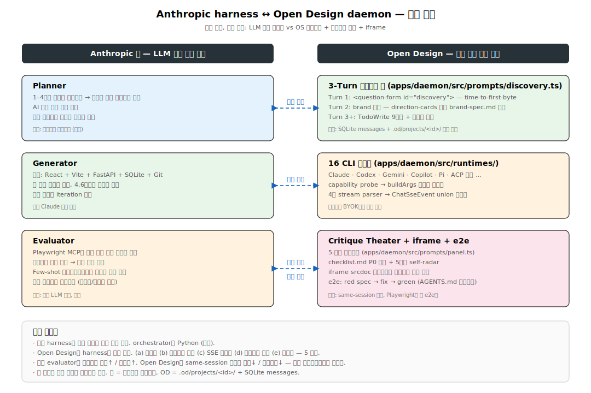
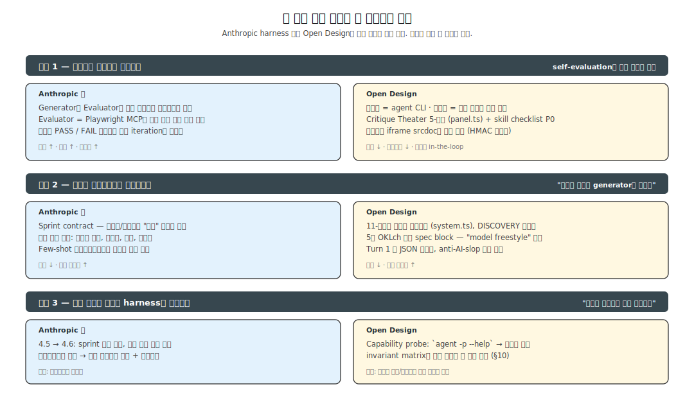
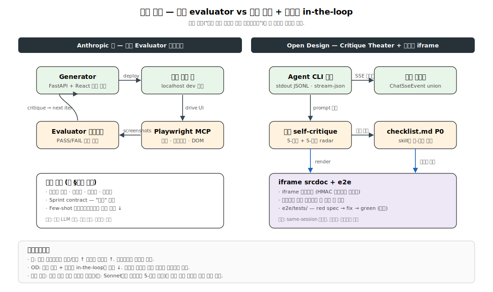

# 14. Anthropic harness 글 vs Open Design 실행 구조 비교

> 출처: [`Harness design for long-running apps` (Anthropic Engineering, 2026)](https://www.anthropic.com/engineering/harness-design-long-running-apps)
> 대상 커밋: `main` (`23218ea`, 2026-05-12).

이 문서는 Anthropic이 공개한 **장기 실행 에이전트 harness 설계**(Planner / Generator / Evaluator 3-에이전트 구조)와 Open Design의 **데몬 중심 실행 구조**가 같은 압력을 어떻게 다른 격자에 매핑했는지 비교합니다.

## 1. 한 문장 요약

| | Anthropic 글 | Open Design |
|---|---|---|
| harness의 정체 | **단일 LLM(Claude) 위에 역할 분리된 에이전트**들을 얹어 수 시간 작업을 자동화 | **데몬이 16개 외부 코딩 CLI를 단일 인터페이스로 래핑**하고 3-턴 결정론적 프롬프트로 디자인 산출물을 통제 |
| 격자 | 같은 모델, 다른 역할 (Planner / Generator / Evaluator) | 외부 모델(agent CLI), 단일 데몬, 단일 세션 안의 단계 분리 |
| 단위 | 작업당 수 시간 ~ 하루 | 대화당 수 턴, 라이브 SSE 스트리밍 |

두 글의 "harness"는 같은 단어지만 층위가 다릅니다. 글은 **LLM 호출 그래프 위의 메타 루프**이고, Open Design은 **OS 프로세스 + IPC + HTTP/SSE + Sandbox를 묶은 데몬**이 그 자체로 harness입니다.

## 2. 역할 매핑

| 글의 역할 | Open Design 대응 위치 | 핵심 차이 |
|---|---|---|
| **Planner** — 1–4문장 입력 → 완전한 제품 스펙 | **3-Turn 결정론적 폼** (`apps/daemon/src/prompts/discovery.ts:34-156`) | 글은 분리 에이전트, OD는 same-session 첫 두 턴 |
| **Generator** — React/Vite + FastAPI + SQLite + Git | **16 CLI 어댑터** (`apps/daemon/src/runtimes/registry.ts:19`) | 글은 같은 Claude 호출, OD는 사용자가 BYOK으로 모델 선택 |
| **Evaluator** — Playwright MCP로 외부 검증 | **Critique Theater 5-패널 + checklist P0 + iframe srcdoc** | 글은 별도 에이전트, OD는 강제 단계 + 사용자 in-the-loop |

핵심 비대칭: 글은 evaluator를 **별도 프로세스로 분리**하여 비용 ↑ / 객체성 ↑을 택했고, Open Design은 **same-session 단계 + 사용자 검토**로 비용 ↓ / 거버넌스 ↓을 택했습니다. 같은 원리("자기-평가는 과대 긍정적이다") 위에서 반대편 트레이드오프를 골랐습니다.

## 3. 세 가지 공유 원칙

### 3-1. 원칙 1 — 행위자와 판단자를 분리한다

- 글: Generator와 Evaluator를 별도 에이전트로 운영. Evaluator는 Playwright MCP로 **실제 브라우저 조작**.
- Open Design: 같은 원칙을 **프롬프트 단계**로 구현. 9단계 TodoWrite의 7·8단계가 강제 자기-비평 (`prompts/discovery.ts:132-156`). 추가로 사용자가 iframe `srcdoc` 미리보기로 외부 판정.

### 3-2. 원칙 2 — 기준은 결정론적으로 명문화한다

글이 가장 강조하는 통찰("기준의 표현이 generator를 예상치 못한 방향으로 이끈다")을 Open Design은 거의 **공리**로 채택합니다 (`analysis/30-runtime/08-prompt-engine.md`):

- **11-레이어 시스템 프롬프트** 조립, `DISCOVERY_AND_PHILOSOPHY`가 최상위로 후속 표현을 override (`apps/daemon/src/prompts/system.ts:162-323`).
- **5개 OKLch 방향 spec block** — 사용자가 카드를 고르는 순간 정확한 CSS 변수 + 폰트 스택 + posture rule이 prompt에 inject되어 "model freestyle" 여지를 제거 (`prompts/directions.ts:242-278`).
- **anti-AI-slop 체크리스트** — 부정 기준의 명문화 (글의 객체화된 평가 차원과 같은 역할).
- **Turn 1 폼 JSON 스키마** — 7개 이하 질문, 5개 핵심 결정, valid JSON 강제.

### 3-3. 원칙 3 — 모델 능력이 변하면 harness가 옮겨간다

- 글: Opus 4.5 → 4.6에서 sprint 구조를 **제거**. "공간은 사라지지 않고 이동한다."
- Open Design: 모델 진화를 흡수하는 두 메커니즘.
  - **Capability probe**: `agent -p --help` 출력을 파싱해 `--include-partial-messages` 같은 플래그를 캐싱 (`apps/daemon/src/runtimes/detection.ts:50-109`). 어댑터의 `buildArgs`가 그 값을 조건부로 사용.
  - **Invariant matrix**: `analysis/00-overview/01-architecture.md` §10이 어떤 변경이 어디까지 전파되는지(`packages/sidecar-proto` stamp 필드, `RuntimeAgentDef.streamFormat`, SSE 이벤트 union 등) 추적.

## 4. 검증 루프 — 외부 evaluator vs 강제 단계 + 사용자

| 축 | Anthropic 글 | Open Design |
|---|---|---|
| 평가 주체 | 별도 Evaluator 에이전트 | 같은 세션의 강제 단계 + 사용자 |
| 외부 시그널 | Playwright MCP (스크린샷, 클릭, DOM) | iframe `srcdoc` 미리보기를 사용자가 본다 |
| 객체화된 기준 | Sprint contract, 4-차원 평가 + few-shot 캘리브레이션 | Critique Theater 5-패널 + skill `checklist.md` P0 |
| 자동화 e2e | (글 범위 외) | `e2e/tests/` red spec → fix → green (AGENTS.md) |
| 비용 | LLM 호출 + 시간 ↑ | same-session 단계 비용만 |
| Playwright의 역할 | **에이전트 평가** 도구 | **앱 자체 e2e** 도구 |

같은 도구(Playwright)를 두 시스템이 **정반대 층위**에서 씁니다. 글은 에이전트가 사람처럼 앱을 만지는 데 쓰고, Open Design은 사람이 작성한 e2e 테스트가 데몬을 검증하는 데 씁니다.

## 5. 컨텍스트와 영속성

| 축 | 글 | Open Design |
|---|---|---|
| 컨텍스트 한계 | 4.5: 완전 리셋 + 핸드오프 아티팩트. 4.6: 단일 세션 유지 | 외부 CLI(Claude Code 등)가 자체 관리 |
| 핸드오프 매체 | 파일 (`agent A → file → agent B`) | SQLite `messages` + `.od/projects/<id>/` 작업 트리 |
| 산출물 영속 | Git | `.od/artifacts/` + `media_tasks` 5-상태 머신 |
| 비밀 | (명시 없음) | `.od/media-config.json` (BYOK) |
| 원자성 | (명시 없음) | atomic `.tmp → rename` (`apps/daemon/src/app-config.ts:325-327`) |

## 6. 프로세스 모델

- 글: 같은 모델의 여러 호출, Python orchestrator(추정). 에이전트 간 통신은 파일.
- Open Design: **5-stamp 사이드카** child process (`app, mode, namespace, ipc, source`).
  - `apps/daemon/src/sidecar/index.ts`를 `tsx`로 detached spawn (`tools/dev/src/index.ts:391`).
  - 데몬-웹-데스크탑은 **HTTP/IPC로만 만남** — `apps/web/**`가 `apps/daemon/src/**`를 import 금지 (AGENTS.md Boundary).
  - stdout JSONL을 ChatSseEvent로 정규화하는 **4종 파서**: `claude-stream`, `acp`, `pi-rpc`, `copilot-stream`.

## 7. 관찰성과 운영

- 글: **시간 × 비용 × 평가 점수**를 추적. DAW 예시 3시간 50분 / $124.70 breakdown 공개. Game Maker 예시 solo 20분/$9 vs full harness 6시간/$200.
- Open Design: `runs` 테이블 + SSE 이벤트 union + `tools-dev logs --json` + 5초 TTL toolchain 캐시 (`apps/daemon/src/runtimes/executables.ts:28-43`).
- **갭**: BYOK이라 정확한 $ 추적이 외부 콘솔(Anthropic/OpenAI/Azure)의 몫. wall-clock과 token usage는 데몬이 가질 수 있지만 현재 스키마엔 없음.

## 8. UI 분리

| 글 | Open Design |
|---|---|
| FastAPI(백엔드) + React/Vite(프론트엔드) + Playwright MCP | Next.js 16 web (Vercel SSR) + Electron desktop + iframe `srcdoc` 샌드박스 |
| 에이전트가 사용자처럼 앱 조작 | 사용자가 iframe 미리보기로 산출물 검토 |
| (보안 모델 명시 없음) | HMAC 데스크탑 게이트, `od://` 프로토콜, SSRF 가드 (`analysis/50-integration/12-security-model.md`) |

## 9. 본 프로젝트가 글에서 가져갈 수 있는 것 (관찰)

결정이 아니라 인접 가능성:

1. **외부 Evaluator 도입 여지.** 현재 self-critique + e2e + iframe 셋이 평가축. 디자인 품질 점수의 **객체화**가 약하다는 갭이 있다. 데몬 옆에 별도 평가자 라우트(예: Sonnet으로 스크린샷 5-차원 채점)를 두면 글의 격자를 부분 채택 가능.
2. **Sprint Contract 패턴.** 3-턴 폼은 사실상 stage 합의이지만, 모델이 1턴에 "이 산출물이 무엇을 만족하면 done인가"를 명시적으로 적는 contract 단계가 없다. 현 RULE 3의 9단계 TodoWrite를 contract 형태로 강화 가능.
3. **운영 메트릭스(wall-clock + token).** `runs` 테이블에 토큰 카운트/시간 컬럼이 추가되면 "harness 효과 정량화"의 토대가 된다. BYOK 환경에선 정확 $ 추적이 어려워도 상관 메트릭은 가능.

## 10. 결론

두 시스템 모두 **(a) 행위자/판단자 분리, (b) 기준의 결정론적 명문화, (c) 모델 능력 진화에 따른 harness 재배치**라는 세 원칙을 따릅니다. 차이는 격자입니다:

- 글은 **LLM 호출 그래프**에 매핑하고,
- Open Design은 **OS 프로세스 + 프롬프트 단계 + 파일시스템 + iframe**의 다층 격자에 분산시킵니다.

모델이 더 강해지면 글의 격자는 컴포넌트가 줄어들고(이미 sprint 제거), Open Design의 격자는 어댑터의 capability flag와 fallback 슬롯이 줄어드는 방식으로 같은 압력에 반응할 것입니다.

## 11. 다이어그램 인덱스

| SVG | 주제 |
|---|---|
| [14-harness-mapping](../svg/60-comparisons/14-harness-mapping.svg) | Planner/Generator/Evaluator ↔ 3-Turn/16-CLI/Critique Theater 역할 매핑 |
| [14b-shared-principles](../svg/60-comparisons/14b-shared-principles.svg) | 세 가지 공유 원칙과 두 시스템의 구현 |
| [14c-evaluation-loops](../svg/60-comparisons/14c-evaluation-loops.svg) | 외부 evaluator vs 강제 단계 + 사용자 in-the-loop |

## 12. 교차 참조

- [00-overview/01-architecture.md](../00-overview/01-architecture.md) — 4계층 아키텍처와 invariant matrix
- [30-runtime/07-agent-runtime.md](../30-runtime/07-agent-runtime.md) — 16 CLI 어댑터, capability probe
- [30-runtime/08-prompt-engine.md](../30-runtime/08-prompt-engine.md) — 3-Turn + 11-레이어 시스템 프롬프트
- [30-runtime/09-sse-chat-pipeline.md](../30-runtime/09-sse-chat-pipeline.md) — POST /api/chat 시퀀스
- [50-integration/12-security-model.md](../50-integration/12-security-model.md) — iframe srcdoc, HMAC, anti-AI-slop
